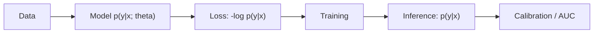

# 머신러닝에서의 확률

> Probability 101 시리즈 (10/10)

<!-- a-grade-intro:begin -->

**핵심 질문**: 지금까지 배운 *확률* 은 *머신러닝* 안에서 *어디에* 살아있을까요?

> *ML 은 *확률을 푸는 기계* 이다.*

<!-- a-grade-intro:end -->

## 이 글에서 배울 것

- *손실함수* 와 *가능도*
- *분류기 출력* 의 확률 의미
- *베이즈 추론* 과 *MAP*
- 5단계 ML 확률 실습
- 흔한 함정 5가지

## 왜 중요한가

*Cross-entropy, MSE, NLL* 모두 *확률* 의 다른 모습입니다. *확률을 모르면 모델 출력을 해석할 수 없습니다*.

> *Modern ML is applied probability.*

## 개념 한눈에 보기



## 핵심 용어 정리

- **가능도(likelihood)**: L(θ) = ∏ p(yᵢ | xᵢ; θ).
- **MLE**: 가능도를 *최대화* 하는 θ.
- **MAP**: 사전 곱한 사후를 *최대화*.
- **Cross-entropy**: -Σ y log p̂.
- **Calibration**: *예측확률* 이 *실제확률* 과 일치하는 정도.

## Before/After

**Before**: *“모델 출력 0.8”* — *무엇* 을 의미?

**After**: *p(y=1 | x) = 0.8* — *조건부확률* 의 추정. *Calibration* 으로 *진짜* 80% 인지 검증.

## 실습: 5단계 ML 확률

### 1단계 — Cross-entropy 손실

```python
import numpy as np
y = np.array([1, 0, 1, 1, 0])
p = np.array([0.9, 0.2, 0.8, 0.6, 0.3])
nll = -np.mean(y*np.log(p) + (1-y)*np.log(1-p))
print("NLL:", nll)
```

### 2단계 — Logistic regression (sklearn)

```python
import numpy as np
from sklearn.linear_model import LogisticRegression
X = np.array([[0],[1],[2],[3],[4]])
y = np.array([0, 0, 1, 1, 1])
clf = LogisticRegression().fit(X, y)
print("p(y=1|x=2):", clf.predict_proba([[2]])[0, 1])
```

### 3단계 — Calibration

```python
import numpy as np
# 예측확률 vs 실제 비율
preds = np.array([0.1, 0.3, 0.5, 0.7, 0.9])
actual = np.array([0.12, 0.28, 0.55, 0.66, 0.91])
print("calibration gap:", np.abs(preds - actual).mean())
```

### 4단계 — 베이지안 업데이트 (개념)

```python
# 사전 p(theta)와 가능도 p(D|theta)에서 사후 도출
prior = 0.5
likelihood = 0.8
post = likelihood * prior / (likelihood * prior + (1 - likelihood) * (1 - prior))
print("posterior:", post)
```

### 5단계 — Brier score

```python
import numpy as np
y = np.array([1, 0, 1, 0])
p = np.array([0.9, 0.2, 0.6, 0.4])
brier = np.mean((p - y)**2)
print("Brier:", brier)
```

## 이 코드에서 주목할 점

- *Cross-entropy* = *NLL* = *가능도 음로그*.
- *Logistic regression* 출력은 *조건부확률 p(y|x)*.
- *Calibration* 은 *분류 정확도와 다른 평가축*.

## 자주 하는 실수 5가지

1. ***출력 점수* 를 *확률* 로 *그대로* 해석**.
2. ***calibration* 무시.**
3. ***accuracy* 만 보고 평가**.
4. ***불균형 데이터* 에 *임계 0.5* 사용.**
5. ***베이지안 사전* 을 *없는 척* 함.**

## 실무에서는 이렇게 쓰입니다

스팸 분류, 의료 진단, 추천 점수, 이상치 탐지 — *확률 출력* 이 *결정 규칙* 과 *비용* 을 만난다. *Calibration*, *Brier*, *Log-loss* 가 표준입니다.

## 시니어 엔지니어는 이렇게 생각합니다

- *손실 = 확률* 임을 안다.
- *Calibration* 을 측정한다.
- *임계값* 을 *비용 기반* 으로 설정한다.
- *불확실성* 을 *예측에 포함* 한다.
- *Bayesian* 과 *frequentist* 둘 다 다룬다.

## 체크리스트

- [ ] *Cross-entropy = NLL* 임을 안다.
- [ ] *Calibration* 을 측정한다.
- [ ] *p(y|x)* 의 의미를 안다.
- [ ] *Brier / Log-loss* 를 사용한다.

## 연습 문제

1. *불균형 90:10* 데이터에서 *임계 0.5* 의 문제를 적으세요.
2. *Calibration plot* 을 그려야 하는 이유를 적으세요.
3. *MAP* 와 *MLE* 의 차이를 한 줄로 적으세요.

## 정리 및 다음 단계

확률은 *ML 의 모국어* 입니다. 다음 단계는 *Linear Algebra 101* 과 *Machine Learning 101* 에서 *모델의 다른 축* 을 배우는 것입니다.

<!-- toc:begin -->
- [확률이란 무엇인가?](./01-what-is-probability.md)
- [사건과 표본공간](./02-events-and-sample-space.md)
- [조건부확률](./03-conditional-probability.md)
- [베이즈 정리](./04-bayes-theorem.md)
- [확률변수](./05-random-variables.md)
- [기대값과 분산](./06-expectation-and-variance.md)
- [이산분포](./07-discrete-distributions.md)
- [연속분포](./08-continuous-distributions.md)
- [대수의 법칙과 중심극한정리](./09-lln-and-clt.md)
- **머신러닝에서의 확률 (현재 글)**
<!-- toc:end -->

## 참고 자료

- [Kevin Murphy — Probabilistic ML](https://probml.github.io/pml-book/book1.html)
- [Bishop — Pattern Recognition and Machine Learning](https://www.microsoft.com/en-us/research/people/cmbishop/prml-book/)
- [scikit-learn — Calibration](https://scikit-learn.org/stable/modules/calibration.html)
- [Wikipedia — Cross-entropy](https://en.wikipedia.org/wiki/Cross-entropy)

Tags: Probability, MachineLearning, Likelihood, Inference, Beginner
