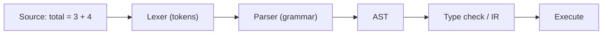

# Syntax and Semantics

This is post 2 in the Programming Languages 101 series.

> Programming Languages 101 series (2/10)

<!-- a-grade-intro:begin -->

**Core question**: Why does the build pass yet the program misbehave, and why does a single missing comma break the whole compilation?

> Every programming language stands on two axes. **Syntax** answers which arrangements of characters are legal. **Semantics** answers what those legal arrangements actually mean. They get blurred together in everyday talk, but separating them is the moment compile errors and runtime bugs stop looking like the same animal.

<!-- a-grade-intro:end -->

## What You Will Learn

- The exact boundary between syntax and semantics
- The pipeline from tokens to grammar to an AST
- Why "syntactically valid but meaningfully wrong" code happens
- The difference between static and dynamic semantics

## Why It Matters

Reading errors quickly, picking up new language syntax fast, and understanding why the same code behaves differently across languages all require splitting the two axes. The later episodes — type systems, scope, closures — are all examples of "same syntax, different semantics."

> "It builds" only means syntax passed. It does not mean the meaning matches your intent.

## Concept at a Glance



The lexer cuts characters into tokens; the parser checks token order against a grammar and builds a tree (AST). All of that is syntax. After it, interpreting meaning — type checking and evaluation — is semantics.

## Key Terms

- **Token**: The smallest meaningful chunk of characters (`if`, `=`, `42`).
- **Grammar (BNF/EBNF)**: Rules for which orderings of tokens are legal.
- **AST (Abstract Syntax Tree)**: A tree representation of source code.
- **Static semantics**: Meaning fixed before execution (type checking, name resolution).
- **Dynamic semantics**: Meaning that emerges during execution (evaluation, side effects).

## Before/After

**Before — confusing syntax errors with intent errors**

```python
# Both are "errors," but they live in different layers.
print("hello"   # SyntaxError
divide(10, 0)   # legal syntax, throws ZeroDivisionError at runtime
```

These two errors are nothing alike. The first is rejected by the parser. The second only happens once execution reaches it.

**After — read errors by which layer they came from**

```python
import ast

src_ok  = "total = 3 + 4"
src_bad = "total = 3 +"

print(ast.parse(src_ok))   # passes syntax → produces an AST
ast.parse(src_bad)         # SyntaxError: invalid syntax
```

Whether `ast.parse` succeeds tells you cleanly whether the syntax stage passed. Whether the meaning matches intent is a later question.

## Hands-on: Parse a Tiny Expression Yourself

Let's tokenize, parse, and evaluate something like `3 + 4 * 2`.

### Step 1 — Tokenize

```python
# 1_lex.py
import re

def tokenize(src: str) -> list[tuple[str, str]]:
    spec = [
        ("NUM", r"\d+"),
        ("OP",  r"[+*\-/()]"),
        ("WS",  r"\s+"),
    ]
    regex = "|".join(f"(?P<{n}>{p})" for n, p in spec)
    return [
        (m.lastgroup, m.group())
        for m in re.finditer(regex, src)
        if m.lastgroup != "WS"
    ]

print(tokenize("3 + 4 * 2"))
# [('NUM', '3'), ('OP', '+'), ('NUM', '4'), ('OP', '*'), ('NUM', '2')]
```

This step only cuts text into meaningful chunks. It does not interpret meaning.

### Step 2 — Define a grammar

In BNF-flavored notation:

```text
expr    = term  ("+" term  | "-" term)*
term    = factor ("*" factor | "/" factor)*
factor  = NUM | "(" expr ")"
```

The fact that `*` lives one level deeper (inside `term`) is what creates precedence.

### Step 3 — Parser produces an AST

```python
# 3_parse.py
class P:
    def __init__(self, toks):
        self.toks, self.i = toks, 0
    def peek(self): return self.toks[self.i] if self.i < len(self.toks) else (None, None)
    def eat(self):  t = self.peek(); self.i += 1; return t
    def expr(self):
        node = self.term()
        while self.peek()[1] in ("+", "-"):
            op = self.eat()[1]; node = (op, node, self.term())
        return node
    def term(self):
        node = self.factor()
        while self.peek()[1] in ("*", "/"):
            op = self.eat()[1]; node = (op, node, self.factor())
        return node
    def factor(self):
        k, v = self.eat()
        if k == "NUM": return int(v)
        if v == "(":
            node = self.expr(); self.eat(); return node
        raise SyntaxError(f"unexpected {v}")

from pprint import pprint
pprint(P(tokenize("3 + 4 * 2")).expr())
# ('+', 3, ('*', 4, 2))
```

The tree shows the precedence directly. `4 * 2` lives inside one node, sitting on the right side of `+`.

### Step 4 — Evaluate (semantics)

```python
# 4_eval.py
def evaluate(node) -> int:
    if isinstance(node, int):
        return node
    op, a, b = node
    return {
        "+": lambda x, y: x + y,
        "-": lambda x, y: x - y,
        "*": lambda x, y: x * y,
        "/": lambda x, y: x // y,
    }[op](evaluate(a), evaluate(b))

print(evaluate(("+", 3, ("*", 4, 2))))  # 11
```

This is dynamic semantics. Only when an evaluator decides what each node means do you get a result. A different evaluator on the same AST gives a different result.

### Step 5 — Same syntax, different semantics

```python
# 5_two_semantics.py
def evaluate_strange(node):
    if isinstance(node, int): return node
    op, a, b = node
    if op == "+": return evaluate_strange(a) * evaluate_strange(b)  # + as multiply
    return 0

print(evaluate_strange(("+", 3, ("*", 4, 2))))  # 24 — meaning changed
```

The example is extreme on purpose, but it proves the point: the same syntax can be assigned a different semantics. The two axes really are separable.

## What to Notice in This Code

- Syntax answers "is this legal?", semantics answers "what does it mean?"
- The AST that the parser produces is the final product of syntax and the input of semantics.
- The same AST under a different evaluator changes meaning — exactly what interpreters and compilers do.
- Precedence and associativity are properties of the grammar, not the evaluator.

## Five Common Mistakes

1. **Treating all errors the same.** SyntaxError, TypeError, and RuntimeError live in different layers and require different debugging.
2. **Believing "it builds" implies "it is correct."** Syntax passing does not guarantee semantic correctness.
3. **Trying to memorize operator precedence.** Don't. Use parentheses to write your intent. Future-you will thank you.
4. **Assuming the same symbol means the same thing across languages.** `+` is string concatenation in Python and forces type coercion in JavaScript.
5. **Never having looked at an AST.** Once you see one even briefly, error messages start reading much more clearly.

## How This Shows Up in Production

Code formatters, linters, refactoring tools, and code transformers all work on ASTs. Python's `ast` module, Babel for JavaScript, the TypeScript compiler API are common examples. Tasks like "find every call site of this function" or "automatically migrate off a deprecated API" are AST-based, not regex-based.

It also helps when reading logs. `Unexpected token` is a syntax-stage message. `is not a function` is a dynamic-semantics message. Knowing which layer the message came from tells you where to start looking.

## How a Senior Engineer Thinks

- Classifies an error first by layer — syntax, static semantics, or dynamic semantics.
- When learning a new language, **prints an AST once** to ground their mental model.
- Writes parentheses instead of memorizing precedence; readability over cleverness.
- Stays alert to the same symbol meaning different things; compares languages by semantics, not keywords.
- Reaches for AST-based tools, not regex, when transforming code.

## Checklist

- [ ] Can you state the difference between syntax and semantics in one sentence?
- [ ] Can you explain what an AST is and why it exists?
- [ ] Can you tell static and dynamic semantics apart in one line?
- [ ] When you read an error message, do you guess which layer it came from?
- [ ] Have you accepted that the same syntax can mean different things in different languages?

## Practice Problems

1. Add a `**` (exponent) operator to the evaluator above. It must bind tighter than `*`. Both the grammar and the evaluator need changes.
2. Run `1 + "2"` in Python and in JavaScript, write down the results, and explain in one line which axis (syntax or semantics) accounts for the difference.
3. Pick a recent bug where the build passed but the result was wrong. Classify the bug as syntax, static semantics, or dynamic semantics.

## Wrap-up and Next Steps

Syntax is the question of legality. Semantics is the question of meaning. Splitting them clarifies what an error really is and tells you where to look first when meeting a new language. Next we examine the biggest tool in static semantics — the type system.

<!-- toc:begin -->
- [What Is a Programming Language?](./01-what-is-a-programming-language.md)
- **Syntax and Semantics (current)**
- Type Systems (upcoming)
- Scope and Binding (upcoming)
- Functions and Closures (upcoming)
- Objects and Prototypes (upcoming)
- Memory Management (upcoming)
- Interpreters and Compilers (upcoming)
- Static vs Dynamic Languages (upcoming)
- What Makes a Good Language Design? (upcoming)
<!-- toc:end -->

## References

- [Python ast module documentation](https://docs.python.org/3/library/ast.html)
- [Crafting Interpreters (Bob Nystrom)](https://craftinginterpreters.com/)
- [Compilers: Principles, Techniques, and Tools (Dragon Book)](https://suif.stanford.edu/dragonbook/)
- [Backus–Naur Form (Wikipedia)](https://en.wikipedia.org/wiki/Backus%E2%80%93Naur_form)

Tags: Computer Science, Programming Languages, Syntax, Semantics, Grammar, Parsing
