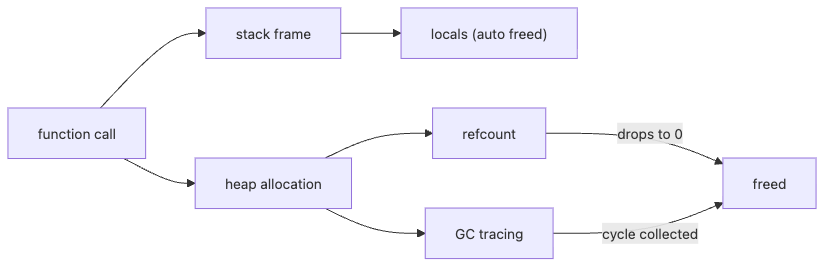

# Memory Management

Writing `del x` does not necessarily mean the object disappears on that line. Names, objects, references, and lifetimes sit at different layers, and languages manage the relationship among those layers in different ways.

This is post 7 in the Programming Languages 101 series.

In this post, we will treat memory management as the rule for deciding when an object is alive and when it is gone. That means walking through stack and heap, reference counting, garbage collection, weak references, and why leaks still happen even in languages that “have GC.”

## Questions this article answers

- How are the stack and the heap different?
- When does Python's reference counting free an object immediately?
- Why do cyclic references require a separate garbage collector?
- Why do memory leaks still happen even in GC languages?

## Why It Matters

Long-running services often slowly creep up in memory. Finding the cause means being able to answer "why is this object still alive?" Memory models are the tools that produce that answer.

> Most leaks start with one forgotten reference.

## Concept at a Glance



*The lifetime flow from stack frames to heap objects, refcounts, and tracing GC*

The stack is reclaimed when the function returns. The heap needs someone to collect it.

## Key Terms

- **Stack**: Tied to function calls; appears and disappears automatically.
- **Heap**: Allocated explicitly; reclaimed when no longer used.
- **Reference counting**: Count references to an object; free immediately at zero.
- **Garbage collection**: Trace which objects are reachable; reclaim the rest.
- **Cycle**: A→B→A reference shape that simple counting cannot resolve.

## Before/After

**Before — manual free in C-style pseudocode**

```python
# pseudocode: forget free, leak forever
buf = malloc(1024)
use(buf)
# free(buf)  ← skip this and 1KB lives on
```

**After — Python: gone when the last reference goes**

```python
def work() -> None:
    buf = bytearray(1024)
    use(buf)
# when work() returns, buf has nowhere to live and is reclaimed
```

## Hands-on: Watch the Lifetime

### Step 1 — Peek at the refcount

```python
# 1_refcount.py
import sys

class Tag:
    def __del__(self) -> None:
        print("Tag deleted")

t = Tag()
print(sys.getrefcount(t))  # 2 (the variable t + getrefcount's argument)
ref = t
print(sys.getrefcount(t))  # 3
del ref, t                  # all references gone → __del__ fires immediately
```

`sys.getrefcount` is biased by +1; just remember that. CPython frees an object the instant the count hits zero.

### Step 2 — Cycles and the GC

```python
# 2_cycle.py
import gc

class Node:
    def __init__(self) -> None:
        self.peer: "Node | None" = None
    def __del__(self) -> None:
        print("Node deleted")

a, b = Node(), Node()
a.peer, b.peer = b, a   # they reference each other
del a, b                 # counts never reach zero
print("before collect")
gc.collect()             # the tracing GC sweeps up the cycle
print("after collect")
```

Cycles are unsolvable by counting alone. CPython runs an auxiliary tracing GC for exactly this case.

### Step 3 — An object that "cannot die"

```python
# 3_leak.py
cache: dict[int, bytes] = {}

def remember(i: int) -> None:
    cache[i] = b"x" * 1024  # cache only ever grows

for i in range(1000):
    remember(i)

print(len(cache), "items still alive")
```

GC or no GC, if something holds a reference, the object lives. **A leak is a forgotten reference.**

### Step 4 — Avoid strong references with `weakref`

```python
# 4_weakref.py
import weakref

class Big:
    pass

obj = Big()
ref = weakref.ref(obj)
print(ref())   # <__main__.Big object ...>
del obj
print(ref())   # None  — a weak reference does not extend lifetime
```

For caches and observer-style patterns, `weakref` is the standard tool to prevent leaks.

### Step 5 — Make resource lifetime explicit with `with`

```python
# 5_with.py
from contextlib import contextmanager

@contextmanager
def opened(name: str):
    print("open", name)
    try:
        yield name
    finally:
        print("close", name)

with opened("config.yml") as f:
    print("use", f)
# leaving the block guarantees close
```

Memory is not the only thing with lifetime. Files, sockets, and locks need it too — `with` is the standard pattern.

## What to Notice in This Code

- The instant the refcount drops to zero, the object is gone (CPython's promptness).
- Cycles need the tracing GC; counting alone is not enough.
- In a GC language, "if a reference exists, the object exists."
- `weakref` and `with` are lifetime tools — not just memory tools.

## Five Common Mistakes

1. **Believing `del` immediately destroys the object.** It only unbinds the name. Other references keep the object alive.
2. **Unbounded global caches.** The most common leak pattern. Always set a cap.
3. **Ignoring cycles.** When two domain objects reference each other, break one side with `weakref`.
4. **Heavy work in `__del__`.** Timing is not guaranteed; do real cleanup with `with` or an explicit close method.
5. **Calling `gc.collect()` aggressively.** Forcing collection in a hot loop just burns CPU.

## How This Shows Up in Production

Long-running servers watch memory graphs over time. When something looks off, `tracemalloc` or `objgraph` shows which type is growing. Caches always have an LRU or TTL bound. Observer/callback registries default to weak references or explicit teardown.

C, C++, and Rust take different paths — Rust uses compile-time ownership instead of GC. The essence is the same across all of them: **who owns this, and when do they let go?**

## How a Senior Engineer Thinks

- Asks "who owns this object?" first.
- Sees a cache and immediately asks about size limits and expiry.
- Looks at metrics first when leaks are suspected — never guess-debugs.
- Remembers that GC languages still leak resources.
- Writes `with`/`finally` so resource lifetime is visible in the code shape.

## Checklist

- [ ] Can you answer stack vs heap in one sentence?
- [ ] Can you explain how Python's refcount and GC cooperate?
- [ ] Can you point to one leak risk in your most recent code?
- [ ] Can you name at least one place to use `weakref`?
- [ ] Is reaching for `with` to manage resource lifetime a habit?

## Practice Problems

1. Take the cycle from step 2 and weaken one side with `weakref`. Confirm cleanup happens without `gc.collect()`.
2. Allocate and drop ten thousand objects while measuring with `tracemalloc`. Write a paragraph on what pattern you see.
3. Pick one of your caches and convert it to LRU (`functools.lru_cache`). Note what changed in behavior with a bound in place.

## Wrap-up and Next Steps

The memory model answers "who holds it, when do they let go?" Next we look at the two roads that execute these objects — interpreters and compilers.

<!-- toc:begin -->
- [What Is a Programming Language?](./01-what-is-a-programming-language.md)
- [Syntax and Semantics](./02-syntax-and-semantics.md)
- [Type Systems](./03-type-system.md)
- [Scope and Binding](./04-scope-and-binding.md)
- [Functions and Closures](./05-functions-and-closures.md)
- [Objects and Prototypes](./06-objects-and-prototypes.md)
- **Memory Management (current)**
- Interpreters and Compilers (upcoming)
- Static vs Dynamic Languages (upcoming)
- What Makes a Good Language Design? (upcoming)
<!-- toc:end -->

## References

- [Python — gc module](https://docs.python.org/3/library/gc.html)
- [Python — weakref module](https://docs.python.org/3/library/weakref.html)
- [Python — tracemalloc](https://docs.python.org/3/library/tracemalloc.html)
- [Garbage collection (Wikipedia)](https://en.wikipedia.org/wiki/Garbage_collection_(computer_science))

Tags: Computer Science, Programming Languages, MemoryManagement, GC, Stack, Heap
