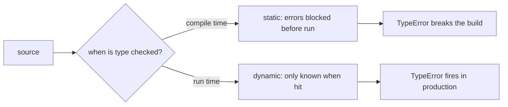

# Static vs Dynamic Languages

This is post 9 in the Programming Languages 101 series.

> Programming Languages 101 series (9/10)

<!-- a-grade-intro:begin -->

**Core question**: Is static typing really "safer" than dynamic typing — and what does that safety actually cover?

> Static and dynamic are not good and bad. They are a choice between **checking at compile time or at run time**. Both catch the same kinds of errors, but at different moments and at different costs. Neither stops every bug.

<!-- a-grade-intro:end -->

## What You Will Learn

- A one-line definition of static vs dynamic
- The difference shown by the same function with and without hints
- What mypy/pyright catches and what it cannot
- What gradual typing makes possible
- The limits of the "static is safe, dynamic is fast" myth

## Why It Matters

Every team debates "should we add more types?" Holding that conversation well requires a one-line answer for what static typing guarantees and what it does not.

> A type is a promise about the shape of data. Where that promise is checked is what static vs dynamic comes down to.

## Concept at a Glance



The same kind of bug — caught by static at build time, by dynamic at run time.

## Key Terms

- **Static typing**: Variable and expression types are determined and checked at compile time.
- **Dynamic typing**: Types are attached to values; checking happens at run time.
- **Strong vs weak**: How much implicit conversion is allowed (think `1 + "1"`).
- **Gradual typing**: Mixing static and dynamic regions in one codebase (Python, TypeScript).
- **Soundness**: A guarantee that any code the type checker accepts behaves only according to its types.

## Before/After

**Before — dynamic code with no hints**

```python
def total(items):
    return sum(item.price for item in items)
```

The caller is responsible for `item` having `price`. A wrong input only blows up in production with `AttributeError`.

**After — type hints make the contract explicit**

```python
from dataclasses import dataclass

@dataclass(frozen=True)
class Item:
    price: int

def total(items: list[Item]) -> int:
    return sum(item.price for item in items)
```

Now mypy/pyright check callers too. Wrong inputs are blocked at build time.

## Hands-on: Compare Both Models on the Same Code

### Step 1 — Errors mypy catches

```python
# 1_mypy.py
def add(a: int, b: int) -> int:
    return a + b

print(add(1, 2))
print(add("1", "2"))   # mypy: error — incompatible argument
```

Run `mypy 1_mypy.py` and the second call fails. A bug found without ever executing the code.

### Step 2 — Errors that still only show up at run time

```python
# 2_runtime_only.py
import json

data = json.loads('{"price": "10"}')   # mypy sees dict[str, Any]
def total(items):
    return sum(i["price"] for i in items)
print(total([data]))                    # runtime TypeError
```

External inputs (JSON, DB, env vars) have no compile-time shape. Static typing's guarantee ends at "this code."

### Step 3 — Gradual typing in action

```python
# 3_gradual.py
def parse(raw: str) -> dict:        # only partly typed
    return eval(raw)                # dynamic region (and risky)

def use(d: dict[str, int]) -> int:  # precisely typed
    return sum(d.values())

print(use(parse('{"a": 1, "b": 2}')))
```

Python is built so the two regions can coexist — receive dynamically at the edge, handle statically inside. TypeScript's `any` plays the same role.

### Step 4 — Structural typing with `Protocol`

```python
# 4_protocol.py
from typing import Protocol

class Pricable(Protocol):
    price: int

def total(items: list[Pricable]) -> int:
    return sum(i.price for i in items)

class Book:
    def __init__(self, price: int) -> None:
        self.price = price

print(total([Book(10), Book(20)]))   # OK — Book has the right shape
```

"Same shape passes" without inheritance is possible in static typing too. Think of it as static-checked duck typing.

### Step 5 — Where dynamic languages shine

```python
# 5_dynamic_strength.py
def call_all(d: dict, *args):
    for name, fn in d.items():
        print(name, fn(*args))

ops = {
    "add": lambda x, y: x + y,
    "mul": lambda x, y: x * y,
}
call_all(ops, 3, 4)
```

Metaprogramming and plugin patterns are possible in static typing too, but usually with more boilerplate. Dynamic expressiveness shows up here.

## What to Notice in This Code

- Static typing's guarantee ends where external input begins.
- Gradual typing is a pragmatic answer that blends both models.
- `Protocol` and duck typing express "same shape" without inheritance.
- There are areas where dynamic genuinely wins (metaprogramming, short scripts).

## Five Common Mistakes

1. **The "static is safe, dynamic is risky" dichotomy.** Both pay different costs.
2. **Believing type hints stop bad external input.** You still need boundary validation (e.g., `pydantic`).
3. **Sprinkling `Any` everywhere.** Gradual typing collapses back into dynamic typing.
4. **Adding hints but never running the checker.** Without mypy/pyright in CI, the hints are documentation at best.
5. **Treating types and unit tests as substitutes.** They catch different kinds of bugs.

## How This Shows Up in Production

Large Python codebases now run mypy/pyright in CI almost universally. JavaScript has effectively standardized on TypeScript — separate from any JIT performance benefit, the maintenance value is large.

A common design pattern is now "validate strongly at the boundary, type precisely inside" — `pydantic`, `attrs`, and `dataclass` + `Protocol` are the typical tools.

## How a Senior Engineer Thinks

- Asks "where does checking happen for this code?" first.
- Always validates external input at the boundary.
- Uses gradual typing but watches the cost of `Any`.
- Treats types and tests as complements, not substitutes.
- Knows when dynamic fits better (short scripts, notebooks) vs when static fits better (shared libraries, long-lived services).

## Checklist

- [ ] Can you state the static–dynamic difference in one line?
- [ ] Do you run mypy/pyright in CI?
- [ ] Is there boundary validation where external input enters?
- [ ] Do you monitor your `Any` usage?
- [ ] Can you state what gradual typing means in one line?

## Practice Problems

1. Add type hints to a recent function and run mypy. Summarize the kinds of errors it catches in a paragraph.
2. Apply a `pydantic` model at one JSON-receiving endpoint. Compare the error messages before and after.
3. Convert the `Protocol` in step 4 to ABC inheritance (`abc.ABC`) and write a paragraph on what changes.

## Wrap-up and Next Steps

Static and dynamic are not better and worse — they are tradeoffs. In the final episode we put all these choices together and ask what makes a good language design.

<!-- toc:begin -->
- [What Is a Programming Language?](./01-what-is-a-programming-language.md)
- [Syntax and Semantics](./02-syntax-and-semantics.md)
- [Type Systems](./03-type-system.md)
- [Scope and Binding](./04-scope-and-binding.md)
- [Functions and Closures](./05-functions-and-closures.md)
- [Objects and Prototypes](./06-objects-and-prototypes.md)
- [Memory Management](./07-memory-management.md)
- [Interpreters and Compilers](./08-interpreter-and-compiler.md)
- **Static vs Dynamic Languages (current)**
- What Makes a Good Language Design? (upcoming)
<!-- toc:end -->

## References

- [PEP 484 — Type Hints](https://peps.python.org/pep-0484/)
- [mypy documentation](https://mypy.readthedocs.io/)
- [TypeScript Handbook — Basic Types](https://www.typescriptlang.org/docs/handbook/2/basic-types.html)
- [Gradual typing (Wikipedia)](https://en.wikipedia.org/wiki/Gradual_typing)

Tags: Computer Science, Programming Languages, StaticTyping, DynamicTyping, Tradeoffs, Safety
