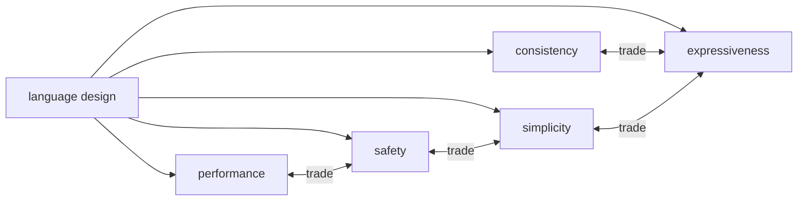

# What Makes a Good Language Design?

> Programming Languages 101 series (10/10)

<!-- a-grade-intro:begin -->

**Core question**: When we say "this language is well designed," what exactly are we scoring?

> Language design is the discipline of tradeoffs. More expressiveness costs consistency. Stronger safety adds friction. A good design is not "great at everything" — it is **a design that balances clearly toward what this language is meant to do well**.

<!-- a-grade-intro:end -->

## What You Will Learn

- Five axes for evaluating a language design
- Tradeoffs among consistency, simplicity, expressiveness, safety, and performance
- How Python, Go, and Rust answered the same problems differently
- Why the concepts in this series ended up the way they are
- The five questions to ask first when meeting any new language

## Why It Matters

Design sense is not just for evaluating languages — **the same instinct applies every time you design an API, library, or internal DSL**. Even a single function signature meets the same tradeoffs.

> Good design is not "good for everyone." It is "an answer that made its choices clear."

## Concept at a Glance



The five axes are coupled — push one down and another rises.

## Key Terms

- **Consistency**: Problems with the same shape are solved with code of the same shape.
- **Simplicity**: Few rules to learn or remember.
- **Expressiveness**: Intent can be written shortly and precisely.
- **Safety**: Wrong programs are blocked at build or run time.
- **Performance**: Same job uses less time and memory.

## Before/After

**Before — evaluating by vibes**

> "I like this language." → Cannot explain why.

**After — decomposing into five axes**

> "This language traded some safety for expressiveness and simplicity. Great for short scripts; weaker for long-lived services."

Same fact, but the second version names the tradeoff.

## Hands-on: Score Three Languages on Five Axes

### Step 1 — Same problem, three answers

The same task ("sum the lengths of strings in a list") in three languages.

```python
# Python
def total_len(xs: list[str]) -> int:
    return sum(len(x) for x in xs)
```

```go
// Go
func TotalLen(xs []string) int {
    n := 0
    for _, x := range xs {
        n += len(x)
    }
    return n
}
```

```rust
// Rust
fn total_len(xs: &[String]) -> usize {
    xs.iter().map(|x| x.len()).sum()
}
```

Same job, similar shape — but different in length, explicitness, and safety.

### Step 2 — Score consistency

```python
# 2_consistency.py
# Python: sum/len/for keep their shape across collections — high consistency
print(sum([1,2,3]))
print(sum((1,2,3)))
print(sum({1,2,3}))
```

When one interface cuts across all collections, consistency is high. Go pursues a similar philosophy with very few keywords.

### Step 3 — Simplicity vs expressiveness

```python
# 3_expressiveness.py
xs = [1, 2, 3, 4, 5]
print([x*x for x in xs if x % 2])     # high expressiveness
# Go has no list comprehension → simpler, less expressive
```

Python lets you write intent in one line. Go forces a `for` loop, reducing what you must learn.

### Step 4 — Safety vs simplicity

```rust
// 4_safety.rs
fn first(xs: &[i32]) -> Option<&i32> {
    xs.first()           // forces "no value" handling at compile time
}
```

Rust forces "value may be missing" into the type — high safety, more to learn. Python's `None` does the same job more lightly (and less safely).

### Step 5 — The whole series in one table

| Topic | Python | Go | Rust |
| --- | --- | --- | --- |
| Memory (ep07) | GC + refcount | GC | compile-time ownership |
| Execution (ep08) | interpreter + bytecode | AOT | AOT |
| Types (ep09) | gradual (optional) | static (simple) | static, rich |
| Objects (ep06) | classes, dynamic | structs + interfaces | structs + traits |
| Functions (ep05) | first-class, closures | first-class, simple | first-class, explicit lifetimes |

Each language's answers cluster around what it tries to be best at.

## What to Notice in This Code

- The three answers are not right or wrong — they are **different priority orderings**.
- High consistency feels like "the pattern I just learned still applies here."
- High expressiveness is short but harder for outsiders to read.
- Strong safety means more time arguing with the compiler — and fewer production incidents in return.

## Five Common Mistakes

1. **Searching for the "best language."** Goodness is only defined relative to a job.
2. **Treating expressiveness as always virtuous.** Too short can be illegible.
3. **Always prioritizing safety.** Rust is overkill for a one-week prototype.
4. **Ignoring consistency.** Solving the same problem differently every time decays a codebase fast.
5. **Mistaking your favorite language for objective truth.** Drawing the tradeoff table reveals the bias.

## How This Shows Up in Production

Choosing a language for a new project is not a popularity contest — it is weighting these five axes for the job. Short, fast validation favors Python. Operational simplicity in long-lived services favors Go. Safety and memory control where it really matters favors Rust.

The same principle applies to internal libraries and APIs. "Does this function favor expressiveness or safety?" Writing the answer down explicitly makes reviews much faster.

## How a Senior Engineer Thinks

- Always names which axis a decision sacrificed.
- Accepts that no answer wins on every axis.
- Can write a paragraph on the tradeoffs of any language they know well.
- Applies the same five axes to API design.
- When evaluating a new language, asks "is this a fit for the problem I have?" first.

## Checklist

- [ ] Can you define the five axes in one line each?
- [ ] Can you write a paragraph on the tradeoffs of your most-used language?
- [ ] Can you say which axis your most recent API favored?
- [ ] Do you avoid claiming "good language" without context?
- [ ] When meeting a new language, do you deliberately walk through the five axes?

## Practice Problems

1. Score your two most-used languages along the five axes and write a paragraph on the differences.
2. Pick one public API in a library you wrote recently. Sketch a "more expressive" and a "safer" alternative for the same job.
3. Pick the episode in this series that struck you most. Write a paragraph on which of the five axes it touches and how.

## Wrap-up and Next Steps

Good language design is the honest declaration of how to weight the five axes. Everything you saw in this series — syntax, types, scope, closures, objects, memory, execution model, static vs dynamic — was an expression of those weights. The next step is to bring this instinct to your own code and API design.

This series ends here. Suggested next reading paths: [compilers-101](../../compilers-101/), [api-design-101](../../api-design-101/), [software-design-101](../../software-design-101/).

<!-- toc:begin -->
- [What Is a Programming Language?](./01-what-is-a-programming-language.md)
- [Syntax and Semantics](./02-syntax-and-semantics.md)
- [Type Systems](./03-type-system.md)
- [Scope and Binding](./04-scope-and-binding.md)
- [Functions and Closures](./05-functions-and-closures.md)
- [Objects and Prototypes](./06-objects-and-prototypes.md)
- [Memory Management](./07-memory-management.md)
- [Interpreters and Compilers](./08-interpreter-and-compiler.md)
- [Static vs Dynamic Languages](./09-static-vs-dynamic.md)
- **What Makes a Good Language Design? (current)**
<!-- toc:end -->

## References

- [Programming language design (Wikipedia)](https://en.wikipedia.org/wiki/Programming_language)
- [Rob Pike — Less is exponentially more (Go)](https://commandcenter.blogspot.com/2012/06/less-is-exponentially-more.html)
- [Bjarne Stroustrup — Foundations of C++](https://www.stroustrup.com/ETAPS-corrected-draft.pdf)
- [PEP 20 — The Zen of Python](https://peps.python.org/pep-0020/)

Tags: Computer Science, Programming Languages, LanguageDesign, Consistency, Simplicity, Expressiveness
