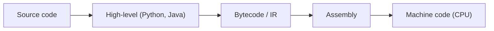

# 프로그래밍 언어란 무엇인가?

> Programming Languages 101 시리즈 (1/10)

<!-- a-grade-intro:begin -->

**핵심 질문**: 우리는 왜 어셈블리 대신 Python을 쓰고, Python을 두고도 왜 또 다른 언어를 만들어 낼까요?

> 프로그래밍 언어는 단순한 "기계에게 일을 시키는 문법"이 아니라, **문제를 어떻게 쪼개고 어떻게 표현할지**를 정해 주는 사고의 틀입니다. 같은 문제를 절차적으로, 객체로, 함수로, 또는 선언적으로 풀 수 있다는 사실은 언어가 우리의 발상을 어떻게 제약하고 또 확장하는지를 보여 줍니다. 이 글은 그 출발점을 정리합니다.

<!-- a-grade-intro:end -->

## 이 글에서 배울 것

- 기계어 → 어셈블리 → 고급 언어로 이어지는 추상화 계층
- 프로그래밍 언어가 결국 무엇을 하는지(번역과 표현)
- 명령형, 객체지향, 함수형, 선언형 패러다임의 차이
- "좋은 언어"라는 말이 의미하는 것

## 왜 중요한가

언어를 단순히 "도구"로 보면, 새 언어를 만날 때마다 처음부터 배우는 느낌이 듭니다. 하지만 모든 언어가 공유하는 공통 구조 — 변수, 표현식, 제어 흐름, 함수, 타입 — 를 이해하면, 새 언어는 **익숙한 개념을 어떤 문법으로 표현하는가**의 문제가 됩니다. 시리즈 전체에서 우리는 그 공통 구조를 하나씩 분해할 것입니다.

> "언어를 배운다"는 말은 사실 "그 언어가 강조하는 사고 방식을 익힌다"는 말입니다.

## 개념 한눈에 보기



위로 갈수록 사람이 읽기 쉽고, 아래로 갈수록 기계가 직접 실행할 수 있습니다. 프로그래밍 언어는 이 계층의 어디에 자리를 잡고, 그 위에서 어떤 추상화를 제공할지를 정합니다. Python의 한 줄은 어셈블리 수십 줄에 해당합니다.

## 핵심 용어 정리

- **Syntax**: 언어의 "문법". 어떤 글자 배열이 합법인지를 정의합니다.
- **Semantics**: 그 문법이 실제로 무엇을 의미하는지(어떻게 동작하는지).
- **Paradigm**: 문제를 푸는 방식 — 명령형, 객체지향, 함수형, 선언형.
- **Abstraction**: 세부 사항을 감추고 더 큰 단위로 다루게 해 주는 도구.
- **Translator**: 사람이 쓴 코드를 기계가 실행할 수 있는 형태로 바꾸는 프로그램(컴파일러·인터프리터).

## Before/After

**Before — 어셈블리로 두 수 더하기**

```asm
; x86-64 (간소화)
mov rax, 3
mov rbx, 4
add rax, rbx        ; rax = 7
```

레지스터 이름과 명령어를 직접 다뤄야 합니다. 변수 이름이 없습니다. 함수도 없습니다.

**After — 같은 일을 Python으로**

```python
total = 3 + 4
print(total)  # 7
```

`total`이라는 이름이 생겼고, `+`라는 익숙한 기호가 그대로 쓰이며, 결과를 출력하는 것도 한 줄입니다. 우리가 "추상화의 가치"라고 부르는 것은 바로 이런 것입니다.

## 실습: 같은 문제를 네 가지 패러다임으로

리스트의 짝수만 골라 두 배 한 합을 구한다고 해 봅시다.

### 1단계 — 명령형(절차적)

```python
# 1_imperative.py
nums = [1, 2, 3, 4, 5, 6]
total = 0
for n in nums:
    if n % 2 == 0:
        total += n * 2
print(total)  # 24
```

루프와 변수로 단계를 명시합니다. 가장 직관적이지만 길어집니다.

### 2단계 — 객체지향

```python
# 2_oop.py
class EvenDoubler:
    def __init__(self, nums: list[int]) -> None:
        self.nums = nums

    def total(self) -> int:
        return sum(n * 2 for n in self.nums if n % 2 == 0)

print(EvenDoubler([1, 2, 3, 4, 5, 6]).total())  # 24
```

데이터와 행동을 한 묶음(객체)으로 만들었습니다. 작은 예제에서는 과하지만, 상태가 생기면 의미가 살아납니다.

### 3단계 — 함수형

```python
# 3_functional.py
from functools import reduce

nums = [1, 2, 3, 4, 5, 6]
result = reduce(
    lambda acc, n: acc + n * 2,
    filter(lambda n: n % 2 == 0, nums),
    0,
)
print(result)  # 24
```

데이터 흐름을 함수의 합성으로 표현합니다. 변수 변경이 없습니다.

### 4단계 — 선언형(SQL 풍)

```python
# 4_declarative.py
import sqlite3
db = sqlite3.connect(":memory:")
db.execute("CREATE TABLE t (n INTEGER)")
db.executemany("INSERT INTO t VALUES (?)", [(i,) for i in [1,2,3,4,5,6]])
row = db.execute("SELECT SUM(n*2) FROM t WHERE n % 2 = 0").fetchone()
print(row[0])  # 24
```

"무엇을 원하는지"만 적었고, "어떻게 계산할지"는 DBMS에 맡겼습니다. 같은 문제를 푸는 가장 짧은 표현입니다.

### 5단계 — 네 가지 답을 비교

같은 24를 얻는 네 가지 방법은 길이도, 읽기 쉬움도, 변경 가능성도 다릅니다. 어느 것이 옳다 그르다가 아니라, **문제와 팀의 맥락이 어느 패러다임을 자연스럽게 만드는가**를 보는 연습입니다.

## 이 코드에서 주목할 점

- 같은 결과를 얻는 코드도 패러다임에 따라 강조점이 다릅니다.
- 명령형은 단계, 객체지향은 책임, 함수형은 데이터 흐름, 선언형은 의도를 강조합니다.
- 한 언어가 여러 패러다임을 동시에 지원하는 것이 흔합니다(Python이 그 예).
- "어느 패러다임이 이 문제에 잘 맞는가?"가 "어느 언어가 좋은가?"보다 훨씬 자주 의미 있는 질문입니다.

## 자주 하는 실수 5가지

1. **언어를 "기능 모음"으로만 본다.** 같은 기능이라도 언어가 강조하는 사고 방식이 다르면 결과 코드가 완전히 달라집니다.
2. **새 언어를 만나면 모든 것을 처음부터 배우려 든다.** 변수·표현식·제어 흐름·함수·타입은 거의 공통입니다. 차이만 골라 보면 충분합니다.
3. **"이 언어가 더 빠르다"로 선택한다.** 대부분의 시스템에서 병목은 언어가 아니라 I/O와 알고리즘입니다.
4. **하나의 패러다임으로만 모든 문제를 푼다.** 객체로 짜야 할 곳에서 함수로, 함수로 충분한 곳에서 객체로 가는 일이 흔합니다.
5. **추상화 수준을 잘못 고른다.** 운영체제 수준의 일에 Python을 쓰거나, 짧은 스크립트에 Rust를 쓰면 둘 다 고통입니다.

## 실무에서는 이렇게 쓰입니다

대부분의 회사는 한 가지 언어로 모든 것을 짜지 않습니다. 백엔드는 Python·Go·Java, 프런트엔드는 JavaScript·TypeScript, 데이터 파이프라인은 SQL·Python, 시스템 소프트웨어는 C·Rust 식으로 **문제 영역에 맞는 언어**를 고르는 것이 보통입니다.

새 팀에 합류해 익숙하지 않은 언어를 만나면, 첫 주에 해야 할 일은 "문법을 외우는 것"이 아니라 **그 언어가 강조하는 패러다임이 무엇이고, 코드 리뷰가 무엇을 칭찬하는가**를 관찰하는 일입니다. 그 관찰이 끝나면 문법은 자연스럽게 따라옵니다.

## 시니어 엔지니어는 이렇게 생각합니다

- 언어는 도구이자 사고의 틀입니다. 도구만 보면 절반밖에 못 씁니다.
- 새 언어를 배울 때 공통 구조를 먼저 매핑하고, 다른 점만 깊이 파고듭니다.
- "이 언어가 좋다/나쁘다"보다 "이 문제에 이 언어가 잘 맞는가"를 묻습니다.
- 한 언어를 깊이 익히는 것이, 열 언어를 얕게 아는 것보다 대부분의 경우 낫습니다.
- 새로운 패러다임은 한 번씩 진지하게 시도해 봅니다. 시야가 한 단계 넓어집니다.

## 체크리스트

- [ ] 추상화 계층(고급 → 어셈블리 → 기계어)을 한 줄로 설명할 수 있는가?
- [ ] 네 가지 패러다임(명령형·객체지향·함수형·선언형)의 강조점을 구별하는가?
- [ ] 같은 문제를 두 가지 패러다임으로 풀어 본 적이 있는가?
- [ ] 새 언어를 만났을 때 공통 구조부터 매핑하는 습관이 있는가?
- [ ] "어느 언어가 좋은가?"라는 질문을 "어느 문제에 어느 언어가 맞는가?"로 바꾸는가?

## 연습 문제

1. 가장 자주 쓰는 언어 한 개를 골라, 그 언어가 강조하는 패러다임이 무엇인지 한 문단으로 적어 보세요.
2. 위 실습의 네 가지 풀이 중, 입력이 1억 개 정수일 때 가장 빠를 것 같은 풀이를 고르고 그 이유를 쓰세요. 실제로 측정해 본 적이 없다면 어떤 도구로 잴지도 함께 적으세요.
3. "선언형이 항상 좋다"는 말이 거짓이 되는 상황을 두 개 들어 보세요.

## 정리 및 다음 단계

프로그래밍 언어는 **기계에게 일을 시키기 위한 문법인 동시에, 우리에게 사고 방식을 강제하는 틀**입니다. 같은 문제도 패러다임에 따라 다르게 표현되고, 그 차이가 코드의 모양을 결정합니다. 다음 글에서는 모든 언어의 두 축 — syntax와 semantics — 가 정확히 무엇을 가리키는지 살펴봅니다.

<!-- toc:begin -->
- **프로그래밍 언어란 무엇인가? (현재 글)**
- syntax와 semantics (예정)
- type system (예정)
- scope와 binding (예정)
- 함수와 closure (예정)
- 객체와 prototype (예정)
- memory management (예정)
- interpreter와 compiler (예정)
- static vs dynamic language (예정)
- 좋은 언어 설계란 무엇인가? (예정)
<!-- toc:end -->

## 참고 자료

- [Programming Language Pragmatics (Scott)](https://www.elsevier.com/books/programming-language-pragmatics/scott/978-0-12-410409-9)
- [Structure and Interpretation of Computer Programs](https://mitpress.mit.edu/sites/default/files/sicp/index.html)
- [Concepts, Techniques, and Models of Computer Programming](https://www.info.ucl.ac.be/~pvr/book.html)
- [Python Documentation — The Python Tutorial](https://docs.python.org/3/tutorial/)

Tags: Computer Science, Programming Languages, 언어, 패러다임, 추상화, 표현력
