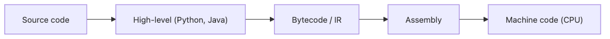

# 프로그래밍 언어란 무엇인가?

Python을 쓰다 보면 언어를 그냥 도구처럼 여기기 쉽습니다. 그런데 같은 문제를 어셈블리로 풀 때와 Python으로 풀 때는 코드 길이만 달라지는 것이 아닙니다. 문제를 쪼개는 방식, 이름을 붙이는 방식, 상태를 다루는 방식까지 함께 달라집니다.

이 글은 Programming Languages 101 시리즈의 첫 번째 글입니다.

이 글에서는 프로그래밍 언어를 단순한 문법 집합이 아니라, 사람이 문제를 표현하는 틀로 보겠습니다. 같은 계산을 여러 패러다임으로 풀어 보면서 언어가 무엇을 감추고 무엇을 드러내는지부터 잡아 두겠습니다.

## 이 글에서 다룰 문제

- 왜 우리는 기계어 대신 고급 언어를 사용할까요?
- 프로그래밍 언어는 정확히 어떤 추상화를 제공할까요?
- 같은 문제를 명령형, 객체지향, 함수형, 선언형으로 풀면 무엇이 달라질까요?
- 좋은 언어를 본다는 말은 결국 무엇을 본다는 뜻일까요?

> 프로그래밍 언어는 기계에 명령을 내리는 표기법이면서, 동시에 문제를 어떻게 분해하고 표현할지를 정하는 사고의 틀입니다. 같은 계산이 패러다임에 따라 전혀 다른 모양의 코드가 되는 이유도 여기에 있습니다.

## 왜 중요한가

언어를 기능 목록으로만 보면 새 언어를 만날 때마다 처음부터 다시 배워야 한다는 느낌을 받습니다. 반대로 변수, 표현식, 제어 흐름, 함수, 타입 같은 공통 구조를 먼저 잡아 두면 새 언어는 낯선 대상이 아니라 익숙한 개념의 다른 표현으로 보입니다. 이 시리즈는 그 공통 구조를 하나씩 분해하는 흐름으로 이어집니다.

## 핵심 개념 한눈에 보기



*고급 언어에서 기계어까지 내려가는 추상화 계층*

위로 갈수록 사람이 읽기 쉽고, 아래로 갈수록 CPU가 직접 이해하는 표현에 가까워집니다. 프로그래밍 언어는 이 층위 어디에 설지 정하고, 그 위에서 이름, 함수, 타입, 모듈 같은 추상화를 제공합니다. Python 한 줄이 어셈블리 수십 줄로 풀리는 이유도 이 추상화 덕분입니다.

## 먼저 알아둘 용어

- 구문: 어떤 문자 배열이 합법인지 정하는 규칙입니다.
- 의미: 그 구문이 실행될 때 실제로 무엇을 하게 되는지입니다.
- 패러다임: 문제를 푸는 기본 관점입니다. 명령형, 객체지향, 함수형, 선언형이 대표적입니다.
- 추상화: 세부 사항을 감추고 더 큰 단위로 생각하게 해 주는 장치입니다.
- 번역기: 소스 코드를 기계가 실행할 다른 형태로 바꾸는 프로그램입니다.

## 먼저 보는 예시

### 추상화가 낮을 때

```asm
; x86-64 (simplified)
mov rax, 3
mov rbx, 4
add rax, rbx        ; rax = 7
```

여기서는 레지스터 이름과 명령어를 직접 다룹니다. 변수도 없고 함수도 없습니다. 계산 자체보다 계산을 어떻게 전달할지에 더 많은 주의를 써야 합니다.

### 추상화가 높을 때

```python
total = 3 + 4
print(total)  # 7
```

`total`이라는 이름이 생기고, `+`라는 익숙한 기호를 그대로 씁니다. 출력도 한 줄이면 충분합니다. 이것이 고급 언어가 주는 가장 현실적인 이점입니다. 기계 명령을 잊고 문제 구조에 집중하게 만든다는 점입니다.

## 같은 문제를 네 가지 패러다임으로 풀기

정수 리스트에서 짝수만 골라 두 배로 만든 뒤 모두 더하는 문제를 보겠습니다.

### 1단계 — 명령형으로 풀기

```python
# 1_imperative.py
nums = [1, 2, 3, 4, 5, 6]
total = 0
for n in nums:
    if n % 2 == 0:
        total += n * 2
print(total)  # 24
```

루프와 변수로 계산 단계를 순서대로 적습니다. 가장 직접적이지만 단계가 길게 드러납니다.

### 2단계 — 객체지향으로 풀기

```python
# 2_oop.py
class EvenDoubler:
    def __init__(self, nums: list[int]) -> None:
        self.nums = nums

    def total(self) -> int:
        return sum(n * 2 for n in self.nums if n % 2 == 0)

print(EvenDoubler([1, 2, 3, 4, 5, 6]).total())  # 24
```

데이터와 동작을 한 객체 안에 묶었습니다. 작은 예제에서는 다소 무거워 보여도, 상태와 책임이 늘어나는 순간 이 장점이 바로 살아납니다.

### 3단계 — 함수형으로 풀기

```python
# 3_functional.py
from functools import reduce

nums = [1, 2, 3, 4, 5, 6]
result = reduce(
    lambda acc, n: acc + n * 2,
    filter(lambda n: n % 2 == 0, nums),
    0,
)
print(result)  # 24
```

데이터 흐름을 함수 조합으로 표현합니다. 값을 바꾸기보다 흘려보내는 쪽에 무게가 실립니다.

### 4단계 — 선언형으로 풀기

```python
# 4_declarative.py
import sqlite3
db = sqlite3.connect(":memory:")
db.execute("CREATE TABLE t (n INTEGER)")
db.executemany("INSERT INTO t VALUES (?)", [(i,) for i in [1,2,3,4,5,6]])
row = db.execute("SELECT SUM(n*2) FROM t WHERE n % 2 = 0").fetchone()
print(row[0])  # 24
```

여기서는 무엇을 원한다는 조건만 적고, 실제 실행 계획은 DBMS에 맡깁니다. 선언형의 핵심은 절차가 아니라 의도를 앞세운다는 점입니다.

### 5단계 — 네 가지 해법 비교하기

네 코드는 모두 24를 계산하지만, 강조점이 다릅니다. 명령형은 절차를, 객체지향은 책임을, 함수형은 데이터 흐름을, 선언형은 의도를 앞세웁니다. 중요한 질문은 어느 패러다임이 더 우월한가가 아니라, 어떤 문제와 어떤 팀에 더 자연스러운가입니다.

## 이 코드에서 먼저 볼 점

- 같은 결과도 패러다임에 따라 전혀 다른 모양의 코드가 됩니다.
- 한 언어가 하나의 패러다임만 강제하는 경우는 드뭅니다. Python처럼 여러 방식을 함께 지원하는 언어가 흔합니다.
- 언어를 고를 때는 속도만이 아니라 문제를 어떻게 표현하게 만드는지도 함께 봐야 합니다.

## 자주 하는 실수

1. 언어를 기능 목록으로만 봅니다. 같은 기능이 있어도 코드가 흘러가는 방식은 크게 다를 수 있습니다.
2. 새 언어를 만날 때마다 모든 것을 처음부터 다시 배워야 한다고 생각합니다. 공통 구조를 먼저 잡으면 부담이 줄어듭니다.
3. 언어 선택을 실행 속도 하나로만 결정합니다. 실제 병목은 I/O나 알고리즘인 경우가 많습니다.
4. 하나의 패러다임을 모든 문제에 밀어 넣습니다. 간단한 스크립트에 무거운 객체 구조를 씌우는 식의 과설계가 흔합니다.
5. 추상화 수준을 잘못 고릅니다. 다섯 줄짜리 작업에 지나치게 무거운 도구를 고르면 생산성이 떨어집니다.

## 실무에서는 이렇게 본다

현업에서는 한 회사가 하나의 언어만 쓰는 경우가 드뭅니다. 백엔드는 Python이나 Go, 프런트엔드는 JavaScript나 TypeScript, 데이터 쪽은 SQL과 Python, 시스템 쪽은 C나 Rust처럼 문제 영역에 따라 선택이 달라집니다. 언어를 고른다는 말은 사실 문제 영역에 맞는 추상화와 패러다임을 고른다는 뜻에 가깝습니다.

새 팀에 합류했을 때도 문법부터 외우기보다 그 팀이 어떤 패러다임을 선호하는지부터 보는 편이 빠릅니다. 코드 리뷰가 무엇을 칭찬하는지, 어떤 구조를 자연스럽다고 여기는지를 보면 언어의 성격이 훨씬 빨리 보입니다.

## 체크리스트

- [ ] 고급 언어에서 기계어까지 내려가는 추상화 계층을 한 문장으로 설명할 수 있는가?
- [ ] 명령형, 객체지향, 함수형, 선언형이 각각 무엇을 강조하는지 구분할 수 있는가?
- [ ] 같은 문제를 두 가지 이상 방식으로 풀어 본 적이 있는가?
- [ ] 새 언어를 배울 때 공통 구조부터 잡는 습관이 있는가?
- [ ] “어느 언어가 최고인가” 대신 “어느 언어가 이 문제에 맞는가”를 묻는가?

## 연습 문제

1. 가장 자주 쓰는 언어 하나를 골라, 그 언어가 어떤 패러다임을 특히 밀어 주는지 한 단락으로 정리해 보세요.
2. 위 네 가지 해법 가운데 가장 빠를 것 같은 것을 고르고, 그렇게 생각한 이유를 적어 보세요.
3. 선언형이 항상 최선이 아닌 상황을 두 가지 적어 보세요.

## 정리

프로그래밍 언어는 기계에 명령을 내리는 문법인 동시에, 사람이 문제를 구조화하는 틀입니다. 같은 계산도 패러다임에 따라 전혀 다른 코드가 되고, 그 차이가 팀의 설계 감각과 유지보수 방식까지 바꿉니다. 다음 글에서는 모든 언어의 두 축인 구문과 의미를 분리해서 보겠습니다.

<!-- toc:begin -->
- **프로그래밍 언어란 무엇인가? (현재 글)**
- 구문과 의미 (예정)
- 타입 시스템 (예정)
- 스코프와 바인딩 (예정)
- 함수와 클로저 (예정)
- 객체와 프로토타입 (예정)
- 메모리 관리 (예정)
- 인터프리터와 컴파일러 (예정)
- 정적 언어와 동적 언어 (예정)
- 좋은 언어 설계란 무엇인가? (예정)
<!-- toc:end -->

## 참고 자료

- [Programming Language Pragmatics (Scott)](https://www.elsevier.com/books/programming-language-pragmatics/scott/978-0-12-410409-9)
- [Structure and Interpretation of Computer Programs](https://mitpress.mit.edu/sites/default/files/sicp/index.html)
- [Concepts, Techniques, and Models of Computer Programming](https://www.info.ucl.ac.be/~pvr/book.html)
- [Python Documentation — The Python Tutorial](https://docs.python.org/3/tutorial/)

Tags: Computer Science, Programming Languages, 언어, 패러다임, 추상화, 표현력
