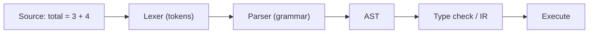

# 구문과 의미

빌드는 통과했는데 프로그램이 이상하게 동작하는 경우가 있습니다. 반대로 쉼표 하나 빠졌다는 이유로 아예 실행조차 못 하는 경우도 있습니다. 둘 다 에러이지만 같은 종류의 에러는 아닙니다.

이 글은 Programming Languages 101 시리즈의 두 번째 글입니다.

이 글에서는 언어를 이루는 두 축인 구문과 의미를 분리해서 보겠습니다. 문자가 합법적으로 배열됐는지와, 그 배열이 실제로 무엇을 뜻하는지는 다른 질문이라는 점을 분명히 잡아 두면 이후의 타입 시스템, 스코프, 클로저도 훨씬 쉽게 읽힙니다.

## 이 글에서 다룰 문제

- 구문과 의미의 경계는 정확히 어디일까요?
- 토큰, 문법, AST는 어떤 순서로 이어질까요?
- 합법적인 코드인데도 의도와 다르게 동작하는 이유는 무엇일까요?
- 정적 의미와 동적 의미는 어떻게 다를까요?

> 구문은 “이 표현이 합법인가?”를 답하고, 의미는 “합법이라면 정확히 무엇을 뜻하는가?”를 답합니다. 이 둘을 분리해야 컴파일 단계의 문제와 실행 단계의 문제를 다른 눈으로 볼 수 있습니다.

## 왜 중요한가

새 언어를 배울 때 문법을 빠르게 익히는 일, 에러 메시지를 빠르게 읽는 일, 같은 기호가 언어마다 왜 다르게 동작하는지 이해하는 일은 모두 이 두 축을 분리해서 볼 때 쉬워집니다. 특히 뒤에서 다룰 타입 시스템과 스코프는 같은 구문 위에 서로 다른 의미 규칙이 올라간 사례들입니다.

## 핵심 개념 한눈에 보기



렉서는 문자를 토큰으로 자르고, 파서는 토큰 순서가 문법에 맞는지 확인한 뒤 AST를 만듭니다. 여기까지가 구문 단계입니다. 그 다음 AST를 어떻게 해석할지, 어떤 타입 규칙을 적용할지, 실행하면 무슨 결과가 나올지를 정하는 단계가 의미입니다.

## 먼저 알아둘 용어

- 토큰: 더 이상 잘게 나누기 어려운 의미 단위입니다.
- 문법: 토큰이 어떤 순서로 놓일 수 있는지 정하는 규칙입니다.
- 추상 구문 트리(AST): 파서가 만든 코드의 트리 표현입니다.
- 정적 의미: 실행 전에 결정되는 의미 규칙입니다.
- 동적 의미: 실제 실행 중에 드러나는 의미 규칙입니다.

## 먼저 보는 예시

### 서로 다른 층위의 두 에러

```python
# Both are "errors," but they live in different layers.
print("hello"   # SyntaxError
divide(10, 0)   # legal syntax, throws ZeroDivisionError at runtime
```

첫 줄은 파서가 아예 받아들이지 못하는 코드입니다. 둘째 줄은 구문상 합법이지만, 실행하다가 0으로 나누는 순간에야 문제가 드러납니다. 둘을 같은 에러라고 묶어 보면 디버깅이 자꾸 헷갈립니다.

### 구문 통과 여부를 분리해서 보기

```python
import ast

src_ok  = "total = 3 + 4"
src_bad = "total = 3 +"

print(ast.parse(src_ok))   # passes syntax → produces an AST
ast.parse(src_bad)         # SyntaxError: invalid syntax
```

`ast.parse`는 구문이 통과했는지만 보여 줍니다. 의도와 맞는 의미인지까지 보장해 주지는 않습니다. 이 차이를 분리해서 보는 습관이 중요합니다.

## 작은 표현식을 직접 파싱해 보기

`3 + 4 * 2` 같은 간단한 표현식을 토큰으로 자르고, 문법에 맞춰 트리로 만든 뒤, 마지막에 평가해 보겠습니다.

### 1단계 — 토큰으로 자르기

```python
# 1_lex.py
import re

def tokenize(src: str) -> list[tuple[str, str]]:
    spec = [
        ("NUM", r"\d+"),
        ("OP",  r"[+*\-/()]"),
        ("WS",  r"\s+"),
    ]
    regex = "|".join(f"(?P<{n}>{p})" for n, p in spec)
    return [
        (m.lastgroup, m.group())
        for m in re.finditer(regex, src)
        if m.lastgroup != "WS"
    ]

print(tokenize("3 + 4 * 2"))
# [('NUM', '3'), ('OP', '+'), ('NUM', '4'), ('OP', '*'), ('NUM', '2')]
```

이 단계는 텍스트를 의미 있는 조각으로 나누는 일입니다. 아직 계산의 의미는 해석하지 않습니다.

### 2단계 — 문법 정의하기

BNF에 가까운 표기로 적으면 다음과 같습니다.

```text
expr    = term  ("+" term  | "-" term)*
term    = factor ("*" factor | "/" factor)*
factor  = NUM | "(" expr ")"
```

`*`와 `/`가 `term` 안에 더 깊게 들어가 있기 때문에 우선순위가 생깁니다. 우선순위는 계산기의 감각이 아니라 문법 구조에서 나옵니다.

### 3단계 — 파서가 구문 트리 만들기

```python
# 3_parse.py
class P:
    def __init__(self, toks):
        self.toks, self.i = toks, 0
    def peek(self): return self.toks[self.i] if self.i < len(self.toks) else (None, None)
    def eat(self):  t = self.peek(); self.i += 1; return t
    def expr(self):
        node = self.term()
        while self.peek()[1] in ("+", "-"):
            op = self.eat()[1]; node = (op, node, self.term())
        return node
    def term(self):
        node = self.factor()
        while self.peek()[1] in ("*", "/"):
            op = self.eat()[1]; node = (op, node, self.factor())
        return node
    def factor(self):
        k, v = self.eat()
        if k == "NUM": return int(v)
        if v == "(":
            node = self.expr(); self.eat(); return node
        raise SyntaxError(f"unexpected {v}")

from pprint import pprint
pprint(P(tokenize("3 + 4 * 2")).expr())
# ('+', 3, ('*', 4, 2))
```

트리를 보면 `4 * 2`가 하나의 하위 노드로 묶여 있습니다. 파서는 이런 구조를 통해 계산 우선순위를 코드 바깥이 아니라 트리 안에 저장합니다.

### 4단계 — 의미를 부여해 평가하기

```python
# 4_eval.py
def evaluate(node) -> int:
    if isinstance(node, int):
        return node
    op, a, b = node
    return {
        "+": lambda x, y: x + y,
        "-": lambda x, y: x - y,
        "*": lambda x, y: x * y,
        "/": lambda x, y: x // y,
    }[op](evaluate(a), evaluate(b))

print(evaluate(("+", 3, ("*", 4, 2))))  # 11
```

이제부터가 동적 의미입니다. 같은 트리라도 어떤 평가기를 붙이느냐에 따라 결과가 달라질 수 있습니다.

### 5단계 — 같은 구문, 다른 의미

```python
# 5_two_semantics.py
def evaluate_strange(node):
    if isinstance(node, int): return node
    op, a, b = node
    if op == "+": return evaluate_strange(a) * evaluate_strange(b)  # + as multiply
    return 0

print(evaluate_strange(("+", 3, ("*", 4, 2))))  # 24 — meaning changed
```

일부러 과장된 예지만 핵심은 분명합니다. 같은 구문 트리라도 다른 의미 규칙을 붙이면 완전히 다른 결과가 나옵니다. 구문과 의미는 정말로 분리된 축입니다.

## 이 코드에서 먼저 볼 점

- 구문은 합법성을, 의미는 해석 결과를 담당합니다.
- AST는 구문 단계의 최종 산출물이면서 의미 단계의 입력입니다.
- 우선순위와 결합 방향은 평가기가 아니라 문법에서 결정됩니다.
- 같은 AST에 다른 평가기를 붙이는 일이 바로 인터프리터와 컴파일러 설계의 핵심이 됩니다.

## 자주 하는 실수

1. 모든 에러를 같은 층위로 봅니다. SyntaxError와 RuntimeError는 출발점부터 다릅니다.
2. 빌드가 되면 코드가 맞다고 생각합니다. 구문 통과는 의미 정확성을 보장하지 않습니다.
3. 연산자 우선순위를 외우는 데 집착합니다. 복잡한 표현은 괄호로 의도를 드러내는 편이 낫습니다.
4. 같은 기호가 언어마다 같은 뜻일 것이라고 가정합니다. `+`만 봐도 문자열 처리에서 차이가 큽니다.
5. AST를 한 번도 직접 보지 않습니다. 한 번만 봐도 에러 메시지가 훨씬 또렷해집니다.

## 실무에서는 이렇게 본다

포매터, 린터, 리팩터링 도구, 자동 코드 변환기는 대부분 AST 위에서 동작합니다. 함수 호출을 모두 찾거나, 낡은 API를 새 API로 바꾸는 작업이 정규식보다 AST 기반으로 안정적인 이유도 여기에 있습니다. 결국 도구가 보는 코드는 문자 문자열이 아니라 구조화된 트리입니다.

로그를 읽을 때도 마찬가지입니다. `Unexpected token`은 구문 단계의 메시지고, `is not a function`은 실행 중 의미 단계의 메시지입니다. 어느 층위의 오류인지 먼저 구분하면 디버깅 시작점이 크게 빨라집니다.

## 체크리스트

- [ ] 구문과 의미의 차이를 한 문장으로 설명할 수 있는가?
- [ ] AST가 무엇이고 왜 필요한지 설명할 수 있는가?
- [ ] 정적 의미와 동적 의미를 구별할 수 있는가?
- [ ] 에러 메시지를 보고 어느 층위의 문제인지 가늠할 수 있는가?
- [ ] 같은 구문이 언어마다 다른 의미를 가질 수 있다는 점을 받아들였는가?

## 연습 문제

1. 위 표현식 문법에 `**` 연산자를 추가해 보세요. 문법과 평가기를 모두 바꿔야 합니다.
2. Python과 JavaScript에서 `1 + "2"`를 각각 실행해 보고, 차이가 구문 때문인지 의미 때문인지 한 줄로 설명해 보세요.
3. 최근에 만난 버그 하나를 골라, 그것이 구문 문제인지 정적 의미 문제인지 동적 의미 문제인지 분류해 보세요.

## 정리

구문은 합법성의 문제이고, 의미는 해석의 문제입니다. 이 둘을 분리하면 에러의 정체가 훨씬 선명해지고, 새 언어를 만났을 때 무엇부터 봐야 할지도 분명해집니다. 다음 글에서는 정적 의미의 핵심 도구인 타입 시스템으로 넘어가겠습니다.

<!-- toc:begin -->
- [프로그래밍 언어란 무엇인가?](./01-what-is-a-programming-language.md)
- **구문과 의미 (현재 글)**
- 타입 시스템 (예정)
- 스코프와 바인딩 (예정)
- 함수와 클로저 (예정)
- 객체와 프로토타입 (예정)
- 메모리 관리 (예정)
- 인터프리터와 컴파일러 (예정)
- 정적 언어와 동적 언어 (예정)
- 좋은 언어 설계란 무엇인가? (예정)
<!-- toc:end -->

## 참고 자료

- [Python ast module documentation](https://docs.python.org/3/library/ast.html)
- [Crafting Interpreters (Bob Nystrom)](https://craftinginterpreters.com/)
- [Compilers: Principles, Techniques, and Tools (Dragon Book)](https://suif.stanford.edu/dragonbook/)
- [Backus–Naur Form (Wikipedia)](https://en.wikipedia.org/wiki/Backus%E2%80%93Naur_form)

Tags: Computer Science, Programming Languages, Syntax, Semantics, Grammar, 파싱
