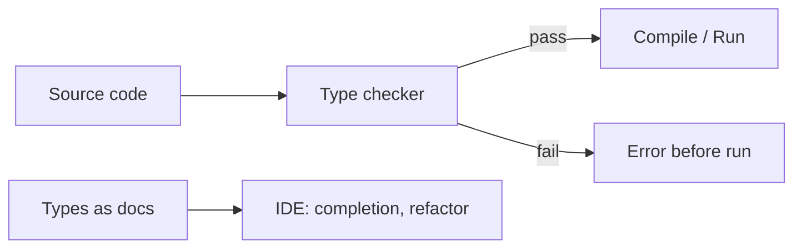

# type system

> Programming Languages 101 시리즈 (3/10)


## 이 글에서 다룰 문제

현대 언어는 대부분 어떤 형태의 타입 시스템을 가지고 있고, Python·JavaScript·Ruby 같은 동적 언어조차 점진적 타입 시스템(Type Hints, TypeScript)을 도입했습니다. 타입을 이해해야 자동 완성, 리팩터링 도구, 빌드 단계의 에러 메시지를 제대로 활용할 수 있고, 시리즈 후반의 scope·closure도 타입 위에서 분석됩니다.

> 타입은 "모든 가능한 입력 중 어떤 것이 합법인가"를 미리 좁혀 주는 약속입니다.

## 전체 흐름


타입 검사기는 실행 전에 "잘못 가능한 호출"을 잘라 냅니다. 동시에 IDE에는 자동 완성과 안전한 리팩터링의 근거가 됩니다.

## Before/After

**Before — 타입 없는 함수**

```python
def discount(price, rate):
    return price - price * rate

# 누가 이렇게 부른다
discount("1000", 0.1)  # 실행 시 TypeError: can't multiply str
```

함수 시그니처만 봐서는 어떤 타입을 기대하는지 알기 어렵고, 잘못된 호출은 실행해야 드러납니다.

**After — 타입을 적은 함수**

```python
def discount(price: int, rate: float) -> float:
    return price - price * rate

discount("1000", 0.1)  # mypy가 호출 단계에서 거부
```

`mypy` 같은 정적 검사기가 실행 전에 잡아 줍니다. 시그니처는 그 자체로 작은 문서가 됩니다.

## 타입을 단계적으로 도입해 보기

### 1단계 — 타입 힌트 적기

```python
# 1_hints.py
def to_kebab(s: str) -> str:
    return s.strip().lower().replace(" ", "-")

print(to_kebab("Hello World"))
```

`-> str`이 없어도 동작은 같지만, 호출자에게 약속이 생깁니다.

### 2단계 — mypy로 검사

```bash
pip install mypy
mypy 1_hints.py    # Success: no issues
```

빌드 단계에서 검사하는 습관이 시작됩니다.

### 3단계 — 제네릭 함수

```python
# 3_generic.py
from typing import TypeVar, Iterable

T = TypeVar("T")

def first(xs: Iterable[T]) -> T:
    for x in xs:
        return x
    raise ValueError("empty")

reveal_type(first([1, 2, 3]))   # Revealed type is "int"
reveal_type(first(["a", "b"]))  # Revealed type is "str"
```

같은 함수가 여러 타입에 대해 정확한 반환 타입을 유지합니다. 도구 지원이 한 단계 강해집니다.

### 4단계 — 합집합 타입과 좁히기

```python
# 4_union.py
def length(x: str | list) -> int:
    if isinstance(x, str):
        return len(x)
    return sum(len(item) for item in x)
```

`isinstance` 검사 후 타입 검사기는 분기 안에서 타입을 좁혀 줍니다.

### 5단계 — 타입을 도입했더니 잡힌 진짜 버그

```python
# 5_real_bug.py
def total_price(items: list[dict]) -> int:
    return sum(item["price"] for item in items)  # 타입 표기 후 mypy가 dict값 타입 모호함을 지적
```

타입을 정확히 적으려고 하면, 데이터 모델 자체의 모호함이 드러납니다. 보통은 그게 진짜 버그의 원인입니다.

## 이 코드에서 주목할 점

- 타입은 "검사"이자 "문서"이자 "도구의 입력"입니다.
- 정적 검사는 모든 버그를 잡지 못하지만, 가장 흔한 종류의 버그를 가장 싸게 잡아 줍니다.
- 제네릭은 "한 번 짜고 여러 타입에 쓰기"의 안전한 방식입니다.
- 합집합 타입과 isinstance 좁히기는 동적 언어 출신에게 익숙한 사고를 정적 검사에 그대로 옮겨 줍니다.

## 자주 하는 실수 5가지

1. **`Any`를 도배한다.** 검사기가 침묵할 뿐, 안전성은 없습니다.
2. **타입을 한 번에 다 붙이려 한다.** 핵심 경계(공개 함수, 모듈 인터페이스)부터 점진적으로.
3. **타입과 런타임 검증을 헷갈린다.** `mypy`는 런타임에 데이터 모양을 검사하지 않습니다. 외부 입력은 별도로 검증해야 합니다.
4. **너무 정교한 타입을 추구한다.** 90% 케이스를 잡아 주는 단순한 타입이, 100% 잡아 주는 복잡한 타입보다 대부분의 경우 더 가치 있습니다.
5. **동적 언어와 정적 언어를 우열로 본다.** 도메인과 팀 크기에 따라 비용/이득이 달라지는 트레이드오프입니다.

## 실무에서는 이렇게 쓰입니다

대형 Python 코드베이스는 mypy/pyright를 빌드 단계에 넣고, 공개 함수의 타입을 강제합니다. JavaScript 진영은 TypeScript가 사실상 표준이 됐습니다. 라이브러리 경계의 타입은 사용자가 받아 보는 1차 문서이고, 자동 완성의 근거이기도 합니다.

타입은 리팩터링의 안전망입니다. "이 함수의 인자 순서를 바꾼다"는 변경이 컴파일 단계에서 모든 호출 지점을 빨갛게 만들면, 그 작업을 자신 있게 할 수 있습니다.

## 체크리스트

- [ ] 정적 vs 동적, 강한 vs 약한 타입의 차이를 한 줄로 구별할 수 있는가?
- [ ] 점진적 타입 도입의 첫 대상이 어디여야 하는지 답할 수 있는가?
- [ ] `Any`를 무엇으로 좁힐지 한 가지 전략을 갖고 있는가?
- [ ] 타입과 런타임 검증의 차이를 알고 있는가?
- [ ] 제네릭이 왜 단순 매개변수화보다 더 강한지 설명할 수 있는가?

## 정리 및 다음 단계

타입 시스템은 안전성, 문서, 도구 지원을 한 번에 얻을 수 있는 도구입니다. 모든 언어에 모든 수준의 타입이 필요한 것은 아니지만, 경계가 큰 시스템에서는 거의 항상 이득입니다. 다음 글에서는 타입과 함께 모든 언어의 또 다른 기둥 — scope와 binding — 을 살펴봅니다.

<!-- toc:begin -->
- [프로그래밍 언어란 무엇인가?](./01-what-is-a-programming-language.md)
- [syntax와 semantics](./02-syntax-and-semantics.md)
- **type system (현재 글)**
- scope와 binding (예정)
- 함수와 closure (예정)
- 객체와 prototype (예정)
- memory management (예정)
- interpreter와 compiler (예정)
- static vs dynamic language (예정)
- 좋은 언어 설계란 무엇인가? (예정)
<!-- toc:end -->

## 참고 자료

- [Types and Programming Languages (Pierce)](https://www.cis.upenn.edu/~bcpierce/tapl/)
- [mypy documentation](https://mypy.readthedocs.io/)
- [TypeScript Handbook](https://www.typescriptlang.org/docs/handbook/)
- [PEP 484 — Type Hints](https://peps.python.org/pep-0484/)

Tags: Computer Science, Programming Languages, TypeSystem, 정적타입, 동적타입, 추론
