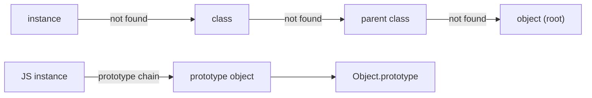

# 객체와 프로토타입

Java의 클래스도 객체지향이고, JavaScript의 프로토타입도 객체지향이라고 합니다. 그런데 둘의 표면은 꽤 다릅니다. 무엇이 같고 무엇이 다를까요.

이 글은 Programming Languages 101 시리즈의 여섯 번째 글입니다.

이 글에서는 객체를 상태와 동작을 묶는 단위로 먼저 정의한 뒤, 그 묶음을 만드는 두 가지 대표 방식인 클래스 기반 모델과 프로토타입 기반 모델을 비교하겠습니다. 핵심 차이는 결국 메서드를 어디서 어떻게 찾느냐에 있습니다.

## 이 글에서 다룰 문제

- 객체를 가장 간단히 정의하면 무엇일까요?
- 클래스 기반 모델과 프로토타입 기반 모델은 메서드 탐색이 어떻게 다를까요?
- Python에서 클래스 자체가 객체라는 말은 무슨 뜻일까요?
- 상속과 위임은 어떤 관계일까요?

> 객체의 본질은 상태와 그 상태를 다루는 동작을 한 단위로 묶는 데 있습니다. 클래스와 프로토타입은 이 묶음을 만드는 두 가지 방법일 뿐이고, 실제 차이는 메서드를 찾을 때 위로 어떻게 위임하느냐에 있습니다.

## 왜 중요한가

객체 모델을 정확히 이해하면 “왜 이 메서드가 호출되지?”, “왜 `super`가 이렇게 동작하지?” 같은 질문이 하나의 설명으로 정리됩니다. 새로운 객체지향 언어를 만나도 표면 문법보다 탐색 규칙을 먼저 보면 훨씬 빠르게 적응할 수 있습니다.

## 핵심 개념 한눈에 보기



위쪽은 클래스 기반 탐색, 아래쪽은 프로토타입 체인입니다. 공통 구조는 단순합니다. 현재 객체에 없으면 한 단계 위로 위임합니다. 객체 모델의 핵심은 이 위임 규칙을 어디에 두느냐입니다.

## 먼저 알아둘 용어

- 인스턴스: 어떤 시점의 실제 상태를 담는 구체 객체입니다.
- 클래스: 인스턴스의 형태와 동작을 정의하는 청사진입니다.
- 프로토타입: 다른 객체가 위임할 수 있는 기준 객체입니다.
- 메서드 해석 순서: 메서드를 찾을 때 어떤 경로를 따라 올라갈지 정한 규칙입니다.
- 위임: 현재 객체에 값이 없을 때 다른 객체에 조회를 넘기는 일입니다.

## 먼저 보는 예시

### 데이터와 함수가 분리돼 있을 때

```python
def make_user(name, age):
    return {"name": name, "age": age}

def greet(user):
    return f"hi, {user['name']}"

u = make_user("kim", 30)
print(greet(u))
```

호출자는 데이터와 함수를 함께 들고 다녀야 합니다. 구조가 단순할 때는 괜찮지만, 책임이 늘수록 관리가 어려워집니다.

### 클래스에 묶었을 때

```python
class User:
    def __init__(self, name: str, age: int) -> None:
        self.name, self.age = name, age
    def greet(self) -> str:
        return f"hi, {self.name}"

print(User("kim", 30).greet())
```

상태와 동작이 한 단위로 묶였기 때문에 호출자는 하나의 객체만 다루면 됩니다. 객체지향의 가장 실질적인 장점이 여기에 있습니다.

## 두 모델을 단계적으로 따라가기

### 1단계 — 클래스 기반 탐색

```python
# 1_class.py
class A:
    def hi(self): return "A.hi"

class B(A):
    pass

print(B().hi())          # 'A.hi' — not on B, delegated upward
print(B.__mro__)          # the lookup order
```

`B`에 `hi`가 없으니 상위 클래스로 올라갑니다. `__mro__`는 Python이 실제로 따르는 탐색 경로를 그대로 보여 줍니다.

### 2단계 — 클래스도 객체다

```python
# 2_class_is_object.py
class A: ...
print(type(A))         # <class 'type'>  — a class is an instance of type
A.tag = "v1"            # you can attach attributes to a class object
print(A.tag)
```

Python에서는 클래스도 일급 객체입니다. 그래서 클래스에 속성을 붙이거나, 메타프로그래밍으로 동작을 바꾸는 일이 가능합니다.

### 3단계 — 사전으로 흉내 내는 프로토타입 방식

```python
# 3_prototype.py
base = {"hi": lambda self: "base.hi"}

def lookup(obj, key):
    if key in obj: return obj[key]
    if "__proto__" in obj: return lookup(obj["__proto__"], key)
    raise KeyError(key)

inst = {"__proto__": base}
print(lookup(inst, "hi")(inst))   # 'base.hi'
```

Python에는 실제 프로토타입 체인이 없지만, “없으면 위로 넘긴다”는 감각은 동일합니다. 클래스가 아닌 객체 자체를 기준으로 위임하는 것이 핵심 차이입니다.

### 4단계 — 재정의와 상위 호출

```python
# 4_super.py
class A:
    def hi(self): return "A"
class B(A):
    def hi(self): return "B+" + super().hi()

print(B().hi())  # B+A
```

`super()`는 막연히 “부모”를 가리키는 것이 아니라 MRO에서 다음 항목으로 이동합니다. 다중 상속에서도 이 한 줄이 일관된 탐색 규칙을 유지해 줍니다.

### 5단계 — 클로저로 객체 흉내 내기

```python
# 5_object_as_closure.py
def make_user(name):
    def greet(): return f"hi, {name}"
    return {"greet": greet}

u = make_user("kim")
print(u["greet"]())  # hi, kim
```

상태인 `name`과 동작인 `greet`가 클로저로 묶였습니다. 클래스 키워드가 없어도 객체의 핵심이 성립한다는 말입니다.

## 이 코드에서 먼저 볼 점

- 두 모델 모두 “없으면 위로 위임한다”는 공통 원리를 갖습니다.
- Python 클래스가 객체라는 사실이 메타프로그래밍의 기반입니다.
- `super`는 부모라는 감각보다 MRO의 다음 항목이라는 감각으로 이해하는 편이 정확합니다.
- 클로저와 객체는 상태와 동작을 묶는다는 점에서 서로 닮아 있습니다.

## 자주 하는 실수

1. 상속 트리를 너무 깊게 만듭니다. 많은 경우 위임이나 조합이 더 단순합니다.
2. MRO를 모른 채 다중 상속을 사용합니다. 그러면 `super`가 갑자기 불투명해집니다.
3. 상태는 없고 메서드만 잔뜩 든 클래스를 만듭니다. 이런 경우는 모듈이나 네임스페이스가 더 자연스러울 수 있습니다.
4. 프로토타입을 클래스의 열등한 흉내처럼 봅니다. 개별 객체 단위로 동작을 바꿀 수 있다는 힘을 놓치게 됩니다.
5. 클로저와 객체를 무관한 개념으로 봅니다. 둘의 공통 구조를 알면 설계 선택지가 넓어집니다.

## 실무에서는 이렇게 본다

대부분의 백엔드 코드는 클래스 기반 객체지향 위에 서 있습니다. 도메인 모델은 클래스가 되고, 동작은 메서드가 됩니다. 반면 JavaScript는 `class` 문법을 받아들였어도 엔진 내부에서는 여전히 프로토타입 체인을 사용합니다. 그래서 `Object.create`나 `Object.getPrototypeOf` 같은 API가 살아 있습니다.

설계를 시작할 때는 “이 객체가 실제로 어떤 상태를 들고 있나?”를 먼저 묻는 편이 좋습니다. 답이 빈약하다면 클래스를 만들 이유가 약할 수 있습니다. 기본값은 조합이고, 상속은 정말로 is-a 관계가 강할 때만 쓰는 편이 안정적입니다.

## 체크리스트

- [ ] 클래스 기반과 프로토타입 기반의 차이를 한 줄로 설명할 수 있는가?
- [ ] Python의 `__mro__`를 직접 출력해 본 적이 있는가?
- [ ] `super`가 무엇을 하는지 한 문장으로 설명할 수 있는가?
- [ ] 기본 선택으로 조합을 더 선호하는가?
- [ ] 클로저로 객체를 흉내 내 본 적이 있는가?

## 연습 문제

1. 다중 상속 클래스를 두 개 만들고 `__mro__`를 출력한 뒤, 그 순서가 왜 그렇게 나오는지 적어 보세요.
2. 클로저 기반 객체 예제에 상태를 바꾸는 연산을 추가해 보세요. `nonlocal`이 필요합니다.
3. 최근에 상속을 쓴 클래스 하나를 골라 조합 기반 대안을 설계해 보세요.

## 정리

객체는 상태와 동작을 묶는 단위이고, 클래스와 프로토타입은 그 묶음을 만드는 두 가지 방식입니다. 어느 쪽이든 핵심은 위임입니다. 다음 글에서는 이 객체들이 메모리 안에서 어떻게 살아 있고 사라지는지 보겠습니다.

<!-- toc:begin -->
- [프로그래밍 언어란 무엇인가?](./01-what-is-a-programming-language.md)
- [구문과 의미](./02-syntax-and-semantics.md)
- [타입 시스템](./03-type-system.md)
- [스코프와 바인딩](./04-scope-and-binding.md)
- [함수와 클로저](./05-functions-and-closures.md)
- **객체와 프로토타입 (현재 글)**
- 메모리 관리 (예정)
- 인터프리터와 컴파일러 (예정)
- 정적 언어와 동적 언어 (예정)
- 좋은 언어 설계란 무엇인가? (예정)
<!-- toc:end -->

## 참고 자료

- [Python Data Model — object](https://docs.python.org/3/reference/datamodel.html)
- [MDN — Inheritance and the prototype chain](https://developer.mozilla.org/en-US/docs/Web/JavaScript/Inheritance_and_the_prototype_chain)
- [Self: The Power of Simplicity (Ungar & Smith)](https://bibliography.selflanguage.org/_static/self-power.pdf)
- [Composition over inheritance (Wikipedia)](https://en.wikipedia.org/wiki/Composition_over_inheritance)

Tags: Computer Science, Programming Languages, Objects, Prototype, Class, Inheritance
