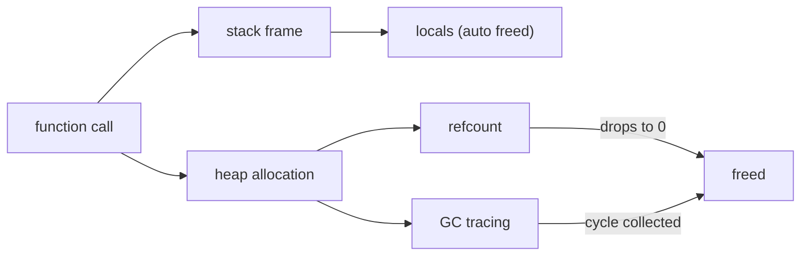

# 메모리 관리

`del x`를 썼다고 해서 그 줄에서 객체가 바로 사라지는 것은 아닙니다. 이름과 객체, 참조와 수명은 서로 다른 층위에 있고, 언어는 그 관계를 각자 다른 방식으로 관리합니다.

이 글은 Programming Languages 101 시리즈의 일곱 번째 글입니다.

이 글에서는 메모리 관리를 “이 객체는 언제 살아 있고 언제 죽는가”를 정하는 규칙으로 보겠습니다. 스택과 힙, 참조 카운팅, 가비지 컬렉션, 약한 참조를 차례로 보면서 GC가 있어도 누수가 생기는 이유까지 함께 정리하겠습니다.

## 이 글에서 다룰 문제

- 스택과 힙은 어떻게 다를까요?
- Python의 참조 카운팅은 언제 객체를 즉시 해제할까요?
- 순환 참조는 왜 가비지 컬렉터가 따로 필요할까요?
- GC 언어에서도 메모리 누수가 생기는 이유는 무엇일까요?

> 메모리 관리는 결국 “누가 이 객체를 붙잡고 있나, 언제 손을 놓나”를 정하는 규칙입니다. 살아 있는 것은 남기고, 더 이상 도달할 수 없는 것은 거두는 일이 핵심입니다.

## 왜 중요한가

오래 실행되는 서비스는 메모리가 조금씩 올라가는 문제를 자주 겪습니다. 그때 필요한 질문은 “왜 이 객체가 아직 살아 있지?”입니다. 메모리 모델을 모르면 이 질문에 답할 수 없고, 누수 원인을 찾는 일도 막연해집니다.

## 핵심 개념 한눈에 보기



함수 호출이 끝나면 스택 프레임은 자동으로 사라집니다. 반면 힙에 있는 객체는 누가 더 참조하는지 따로 추적해야 합니다. CPython은 참조 카운팅과 순환 수집기를 함께 사용해 이 문제를 풉니다.

## 먼저 알아둘 용어

- 스택: 함수 호출과 함께 생기고 사라지는 메모리 영역입니다.
- 힙: 객체를 할당해 두는 영역으로, 별도 회수가 필요합니다.
- 참조 카운팅: 객체를 가리키는 참조 수를 세다가 0이 되면 해제합니다.
- 가비지 컬렉션: 도달 가능한 객체를 따라가며 살아 있는 것만 남깁니다.
- 순환 참조: A가 B를, B가 다시 A를 가리키는 구조입니다.

## 먼저 보는 예시

### 수동 해제 방식의 감각

```python
# pseudocode: forget free, leak forever
buf = malloc(1024)
use(buf)
# free(buf)  ← skip this and 1KB lives on
```

수동 해제 모델에서는 마지막 `free`를 잊는 순간 누수가 시작됩니다.

### 이름이 사라질 때 객체 수명 보기

```python
def work() -> None:
    buf = bytearray(1024)
    use(buf)
# when work() returns, buf has nowhere to live and is reclaimed
```

이름이 사라지고 다른 참조도 없다면 객체는 수명을 다합니다. 다만 “이름이 사라진다”와 “객체가 즉시 해제된다”를 같은 말로 보면 자꾸 헷갈립니다.

## 객체 수명을 직접 따라가 보기

### 1단계 — 참조 카운트 보기

```python
# 1_refcount.py
import sys

class Tag:
    def __del__(self) -> None:
        print("Tag deleted")

t = Tag()
print(sys.getrefcount(t))  # 2 (the variable t + getrefcount's argument)
ref = t
print(sys.getrefcount(t))  # 3
del ref, t                  # all references gone → __del__ fires immediately
```

CPython에서는 참조 수가 0이 되는 순간 객체가 곧바로 정리되는 경우가 많습니다. `sys.getrefcount`가 호출 인자로 인해 1 더 크게 보인다는 점만 기억하면 됩니다.

### 2단계 — 순환 참조와 가비지 컬렉터

```python
# 2_cycle.py
import gc

class Node:
    def __init__(self) -> None:
        self.peer: "Node | None" = None
    def __del__(self) -> None:
        print("Node deleted")

a, b = Node(), Node()
a.peer, b.peer = b, a   # they reference each other
del a, b                 # counts never reach zero
print("before collect")
gc.collect()             # the tracing GC sweeps up the cycle
print("after collect")
```

서로만 참조하는 객체는 참조 수만으로는 정리되지 않습니다. 그래서 CPython은 보조적인 추적 기반 수집기를 함께 둡니다.

### 3단계 — 죽지 않는 객체 만들기

```python
# 3_leak.py
cache: dict[int, bytes] = {}

def remember(i: int) -> None:
    cache[i] = b"x" * 1024  # cache only ever grows

for i in range(1000):
    remember(i)

print(len(cache), "items still alive")
```

GC가 있든 없든 참조가 남아 있으면 객체는 계속 살아 있습니다. 누수의 본질은 잊힌 해제가 아니라 잊히지 않은 참조인 경우가 많습니다.

### 4단계 — 약한 참조 사용하기

```python
# 4_weakref.py
import weakref

class Big:
    pass

obj = Big()
ref = weakref.ref(obj)
print(ref())   # <__main__.Big object ...>
del obj
print(ref())   # None  — a weak reference does not extend lifetime
```

캐시나 옵저버 목록처럼 수명을 늘리고 싶지 않은 참조에는 `weakref`가 표준 도구입니다.

### 5단계 — 블록으로 자원 수명 드러내기

```python
# 5_with.py
from contextlib import contextmanager

@contextmanager
def opened(name: str):
    print("open", name)
    try:
        yield name
    finally:
        print("close", name)

with opened("config.yml") as f:
    print("use", f)
# leaving the block guarantees close
```

메모리만 수명을 가지는 것은 아닙니다. 파일, 소켓, 락도 모두 수명 관리가 필요합니다. `with`는 그 의도를 코드 모양으로 드러내는 가장 좋은 패턴입니다.

## 이 코드에서 먼저 볼 점

- 참조 수가 0이 되면 객체가 즉시 정리될 수 있다는 점이 CPython의 중요한 특징입니다.
- 순환 참조는 참조 카운팅만으로 풀 수 없기 때문에 추적 기반 GC가 필요합니다.
- GC 언어에서도 참조가 남아 있으면 객체는 살아 있습니다.
- `weakref`와 `with`는 메모리뿐 아니라 자원 수명 전반을 다루는 도구입니다.

## 자주 하는 실수

1. `del`이 객체를 즉시 파괴한다고 믿습니다. 실제로는 이름 바인딩을 끊을 뿐입니다.
2. 크기 제한 없는 전역 캐시를 둡니다. 아주 흔한 누수 패턴입니다.
3. 순환 참조를 무시합니다. 도메인 객체가 서로를 오래 붙잡는 구조가 흔합니다.
4. `__del__`에 무거운 정리 로직을 넣습니다. 진짜 정리는 `with`나 명시적 `close`가 더 안전합니다.
5. 뜨거운 경로에서 `gc.collect()`를 남발합니다. CPU만 태우는 경우가 많습니다.

## 실무에서는 이렇게 본다

오래 실행되는 서버는 메모리 그래프를 지속적으로 봅니다. 이상 징후가 보이면 `tracemalloc`이나 `objgraph`로 어떤 객체가 늘어나는지 확인합니다. 캐시에는 항상 크기 제한이나 TTL을 넣고, 콜백이나 옵저버 목록에는 약한 참조나 명시적 해제를 기본값으로 둡니다.

C, C++, Rust는 또 다른 길을 갑니다. Rust는 GC 대신 소유권을 컴파일 시점에 검사합니다. 구현은 달라도 질문은 같습니다. “이 객체를 누가 소유하고, 언제 놓는가?” 이 질문에 답할 수 있어야 메모리 문제를 제대로 다룰 수 있습니다.

## 체크리스트

- [ ] 스택과 힙의 차이를 한 문장으로 말할 수 있는가?
- [ ] Python의 참조 카운팅과 GC가 어떻게 협력하는지 설명할 수 있는가?
- [ ] 최근 코드에서 잠재적 누수 지점을 하나 짚을 수 있는가?
- [ ] `weakref`를 써야 할 대표 상황을 하나 이상 말할 수 있는가?
- [ ] 자원 수명 관리에 `with`를 자연스럽게 쓰는가?

## 연습 문제

1. 순환 참조 예제에서 한쪽을 `weakref`로 바꿔 `gc.collect()` 없이도 정리되는지 확인해 보세요.
2. `tracemalloc`으로 객체를 많이 만들고 지우는 실험을 한 뒤, 관찰한 패턴을 한 단락으로 적어 보세요.
3. 최근에 만든 캐시 하나를 골라 크기 제한이 있는 형태로 바꿔 보세요.

## 정리

메모리 모델은 결국 “누가 붙잡고 있고, 언제 손을 놓는가”를 설명하는 규칙입니다. 다음 글에서는 이 객체와 코드를 실제로 실행하는 두 가지 큰 전략인 인터프리터와 컴파일러를 보겠습니다.

<!-- toc:begin -->
- [프로그래밍 언어란 무엇인가?](./01-what-is-a-programming-language.md)
- [구문과 의미](./02-syntax-and-semantics.md)
- [타입 시스템](./03-type-system.md)
- [스코프와 바인딩](./04-scope-and-binding.md)
- [함수와 클로저](./05-functions-and-closures.md)
- [객체와 프로토타입](./06-objects-and-prototypes.md)
- **메모리 관리 (현재 글)**
- 인터프리터와 컴파일러 (예정)
- 정적 언어와 동적 언어 (예정)
- 좋은 언어 설계란 무엇인가? (예정)
<!-- toc:end -->

## 참고 자료

- [Python — gc module](https://docs.python.org/3/library/gc.html)
- [Python — weakref module](https://docs.python.org/3/library/weakref.html)
- [Python — tracemalloc](https://docs.python.org/3/library/tracemalloc.html)
- [Garbage collection (Wikipedia)](https://en.wikipedia.org/wiki/Garbage_collection_(computer_science))

Tags: Computer Science, Programming Languages, MemoryManagement, GC, Stack, Heap
