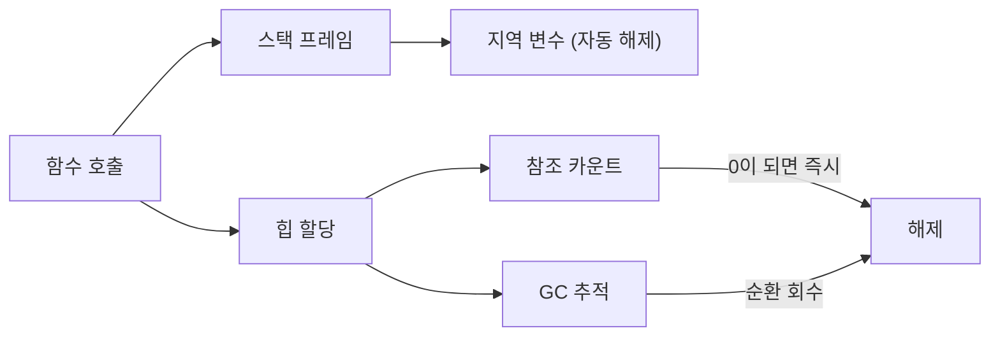

# memory management

> Programming Languages 101 시리즈 (7/10)


## 이 글에서 다룰 문제

서비스가 며칠째 돌고 나면 메모리 사용량이 슬금슬금 오르는 일이 흔합니다. 원인을 찾으려면 "이 객체가 왜 아직 살아 있나"를 답할 수 있어야 합니다. 그 답을 만드는 도구가 메모리 모델입니다.

> 메모리 누수는 보통 "잊혀진 참조" 한 줄에서 시작됩니다.

## 전체 흐름


스택은 함수가 끝나면 통째로 사라집니다. 힙은 누군가가 관리해 줘야 회수됩니다.

## Before/After

**Before — 직접 해제하는 C 스타일 의사코드**

```python
# 의사코드: 사용자가 free를 잊으면 누수
buf = malloc(1024)
use(buf)
# free(buf)  ← 빠뜨리면 1KB가 살아 있다
```

**After — Python: 참조가 사라지면 자동 회수**

```python
def work() -> None:
    buf = bytearray(1024)
    use(buf)
# work()이 끝나면 buf는 갈 곳이 없으니 자동 회수
```

## 객체의 일생을 직접 관찰하기

### 1단계 — 참조 카운트 들여다보기

```python
# 1_refcount.py
import sys

class Tag:
    def __del__(self) -> None:
        print("태그 삭제됨")

t = Tag()
print(sys.getrefcount(t))  # 2 (변수 t + getrefcount의 임시 인자)
ref = t
print(sys.getrefcount(t))  # 3
del ref, t                  # 모든 참조 제거 → 즉시 __del__ 호출
```

`sys.getrefcount`는 +1 편향이 있다는 점만 기억하세요. CPython은 카운트가 0이 되는 순간 객체를 해제합니다.

### 2단계 — 순환 참조와 GC

```python
# 2_cycle.py
import gc

class Node:
    def __init__(self) -> None:
        self.peer: "Node | None" = None
    def __del__(self) -> None:
        print("노드 삭제됨")

a, b = Node(), Node()
a.peer, b.peer = b, a   # 서로를 참조 (순환)
del a, b                 # 카운트는 0이 안 된다
print("before collect")
gc.collect()             # 추적식 GC가 순환을 회수
print("after collect")
```

순환은 카운팅만으로는 못 풉니다. CPython은 보조 GC(추적식)를 같이 돌려 이 문제를 해결합니다.

### 3단계 — "죽지 못하는" 객체

```python
# 3_leak.py
cache: dict[int, bytes] = {}

def remember(i: int) -> None:
    cache[i] = b"x" * 1024  # 캐시에 계속 쌓이기만 한다

for i in range(1000):
    remember(i)

print(len(cache), "items still alive")
```

GC가 있어도 누군가가 참조를 들고 있으면 회수되지 않습니다. **누수 = 잊혀진 참조**입니다.

### 4단계 — `weakref`로 강한 참조를 피하기

```python
# 4_weakref.py
import weakref

class Big:
    pass

obj = Big()
ref = weakref.ref(obj)
print(ref())   # <__main__.Big object ...>
del obj
print(ref())   # None  — 약한 참조는 객체 수명을 늘리지 않는다
```

캐시나 옵저버 패턴에서 `weakref`는 누수를 막는 표준 도구입니다.

### 5단계 — `with`로 자원의 수명을 명확히 하기

```python
# 5_with.py
from contextlib import contextmanager

@contextmanager
def opened(name: str):
    print("open", name)
    try:
        yield name
    finally:
        print("close", name)

with opened("config.yml") as f:
    print("use", f)
# 블록을 벗어나는 순간 close가 보장된다
```

메모리뿐 아니라 파일·소켓·잠금 같은 자원도 수명 관리가 필요하고, `with`가 그 표준 패턴입니다.

## 이 코드에서 주목할 점

- 참조 카운트가 0인 순간 객체는 사라집니다 (CPython의 즉시성).
- 순환은 카운팅만으로는 못 풀고, 추적식 GC가 보충합니다.
- GC 언어에서도 "참조가 살아 있으면" 객체는 살아 있습니다.
- `weakref`와 `with`는 수명을 다루는 도구입니다 — 메모리만의 이야기가 아닙니다.

## 자주 하는 실수 5가지

1. **`del`이면 즉시 사라진다고 믿는다.** `del`은 이름 바인딩만 끊을 뿐, 다른 참조가 있으면 객체는 살아 있습니다.
2. **전역 캐시에 무한히 쌓는다.** 가장 흔한 누수 패턴입니다. 항상 상한을 정하세요.
3. **순환 참조를 무시한다.** 서로 참조하는 도메인 모델은 `weakref`로 한쪽을 풀어 줍니다.
4. **`__del__`에 무거운 일을 넣는다.** 호출 시점이 보장되지 않으니, 실제 정리 작업은 `with`나 명시적 close 메서드에 맡기세요.
5. **GC를 강제로 자주 부른다.** `gc.collect()`를 루프에서 부르면 CPU가 더 든다는 사실만 남습니다.

## 실무에서는 이렇게 쓰입니다

긴 시간 도는 서버는 메모리 그래프를 정기적으로 본다. 의심스러우면 `tracemalloc`이나 `objgraph`로 어떤 타입이 늘어나는지 추적합니다. 캐시는 항상 LRU나 TTL을 두고, 옵저버/콜백 등록은 약한 참조나 명시적 해제를 표준으로 둡니다.

C/C++/Rust 같은 언어는 다른 접근을 씁니다 — Rust는 컴파일 타임 소유권으로 GC 없이 안전을 보장합니다. 어떤 모델이든 본질은 같습니다: **소유자가 누구이고, 언제 놓아주는가**.

## 체크리스트

- [ ] 스택과 힙의 차이를 한 줄로 답할 수 있는가?
- [ ] Python의 참조 카운팅과 GC가 어떻게 협력하는지 설명할 수 있는가?
- [ ] 가장 최근에 짠 코드에서 누수 가능 지점을 한 군데라도 짚을 수 있는가?
- [ ] `weakref`를 어디에 쓰는지 한 가지 이상 말할 수 있는가?
- [ ] `with`로 자원의 수명을 다루는 것이 습관인가?

## 정리 및 다음 단계

메모리 모델은 "누가 들고 있고, 언제 놓는가"의 답을 만드는 도구입니다. 다음 글에서는 그 객체들을 실행하는 두 길 — 인터프리터와 컴파일러 — 을 살펴봅니다.

<!-- toc:begin -->
- [프로그래밍 언어란 무엇인가?](./01-what-is-a-programming-language.md)
- [syntax와 semantics](./02-syntax-and-semantics.md)
- [type system](./03-type-system.md)
- [scope와 binding](./04-scope-and-binding.md)
- [함수와 closure](./05-functions-and-closures.md)
- [객체와 prototype](./06-objects-and-prototypes.md)
- **memory management (현재 글)**
- interpreter와 compiler (예정)
- static vs dynamic language (예정)
- 좋은 언어 설계란 무엇인가? (예정)
<!-- toc:end -->

## 참고 자료

- [Python — gc module](https://docs.python.org/3/library/gc.html)
- [Python — weakref module](https://docs.python.org/3/library/weakref.html)
- [Python — tracemalloc](https://docs.python.org/3/library/tracemalloc.html)
- [Garbage collection (Wikipedia)](https://en.wikipedia.org/wiki/Garbage_collection_(computer_science))

Tags: Computer Science, Programming Languages, 메모리관리, GC, 스택, 힙
