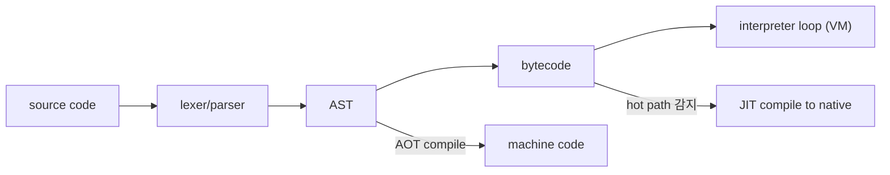

# interpreter와 compiler

> Programming Languages 101 시리즈 (8/10)


## 이 글에서 다룰 문제

성능 문제가 보였을 때 "이 한 줄이 실제로 어떤 명령으로 실행되는가"를 답할 수 있으면 추측 디버깅이 사라집니다. 같은 코드가 인터프리터·JIT·AOT에서 어떻게 다르게 도는지 이해하면, 도구 선택이 명확해집니다.

> 같은 알고리즘이라도 실행 모델이 다르면 100배 차이가 납니다.

## 개념 한눈에 보기



Python은 `A → ... → D → E` 경로, JVM은 hot path가 `F`로 빠집니다. C/Rust는 처음부터 `G`로 갑니다.

## Before/After

**Before — "Python은 그냥 실행된다"는 모호한 그림**

```text
.py 파일 → ??? → 결과
```

**After — 실제 단계가 보이는 그림**

```text
.py → 토큰화 → 파싱 → AST → 컴파일 → .pyc 바이트코드 → VM이 한 명령씩 실행
```

`.pyc`는 캐시된 바이트코드입니다. 즉 Python에는 컴파일 단계가 분명히 있고, 실행 단계는 인터프리터가 맡습니다.

## 실습: Python의 속살을 들여다보기

### 1단계 — `dis`로 바이트코드 읽기

```python
# 1_dis.py
import dis

def add(a: int, b: int) -> int:
    return a + b

dis.dis(add)
```

출력에 `LOAD_FAST a`, `LOAD_FAST b`, `BINARY_OP +`, `RETURN_VALUE` 같은 명령이 보입니다. 이게 Python VM이 한 사이클씩 처리하는 단위입니다.

### 2단계 — 같은 알고리즘, 다른 명령 수

```python
# 2_optimization.py
import dis

def slow(xs):
    s = 0
    for x in xs:
        s = s + x
    return s

def fast(xs):
    return sum(xs)

print("--- slow ---"); dis.dis(slow)
print("--- fast ---"); dis.dis(fast)
```

`fast`가 훨씬 짧은 명령으로 끝납니다. 함수 호출 한 번이 VM 명령 한 줄이 되고, 그 안의 루프는 C로 구현돼 있기 때문입니다.

### 3단계 — `.pyc`가 정말 바이트코드인지 확인

```python
# 3_pyc.py
import py_compile, dis, marshal, importlib.util, pathlib

src = pathlib.Path("/tmp/sample.py")
src.write_text("def f(): return 42\n")
pyc = py_compile.compile(str(src), doraise=True)

with open(pyc, "rb") as f:
    f.read(16)                # 헤더 (Python 3.7+ 16바이트)
    code = marshal.load(f)
dis.dis(code)
```

`.pyc`는 헤더 + marshal된 code object입니다. 다음 실행에서는 이 캐시를 그대로 가져다 VM에 넣으니, 임포트가 빨라집니다.

### 4단계 — AOT 컴파일과 비교 (Python에서 흉내)

```python
# 4_compile_call.py
import time

PY_SRC = "result = sum(range(10_000_000))"
code = compile(PY_SRC, "<inline>", "exec")

t0 = time.perf_counter(); exec(code, {}); t1 = time.perf_counter()
print("compiled-once exec:", t1 - t0)

t0 = time.perf_counter()
for _ in range(3):
    exec(PY_SRC, {})           # 매번 다시 컴파일
print("recompiled each time:", time.perf_counter() - t0)
```

미리 컴파일해 두면 반복 실행이 빠릅니다. AOT의 핵심 아이디어가 이것입니다 — 번역을 한 번만 하고, 실행을 여러 번.

### 5단계 — JIT의 직관: hot path 측정

```python
# 5_hot_path.py
from collections import Counter

calls: Counter[str] = Counter()

def trace(name: str) -> None:
    calls[name] += 1

for _ in range(1_000_000):
    trace("inner")             # 백만 번 — JIT라면 이게 hot path
trace("outer")                  # 한 번

print(calls.most_common(2))
```

JIT 컴파일러는 이런 호출 빈도를 실시간으로 보고, 임계치를 넘는 함수만 기계어로 번역합니다. PyPy, V8(JavaScript), HotSpot(JVM) 모두 같은 아이디어를 변형해 씁니다.

## 이 코드에서 주목할 점

- Python의 "인터프리터 언어" 분류는 **실행 단계 기준**입니다. 컴파일 단계도 분명히 있습니다.
- `dis` 출력 한 줄이 VM 한 사이클입니다 — 성능 분석의 기본 단위.
- `.pyc`는 마법이 아니라 캐시된 바이트코드입니다.
- JIT는 "전부 컴파일"과 "아무것도 컴파일 안 함"의 사이를 잡는 절충입니다.

## 자주 하는 실수 5가지

1. **"인터프리터 vs 컴파일러"를 두 진영의 싸움으로 본다.** 같은 일의 다른 시점일 뿐입니다.
2. **`.pyc`를 "실행 가능한 파일"로 오해한다.** 그 안에는 VM 명령이 있고, 이를 돌려 줄 Python VM이 필요합니다.
3. **Python 루프가 느리다고 알고리즘부터 바꾼다.** 먼저 루프를 C 구현(`sum`, `numpy`)으로 옮기는 것이 정답일 때가 많습니다.
4. **JIT가 항상 빠르다고 가정한다.** 짧게 끝나는 스크립트에서는 워밍업 비용이 더 비쌉니다.
5. **`dis`를 한 번도 안 읽고 성능을 추측한다.** 30초면 답이 나오는 도구가 바로 옆에 있습니다.

## 실무에서는 이렇게 쓰입니다

CPython은 인터프리터 + 바이트코드 캐시 모델로 충분히 빠른 경우를 다 커버합니다. 정말 뜨거운 수치 연산은 NumPy/PyTorch처럼 C/C++ 구현에 위임합니다. PyPy는 같은 Python을 JIT로 돌려 단순 루프 코드에서 큰 차이를 냅니다.

JVM은 기본 전략이 JIT입니다 — 처음에는 인터프리트로 시작하고, hot path를 기계어로 컴파일해 점진적으로 빨라지는 모델입니다. Go/Rust/C는 AOT로 한 번에 기계어를 만들고, 시작이 즉시 빠릅니다.

## 체크리스트

- [ ] 인터프리터와 컴파일러의 차이를 한 줄로 답할 수 있는가?
- [ ] `dis`로 함수 하나의 바이트코드를 읽어 본 적이 있는가?
- [ ] `.pyc`의 정체를 한 줄로 설명할 수 있는가?
- [ ] AOT와 JIT의 차이를 한 줄로 답할 수 있는가?
- [ ] 핫 루프를 C 구현으로 옮기는 패턴을 한 가지 이상 알고 있는가?

## 정리 및 다음 단계

인터프리터·컴파일러·JIT는 적이 아니라 같은 문제의 다른 답입니다. 다음 글에서는 이 실행 모델을 결정짓는 또 하나의 큰 축 — 정적 타입과 동적 타입의 트레이드오프 — 를 살펴봅니다.

<!-- toc:begin -->
- [프로그래밍 언어란 무엇인가?](./01-what-is-a-programming-language.md)
- [syntax와 semantics](./02-syntax-and-semantics.md)
- [type system](./03-type-system.md)
- [scope와 binding](./04-scope-and-binding.md)
- [함수와 closure](./05-functions-and-closures.md)
- [객체와 prototype](./06-objects-and-prototypes.md)
- [memory management](./07-memory-management.md)
- **interpreter와 compiler (현재 글)**
- static vs dynamic language (예정)
- 좋은 언어 설계란 무엇인가? (예정)
<!-- toc:end -->

## 참고 자료

- [Python — dis module](https://docs.python.org/3/library/dis.html)
- [Python — py_compile module](https://docs.python.org/3/library/py_compile.html)
- [PyPy — How does PyPy work?](https://doc.pypy.org/en/latest/architecture.html)
- [Just-in-time compilation (Wikipedia)](https://en.wikipedia.org/wiki/Just-in-time_compilation)

Tags: Computer Science, Programming Languages, Interpreter, Compiler, JIT, 바이트코드
