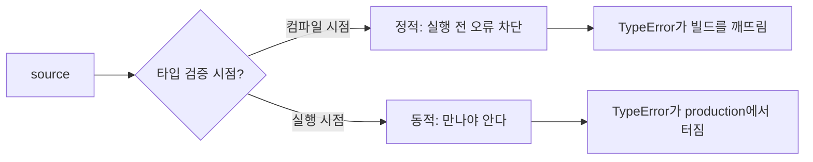

# static vs dynamic language

> Programming Languages 101 시리즈 (9/10)


## 이 글에서 다룰 문제

모든 팀이 "타입을 더 쓸 것인가"를 두고 토론합니다. 토론을 잘하려면 정적 타입이 정확히 무엇을 보장하고, 무엇은 보장하지 않는지를 한 줄로 답할 수 있어야 합니다.

> 타입은 "이 데이터의 모양"에 대한 약속입니다. 약속이 어디에서 검증되느냐가 정적/동적의 핵심 차이입니다.

## 개념 한눈에 보기



같은 종류의 버그를, 정적은 빌드에서 잡고 동적은 실행에서 잡습니다.

## Before/After

**Before — 타입 힌트 없는 동적 코드**

```python
def total(items):
    return sum(item.price for item in items)
```

`item`이 `price`를 가질지 호출자가 책임집니다. 잘못된 입력은 production에서야 `AttributeError`로 터집니다.

**After — 타입 힌트가 약속을 명시**

```python
from dataclasses import dataclass

@dataclass(frozen=True)
class Item:
    price: int

def total(items: list[Item]) -> int:
    return sum(item.price for item in items)
```

이제 mypy/pyright가 호출자도 함께 검사합니다. 잘못된 입력은 빌드 단계에서 막힙니다.

## 실습: 두 모델을 같은 코드로 비교하기

### 1단계 — mypy가 잡는 오류

```python
# 1_mypy.py
def add(a: int, b: int) -> int:
    return a + b

print(add(1, 2))
print(add("1", "2"))   # mypy: error — incompatible argument
```

`mypy 1_mypy.py`를 돌리면 두 번째 호출에서 오류가 납니다. 실행을 안 해도 알 수 있는 종류의 버그입니다.

### 2단계 — 그래도 런타임에서만 보이는 오류

```python
# 2_runtime_only.py
import json

data = json.loads('{"price": "10"}')   # mypy 입장에서 dict[str, Any]
def total(items):
    return sum(i["price"] for i in items)
print(total([data]))                    # 런타임 TypeError
```

외부 입력(JSON, DB, 환경 변수)은 컴파일 시점에 모양을 알 수 없습니다. 정적 타입의 보장은 "이 코드 안"에서 끝납니다.

### 3단계 — 점진적 타이핑

```python
# 3_gradual.py
def parse(raw: str) -> dict:        # 일부만 타이핑
    return eval(raw)                # 동적 영역 (위험)

def use(d: dict[str, int]) -> int:  # 정확하게 타이핑
    return sum(d.values())

print(use(parse('{"a": 1, "b": 2}')))
```

Python은 두 영역을 섞을 수 있게 설계됐습니다 — 외곽은 동적으로 받고, 내부는 정적으로 다룹니다. TypeScript의 `any`도 같은 역할입니다.

### 4단계 — `Protocol`로 "구조적 타이핑" 시도

```python
# 4_protocol.py
from typing import Protocol

class Pricable(Protocol):
    price: int

def total(items: list[Pricable]) -> int:
    return sum(i.price for i in items)

class Book:
    def __init__(self, price: int) -> None:
        self.price = price

print(total([Book(10), Book(20)]))   # OK — Book이 Pricable처럼 생겼다
```

상속 없이 "모양이 같으면 통과"하는 검사가 정적 타입에서도 가능합니다. duck typing의 정적 버전이라고 보면 됩니다.

### 5단계 — 동적 언어가 빛나는 자리

```python
# 5_dynamic_strength.py
def call_all(d: dict, *args):
    for name, fn in d.items():
        print(name, fn(*args))

ops = {
    "add": lambda x, y: x + y,
    "mul": lambda x, y: x * y,
}
call_all(ops, 3, 4)
```

이런 메타프로그래밍·플러그인 패턴은 정적 타입에서도 가능하지만, 보통 더 많은 보일러플레이트를 요구합니다. 동적 언어의 표현력은 이런 자리에서 드러납니다.

## 이 코드에서 주목할 점

- 정적 타입의 보장은 외부 입력(JSON, env, DB)을 만나는 순간 끝납니다.
- 점진적 타이핑이 두 모델의 장점을 같이 가져가는 현실적인 답입니다.
- `Protocol`/duck typing은 "상속 없이 같은 모양"을 표현합니다.
- 동적 언어가 절대적으로 빠른 영역도 분명히 있습니다 (메타프로그래밍, 짧은 스크립트).

## 자주 하는 실수 5가지

1. **"정적은 안전, 동적은 위험"이라는 이분법.** 둘 다 다른 종류의 비용을 냅니다.
2. **외부 입력을 타입 힌트로 막을 수 있다고 착각.** 경계에서 검증(`pydantic` 등)이 따로 필요합니다.
3. **`Any`를 남발한다.** 점진적 타이핑이 결국 동적 타이핑이 돼 버립니다.
4. **타입 힌트만 달고 검사기를 안 돌린다.** mypy/pyright를 CI에 안 넣으면 거의 의미가 없습니다.
5. **타입과 단위 테스트를 대체재로 본다.** 둘이 잡는 버그의 종류가 다릅니다.

## 실무에서는 이렇게 쓰입니다

대규모 Python 코드베이스는 이제 거의 다 mypy/pyright를 CI에 넣습니다. JavaScript는 TypeScript로 사실상 정적 타이핑이 표준이 됐고, JIT 성능과 별개로 유지보수 가치가 큽니다.

설계할 때는 "외부 경계에서 강하게 검증, 내부는 정확한 타입으로" 패턴이 자리잡았습니다 — `pydantic`, `attrs`, `dataclass` + `Protocol`이 그 도구입니다.

## 체크리스트

- [ ] 정적과 동적의 차이를 한 줄로 답할 수 있는가?
- [ ] mypy/pyright를 CI에서 돌리는가?
- [ ] 외부 입력을 받는 곳에 경계 검증이 있는가?
- [ ] `Any`의 사용 빈도를 모니터링하는가?
- [ ] 점진적 타이핑의 의미를 한 줄로 답할 수 있는가?

## 정리 및 다음 단계

정적과 동적은 우열이 아니라 트레이드오프입니다. 마지막 글에서는 이 모든 선택을 통합해 — 좋은 언어 설계란 무엇인가 — 를 정리합니다.

<!-- toc:begin -->
- [프로그래밍 언어란 무엇인가?](./01-what-is-a-programming-language.md)
- [syntax와 semantics](./02-syntax-and-semantics.md)
- [type system](./03-type-system.md)
- [scope와 binding](./04-scope-and-binding.md)
- [함수와 closure](./05-functions-and-closures.md)
- [객체와 prototype](./06-objects-and-prototypes.md)
- [memory management](./07-memory-management.md)
- [interpreter와 compiler](./08-interpreter-and-compiler.md)
- **static vs dynamic language (현재 글)**
- 좋은 언어 설계란 무엇인가? (예정)
<!-- toc:end -->

## 참고 자료

- [PEP 484 — Type Hints](https://peps.python.org/pep-0484/)
- [mypy documentation](https://mypy.readthedocs.io/)
- [TypeScript Handbook — Basic Types](https://www.typescriptlang.org/docs/handbook/2/basic-types.html)
- [Gradual typing (Wikipedia)](https://en.wikipedia.org/wiki/Gradual_typing)

Tags: Computer Science, Programming Languages, 정적타입, 동적타입, 트레이드오프, 안전성
