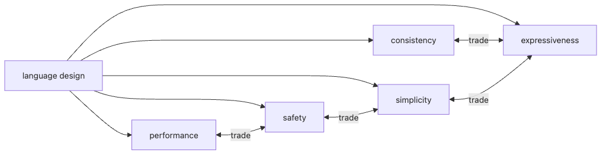

# 좋은 언어 설계란 무엇인가?

어떤 언어를 두고 “잘 설계됐다”라고 말할 때가 있습니다. 하지만 그 말이 구체적으로 무엇을 뜻하는지는 막상 설명하기 어렵습니다. 빠르다는 뜻인지, 배우기 쉽다는 뜻인지, 실수를 잘 막는다는 뜻인지가 섞여 있기 때문입니다.

이 글은 Programming Languages 101 시리즈의 마지막 글입니다.

이 글에서는 좋은 언어 설계를 만능 정답으로 보지 않고, 분명한 우선순위를 가진 트레이드오프로 보겠습니다. 지금까지 다룬 구문, 타입, 스코프, 클로저, 객체, 메모리, 실행 모델, 정적과 동적의 차이를 모두 설계 축 위에 다시 올려 보겠습니다.

## 이 글에서 다룰 문제

- 언어 설계를 볼 때 어떤 축으로 평가해야 할까요?
- 일관성, 단순성, 표현력, 안전성, 성능은 왜 서로 충돌할까요?
- Python, Go, Rust는 같은 문제에 왜 다른 답을 내릴까요?
- 새 언어를 만났을 때 무엇부터 질문해야 할까요?

> 좋은 언어 설계는 모든 면에서 최고인 설계가 아닙니다. 이 언어가 무엇을 잘하려고 하는지 분명히 정하고, 그 방향으로 어떤 대가를 치렀는지 숨기지 않는 설계가 좋은 설계입니다.

## 왜 중요한가

설계 감각은 언어를 평가할 때만 쓰이지 않습니다. API 하나를 설계할 때도, 내부 DSL을 만들 때도, 함수 시그니처 하나를 정할 때도 같은 감각이 필요합니다. 언어 설계는 결국 소프트웨어 설계 감각의 큰 버전입니다.

## 핵심 개념 한눈에 보기



*일관성, 단순성, 표현력, 안전성, 성능이 서로 맞물리는 언어 설계 축*

다섯 축은 서로 독립적이지 않습니다. 표현력을 높이면 단순성이 줄고, 안전성을 높이면 문법이나 사용법이 무거워질 수 있습니다. 좋은 설계를 보려면 무엇을 얻고 무엇을 포기했는지 함께 읽어야 합니다.

## 먼저 알아둘 용어

- 일관성: 비슷한 문제를 비슷한 코드 모양으로 풀게 만드는 성질입니다.
- 단순성: 배워야 할 규칙과 예외가 적은 정도입니다.
- 표현력: 의도를 짧고 정확하게 적을 수 있는 정도입니다.
- 안전성: 잘못된 프로그램을 빌드나 실행 단계에서 막아 주는 정도입니다.
- 성능: 같은 작업을 더 적은 시간과 메모리로 처리하는 정도입니다.

## 먼저 보는 예시

### 느낌으로만 평가할 때

> "이 언어는 그냥 좋다."

### 설계 축으로 분해할 때

> "이 언어는 표현력과 단순성을 높이는 대신 안전성 일부를 포기했다. 짧은 스크립트에는 강하지만 장기 서비스에는 보완 장치가 더 필요하다."

두 문장은 같은 취향을 말할 수 있지만, 두 번째 문장만이 설계 이유를 설명합니다.

## 세 언어를 다섯 축으로 비교하기

### 1단계 — 같은 문제, 세 가지 답

문자열 리스트의 길이 합을 구하는 같은 문제를 세 언어로 보겠습니다.

```python
# Python
def total_len(xs: list[str]) -> int:
    return sum(len(x) for x in xs)
```

```go
// Go
func TotalLen(xs []string) int {
    n := 0
    for _, x := range xs {
        n += len(x)
    }
    return n
}
```

```rust
// Rust
fn total_len(xs: &[String]) -> usize {
    xs.iter().map(|x| x.len()).sum()
}
```

같은 작업인데도 길이, 명시성, 안전성의 무게 중심이 다릅니다. 언어 설계 차이는 이런 평범한 코드에서 가장 잘 드러납니다.

### 2단계 — 일관성 보기

```python
# 2_consistency.py
# Python: sum/len/for keep their shape across collections — high consistency
print(sum([1,2,3]))
print(sum((1,2,3)))
print(sum({1,2,3}))
```

비슷한 컬렉션에 같은 인터페이스를 반복해서 쓸 수 있다면 일관성이 높습니다. 배운 패턴이 다른 곳에서도 그대로 통하는 느낌이 강해집니다.

### 3단계 — 단순성과 표현력의 줄다리기

```python
# 3_expressiveness.py
xs = [1, 2, 3, 4, 5]
print([x*x for x in xs if x % 2])     # high expressiveness
# Go has no list comprehension → simpler, less expressive
```

Python은 의도를 짧게 적게 해 줍니다. 반면 Go는 이런 압축된 구문을 줄여 배워야 할 규칙을 낮춥니다. 어느 쪽이 더 낫다고 단정하기보다, 무엇을 우선했는지를 읽는 편이 정확합니다.

### 4단계 — 안전성과 단순성의 교환

```rust
// 4_safety.rs
fn first(xs: &[i32]) -> Option<&i32> {
    xs.first()           // forces "no value" handling at compile time
}
```

Rust는 값이 없을 수 있다는 사실을 타입에 올려 강하게 강제합니다. 안전성은 높아지지만 배워야 할 문법과 개념도 늘어납니다. Python의 `None`은 더 가볍지만 덜 엄격합니다.

### 5단계 — 시리즈 전체를 한 표로 묶기

| 주제 | Python | Go | Rust |
| --- | --- | --- | --- |
| 메모리 관리 | GC + refcount | GC | compile-time ownership |
| 실행 모델 | interpreter + bytecode | AOT | AOT |
| 타입 | gradual (optional) | static (simple) | static, rich |
| 객체 모델 | classes, dynamic | structs + interfaces | structs + traits |
| 함수 | first-class, closures | first-class, simple | first-class, explicit lifetimes |

각 언어의 답이 어떤 축에 더 무게를 두는지 한눈에 보입니다. 시리즈에서 본 모든 주제가 사실은 설계 우선순위의 결과라는 말입니다.

### 6단계 — 같은 팀이라도 상황이 바뀌면 답이 달라진다

| 상황 | 더 무게를 둘 축 | 자주 떠오르는 선택 |
| --- | --- | --- |
| 일주일 안에 실험해야 하는 프로토타입 | 단순성, 표현력 | Python |
| 배포 단순성과 짧은 빌드 시간을 중시하는 서비스 | 일관성, 운영 단순성, 성능 | Go |
| 메모리 제어와 강한 안전성이 중요한 시스템 경계 | 안전성, 성능 | Rust |

이 표의 핵심은 특정 언어를 추천하는 데 있지 않습니다. 같은 팀도 프로젝트 단계가 달라지면 우선순위가 바뀌고, 그 순간 “좋은 언어”의 정의도 함께 바뀝니다. 설계 평가는 언제나 맥락을 먼저 적어 두는 쪽이 정확합니다.

## 이 코드에서 먼저 볼 점

- 세 언어의 답은 맞고 틀림의 문제가 아니라 우선순위의 차이입니다.
- 일관성이 높은 언어는 “방금 배운 패턴이 여기서도 통한다”는 느낌을 줍니다.
- 표현력이 높을수록 짧아지지만, 처음 보는 사람에게는 더 읽기 어려울 수 있습니다.
- 안전성이 높을수록 컴파일러와 더 많이 대화하게 되지만, 운영 사고는 줄어드는 편입니다.

## 자주 하는 실수

1. “최고의 언어”를 찾으려 합니다. 좋은 언어는 항상 어떤 작업을 기준으로만 정의됩니다.
2. 표현력이 높을수록 무조건 좋다고 생각합니다. 너무 짧으면 읽기 어려워집니다.
3. 안전성을 언제나 최우선에 둡니다. 일주일짜리 프로토타입에는 과할 수 있습니다.
4. 일관성을 과소평가합니다. 같은 문제를 매번 다른 방식으로 풀게 하면 코드베이스가 빨리 피로해집니다.
5. 좋아하는 언어를 객관적 진실처럼 여깁니다. 설계 축으로 적어 보면 편향이 드러납니다.

## 실무에서는 이렇게 본다

새 프로젝트에서 언어를 고르는 일은 인기투표가 아니라 다섯 축의 가중치를 정하는 일입니다. 짧고 빠른 검증이 중요하면 Python이, 운영 단순성이 중요하면 Go가, 메모리 제어와 안전성이 중요하면 Rust가 자연스럽게 올라옵니다. 언어 선택의 이유를 이렇게 적어 두면 팀 합의도 빨라집니다.

같은 원리는 내부 라이브러리와 API 설계에도 적용됩니다. “이 함수는 표현력을 우선하는가, 안전성을 우선하는가”를 먼저 적어 두면 리뷰가 훨씬 명료해집니다. 언어 설계 감각은 결국 팀의 API 감각으로 이어집니다.

## 체크리스트

- [ ] 다섯 축을 각각 한 줄로 정의할 수 있는가?
- [ ] 가장 자주 쓰는 언어의 트레이드오프를 한 단락으로 적을 수 있는가?
- [ ] 최근 만든 API가 어느 축을 우선했는지 설명할 수 있는가?
- [ ] 맥락 없이 “좋은 언어”라고 단정하지 않는가?
- [ ] 새 언어를 만날 때 다섯 축을 의식적으로 훑는가?

## 연습 문제

1. 가장 자주 쓰는 두 언어를 다섯 축으로 비교해 보고, 차이를 한 단락으로 정리해 보세요.
2. 최근 만든 공개 API 하나를 골라 더 표현력 높은 버전과 더 안전한 버전을 각각 스케치해 보세요.
3. 이 시리즈에서 가장 인상 깊었던 주제를 하나 골라, 그것이 다섯 축 중 어디와 가장 강하게 연결되는지 적어 보세요.

## 정리

좋은 언어 설계는 다섯 축을 어떻게 가중했는지 솔직하게 드러내는 설계입니다. 구문, 타입, 스코프, 클로저, 객체, 메모리, 실행 모델, 정적과 동적의 차이는 모두 그 가중치의 결과였습니다. 이 시리즈는 여기서 끝나지만, 다음 단계는 이 감각을 여러분 자신의 코드와 API 설계에 가져가는 일입니다.

이 시리즈는 여기서 마무리합니다. 다음 읽을거리로는 [compilers-101](../../compilers-101/), [api-design-101](../../api-design-101/), [software-design-101](../../software-design-101/) 시리즈를 추천합니다.

<!-- toc:begin -->
- [프로그래밍 언어란 무엇인가?](./01-what-is-a-programming-language.md)
- [구문과 의미](./02-syntax-and-semantics.md)
- [타입 시스템](./03-type-system.md)
- [스코프와 바인딩](./04-scope-and-binding.md)
- [함수와 클로저](./05-functions-and-closures.md)
- [객체와 프로토타입](./06-objects-and-prototypes.md)
- [메모리 관리](./07-memory-management.md)
- [인터프리터와 컴파일러](./08-interpreter-and-compiler.md)
- [정적 언어와 동적 언어](./09-static-vs-dynamic.md)
- **좋은 언어 설계란 무엇인가? (현재 글)**
<!-- toc:end -->

## 참고 자료

- [Rob Pike — Less is exponentially more (Go)](https://commandcenter.blogspot.com/2012/06/less-is-exponentially-more.html)
- [The Zen of Python (PEP 20)](https://peps.python.org/pep-0020/)
- [The Go FAQ — language design](https://go.dev/doc/faq)
- [The Rust Programming Language — Foreword](https://doc.rust-lang.org/book/foreword.html)
- [Programming Language Pragmatics (Scott)](https://www.elsevier.com/books/programming-language-pragmatics/scott/978-0-12-410409-9)

Tags: Computer Science, Programming Languages, LanguageDesign, Consistency, Simplicity, Expressiveness
