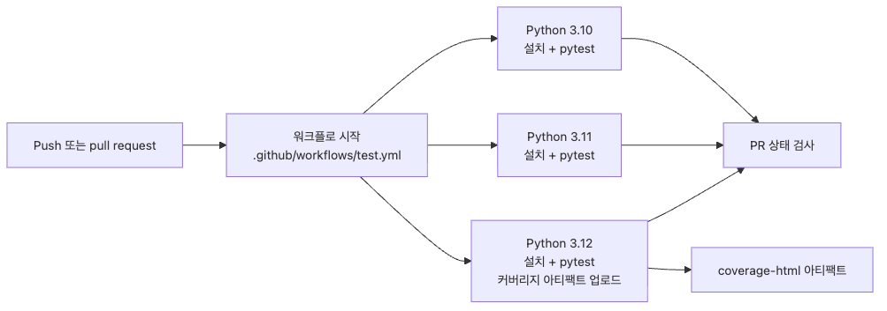

# GitHub Actions에서 테스트 자동화하기

로컬에서는 통과했는데 PR에서 깨지는 상황은 테스트가 없어서가 아니라 검증 경로가 운영으로 연결되지 않았기 때문에 자주 생깁니다. 이 글에서는 push와 pull request마다 같은 테스트를 자동으로 돌리고, Python 버전별 결과와 커버리지 아티팩트까지 한 번에 확인하는 CI 흐름을 정리합니다.

이 글은 pytest 101 시리즈의 아홉 번째 글입니다.

## 이 글에서 다룰 문제

- PR을 열 때마다 테스트를 수동으로 실행하는 습관에 의존하지 않으려면 어떻게 해야 할까요?
- GitHub Actions workflow를 여러 조각이 아니라 하나의 최종 파일로 어떻게 조립할까요?
- Python 3.10, 3.11, 3.12를 동시에 검증하면서도 피드백 속도를 유지하려면 무엇을 신경 써야 할까요?
- 커버리지 HTML 리포트를 아티팩트로 남겨 리뷰어가 실패 원인을 바로 확인하게 하려면 어떻게 구성할까요?

## 왜 중요한가

CI가 없으면 테스트가 코드 품질 규칙이 아니라 개인의 성실성 문제로 남습니다. 개발자가 바쁘거나 급하면 한 번쯤 빼먹게 되고, 그 한 번이 main 브랜치의 회귀 버그로 이어집니다.

> CI의 핵심 가치는 “테스트를 자동으로 돌린다”보다 “테스트를 빠뜨릴 수 없게 만든다”에 더 가깝습니다.

특히 Python 프로젝트는 로컬 버전, 의존성 캐시, 운영체제 차이 때문에 “내 컴퓨터에서는 됨”이 쉽게 발생합니다. 그래서 팀이 합의한 기준은 로컬이 아니라 PR에 붙는 CI 결과여야 합니다.

## 핵심 개념 잡기

> push/PR 이벤트가 들어오면 GitHub Actions가 같은 workflow를 기준으로 여러 Python 버전을 병렬 검증하고, 대표 실행 하나에서 커버리지 아티팩트를 남긴다고 생각하면 됩니다.

```text
push or pull_request
  -> workflow starts
  -> matrix jobs for Python 3.10 / 3.11 / 3.12
  -> each job installs package + test dependencies
  -> each job runs pytest with coverage threshold
  -> Python 3.12 job uploads HTML coverage artifact
  -> PR shows pass/fail signal for merge decision
```


*push 또는 pull request 이벤트가 들어오면 같은 workflow 정의를 기준으로 Python 3.10, 3.11, 3.12 잡이 병렬로 실행됩니다. 그중 대표 실행 하나는 HTML 커버리지 리포트를 아티팩트로 업로드하므로, 리뷰어는 로컬 재현 없이도 실패 지점과 누락 라인을 바로 확인할 수 있습니다.*

## 핵심 개념

| 용어 | 설명 |
| --- | --- |
| workflow | `.github/workflows/` 아래에 두는 자동화 정의 파일입니다 |
| trigger | workflow를 시작시키는 이벤트 조건입니다 |
| job | GitHub Actions runner에서 독립적으로 실행되는 작업 단위입니다 |
| matrix | 여러 Python 버전 같은 환경 조합을 병렬로 펼치는 설정입니다 |
| artifact | 실행 결과 파일을 보관하고 다운로드할 수 있게 해 주는 저장물입니다 |

## Before / After

**Before — 테스트 실행이 사람 기억에 달려 있음:**

```bash
git push origin feature/cart-discount
# PR 생성
# 리뷰어: "3.10에서도 돌려 봤나요?"
# 작성자: "3.12만 확인했습니다..."
```

**After — push와 PR이 같은 기준으로 자동 검증됨:**

```yaml
# .github/workflows/test.yml
name: test

on:
  push:
    branches: [master]
  pull_request:
    branches: [master]

jobs:
  pytest:
    strategy:
      matrix:
        python-version: ["3.10", "3.11", "3.12"]
    steps:
      - uses: actions/checkout@v4
      - uses: actions/setup-python@v5
      - run: pip install -e ".[test]"
      - run: pytest --cov=src --cov-fail-under=80
```

위 요약만으로도 “언제 실행되는지, 어떤 버전을 검증하는지, 실패 기준이 무엇인지”가 한눈에 보입니다. 이제 이 요약을 실무에서 바로 쓸 수 있는 최종 workflow로 확장해 보겠습니다.

## 단계별 실습

### Step 1: 먼저 최종 workflow 전체를 본다

여기서는 조각난 YAML을 머릿속으로 합치지 않아도 되도록, 처음부터 완성본을 기준으로 설명합니다.

```yaml
# .github/workflows/test.yml
name: test

on:
  push:
    branches: [master]
  pull_request:
    branches: [master]

jobs:
  pytest:
    name: pytest (Python ${{ matrix.python-version }})
    runs-on: ubuntu-latest

    strategy:
      fail-fast: false
      matrix:
        python-version: ["3.10", "3.11", "3.12"]

    steps:
      - name: Check out repository
        uses: actions/checkout@v4

      - name: Set up Python
        uses: actions/setup-python@v5
        with:
          python-version: ${{ matrix.python-version }}
          cache: pip
          cache-dependency-path: pyproject.toml

      - name: Install package and test dependencies
        run: |
          python -m pip install --upgrade pip
          pip install -e ".[test]"

      - name: Run pytest with coverage gate
        run: |
          pytest -q --maxfail=1 \
            --cov=src \
            --cov-report=term-missing \
            --cov-report=xml \
            --cov-fail-under=80

      - name: Build HTML coverage report
        if: matrix.python-version == '3.12'
        run: coverage html

      - name: Upload HTML coverage artifact
        if: matrix.python-version == '3.12'
        uses: actions/upload-artifact@v4
        with:
          name: coverage-html
          path: htmlcov/
          if-no-files-found: error
```

이 파일 하나가 이 글의 기준점입니다. 아래 설명은 모두 이 완성본의 특정 줄이 왜 필요한지 해설하는 방식으로 읽으면 됩니다.

### Step 2: trigger를 push와 pull request에 모두 건다

```yaml
on:
  push:
    branches: [master]
  pull_request:
    branches: [master]
```

`push`만 걸어 두면 브랜치에서 올라온 커밋은 검증되지만 PR 화면에서 같은 규칙이 다시 보장된다는 인상이 약해집니다. 반대로 `pull_request`만 쓰면 브랜치에 연속 커밋을 푸시할 때 빠른 피드백을 받기 어렵습니다.

실무에서는 둘 다 켜 두고, 브랜치 보호(branch protection)에서 이 workflow를 필수 상태 검사(required status check)로 연결하는 경우가 많습니다. 그러면 “CI가 통과하지 않으면 머지 불가”가 저장소 규칙이 됩니다.

### Step 3: matrix로 Python 호환성 문제를 앞당겨 잡는다

```yaml
strategy:
  fail-fast: false
  matrix:
    python-version: ["3.10", "3.11", "3.12"]
```

matrix는 같은 job 정의를 여러 Python 버전으로 펼쳐 실행합니다. `fail-fast: false`를 둔 이유는 3.10에서 하나가 실패해도 3.11과 3.12 결과를 끝까지 받아 보려는 것입니다. 이렇게 해야 특정 버전 전용 실패인지, 전체 공통 실패인지 구분이 빨라집니다.

버전 문자열을 꼭 따옴표로 감싸는 것도 중요합니다. YAML에서 `3.10`을 숫자로 다루면 `3.1`처럼 해석되는 문제를 피해야 하기 때문입니다.

### Step 4: 설치 단계를 프로젝트 기준으로 맞춘다

```yaml
- name: Install package and test dependencies
  run: |
    python -m pip install --upgrade pip
    pip install -e ".[test]"
```

`pip install -r requirements.txt`만 실행하면 테스트 의존성은 설치돼도 패키지 자체가 editable 모드로 잡히지 않아 import 오류가 날 수 있습니다. 특히 `src/` 레이아웃 프로젝트라면 `pip install -e ".[test]"`처럼 프로젝트 패키지와 테스트 extra를 같이 올리는 방식이 더 안전합니다.

`pyproject.toml` 쪽 설정이 함께 있어야 workflow도 단순해집니다.

```toml
[project.optional-dependencies]
test = [
    "pytest>=8.0",
    "pytest-cov>=5.0",
]

[tool.pytest.ini_options]
testpaths = ["tests"]
pythonpath = ["src"]
addopts = "-ra --tb=short"

[tool.coverage.run]
source = ["src"]
branch = true

[tool.coverage.report]
show_missing = true
fail_under = 80
```

### Step 5: 캐시는 setup-python에 붙여 단순하게 관리한다

```yaml
- name: Set up Python
  uses: actions/setup-python@v5
  with:
    python-version: ${{ matrix.python-version }}
    cache: pip
    cache-dependency-path: pyproject.toml
```

예전에는 `actions/cache`를 따로 조립하는 예제가 많았지만, Python 프로젝트라면 `actions/setup-python`의 내장 캐시 옵션으로 시작하는 편이 단순합니다. 의존성 파일이 바뀌면 캐시가 갱신되고, 안 바뀌면 설치 시간을 줄여 줍니다.

CI 최적화의 목적은 “가장 빠른 설정”보다 “팀이 계속 이해할 수 있는 설정”입니다. 처음부터 캐시 키를 직접 짜는 것보다 내장 기능으로 충분한 경우가 많습니다.

### Step 6: pytest 명령은 하나로 표준화한다

```yaml
- name: Run pytest with coverage gate
  run: |
    pytest -q --maxfail=1 \
      --cov=src \
      --cov-report=term-missing \
      --cov-report=xml \
      --cov-fail-under=80
```

로컬에서는 `pytest`, CI에서는 `pytest --cov`, 또 다른 문서에서는 `pytest -v`처럼 기준이 계속 갈라지면 팀이 어떤 명령을 표준으로 봐야 하는지 헷갈립니다. 가능하면 CI에서 쓰는 명령을 “저장소가 공식으로 인정하는 검증 명령”으로 고정하는 편이 좋습니다.

여기서는 다음 네 가지를 한 번에 달성합니다.

- 테스트 통과 여부 확인
- 커버리지 누락 라인 표시
- XML 리포트 생성
- 최소 커버리지 기준 미달 시 실패 처리

### Step 7: HTML 커버리지 아티팩트는 대표 버전 하나만 올린다

```yaml
- name: Build HTML coverage report
  if: matrix.python-version == '3.12'
  run: coverage html

- name: Upload HTML coverage artifact
  if: matrix.python-version == '3.12'
  uses: actions/upload-artifact@v4
  with:
    name: coverage-html
    path: htmlcov/
    if-no-files-found: error
```

모든 matrix job에서 HTML 리포트를 올리면 저장 공간과 로그가 불필요하게 늘어납니다. 보통 가장 최신 지원 버전 하나를 대표 실행으로 삼아 업로드하면 충분합니다. 여기서는 3.12가 그 역할을 맡습니다.

리뷰어 입장에서는 실패한 PR에서 아티팩트를 열어 `htmlcov/index.html`을 내려받고, 어떤 분기와 파일이 비어 있는지 바로 확인할 수 있다는 점이 중요합니다.

## 검증은 이렇게 확인합니다

workflow를 저장하고 브랜치에 push한 뒤에는 “실행됐다”로 끝내지 말고 다음을 확인해야 합니다.

1. **Actions 탭의 workflow run 제목**이 해당 브랜치 push 또는 PR 이벤트와 연결되어 있는지 확인합니다.
2. **matrix job 세 개**가 `pytest (Python 3.10)`, `3.11`, `3.12`처럼 각각 분리되어 보이는지 확인합니다.
3. **로그에서 설치 → pytest → coverage** 순서가 기대한 대로 실행됐는지 봅니다.
4. **3.12 job의 Artifacts 영역**에 `coverage-html`이 생성됐는지 확인합니다.
5. 필요하다면 저장소 설정에서 이 workflow를 **필수 상태 검사**로 연결합니다.

성공 화면을 보는 방법까지 알아야 CI가 운영 절차로 완성됩니다. YAML을 작성하는 것만으로는 아직 절반입니다.

## 이 코드에서 주목할 점

- 완성된 `test.yml` 하나를 기준으로 읽으면 workflow 조각을 머릿속에서 다시 합칠 필요가 없습니다.
- `fail-fast: false`는 다중 버전 실패 양상을 한 번에 수집하게 해 줍니다.
- `actions/setup-python`의 pip 캐시는 별도 캐시 step 없이도 충분히 실용적입니다.
- 커버리지 HTML은 대표 버전 하나만 아티팩트로 남겨도 운영 가치가 큽니다.

## 흔한 실수

| 실수 | 왜 문제인가 | 해결 방법 |
| --- | --- | --- |
| `push` 또는 `pull_request` 중 하나만 설정함 | 피드백 경로가 반쪽짜리가 됩니다 | 둘 다 걸고 브랜치 보호와 연결합니다 |
| 버전 문자열에 따옴표를 빼먹음 | YAML이 `3.10`을 `3.1`로 해석할 수 있습니다 | `"3.10"`처럼 문자열로 씁니다 |
| 패키지 설치 없이 requirements만 설치함 | `src` 레이아웃에서 import 오류가 날 수 있습니다 | `pip install -e ".[test]"`를 사용합니다 |
| 모든 matrix job에서 HTML 리포트를 업로드함 | 로그와 아티팩트가 불필요하게 커집니다 | 대표 버전 하나만 업로드합니다 |
| CI 명령과 로컬 명령이 다름 | 실패 재현과 팀 공통 기준이 흐려집니다 | pytest 명령을 문서와 CI에서 최대한 통일합니다 |

## 실무에서 이렇게 씁니다

- 테스트 job 외에 `ruff`, `mypy` 같은 정적 검사 job을 병렬로 붙입니다.
- 통합 테스트가 느리면 unit test와 integration test를 job으로 분리합니다.
- PR 템플릿에 “CI green required” 문구를 넣기보다 저장소 설정으로 강제합니다.
- nightly workflow를 따로 두고, 일상 PR용 workflow는 빠르게 유지합니다.

## 현업 개발자는 이렇게 생각합니다

좋은 CI는 “기능이 많다”보다 “팀이 신뢰하는 하나의 기준이 있다”에 가깝습니다. 로그가 너무 복잡하거나 규칙이 자주 바뀌면 결국 사람들은 빨간 불을 봐도 무감각해집니다.

그래서 첫 번째 목표는 화려한 자동화가 아니라 단순하고 일관된 기본 검증선입니다. push와 PR마다 같은 pytest 명령이 돌고, 실패하면 머지되지 않는 상태까지 만들면 이미 큰 품질 차이가 납니다.

## 체크리스트

- [ ] `.github/workflows/test.yml`에 push와 pull request trigger를 모두 설정했다
- [ ] Python 3.10, 3.11, 3.12 matrix를 구성했다
- [ ] `pip install -e ".[test]"`로 프로젝트 패키지와 테스트 의존성을 함께 설치했다
- [ ] `pytest --cov` 계열 명령을 CI의 표준 검증 명령으로 정했다
- [ ] 대표 버전 하나에서 HTML 커버리지 아티팩트를 업로드했다

## 연습 문제

1. `ruff check .`를 실행하는 lint job을 추가하고 test job과 병렬로 돌려 보세요.
2. coverage 하한선을 80에서 85로 올렸을 때 어떤 파일이 실패 원인인지 확인해 보세요.
3. 저장소의 branch protection 규칙에 이 workflow를 required status check로 연결해 보세요.

## 정리 및 다음 글 안내

GitHub Actions는 테스트를 자동으로 실행하는 도구이면서, 팀이 PR을 머지하기 전에 반드시 통과해야 하는 운영 규칙을 구현하는 장치이기도 합니다. 완성된 workflow 하나를 기준으로 trigger, matrix, 캐시, coverage artifact를 묶어 두면 CI는 단순한 보조 기능이 아니라 저장소의 기본 안전장치가 됩니다. 다음 글에서는 테스트를 많이 쓰는 문제를 넘어, 애초에 mock이 적게 필요한 코드 구조를 어떻게 만들지 살펴보겠습니다.

<!-- toc:begin -->
- [왜 테스트를 작성해야 할까?](./01-why-write-tests.md)
- [첫 번째 pytest 테스트 작성하기](./02-first-pytest-test.md)
- [assert와 예외 테스트](./03-assert-and-exceptions.md)
- [fixture 이해하기](./04-fixtures.md)
- [parametrization으로 테스트 케이스 늘리기](./05-parametrization.md)
- [mock과 monkeypatch](./06-mock-and-monkeypatch.md)
- [파일, 환경변수, 시간 테스트하기](./07-testing-files-env-time.md)
- [coverage와 테스트 품질 보기](./08-coverage.md)
- **GitHub Actions에서 테스트 자동화하기 (현재 글)**
- 테스트하기 쉬운 코드 구조 만들기 (예정)
<!-- toc:end -->

## 참고 자료

- [GitHub Actions workflow syntax](https://docs.github.com/en/actions/writing-workflows/workflow-syntax-for-github-actions)
- [Running variations of jobs in a workflow with a matrix](https://docs.github.com/en/actions/using-jobs/using-a-matrix-for-your-jobs)
- [Caching dependencies to speed up workflows](https://docs.github.com/en/actions/using-workflows/caching-dependencies-to-speed-up-workflows)
- [actions/setup-python](https://github.com/actions/setup-python)
- [Store and share data with workflow artifacts](https://docs.github.com/en/actions/using-workflows/storing-workflow-data-as-artifacts)

Tags: Python, pytest, GitHub Actions, CI/CD, 테스트 자동화
