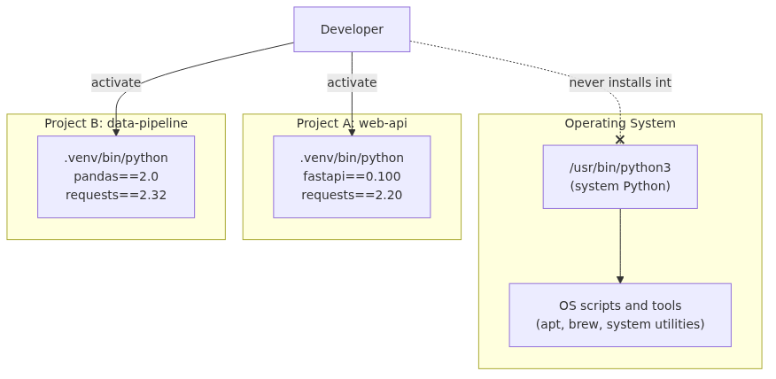

# Why Python, and how to install and use venv

One computer can host many Pythons at once, and every project gets its own. If you miss that model early, environment problems pile up faster than syntax problems.

This post is the first article in the Python 101 series. This is the first step in the series, where you set up the environment model the rest of the articles depend on.

## What you will learn

- Why "just installing Python" is risky, and why you must separate system Python from project Python
- How to install Python 3.12 safely on macOS, Windows, and Linux
- What a venv (virtual environment) actually solves
- The difference between `python` and `python3`, and which one to use when
- How to create, activate, and **verify** that you are inside a project venv
- How to install packages with pip and reproduce environments with `requirements.txt`

## Why this matters

The single biggest source of pain when you start with Python is not syntax. It is **environment**.

Code that ran fine yesterday breaks today. A script that works on your laptop throws import errors on your colleague's machine. `pip install` fails with a permission error. The cause behind almost all of these is the same: **you are installing packages into the system Python.**

System Python is the Python that the operating system itself uses. macOS uses it for some tools, Linux relies on it for `apt`, and many system scripts trust it to behave a specific way. The moment you install or upgrade packages into it, you risk silently breaking parts of your OS. Experienced Python users follow one rule: **never touch system Python.** Instead, they create one isolated Python environment per project and install packages only inside it. That isolated environment is a venv.

Make venv a habit on day one and roughly 80% of the dependency conflicts, version mismatches, and "works on my machine" stories you would otherwise meet just disappear.

## Mental Model

> One computer can host many Pythons at once, and every project gets its own.

That single sentence is the heart of this article.

- system Python: belongs to the OS. You do not touch it.
- project Python (venv): a copy living inside the project folder. You install packages only here.
- Ten projects? Ten venvs. They cannot affect each other.



*Mental Model*
System Python is the OS's territory. Each venv is the project's territory. As a developer you only ever activate a venv and work inside it.

## Core Concepts

**1. Flavors of Python**

- **CPython**: the official Python implementation, the one you download from python.org. Almost every tutorial assumes CPython, and so does this article (CPython 3.12).
- **system Python**: the Python preinstalled by your OS. macOS and Linux usually ship one. It is often older, and the OS depends on it.
- **user-installed Python**: Python installed via the python.org installer, Homebrew, pyenv, uv, etc. This is the one you actually develop against.

**2. `python` vs `python3`**

Two commands, same name, lots of confusion. The rule is simple:

- On macOS and Linux, `python3` points to Python 3. `python` may not exist or may point to the ancient Python 2, which is dangerous. So **in a shell, always use `python3` before activating a venv.**
- On Windows, the official installer creates `python` (and the `py` launcher). `python3` may not exist.
- After activating a venv, just `python` is fine on every OS — it points to the venv's Python.

In this article we use `python3` (or `py -3` on Windows) before activation, and plain `python` after activation.

**3. venv (virtual environment)**

`venv` is built into the Python standard library. Running `python3.12 -m venv .venv` (always pin the version explicitly — see Common Mistake 6) creates a `.venv/` folder containing a copy (or link to) the Python interpreter and an empty `site-packages/`. Activating the venv makes `python` and `pip` point at the binaries inside it. Deactivating returns you to the system environment.

**4. pip and requirements.txt**

`pip` is Python's package manager. `pip install requests` installs the package into the active venv's `site-packages/`. `pip freeze > requirements.txt` writes the current state to a file, and a teammate can run `pip install -r requirements.txt` to reproduce the same environment. This is the basic unit of collaboration and deployment in Python.

## Before / After

**Before — installing into system Python**

```bash
$ pip install requests
ERROR: Could not install packages due to an EnvironmentError: [Errno 13] Permission denied
$ sudo pip install requests   # please don't
```

`sudo pip install` may appear to work, but it pollutes the system Python. The next OS update or `brew` invocation may fail in ways that take hours to diagnose.

**After — installing inside a venv**

```bash
$ python3.12 -m venv .venv
$ source .venv/bin/activate         # macOS/Linux
(.venv) $ pip install requests
Successfully installed requests-2.32.3
(.venv) $ which python
/Users/me/myproj/.venv/bin/python
```

The `(.venv)` prompt appears, and `which python` points inside your project. Every package installed in this state lives only under `.venv/`, and deleting the folder removes it cleanly.

## Step-by-step Walkthrough

### 1) Install Python 3.12

**macOS** (using Homebrew):

```bash
brew install python@3.12
python3.12 --version
# Python 3.12.x
```

**Windows** (using the python.org installer):

1. Download the Python 3.12 installer from https://www.python.org/downloads/.
2. **Check "Add python.exe to PATH"** during installation.
3. After installation, in PowerShell:

```powershell
py -3.12 --version
# Python 3.12.x
```

**Linux** (Ubuntu/Debian):

```bash
sudo apt update
sudo apt install python3 python3-venv     # whichever Python 3 your distro ships
python3 --version
```

On Debian-family distros you must install the matching `-venv` package or `python3 -m venv` will fail with a cryptic error — a classic trap. If your distro's packaged Python is older than 3.12, the safest route is the `deadsnakes` PPA on Ubuntu (`sudo add-apt-repository ppa:deadsnakes/ppa` then `sudo apt install python3.12 python3.12-venv`), or installing Python 3.12 separately via `pyenv` or `uv`. The point is: never replace or upgrade the system Python itself.

### 2) Create the project folder and the venv

```bash
mkdir hello-python && cd hello-python
python3.12 -m venv .venv
```

A `.venv/` folder appears. Do not commit it to git — add `.venv/` to your `.gitignore` later in this article.

### 3) Activate

**macOS / Linux**:

```bash
source .venv/bin/activate
```

**Windows PowerShell**:

```powershell
.\.venv\Scripts\Activate.ps1
```

If PowerShell complains "running scripts is disabled on this system," set the user-level execution policy once:

```powershell
Set-ExecutionPolicy -Scope CurrentUser -ExecutionPolicy RemoteSigned
```

When activation succeeds, your prompt is prefixed with `(.venv)`.

### 4) Verify the isolation (do not skip this)

This step is the most important one in the entire article. Activation alone is not proof — confirm that you are really running the venv's Python with three commands.

macOS / Linux:

```bash
(.venv) $ which python
/Users/me/hello-python/.venv/bin/python

(.venv) $ python -c "import sys; print(sys.executable)"
/Users/me/hello-python/.venv/bin/python

(.venv) $ pip --version
pip 24.x from /Users/me/hello-python/.venv/lib/python3.12/site-packages/pip (python 3.12)
```

Windows:

```powershell
(.venv) PS> where python
C:\Users\me\hello-python\.venv\Scripts\python.exe

(.venv) PS> python -c "import sys; print(sys.executable)"
C:\Users\me\hello-python\.venv\Scripts\python.exe

(.venv) PS> pip --version
pip 24.x from C:\Users\me\hello-python\.venv\Lib\site-packages\pip (python 3.12)
```

If all three commands point inside `.venv`, isolation is working. If you see a system path (e.g., `/usr/bin/python` on macOS/Linux, `C:\Python312\python.exe` on Windows), activation failed — re-run `source .venv/bin/activate` (macOS/Linux) or `.\.venv\Scripts\Activate.ps1` (Windows) and try again.

### 5) Your first script (no network needed)

Start with something that proves Python is running, with zero external dependencies. `hello.py`:

```python
import sys
import platform

print(f"Hello from Python {sys.version_info.major}.{sys.version_info.minor}")
print(f"Running on: {platform.system()} {platform.release()}")
print(f"Interpreter path: {sys.executable}")
```

Run it:

```bash
(.venv) $ python hello.py
Hello from Python 3.12
Running on: Darwin 23.x.x
Interpreter path: /Users/me/hello-python/.venv/bin/python
```

If you see this output, Python inside your venv is executing your code correctly. The script has no external dependencies, so it works the same way offline.

### 6) Install a package and pin it

Now install a real package (network required):

```bash
(.venv) $ pip install requests
(.venv) $ pip freeze > requirements.txt
(.venv) $ cat requirements.txt
certifi==2024.x.x
charset-normalizer==3.x.x
idna==3.x
requests==2.32.3
urllib3==2.x.x
```

Commit `requirements.txt` to git, and a teammate can reproduce the same environment:

```bash
python3.12 -m venv .venv
source .venv/bin/activate
pip install -r requirements.txt
```

### 7) Deactivate

When you finish:

```bash
(.venv) $ deactivate
$
```

The `(.venv)` prefix disappears. You are back in the system environment.

## Common Mistakes

**1. Reaching for `sudo pip install`**
Seeing a "permission denied" error makes you want to add `sudo`. Do not. The permission error itself is a signal that you are about to write into system Python. Move into a project folder and create a venv instead.

**2. Mixing `python` and `python3`**
Typing `python` in a shell can resolve to almost anything depending on the OS and history. **Before activating a venv, always type `python3` (or `py -3` on Windows).** After activation, plain `python` is safe — it resolves to the venv.

**3. Creating the venv but forgetting to activate it**
A surprising number of beginners run `python3.12 -m venv .venv`, then immediately `pip install ...` without activating. The install lands in system Python again. Always confirm the `(.venv)` prompt **and** the output of `which python`.

**4. Misreading PowerShell activation errors as "Python errors"**
"Running scripts is disabled on this system" is a Windows security policy issue, not a Python problem. One-time fix: `Set-ExecutionPolicy -Scope CurrentUser -ExecutionPolicy RemoteSigned`.

**5. Committing `.venv/` to git**
`.venv/` contains binaries tied to your specific OS and Python version, so it cannot be reused by anyone else. Always add it to `.gitignore` and let `requirements.txt` carry the reproducibility burden.

**6. Using `python3 -m venv` instead of `python3.12 -m venv`**
If you have multiple Python versions installed (3.10 and 3.12, say), `python3` is ambiguous. **Always pick the version explicitly when creating a venv**, e.g., `python3.12 -m venv .venv`. Once created, the venv is permanently bound to that interpreter version.

## Production Patterns

**1. Standard project layout**

Start every project with the same shape so you have zero cognitive overhead when you open it months later:

```text
hello-python/
├── .venv/              # not committed
├── .gitignore          # includes .venv/ and __pycache__/
├── requirements.txt    # runtime dependencies
├── requirements-dev.txt # dev tools (pytest, ruff, etc.)
└── src/
    └── hello.py
```

**2. Split runtime and dev dependencies**

Put runtime-only packages in `requirements.txt` and testing/lint tools in `requirements-dev.txt`. CI installs both, but production containers only install `requirements.txt` — smaller image, smaller attack surface.

**3. Pin versions explicitly**

`pip freeze` produces lines like `requests==2.32.3` with the version locked. This is intentional. Allowing "any version" means a working build today can break tomorrow when an upstream release ships a regression. Pin everything that ends up in production.

**4. Pin the Python version too**

Drop a `.python-version` file at the project root containing `3.12`. pyenv, uv, and several IDEs respect it automatically and pick the right interpreter, which removes the "what Python version are you on?" question from every code review.

**5. Treat uv and Poetry as next steps**

Newer tools like `uv` and `poetry` are faster and more powerful, but they are built on top of the same venv concept. Get fluent with plain venv + pip first, and you will recognize the same primitives no matter which tool you adopt later.

## Checklist

- [ ] Installed Python 3.12 and verified with `python3.12 --version` (or `py -3.12 --version` on Windows)
- [ ] Created a venv with `python3.12 -m venv .venv` inside a project folder
- [ ] Saw the `(.venv)` prefix appear after activation
- [ ] `which python` (or `where python` on Windows) points into `.venv`
- [ ] `python -c "import sys; print(sys.executable)"` prints the same path
- [ ] Added `.venv/` to `.gitignore`
- [ ] Captured dependencies with `pip freeze > requirements.txt`
- [ ] Reproduced the same environment in a fresh folder using `pip install -r requirements.txt`

## Exercises

1. **Two venvs, two versions of the same package**
   Create two folders, `proj-a` and `proj-b`. In `proj-a`, install `requests==2.20.0`. In `proj-b`, install `requests==2.32.3`. Run `python -c "import requests; print(requests.__version__)"` in each.
   - Success criterion: each venv reports a different version, and installing in one does not affect the other.

2. **Reproduce an environment from requirements.txt**
   In `proj-a`, run `pip freeze > requirements.txt`. Then create a third folder `proj-c`, make a fresh venv, and run `pip install -r requirements.txt` from `proj-a`'s file.
   - Success criterion: `pip list` in `proj-c` matches `proj-a` exactly, including transitive packages.

3. **See system vs venv Python with your own eyes**
   Run `python3 -c "import sys; print(sys.executable)"` once with no venv active and once after activating any venv.
   - Success criterion: deactivated state shows a system path (e.g., `/usr/bin/python3`); activated state shows a path under `.venv`.

## Summary

- System Python belongs to the OS. Never `pip install` into it.
- Create an isolated environment per project with `python3.12 -m venv .venv`.
- After activation, verify isolation with `which python` — this single step prevents half of your future environment bugs.
- Document your environment with `pip freeze > requirements.txt`; teammates reproduce it with `pip install -r requirements.txt`.
- Use `python` inside a venv, but always `python3` outside one.

## Next

The next article covers variables, types, and operators: what dynamic typing really means, why type hints exist, and how int, float, str, bool, and None behave differently in practice.

<!-- toc:begin -->
<!-- toc:end -->

## References

- Python official docs — venv: https://docs.python.org/3/library/venv.html
- Python official docs — pip user guide: https://pip.pypa.io/en/stable/user_guide/
- PEP 405 — Python Virtual Environments: https://peps.python.org/pep-0405/
- Python.org downloads: https://www.python.org/downloads/
- Real Python — Python Virtual Environments Primer: https://realpython.com/python-virtual-environments-a-primer/

Tags: Python, virtual-environments, environment-isolation, python-installation, package-management, developer-setup
