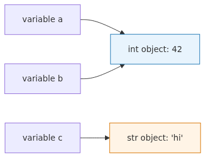

# Variables, types, and operators

## What you'll learn

By the end of this chapter you will be able to explain and code the following yourself.

- Why a Python variable is not a "box that holds a value" but a name tag attached to an object
- The five primitive types — `int`, `float`, `str`, `bool`, `None` — and what each one guarantees
- What dynamic typing buys you, and how type hints make that freedom safe again
- How arithmetic, comparison, logical, and assignment operators behave, including the precedence rules people get wrong
- The classic traps every beginner hits at least once: `is` versus `==`, floating-point comparison, and mutable defaults

This chapter targets Python 3.12. Blocks shown as REPL sessions (with the `>>>` prompt) run line by line in an activated venv. Short snippets without the prompt are illustrative excerpts and assume surrounding names are defined.

## Questions this chapter answers

- Why is a Python variable a name tag attached to an object rather than a box that holds a value?
- What does each of the five primitive types — `int`, `float`, `str`, `bool`, `None` — actually guarantee?
- Where does dynamic typing meet type hints, and how do hints make that freedom safer?
- When do `is` and `==` agree, and when do they disagree?
- Which floating-point comparisons surprise beginners, and how do you avoid them?


## Why it matters

Variables and types are the skeleton of every program you'll ever write. It's tempting to dismiss `x = 1` as trivial, but here are the bugs you keep hitting if the model is fuzzy.

- `total = total + items` raises `TypeError` because you accidentally added a string to a number.
- `if user.age == "18":` always returns `False` and the gate never opens.
- `0.1 + 0.2 == 0.3` is `False`, so a payment validation rejects valid input.
- A function mutates a list it received as an argument, and the caller sees the change too — and you spend an afternoon hunting the source.

The common root is one of two confusions: not knowing exactly what a variable points to, or not knowing what a type guarantees. Nail this once and the chapters on data structures, functions, and classes get noticeably easier.

## Mental model

> In Python, a variable is not a box that holds a value but a name tag attached to an object. Holding only that picture in your head explains almost every assignment, comparison, and copying trap with the same diagram.
In Python, a variable is not a box that holds a value. It's a **name tag attached to an object**. One object can have many name tags, and a name tag can be moved to a different object at any time.


In the diagram above, after `a = 42; b = a` both `a` and `b` point at the same integer object `42`. After `a = "hi"`, only `a` moves to a fresh string object; `b` still points at `42`.

Holding this picture in your head makes two behaviors feel natural.

- `id(a) == id(b)` tells you whether two name tags refer to the same object.
- If two name tags point at a mutable object such as a list, mutating it through one name tag is visible through the other.

## Core concepts

### 1) Dynamic typing and type hints

Python does not bind a type to the variable. Types live on the objects the variable points to.

```python
x = 1          # the name now points at an int object
x = "hello"    # the same name now points at a str object
```

This freedom lets you write code fast, but in a large codebase it blurs the question "what does this function take and return?" That's why Python adopted **type hints** as a standard with PEP 484.

```python
def total_price(quantity: int, unit_price: float) -> float:
    return quantity * unit_price
```

Type hints do not change runtime behavior. A separate static checker such as `mypy` or `pyright` validates them. "Free at runtime, safe at build time" is the trade-off Python chose.

### 2) The five primitive types

| Type | Examples | Notes |
| --- | --- | --- |
| `int` | `42`, `-7`, `1_000_000` | Arbitrary precision. No overflow. |
| `float` | `3.14`, `1e-9` | 64-bit IEEE 754. Floating-point error applies. |
| `str` | `"hello"`, `'world'` | Immutable Unicode text. |
| `bool` | `True`, `False` | Subtype of `int` (`True == 1`). |
| `None` | `None` | The single object that means "no value". |

Three things to memorize. First, `int` has no overflow, unlike C or Java. Second, `float` is IEEE 754, so `0.1 + 0.2` is not exactly `0.3`. Third, `None` is the standard way to express "absent", and you compare it with `if x is None:`, never `if x == None:`.

### 3) Operators

Arithmetic looks familiar, but integer division and exponentiation surprise newcomers.

```python
7 / 2     # 3.5 (always returns a float)
7 // 2    # 3   (floor division)
7 % 2     # 1   (remainder)
2 ** 10   # 1024 (exponentiation)
```

Comparison operators chain. `0 <= x < 10` is the same as `x >= 0 and x < 10`, and the chained form is more readable. Use it.

Logical operators short-circuit. In `a and b`, if `a` is falsy, `b` is never evaluated. That's why this idiom is everywhere:

```python
name = user.name or "guest"          # if user.name is empty, fall back to "guest"
config = override_config or default_config
```

## Before / After

Compare how type hints and explicit names change readability.

**Before — the intent is hidden**

```python
def calc(q, p, r):
    return q * p * (1 - r)
```

Is `q` quantity or quality? Is `r` a discount rate or an exchange rate? You can't tell from the function alone.

**After — names and types reveal the intent**

```python
def discounted_total(quantity: int, unit_price: float, discount_rate: float) -> float:
    return quantity * unit_price * (1 - discount_rate)
```

The function name got longer, but the call site became shorter to read: `discounted_total(3, 9_900, 0.1)` is self-explanatory.

## Step by step

Open a REPL and type these lines yourself. If a result differs from what's printed here, stop and figure out why before moving on.

### 1) Same object versus different object

```python
>>> a = [1, 2]
>>> b = [1, 2]
>>> a == b      # value comparison: True
True
>>> a is b      # identity comparison: False (two distinct list objects)
False
>>> c = a
>>> c is a      # True — two name tags on the same list object
True
```

In the example above, `a` and `b` hold lists with the same contents but distinct objects, so `a == b` is `True` while `a is b` is `False`. Once you bind another name with `c = a`, both `c` and `a` point at the same object and `c is a` is `True`. The rule: `==` compares values, `is` compares object identity. Use `is None` for None checks; for almost everything else, use `==`.

### 2) The floating-point trap

```python
>>> 0.1 + 0.2
0.30000000000000004
>>> 0.1 + 0.2 == 0.3
False
>>> import math
>>> math.isclose(0.1 + 0.2, 0.3)
True
```

For computed float results, use `math.isclose` when tolerance matters, or switch to `Decimal` when exactness matters. Even if the constant itself is exactly representable, equality can still fail when the other side is a computed float, so do not generalize this into a rule.

### 3) Type conversion

```python
>>> int("42")           # 42
>>> float("3.14")       # 3.14
>>> str(42)             # '42'
>>> bool(0), bool(1)    # (False, True)
>>> bool(""), bool("hi")  # (False, True)
>>> int("3.14")         # ValueError
```

`int("3.14")` raises because the string isn't an integer literal. To convert a decimal string to an integer, go through float first: `int(float("3.14"))`.

## Common mistakes

**1. Mixing `==` and `is`**
Use `==` unless you genuinely care about object identity. `if name is "admin":` may work by accident due to CPython's string interning, but it's wrong code.

**2. Comparing floats with `==`**
The `0.1 + 0.2 != 0.3` case above is the canonical trap. Use `decimal.Decimal` for money, taxes, and discount rates; use `math.isclose` for general floating-point comparison.

**3. Mutable default arguments**
Default arguments are evaluated once, when the function is defined. Writing `def f(x, items=[]):` makes the same list accumulate across calls. Use `None` as the default and create a fresh list inside.

```python
def append_id(item, items=None):
    if items is None:
        items = []
    items.append(item)
    return items
```

**4. Confusing strings and numbers**
User input always arrives as a string. `input("Age: ")` returns `"25"`, not `25`. Convert explicitly with `int(...)` before comparing or doing arithmetic.

**5. Adding booleans like integers**
`True + True` is `2`. You can lean on this for tricks, but it hurts readability. Use `sum(1 for x in xs if cond(x))` to make the intent obvious.

**6. Writing big numbers without separators**
`10000000` is harder to read than `10_000_000`. Python ignores underscores in numeric literals, so use them freely as thousands separators.

## Real-world patterns

**1. Validate type hints with mypy in CI**
Type hints alone don't make your code safer; you have to actually run a checker. Add this to `pyproject.toml` and run `mypy src/` in CI.

```toml
[tool.mypy]
strict = true
python_version = "3.12"
```

**2. Use `Decimal` for money and taxes**
Floating-point rounding errors compound when you process payments.

```python
from decimal import Decimal

price = Decimal("9900")
tax = price * Decimal("0.1")
total = price + tax  # Decimal('10890')
```

The string literal is the key part. `Decimal(0.1)` accepts a float that already carries floating-point error, which defeats the purpose.

**3. Always cast environment variables**
`os.environ["PORT"]` is a string. Convert it before using it for comparison or arithmetic, and handle the case where the value isn't a valid integer.

```python
import os

port = int(os.environ.get("PORT", "8000"))
```

**4. Reach for `dataclass` once you have several fields**
Once a dict grows to three or four related fields, switch to a `dataclass`. Type hints and defaults live in one place, and your IDE can autocomplete the field names.

```python
from dataclasses import dataclass

@dataclass
class Order:
    order_id: str
    quantity: int
    unit_price: float
```

## Checklist

Before moving to the next chapter, walk through these by hand at least once.

- [ ] Ran `a = [1, 2]; b = [1, 2]; print(a == b, a is b)` in the REPL
- [ ] Confirmed that `0.1 + 0.2` is not equal to `0.3`
- [ ] Can describe `int`, `float`, `str`, `bool`, and `None` in one sentence each
- [ ] Understand that type hints do not change runtime behavior
- [ ] Ran `mypy` at least once on a small file
- [ ] Performed a money calculation with `Decimal`

## Exercises

1. **Tax-inclusive price calculator**
   Write `total_with_tax(unit_price: Decimal, quantity: int, tax_rate: Decimal = Decimal("0.1")) -> Decimal`. Apply full type hints and validate with mypy strict.
   - Success criteria: `total_with_tax(Decimal("9900"), 3)` returns `Decimal('32670')`, and `mypy --strict` reports 0 errors.

2. **Floating-point comparison helper**
   Implement `almost_equal(a: float, b: float, tol: float = 1e-9) -> bool` from scratch, then compare its results with `math.isclose`.
   - Success criteria: `almost_equal(0.1 + 0.2, 0.3)` returns `True` and matches `math.isclose(0.1 + 0.2, 0.3)`.

3. **Safe user input conversion**
   Write `read_age() -> int` that calls `input("Age: ")`, converts to int, and re-prompts on negative numbers or non-numeric input.
   - Success criteria: `"25"` returns `25`; `"-1"` and `"abc"` both re-prompt without raising.

## Summary and next chapter

- A Python variable is a name tag attached to an object. `=` doesn't copy the value; it moves the tag.
- Dynamic typing is convenient, but at scale you reinforce it with type hints and mypy.
- `int` has no overflow, `float` carries IEEE 754 error, and `bool` is a subtype of `int`.
- `==` compares values, `is` compares identity. The only `is` you write regularly is `is None`.
- Use `Decimal` for money, `math.isclose` for floating-point checks, and explicit casts for user input.

The next chapter dives into strings: f-strings and format specs, the difference between `str` and `bytes`, and a first look at regular expressions.

<!-- toc:begin -->
<!-- toc:end -->

## References

- Python docs — Built-in Types: https://docs.python.org/3/library/stdtypes.html
- Python docs — `decimal`: https://docs.python.org/3/library/decimal.html
- PEP 484 — Type Hints: https://peps.python.org/pep-0484/
- PEP 8 — Style Guide for Python Code: https://peps.python.org/pep-0008/
- mypy documentation: https://mypy.readthedocs.io/

Tags: variables, python-types, equality-vs-identity, floating-point, decimal, type-hints
