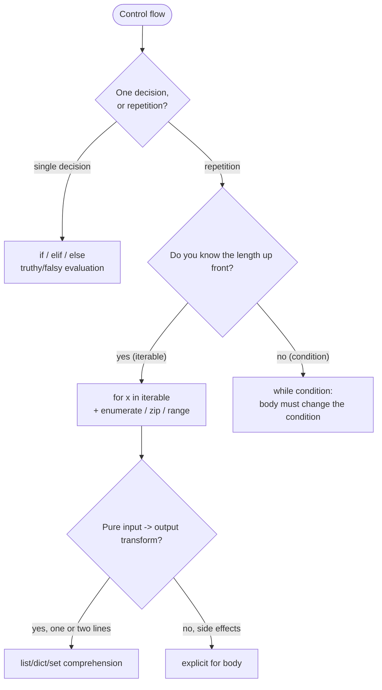

# Control flow: if, for, while, comprehension

## What you will learn

By the end of this chapter you will be able to explain and code the following:

- How to handle truthy and falsy values deliberately when writing `if`/`elif`/`else`
- A first-cut decision rule for choosing between `for` and `while`
- How to combine `range`, `enumerate`, and `zip` for loops that read well
- When to reach for list/dict/set comprehensions, and when to fall back to a regular loop
- The subtle behavior of `break`, `continue`, and the `for ... else` clause
- How to avoid common traps — mutating a sequence while iterating, deeply nested comprehensions, off-by-one errors

## Why it matters

Branching and looping make up a large share of application code, so when this part is messy the rest is harder to read. Python's branching and loop syntax is leaner than most languages, but it adds a few unfamiliar tools — `for`-`else` and comprehensions — that pay off once you know them. With them in your toolbox you stop writing tall `if` ladders, and you can switch between regular loops and comprehensions on purpose.

There is a second reason: in Python an `if` does not test "is the value true" but "is the value truthy". `0`, `0.0`, `""`, `[]`, `{}`, and `None` are all falsy. The rule lets you write short, clear conditions, but if you forget it you end up with code that "checks whether a list is empty" yet behaves unexpectedly when the list contains a single zero. This chapter pins down truthy and falsy once.

This chapter is also a setup for the next one on functions and argument design. Function bodies are mostly branching and looping, and the shape of the argument decides which loop reads naturally.

## Mental model

Lay out the choices on a single page so that, while reading code, you can guess the next step in your head.



Three rules carry most of the weight.

1. **A single decision is `if`; the same work repeated is a loop.** `for` and `while` are two tools for the same job — repetition — and the choice depends on whether you already have something to iterate over.
2. **If you have an iterable to walk, `for` reads naturally.** Use `while` when there is no length and you must keep going until a condition holds. Blur this line and infinite loops and off-by-one errors creep in.
3. **A comprehension is a focused expression for "turn an input iterable into a new collection".** As soon as side effects (file writes, prints, mutating outside state) appear, a regular `for` body reads better.

These rules anchor every section that follows.

## Core concepts

### 1. Truthy and falsy

Think of Python's `if` as wrapping the condition in `bool()` once. The following values are all falsy:

- `False`, `None`
- Numeric zeros: `0`, `0.0`, `0j`, `Decimal(0)`, `Fraction(0)`
- Empty sequences and collections: `""`, `b""`, `()`, `[]`, `{}`, `set()`, `range(0)`

Everything else is truthy. The rule lets you write `if not items:` to check for an empty list. But "is the value zero" is a different question from "is the container empty". If a user explicitly entered `0`, write `if value is None:` or `if value == 0:` so the intent is clear.

### 2. `if` / `elif` / `else`

A short branch ladder reads more easily than a tall one. If you keep adding branches against the same variable, consider flattening with a dict mapping or function dispatch.

```python
def label(score: int) -> str:
    if score >= 90:
        return "A"
    elif score >= 80:
        return "B"
    elif score >= 70:
        return "C"
    else:
        return "F"
```

`elif` runs only when every condition above it was false. Keep the conditions getting tighter from top to bottom — it is the safest way to read them.

### 3. `for` and iterables

`for` "pulls one element at a time from an iterable, binds it to a variable, and runs the body". So `range`, `list`, `tuple`, `set`, `dict`, file objects, and generators — anything that yields one item at a time — all work.

```python
for item in ["ada", "bob", "carol"]:
    print(item)

for i in range(3):
    print(i)

for ch in "hi":
    print(ch)
```

`enumerate`, `zip`, and `range` raise `for`'s expressiveness sharply.

```python
names = ["ada", "bob", "carol"]
roles = ["engineer", "designer", "engineer"]

for idx, name in enumerate(names, start=1):
    print(idx, name)

for name, role in zip(names, roles):
    print(name, "->", role)
```

Use `enumerate` when you need the index, `zip` when you want to walk two or more sequences in lockstep. `zip` stops at the shortest input. If you want to catch mismatched lengths, use `zip(..., strict=True)` to make the intent explicit.

### 4. `while` and the exit condition

`while` "runs the body while the condition is truthy". If the body never changes anything that affects the condition, you have an infinite loop.

```python
remaining = 5
while remaining > 0:
    print("tick", remaining)
    remaining -= 1
```

Tasks without an obvious end — reading user input, pulling messages off a queue — read better as `while True` plus an explicit `break`.

```python
while True:
    line = input("> ").strip()
    if line in {"quit", "exit"}:
        break
    print("echo:", line)
```

### 5. `break`, `continue`, and `for`-`else`

- `break` ends the innermost loop immediately.
- `continue` skips the rest of the body and moves to the next iteration.
- A loop's `else` clause runs **only when the loop finished without `break`**. It can be useful in search patterns but a `found = False` flag is often clearer.

```python
for n in [4, 6, 8, 9]:
    if n % 2 == 1:
        print("found odd:", n)
        break
else:
    print("no odd found")
```

### 6. Comprehensions

List, dict, and set comprehensions are expressions that "turn an input iterable into a new collection in one go".

```python
squares = [x * x for x in range(5)]
positives = [x for x in [-1, 2, -3, 4] if x > 0]
by_role = {name: role for name, role in zip(names, roles)}
unique_words = {w.lower() for w in "Hello hello world".split()}
```

You can attach a filter, and you can nest two levels. Two is about the upper limit. Beyond that, a regular `for` loop is friendlier to humans and tools alike.

A generator expression (`(x * x for x in range(5))`) uses the same syntax but evaluates lazily without materializing the collection. It fits when you need to fold a large input (`sum(x * x for x in range(10**6))`) or you only need the next item.

## Before-after

Rewrite the same task from "verbose loop" to "Pythonic loop". The input is a list of student names and a parallel list of scores.

**Before — C-style loop**

```python
names = ["ada", "bob", "carol", "dan"]
scores = [92, 71, 85, 58]

i = 0
result = []
while i < len(names):
    name = names[i]
    score = scores[i]
    if score >= 60:
        result.append(name + ":" + str(score))
    i += 1
print(result)
```

When you read it, you have to track four moving parts: (a) the index counter you advance by hand, (b) using the same index against both lists, (c) the inline filter condition, and (d) the accumulator variable.

**After — `zip` plus comprehension**

```python
names = ["ada", "bob", "carol", "dan"]
scores = [92, 71, 85, 58]

result = [f"{name}:{score}" for name, score in zip(names, scores) if score >= 60]
print(result)
```

The behavior is identical, but the intent — "walk both sequences and collect names and scores at or above 60" — is visible in one line. The index disappears, and so does the explicit accumulator.

If side effects creep in — "log low scores, collect the rest" — fall back to a regular `for`.

```python
result = []
for name, score in zip(names, scores):
    if score < 60:
        log_low(name, score)
        continue
    result.append(f"{name}:{score}")
```

Once you can move freely between these two shapes, branching-and-looping code becomes much easier to read and maintain.

## Step-by-step practice

Run the snippets in order, in a REPL or a small script. Lines starting with `>>>` are REPL inputs; the lines below are the output.

1. **Confirm truthy and falsy yourself.**

```python
>>> for v in [0, 1, "", "x", [], [0], None, {"a": 1}]:
...     print(repr(v), bool(v))
0 False
1 True
'' False
'x' True
[] False
[0] True
None False
{'a': 1} True
```

Note that `[0]` is truthy because the container has length 1. The rule is "the container is empty", not "the elements are zero".

2. **Combine `enumerate` with `zip`.**

```python
>>> names = ["ada", "bob", "carol"]
>>> roles = ["engineer", "designer", "engineer"]
>>> for idx, (name, role) in enumerate(zip(names, roles), start=1):
...     print(idx, name, "->", role)
1 ada -> engineer
2 bob -> designer
3 carol -> engineer
```

`enumerate(zip(...))` shows up whenever you want to walk two sequences in lockstep and number the rows from 1.

3. **Branch on a search result with `for`-`else`.**

```python
>>> def find_first_negative(nums):
...     for n in nums:
...         if n < 0:
...             return n
...     return None
>>> find_first_negative([1, 2, 3])
>>> find_first_negative([1, -2, 3])
-2
```

The same idea written with `for`-`else`:

```python
>>> def find_first_negative_v2(nums):
...     for n in nums:
...         if n < 0:
...             return n
...     else:
...         return None
```

Here the `for`-`else` adds little because the trailing `return None` is already natural. Reach for it when you genuinely need to handle "we finished without finding" in one place.

4. **Move between comprehensions and a regular loop.**

```python
>>> nums = list(range(10))
>>> [x * x for x in nums if x % 2 == 0]
[0, 4, 16, 36, 64]
>>> {x: x * x for x in nums if x % 2 == 0}
{0: 0, 2: 4, 4: 16, 6: 36, 8: 64}
>>> sum(x * x for x in nums if x % 2 == 0)  # generator expression
120
```

All three produce the same "even squares", but the resulting container differs — list, dict, and a single sum.

## Common mistakes

1. **Mutating the list you are iterating.**
   Calling `items.remove(...)` or `items.append(...)` inside `for item in items:` shifts indices and either skips elements or runs forever. Build a new list (`items = [x for x in items if cond(x)]`) or iterate over a copy (`for item in items[:]`).

2. **Forgetting the exit condition inside `while True`.**
   The exit condition must become truthy somewhere in the body. If you rely on an external signal (`KeyboardInterrupt`, a queue message), make the `try/except` or `break` explicit.

3. **Using a falsy check as "is the value zero".**
   `if value:` is false when `value` is `0`, `""`, or `[]`. If you really mean "the value was not provided", write `if value is None:`. The two checks have different meanings.

4. **Side effects inside a comprehension.**
   `[print(x) for x in nums]` builds a list of `None`s as a side effect — awkward code. Call `print` from a `for` body so the intent reads.

5. **Forgetting that `zip` stops at the shortest input.**
   Zipping two sequences of different length yields only as many tuples as the shorter one. If that is not the intent, use `zip(a, b, strict=True)` to raise `ValueError` immediately.

6. **Confusing `==` and `is`.**
   `is` checks whether two names refer to the same object. To compare values, use `==`. `is` is natural only for singletons such as `None`, `True`, and `False`.

## In practice

In real code you often see loops that iterate over many stages, or whose end is not known up front. Two patterns are worth keeping in mind.

**(1) Stream a large file line by line.**

```python
total = 0
with open("access.log", encoding="utf-8") as f:
    for line in f:
        if line.startswith("GET "):
            total += 1
print(total)
```

A file object is itself an iterable that yields one line at a time, so `for line in f:` is enough. Reading everything at once with `f.readlines()` wastes memory for large files.

**(2) Aggregate results from external calls.**

```python
def fetch_users(ids):
    results = {}
    for user_id in ids:
        try:
            user = api.get_user(user_id)
        except NotFound:
            continue
        results[user_id] = user
    return results
```

Wrapping a single call in `try/except` inside the loop lets you skip one failed user and keep going. A `for` body is more appropriate than a comprehension here because failures interrupt the flow.

These two patterns reappear in the next chapter on function arguments and the chapter after on file I/O and exceptions.

## Checklist

- [ ] I can state, in one sentence, the difference between `if value:` and `if value is None:`.
- [ ] I can decide between `for` and `while` based on "do I have an iterable already".
- [ ] I have called `enumerate`, `zip`, and `range` from a real loop body.
- [ ] I have written one list, dict, and set comprehension each — without side effects.
- [ ] I know that `zip` stops at the shortest input and that `strict=True` exists.
- [ ] I know patterns for not mutating a sequence while iterating it (`items[:]`, comprehensions).

## Exercises

1. **Score classifier.**
   Given `scores = {"ada": 92, "bob": 58, "carol": 71}`, collect the names with a score of 60 or higher into a list. Write it once with a regular `for` and once with a list comprehension.
   - Success criterion: both versions produce `["ada", "carol"]`.

2. **First negative.**
   Write a function `first_negative(nums)` that returns the index of the first negative number in `nums`, or `-1` if there is none.
   - Success criterion: `first_negative([3, 1, -7, 4]) == 2` and `first_negative([1, 2, 3]) == -1`.

3. **Pair two sequences.**
   Take two lists — names and roles — and produce a `{name: role}` dict. If the lengths differ, raise `ValueError`.
   - Hint: `zip(..., strict=True)`.
   - Success criterion: equal lengths produce a dict; unequal lengths raise `ValueError`.

## Summary and next chapter

- Branching versus looping splits naturally on "single decision or repetition?", then on "do I have an iterable already?".
- `if` evaluates truthy and falsy. Keep in mind that empty containers and `0` are both falsy.
- `for` walks an iterable; `while` runs while the condition is truthy. Reach for `enumerate`/`zip`/`range` to lift expressiveness.
- Comprehensions are a focused tool for "transform only". The moment side effects appear, fall back to a regular `for`.
- Small tools like `for`-`else`, `zip(..., strict=True)`, and `items[:]` clear up the common traps.

The next chapter covers functions and arguments. We will pin down `def`, `*args`/`**kwargs`, defaults, and `lambda`, and look at how to package branching and looping bodies into named functions.

<!-- toc:begin -->
<!-- toc:end -->

## References

- Python tutorial — More Control Flow Tools: https://docs.python.org/3/tutorial/controlflow.html
- Python docs — Truth Value Testing: https://docs.python.org/3/library/stdtypes.html#truth-value-testing
- Python docs — `enumerate`: https://docs.python.org/3/library/functions.html#enumerate
- Python docs — `zip` (including the strict option): https://docs.python.org/3/library/functions.html#zip
- PEP 202 — List Comprehensions: https://peps.python.org/pep-0202/

Tags: control-flow, if-statement, for-loop, while-loop, comprehensions, enumerate-zip
