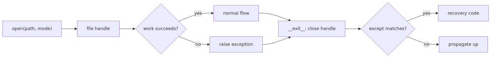

# File I/O and exception handling

A file is a three-step resource: open it, read or write it, then close it. Exceptions are the labels that tell you which step failed and what kind of failure you hit.

This post is the 8th article in the Python 101 series. This is the point in the series where resource handling and failure paths become part of normal coding.

## What you will learn

By the end of this chapter you can do the following.

- Open and close files safely using `open()` together with the `with` statement.
- Tell text mode (`"r"`, `"w"`, `"a"`) apart from binary mode (`"rb"`, `"wb"`) and pick the right one.
- Describe the difference between `read`, `readline`, `readlines`, and iterating the file object in one sentence each.
- Use the four blocks of `try`/`except`/`else`/`finally` for their distinct roles.
- Catch narrow exceptions like `FileNotFoundError` and `PermissionError` instead of using a bare `except:` clause.
- Use `pathlib.Path` for path manipulation and `read_text` / `write_text` for short file operations.

## Why it matters

File code touches outside resources. Unlike in-memory variables, a file handle is a limited operating system resource, and many failure modes come along with it. The disk may be full, permissions may be missing, or another process may hold the file open.

Code that ignores these conditions tends to work fine in development and break in production. Forgetting to close a handle leaks file descriptors in long-running servers; swallowing exceptions can leave half-written data behind. Catching unexpected exceptions with a bare `except:` hides real bugs in plain sight.

The `with` statement and narrow `except` clauses are the simplest tools for avoiding both traps. This chapter shows where each tool fits and how to combine them.

## Mental model

> A file is a three-step resource: open, read or write, close. Exceptions are labels that classify which step failed and how. Separating those two models makes the shape of `with` and `try` blocks fall out naturally.
The diagram below shows the flow that runs whenever you open a file and do work with it.



*Mental model*
Two ideas hold this together.

- **`with` calls `__exit__` on both normal exit and exception exit, so the handle is closed in both cases.** That removes most of the need to write `try`/`finally` and call `close()` by hand.
- **Uncaught exceptions propagate up the call stack.** When `except` does not match, the function exits at that point and the caller sees the same exception. This is what lets one place own the error policy for many callers.

## Core concepts

### `open()` and modes

`open(path, mode, encoding=...)` returns a file object. The most common modes are:

- `"r"` — read; raises `FileNotFoundError` when the file is missing
- `"w"` — write; truncates the file when it already exists
- `"a"` — append; creates the file when missing
- `"x"` — create; raises `FileExistsError` when the file already exists
- `"b"` — binary suffix (`"rb"`, `"wb"`)

In text mode the `encoding` argument falls back to a platform default when omitted. That default differs across operating systems, so passing `encoding="utf-8"` for text files is the safer choice.

### The `with` statement

`with` uses the context-manager protocol (`__enter__`/`__exit__`). File objects implement this protocol, which is why exiting a `with` block also closes the handle.

```python
with open("notes.txt", "r", encoding="utf-8") as f:
    text = f.read()
# f is already closed here
```

The handle is closed even when an exception is raised inside the block, so resource leaks are no longer a concern at this layer.

### Four ways to read

- `f.read()` — read the whole file into one string. Fits small files.
- `f.readline()` — read one line, advance to the next on the next call.
- `f.readlines()` — read the remaining lines into a list at once.
- `for line in f:` — iterate one line at a time. Stays small in memory for large files.

For a large log file the last form fits best. For a tiny config file `read()` is the simpler option.

### Writing

`write(s)` writes a single string; `writelines(seq)` writes a sequence of strings in order. `writelines` does not add line separators on its own, so include them when you need them.

```python
with open("out.txt", "w", encoding="utf-8") as f:
    f.write("first line\n")
    f.writelines(["a\n", "b\n", "c\n"])
```

### Text vs binary

Text mode reads and writes `str`; binary mode reads and writes `bytes`. Images, compressed archives, and executables belong in binary mode. Text mode may translate line endings depending on the platform, so reach for binary mode when you need the bytes preserved exactly.

### `try`/`except`/`else`/`finally`

The four blocks play distinct roles.

- `try` — code that may raise.
- `except` — code that responds to a specific exception class.
- `else` — code that runs only when `try` finished without raising.
- `finally` — code that runs at the end whether or not an exception was raised.

`else` and `finally` are not used as often, but they are useful when you want to separate the success path from the cleanup path.

### Catching narrow exceptions

A bare `except:` or even `except Exception:` swallows real bugs (a typo that raises `NameError`, for example) along with the failure you actually expected. Catching only the exception classes you anticipate makes debugging much easier.

```python
try:
    with open(path, "r", encoding="utf-8") as f:
        return f.read()
except FileNotFoundError:
    return ""
except PermissionError:
    raise
```

### `pathlib.Path`

`pathlib.Path` treats paths as objects. The `/` operator joins parts, and `read_text` / `write_text` collapse short file work into a single line.

```python
from pathlib import Path

config_dir = Path.home() / ".myapp"
config_dir.mkdir(parents=True, exist_ok=True)
(config_dir / "config.txt").write_text("debug=true\n", encoding="utf-8")
```

Joining paths with string `+` invites separator and double-slash bugs across platforms. `pathlib` removes most of those small mistakes.

## Before-After

The function below reads a config file and returns its content as a string.

**Before**

```python
def load_config(path):
    f = open(path)
    try:
        return f.read()
    except:
        return ""
```

This snippet has three problems.

- `open()` is used without `with`, so an exception during `read()` can leak the handle.
- `encoding` is not specified, so the result depends on the platform default.
- The bare `except:` swallows unexpected exceptions too, so a permission error and a code bug both end up as an empty string.

**After**

```python
from pathlib import Path

def load_config(path):
    try:
        return Path(path).read_text(encoding="utf-8")
    except FileNotFoundError:
        return ""
```

Three changes happened.

- `pathlib.Path.read_text` uses `with` internally, so handle management moves out of this function.
- `encoding="utf-8"` removes the platform difference.
- Only `FileNotFoundError` is caught; permission problems, disk errors, and code bugs propagate to the caller.

## Step-by-step practice

Open a REPL and follow along. Blocks marked with `>>>` are REPL transcripts; the other code blocks are illustrative snippets.

### 1. Write a text file and read it back

```text
>>> with open("hello.txt", "w", encoding="utf-8") as f:
...     f.write("hello\n")
...
6
>>> with open("hello.txt", "r", encoding="utf-8") as f:
...     print(f.read())
...
hello
```

The number returned by `write` is the count of characters that were written.

### 2. Open a missing file safely

```text
>>> try:
...     with open("missing.txt", "r", encoding="utf-8") as f:
...         data = f.read()
... except FileNotFoundError:
...     data = ""
...
>>> data
''
```

A narrow `except` covers exactly one failure mode. Other errors keep propagating.

### 3. Read the first 4 bytes in binary mode

```text
>>> with open("hello.txt", "rb") as f:
...     header = f.read(4)
...
>>> header
b'hell'
```

The same file opened in binary mode shows the raw bytes that text mode would have decoded.

### 4. Use `pathlib` to make a directory and write a file

```text
>>> from pathlib import Path
>>> base = Path("scratch")
>>> base.mkdir(exist_ok=True)
>>> (base / "note.txt").write_text("hi\n", encoding="utf-8")
3
>>> (base / "note.txt").read_text(encoding="utf-8")
'hi\n'
```

### 5. Walk through `try`/`except`/`else`/`finally`

```text
>>> def safe_read(p):
...     try:
...         text = Path(p).read_text(encoding="utf-8")
...     except FileNotFoundError:
...         print("missing")
...         return None
...     else:
...         print("ok")
...         return text
...     finally:
...         print("done")
...
>>> safe_read("scratch/note.txt")
ok
done
'hi\n'
>>> safe_read("scratch/none.txt")
missing
done
```

`else` runs only when there was no exception; `finally` runs in either case.

## Common mistakes

- **Using `open()` without `with`** — an exception inside the block can leave the handle open. Reach for `with` by default, even in short scripts.
- **Omitting `encoding`** — relying on the platform default makes the same code behave differently in different environments. Pass `encoding="utf-8"` for text files.
- **Catching with bare `except:`** — real bugs disappear along with the expected failures. Name the exception classes you mean to handle.
- **Silently swallowing exceptions** — `except FileNotFoundError: pass` makes debugging painful later. At minimum, log the failure.
- **Opening a binary file in text mode** — decoding errors or line-ending translation can corrupt the data. Use `"rb"` / `"wb"` for images, archives, and executables.
- **Joining paths with `+`** — separators differ across platforms and double slashes show up easily. Use `pathlib.Path` with `/` or `os.path.join`.
- **Reading a large file with `read()`** — the whole content lands in memory at once. Iterate line by line with `for line in f:` instead.

## In real projects

In real projects file I/O and exception handling tend to show up in these places.

- **Config loaders**: read a short config with `pathlib.Path.read_text`, fall back to defaults when missing, and let permission errors propagate so the program fails fast.
- **Log and report writers**: append (`"a"`) one line at a time. Group writes inside a single `with` block instead of opening and closing the file per line.
- **CSV / JSON processing**: line-oriented formats (CSV, JSONL) work well with `for line in f:`, which keeps even large files within reasonable memory.
- **Temporary files**: pair `tempfile.NamedTemporaryFile` with `with` so the file is cleaned up automatically when the block ends.
- **Retries and recovery**: catch transient errors (a brief network filesystem outage, for example) with a narrow `except` and retry, but let permanent errors propagate so the caller decides what to do.

The shape stays the same: close resources with `with`, catch exceptions narrowly, and let unfamiliar errors travel up.

## Checklist

- [ ] You can use `open()` together with `with` by default.
- [ ] You can describe the difference between text mode and binary mode and explain why `encoding` matters in one sentence.
- [ ] You can describe the difference between `read`, `readline`, `readlines`, and `for line in f:`.
- [ ] You can use the four blocks of `try`/`except`/`else`/`finally` for their distinct roles.
- [ ] You can avoid `except:` and `except Exception:` and pick narrow exception classes instead.
- [ ] You can join paths with `pathlib.Path` and use `read_text` / `write_text` for short file work.
- [ ] You can choose `for line in f:` over `read()` when the file is large.

## Exercises

1. Write `append_note(text)` that appends a line to `notes.txt`. Use append mode (`"a"`) together with `with`, and add the line break yourself.
2. Write `count_lines(path)` that returns `0` when the file is missing and otherwise counts lines using `for line in f:`.
3. Write `safe_copy(src, dst)` that reads `src` in binary mode and writes the same bytes to `dst`. Let `FileNotFoundError` propagate when `src` is missing.
4. Using only `pathlib`, write a script that creates a `data/` directory, writes `hello.txt` inside it, and reads the file back. Make the directory creation safe to run more than once.

## Summary and next chapter

- Files are operating system resources, so opening them inside a `with` block is the safer default for closing the handle.
- Text mode exchanges `str` and binary mode exchanges `bytes`, and passing `encoding="utf-8"` for text files removes platform differences.
- Exceptions split into `try`/`except`/`else`/`finally` so the success path and the cleanup path stay separate from the recovery path.
- Pick narrow exception classes and let unfamiliar errors propagate so the caller decides the policy.
- `pathlib.Path` is the standard tool that collapses path manipulation and short file work into one line.

The next chapter covers classes and objects. The functions and modules from earlier chapters get one more layer of abstraction, where data and behavior live together.

<!-- toc:begin -->
<!-- toc:end -->

## References

- [Python tutorial — Reading and writing files](https://docs.python.org/3/tutorial/inputoutput.html#reading-and-writing-files)
- [Python tutorial — Errors and exceptions](https://docs.python.org/3/tutorial/errors.html)
- [Python library — pathlib](https://docs.python.org/3/library/pathlib.html)
- [PEP 343 — The "with" statement](https://peps.python.org/pep-0343/)

Tags: file-io, context-manager, text-vs-binary, exception-handling, try-except-finally, pathlib
