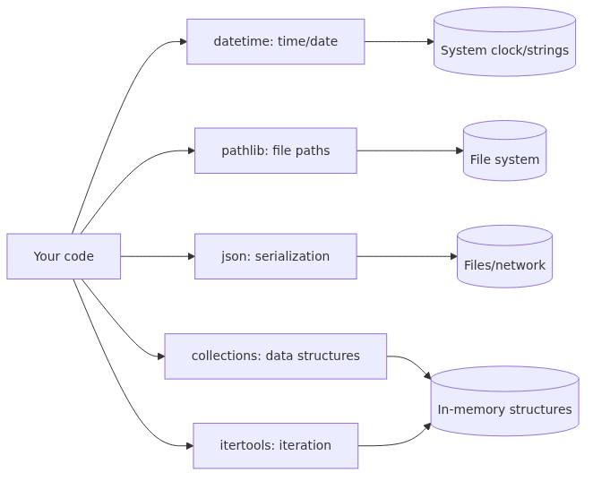

# Standard library tour: datetime, pathlib, json, collections, itertools

## What you will learn

- How to handle dates and times with `datetime`
- How to treat file paths as objects with `pathlib.Path`
- How to convert between dicts and JSON strings using `json`
- What `collections.Counter`, `defaultdict`, and `deque` are for
- How `itertools.chain`, `groupby`, and `combinations` compress repetitive iteration

## Why it matters

Python is often described as "batteries included" — many of the tools you reach for daily are part of the standard library. Getting comfortable with it changes a few things.

- **You add fewer external dependencies.** For small scripts, checking the standard library first keeps `requirements.txt` lean.
- **The code becomes shorter and more familiar.** Other Python developers know the same tools, so reviews go faster.
- **Versioning stays simple.** Match the interpreter version and you can expect the same behavior.

This article does not cover the entire standard library. It picks five modules that show up often in scripts and small data-processing jobs and walks through them at an introductory level.

## Mental model

> The standard library is a toolbox of routines so you do not write the same thing twice. Each module sticks to one domain — time, paths, serialization, aggregation, iteration — and exposes a small focused vocabulary.
The standard library is organized by purpose. `datetime` covers time, `pathlib` covers file paths, `json` covers serialization, `collections` adds richer data structures, and `itertools` covers iteration patterns.


Each module is designed to solve "one kind of problem" well. The naming is consistent enough that you can usually guess what a module covers from its name alone.

## Core concepts

- **`datetime` types**: `date`, `time`, the combined `datetime`, and `timedelta` for spans. A `datetime` instance can carry a `tzinfo` for time zones.
- **`pathlib.Path`**: A path object instead of a string. You join with `/`, and call methods like `.exists()`, `.read_text()`, and `.glob()` directly on the path.
- **`json.dumps`/`json.loads`**: Convert between Python objects and JSON strings. dict, list, str, int, float, bool, and None map directly; other types need a custom rule.
- **`Counter`**: A dict subclass that counts occurrences of items.
- **`defaultdict`**: A dict that calls a factory function when a missing key is accessed.
- **`deque`**: A double-ended queue with `O(1)` append and pop on both ends.
- **`itertools`**: A collection of functions that transform, combine, and slice iterables. Results come back as lazy iterators.

## Before-after

The snippet below counts word occurrences.

**Before**

```python
def word_counts(words):
    counts = {}
    for w in words:
        if w in counts:
            counts[w] += 1
        else:
            counts[w] = 1
    return counts
```

Working with a plain dict means checking key membership on each step.

**After**

```python
from collections import Counter

def word_counts(words):
    return Counter(words)
```

Three changes happened.

- The membership branch disappeared.
- `Counter` provides helpers like `most_common(n)` for free.
- The result is a dict subclass, so it stays compatible with code that expects a dict.

## Step-by-step practice

Open a REPL and follow along. Blocks marked with `>>>` are REPL transcripts; the other code blocks are illustrative snippets.

### 1. Use `datetime` for today and now

```text
>>> from datetime import date, datetime, timedelta
>>> date.today()
datetime.date(2026, 5, 3)
>>> datetime.now()
datetime.datetime(2026, 5, 3, 14, 30, 0, 123456)
>>> date(2026, 12, 25) - date.today()
datetime.timedelta(days=236)
>>> (datetime(2026, 5, 3, 14, 30) + timedelta(hours=2)).strftime("%Y-%m-%d %H:%M")
'2026-05-03 16:30'
```

`strftime` controls the output format; `strptime` parses a string back into an object. User-provided strings vary in shape, so parsing them once at the boundary and working with objects afterward is safer.

### 2. Use `pathlib` for paths

```text
>>> from pathlib import Path
>>> p = Path("docs") / "intro.md"
>>> p
PosixPath('docs/intro.md')
>>> p.suffix
'.md'
>>> p.stem
'intro'
>>> p.parent
PosixPath('docs')
```

`Path` objects abstract away OS differences. `Path("a") / "b"` becomes `a/b` on Linux and `a\b` on Windows, so you write less slash-handling code yourself.

### 3. Serialize and deserialize with `json`

```text
>>> import json
>>> data = {"name": "Ada", "tags": ["math", "logic"]}
>>> s = json.dumps(data, ensure_ascii=False)
>>> s
'{"name": "Ada", "tags": ["math", "logic"]}'
>>> json.loads(s) == data
True
```

`ensure_ascii=False` keeps non-ASCII characters readable. To work with files, use `json.dump(data, f)` for writing and `json.load(f)` for reading.

### 4. Count with `Counter`

```text
>>> from collections import Counter
>>> Counter("banana")
Counter({'a': 3, 'n': 2, 'b': 1})
>>> Counter(["red", "blue", "red", "green", "blue", "red"]).most_common(2)
[('red', 3), ('blue', 2)]
```

A string is counted by character, a list by element. `most_common(n)` returns the `n` highest-frequency entries.

### 5. Group with `defaultdict`

```text
>>> from collections import defaultdict
>>> groups = defaultdict(list)
>>> for word in ["ant", "ape", "bee", "bat"]:
...     groups[word[0]].append(word)
...
>>> dict(groups)
{'a': ['ant', 'ape'], 'b': ['bee', 'bat']}
```

Missing keys produce a fresh empty list automatically, so the `if key not in d` branch goes away.

### 6. Compress iteration with `itertools`

```text
>>> from itertools import chain, groupby, combinations
>>> list(chain([1, 2], [3, 4]))
[1, 2, 3, 4]
>>> [(k, list(g)) for k, g in groupby("aaabbc")]
[('a', ['a', 'a', 'a']), ('b', ['b', 'b']), ('c', ['c'])]
>>> list(combinations(["A", "B", "C"], 2))
[('A', 'B'), ('A', 'C'), ('B', 'C')]
```

Note that `groupby` only groups adjacent equal values. Unsorted input usually needs `sorted()` first to produce the groups you expect.

## Common mistakes

- **Mixing `datetime.now()` and `utcnow()`** — Both return naive objects without time-zone info. When time zones matter, use `datetime.now(timezone.utc)` and pass an explicit `tzinfo`.
- **Passing a `pathlib.Path` to APIs that demand strings** — Some external libraries accept strings only. Converting with `str(path)` at the boundary makes debugging easier.
- **Seeing `\uXXXX` in `json.dumps` output** — That happens when `ensure_ascii=False` is omitted. Turn it on for human-readable logs and files.
- **Relying on `Counter` key order** — Without going through `most_common()`, frequency-sorted order is not guaranteed. Use `most_common()` when you need the ranking.
- **Calling the factory in `defaultdict`** — `defaultdict(list)` is the correct shape. `defaultdict(list())` passes a single empty list as the factory and raises `TypeError` on access.
- **Feeding unsorted input to `groupby`** — Adjacent-only grouping splits the same key into multiple groups.
- **Iterating an `itertools` result twice** — Iterators are consumed once and become empty. To reuse, capture the result with `list(...)` first.

## In practice

Standard-library helpers show up in many small but recurring places.

- **Cleaning log files**: walk a directory with `pathlib`, parse the date encoded in each filename with `datetime`, and separate older files.
- **Lightweight config files**: a `json` file is enough when there is no external dependency to configure. If humans edit it often, a format with comments (such as YAML) may be a better fit.
- **Log analysis**: `Counter` for top error messages, `defaultdict(list)` for grouping requests by user — both produce quick stats with little code.
- **Work queues**: `deque` lets you push and pop on both ends. `popleft()` outperforms `list.pop(0)` on larger inputs.
- **Pairing data**: `itertools.combinations` and `product` expand candidate pairs for test cases or matrix-style inputs.

The more familiar you are with the standard library, the shorter your scripts get. Reviewers also share the same vocabulary, so the review goes faster.

## Checklist

- [ ] You can express date arithmetic in one line using `datetime`, `date`, and `timedelta`.
- [ ] You can use `pathlib.Path` with `/`, `.suffix`, `.stem`, and `.parent`.
- [ ] You can describe the difference between `json.dumps`/`loads` and `json.dump`/`load`.
- [ ] You can pick between `Counter`, `defaultdict(list)`, and `deque` for the right situation.
- [ ] You can describe `itertools.chain`, `groupby`, and `combinations` in one sentence each.
- [ ] You stay aware that an iterator is consumed only once.

## Exercises

1. Write a function that prints the date 100 days from today in `YYYY-MM-DD` format. (Hint: `date.today() + timedelta(days=100)`.)
2. Use `pathlib.Path.glob` to count `.md` files in the current directory.
3. Serialize the dict `{"items": [1, 2, 3], "name": "report"}` to a JSON string, deserialize it, and confirm the result equals the original. Try non-ASCII names too, with and without `ensure_ascii=False`.
4. Use `Counter` to find the five most frequent characters in `"the quick brown fox jumps over the lazy dog"`.
5. Group the tuple list `[("a", 80), ("b", 90), ("a", 70), ("b", 85)]` into a `defaultdict(list)` keyed by student.
6. Use `itertools.combinations` to print each length-3 combination of `["A", "B", "C", "D"]`.

## Wrap-up and next post

- `datetime` lets you express date and time arithmetic with objects. Time-zone handling adds extra concerns.
- `pathlib` treats paths as objects, removing OS-specific slash handling.
- `json` is the lightest serialization choice for dict-shaped data going to an external destination.
- `Counter`, `defaultdict`, and `deque` from `collections` fill in gaps that plain dict and list leave open.
- `itertools` shortens iteration patterns; remember that the result is a lazy iterator.

This wraps up the Python 101 series. The functions, modules, classes, and standard-library tools introduced here come up again in later series such as `python-dbapi-101` and `sqlalchemy-101`. The next series picks up from the standard library and gradually moves into external packages.

<!-- toc:begin -->
<!-- toc:end -->

## References

- [Python tutorial — Brief tour of the standard library](https://docs.python.org/3/tutorial/stdlib.html)
- [Python library — datetime](https://docs.python.org/3/library/datetime.html)
- [Python library — pathlib](https://docs.python.org/3/library/pathlib.html)
- [Python library — json](https://docs.python.org/3/library/json.html)
- [Python library — collections](https://docs.python.org/3/library/collections.html)
- [Python library — itertools](https://docs.python.org/3/library/itertools.html)

Tags: standard-library, datetime-module, pathlib-module, json-module, collections-module, itertools-module
