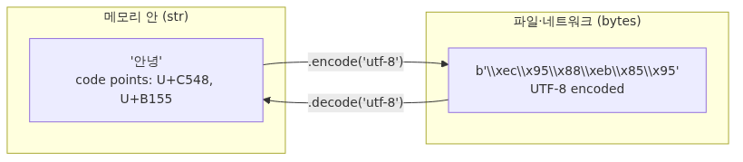

# 문자열과 포매팅


## 이 글에서 다룰 문제

문자열은 거의 모든 프로그램의 입출력입니다. 사용자가 입력한 값, 파일에서 읽은 한 줄, HTTP 응답, 로그 메시지, JSON 필드 — 모두 `str`입니다. 그래서 문자열을 어설프게 다루면 다음과 같은 사고가 흔하게 일어납니다.

- 한국어가 들어 있는 파일을 읽다가 `UnicodeDecodeError`로 멈춥니다.
- 큰 로그를 만드는 동안 `+` 연결을 반복해서 메모리와 시간을 낭비합니다.
- 사용자 입력을 신뢰하고 그대로 SQL에 끼워 넣어 SQL 인젝션을 만듭니다.
- f-string의 format spec을 모른 채 `round`와 `str.zfill`을 짜집기로 씁니다.

문자열을 정확히 다룰 줄 알면 이런 실수를 사전에 막을 수 있고, 코드는 짧고 명료해집니다. 무엇보다 다음 글에서 다룰 list/tuple/dict와 자연스럽게 이어집니다 — 컬렉션 안에 들어가는 값의 상당수가 결국 문자열이기 때문입니다.

## Mental Model

> Python 3에서 `str`은 "Unicode 코드포인트의 불변 시퀀스"이고 `bytes`는 "바이트의 불변 시퀀스"라는 두 층을 분리해 두면, 인코딩·포매팅·정규표현식 어느 자리에서도 같은 도식으로 사고할 수 있습니다.
Python의 `str`은 "코드 포인트의 시퀀스"입니다. 사람이 읽는 글자 단위로 추상화돼 있고, 디스크나 네트워크에 나갈 때만 `bytes`로 인코딩됩니다.



*Mental Model*
핵심 규칙 세 가지를 외워 두면 대부분의 혼란이 사라집니다.

1. **`str`은 Unicode 코드 포인트의 시퀀스입니다.** 인코딩 정보를 갖지 않습니다.
2. **`bytes`는 0~255 정수의 시퀀스입니다.** "어떤 인코딩의 결과물인지"는 코드를 짜는 사람이 기억해야 합니다.
3. **외부 세계와의 경계에서만 `encode`/`decode`합니다.** 메모리 안에서는 `str`로만 다룹니다.


왼쪽 끝과 오른쪽 끝에서만 `bytes`를 만지고, 중앙의 모든 작업은 `str`로 합니다. 이 경계만 잘 지키면 `UnicodeDecodeError`는 입출력 한 곳에서만 발생하므로 추적이 쉬워집니다.

`str`은 또한 **불변(immutable)** 입니다. `s = "hi"; s[0] = "H"`처럼 한 글자만 바꾸려고 하면 `TypeError`가 납니다. 모든 변형 메서드는 새 `str`을 돌려줍니다.

## 핵심 개념

### 1) 문자열 리터럴

Python은 여러 가지 따옴표를 허용합니다. 의미는 모두 같지만, 안에 들어가는 따옴표를 escape하지 않으려고 골라 씁니다.

```python
>>> 'hello'
'hello'
>>> "she said \"hi\""
'she said "hi"'
>>> 'she said "hi"'        # 큰따옴표가 본문에 있으면 작은따옴표로 감싸면 편합니다
'she said "hi"'
>>> """여러 줄
... 문자열도
... 가능합니다"""
'여러 줄\n문자열도\n가능합니다'
```

raw 문자열은 백슬래시를 그대로 유지합니다. Windows 경로나 정규표현식에서 자주 씁니다.

```python
>>> path = r"C:\Users\name\file.txt"
>>> print(path)
C:\Users\name\file.txt
```

`b"..."`는 byte 리터럴입니다. ASCII 문자는 그대로 쓸 수 있고, 그 밖의 바이트 값은 `\xFF` 같은 escape 시퀀스로 표현해야 합니다.

```python
>>> b"hello"
b'hello'
>>> b"안녕"
  File "<stdin>", line 1
SyntaxError: bytes can only contain ASCII literal characters
```

### 2) str과 bytes의 경계

OS와 프로토콜 경계에서 데이터는 결국 바이트입니다. 다만 Python의 많은 텍스트 API(`open(..., "r")`, `requests.Response.text` 등)는 그 바이트를 알아서 `str`로 디코드해 돌려줍니다. 직접 바이트를 다루는 자리에서는 UTF-8을 가정해 `decode`하면 `str`이 됩니다.

```python
>>> data = "안녕".encode("utf-8")
>>> data
b'\xec\x95\x88\xeb\x85\x95'
>>> data.decode("utf-8")
'안녕'
>>> data.decode("ascii")
Traceback (most recent call last):
  ...
UnicodeDecodeError: 'ascii' codec can't decode byte 0xec in position 0: ordinal not in range(128)
```

인코딩을 잘못 추측하면 `UnicodeDecodeError`가 납니다. 모르면 일단 UTF-8로 시도하고, 실패하면 송신자에게 인코딩을 물어봐야 합니다.

### 3) 핵심 메서드

`str`의 메서드는 모두 새 `str`을 돌려줍니다. 원본은 변하지 않습니다.

```python
>>> "  hello, world  ".strip()
'hello, world'
>>> "user@example.com".split("@")
['user', 'example.com']
>>> ", ".join(["a", "b", "c"])
'a, b, c'
>>> "Python".lower()
'python'
>>> "Python".replace("P", "J")
'Jython'
>>> "image.png".endswith(".png")
True
>>> "report.txt".startswith(("draft", "report"))    # tuple도 가능합니다
True
>>> "find me here".find("me")
5
>>> "needle" in "haystack with needle"
True
```

`split`은 인자를 주지 않으면 공백(연속 공백, 탭, 개행 포함)을 기준으로 자릅니다. 일관된 결과가 필요하면 구분자를 명시합니다.

### 4) 슬라이싱과 불변성

`str`은 시퀀스이므로 인덱싱과 슬라이싱이 됩니다.

```python
>>> s = "Python"
>>> s[0], s[-1]
('P', 'n')
>>> s[0:3]
'Pyt'
>>> s[::-1]
'nohtyP'
```

대신 일부분만 바꾸려면 새 문자열을 만들어야 합니다.

```python
>>> s = "hello"
>>> s = "H" + s[1:]
>>> s
'Hello'
```

### 5) f-string과 format spec

f-string(PEP 498)은 인라인 포매팅의 가장 분명한 기본값입니다. 변수와 식을 중괄호 안에 그대로 넣습니다.

```python
>>> name = "yeongseon"
>>> count = 3
>>> f"{name} has {count} books"
'yeongseon has 3 books'
>>> f"{count * 2}"
'6'
```

콜론(`:`) 뒤에는 format spec이 옵니다. 정렬·폭·소수점·진수·날짜를 한 줄로 표현할 수 있습니다.

```python
>>> import math
>>> f"{math.pi:.2f}"           # 소수점 둘째 자리까지
'3.14'
>>> f"{42:>6}"                 # 폭 6, 오른쪽 정렬
'    42'
>>> f"{42:0>6}"                # 폭 6, 왼쪽을 0으로 채움
'000042'
>>> f"{255:#x}"                # 16진수, 0x 접두사
'0xff'
>>> from datetime import date
>>> today = date(2026, 5, 3)
>>> f"{today:%Y-%m-%d}"
'2026-05-03'
```

`!r`은 디버깅에 유용합니다. 값에 `repr()`을 씌워 따옴표가 보이게 합니다.

```python
>>> name = "ada"
>>> f"name={name!r}"
"name='ada'"
```

Python 3.8부터는 `=`을 붙이면 변수 이름과 값을 함께 출력합니다. 디버깅이 한결 쉬워집니다.

```python
>>> count = 3
>>> f"{count=}"
'count=3'
```

### 6) str.format과 % 포매팅

옛 코드에서 자주 보이는 두 가지입니다. 새 코드는 f-string을 우선하지만, 의미는 알아 두는 편이 좋습니다.

```python
>>> "{} has {} books".format("yeongseon", 3)
'yeongseon has 3 books'
>>> "%s has %d books" % ("yeongseon", 3)
'yeongseon has 3 books'
```

`format`은 키워드 인자도 받습니다. 템플릿 문자열을 외부에서 채울 때 유용합니다. f-string은 정의되는 시점에 변수를 잡으므로 템플릿 용도로는 쓰기 어렵습니다.

```python
>>> template = "{name} owes {amount}"
>>> template.format(name="ada", amount=12000)
'ada owes 12000'
```

### 7) 정규표현식 한 줄 맛보기

`re` 모듈은 패턴으로 문자열을 다룹니다. 자세한 문법은 별도의 글이 필요하지만, 이메일을 찾는 정도는 한 줄로 가능합니다.

```python
>>> import re
>>> text = "문의는 ada@example.com 또는 bob@example.org 로 보내 주세요"
>>> re.findall(r"[\w.+-]+@[\w-]+\.[\w.-]+", text)
['ada@example.com', 'bob@example.org']
```

raw 문자열(`r"..."`)을 쓰면 백슬래시를 두 번 쓰지 않아도 되어 가독성이 좋아집니다.

## Before-After

같은 일을 옛날 방식과 f-string 방식으로 비교해 봅니다. f-string은 한눈에 의도가 보이고, 잘못된 변환을 줄여 줍니다.

```python
# Before: %  포매팅 + 수동 zfill
name = "ada"
count = 3
price = 1234.5
line = "%s | %s | %s" % (name.ljust(10), str(count).zfill(3), "%.2f" % price)
print(line)
# 'ada        | 003 | 1234.50'

# After: f-string + format spec
line = f"{name:<10} | {count:0>3} | {price:.2f}"
print(line)
# 'ada        | 003 | 1234.50'
```

또 다른 흔한 비교는 문자열을 합치는 방식입니다. `+` 반복 대신 `join`을 쓰면 의도도 명확하고 빠릅니다.

```python
# Before: + 연결을 반복
parts = ["alpha", "beta", "gamma", "delta"]
out = ""
for p in parts:
    out = out + p + ", "
out = out.rstrip(", ")
print(out)

# After: join 한 줄
print(", ".join(parts))
```

## 단계별 실습

CSV 한 줄을 받아 사람이 읽기 좋은 표 형태로 출력하는 함수를 만들어 봅니다. f-string과 format spec, 그리고 메서드를 두루 씁니다.

1. **입력 파싱.** 콤마로 자른 뒤 양쪽 공백을 제거합니다.

   ```python
   raw = "ada, 30, 1700000.5"
   name, age_str, salary_str = [field.strip() for field in raw.split(",")]
   ```

2. **타입 변환.** 숫자 필드는 명시적으로 캐스팅합니다. 사용자 입력을 신뢰하지 않습니다.

   ```python
   age = int(age_str)
   salary = float(salary_str)
   ```

3. **포매팅.** 폭을 맞추고 천 단위 구분자를 넣습니다.

   ```python
   line = f"{name:<10} | {age:>3}세 | {salary:>12,.2f}원"
   print(line)
   # 'ada        |  30세 | 1,700,000.50원'
   ```

4. **반복 적용.** 여러 줄을 받아 표를 만듭니다.

   ```python
   rows = [
       "ada, 30, 1700000.5",
       "bob, 28, 2300000",
       "charlie, 41, 5400000.25",
   ]
   for raw in rows:
       name, age_str, salary_str = [f.strip() for f in raw.split(",")]
       age = int(age_str)
       salary = float(salary_str)
       print(f"{name:<10} | {age:>3}세 | {salary:>12,.2f}원")
   ```

5. **확장.** salary가 원이 아니라 다른 통화일 수도 있다는 요구가 들어오면, 통화 기호를 변수로 빼고 f-string에 끼워 넣으면 됩니다. 이때 `+`로 잇지 말고 f-string 안에서 직접 보간합니다.

## 이 코드에서 주목할 점

- `[field.strip() for field in raw.split(",")]` — `split` 후 `strip`을 한 줄로 묶었습니다. CSV 한 줄 파싱의 표준 패턴입니다. 양쪽 공백 제거를 잊으면 `"30"`이 아니라 `" 30"`이 들어와 `int()`가 깨집니다.
- `f"{salary:>12,.2f}원"` — format spec 하나로 정렬·천단위·소수점을 모두 표현했습니다. `str.zfill`, `format(x, ',')`, `round`를 따로 조합하지 않습니다.
- 숫자 변환을 명시적으로 분리한 점 — `name`은 `str` 그대로 두고, `age`와 `salary`만 `int`/`float`로 캐스팅했습니다. "입력은 모두 문자열"이라는 사실을 코드가 드러내고 있습니다.
- `r"[\w.+-]+@[\w-]+\.[\w.-]+"` — raw 문자열을 쓰지 않으면 백슬래시를 두 번 적어야 하고, 정규식이 한층 더 읽기 어려워집니다. `re`를 쓸 때 raw는 사실상 기본값입니다.
- `print(f"...{name:<10}...")` — f-string 안에서 폭과 정렬을 직접 표현했습니다. 문자열을 만든 뒤 `print`하지 않고 한 줄에 모은 것이 의도가 더 잘 드러납니다.

## 자주 하는 실수

1. **`str`을 UTF-8 문자열이라고 부른다.**
   `str`은 Unicode 코드 포인트의 시퀀스입니다. UTF-8은 `bytes`로 변환할 때 쓰는 인코딩 중 하나일 뿐입니다.

2. **`bytes`와 `str`을 섞어 쓴다.**
   `b"a" + "b"`는 `TypeError`입니다. 외부에서 받은 `bytes`는 가능한 한 빨리 `decode("utf-8")`하고, 내부에서는 `str`만 다룹니다. 반대로 디스크나 네트워크로 보낼 때는 마지막에 한 번만 `encode`합니다.

3. **`+`로 큰 문자열을 반복해서 연결한다.**
   매번 새 문자열을 만들기 때문에 항이 늘어나면 비효율적입니다. 큰 데이터는 리스트에 모아 두었다가 마지막에 `"".join(...)`으로 합칩니다.

4. **f-string에 사용자 입력을 그대로 넣어 SQL을 만든다.**
   `f"SELECT * FROM users WHERE name = '{name}'"`은 SQL 인젝션의 시작입니다. DB API의 placeholder(`?` 또는 `%s`)를 써야 합니다. 자세한 내용은 데이터베이스 시리즈에서 다룹니다.

5. **`format`과 f-string을 혼동한다.**
   f-string은 정의되는 순간 변수를 캡처합니다. 나중에 채워 넣어야 한다면 `template.format(...)` 또는 `string.Template`을 씁니다.

6. **`split()`과 `split(" ")`의 차이를 모른다.**
   인자 없는 `split()`은 연속 공백을 한 덩어리로 취급하지만, `split(" ")`은 공백 사이의 빈 문자열도 결과에 포함합니다. 사용자 입력을 다룰 때는 인자 없는 `split()`이 보통 더 안전합니다.

## 실무

- **로그 메시지.** `logger.info(f"user={user_id} action={action}")`처럼 f-string으로 키=값 형태를 만들면 grep과 파싱이 모두 쉬워집니다. 단, `logger.info("user=%s", user_id)`처럼 `%s`와 인자를 분리하면 로그 레벨이 꺼졌을 때 포매팅 비용이 들지 않아 더 효율적입니다.
- **파일 경로.** Windows 경로를 다룰 때는 raw 문자열보다 `pathlib.Path("C:/Users/name") / "file.txt"`가 안전합니다. 슬래시 방향을 OS가 알아서 맞춥니다.
- **이메일·URL 검증.** 정규표현식만으로 완벽하게 검증하기는 어렵습니다. 형식만 1차로 거르고, 실제 검증은 인증 코드 메일 발송 같은 외부 신호에 맡깁니다.
- **표 출력.** 줄을 맞춘 콘솔 출력이 자주 필요하면 `tabulate`나 `rich.table`을 쓰는 편이 손맛으로 폭을 계산하는 것보다 안정적입니다.
- **국제화.** 사용자에게 보여주는 문자열은 코드에 박지 말고 `gettext`나 i18n 라이브러리로 분리합니다. f-string에 직접 번역 키를 넣으면 추후 번역 추출이 어려워집니다.

## 체크리스트

- [ ] `str`이 Unicode 시퀀스이고 `bytes`와 다르다는 것을 설명할 수 있다
- [ ] `decode`/`encode`의 방향(외부→내부, 내부→외부)을 헷갈리지 않는다
- [ ] `split`, `join`, `strip`, `replace`, `find`, `startswith`/`endswith`를 구분해서 쓴다
- [ ] f-string으로 `:.2f`, `:>10`, `:%Y-%m-%d`, `!r`, `{var=}`를 자유롭게 쓴다
- [ ] `str`이 불변이라는 의미와, 모든 메서드가 새 문자열을 돌려준다는 점을 안다
- [ ] 큰 문자열은 `+`가 아니라 리스트에 모은 뒤 `join`으로 합친다
- [ ] f-string에 사용자 입력을 끼워 SQL을 만들지 않는다
- [ ] `re.findall`과 raw 문자열을 한 번이라도 직접 써 보았다

## 정리·다음 글

- Python 3의 `str`은 Unicode 코드 포인트의 시퀀스이고, `bytes`는 0~255 정수의 시퀀스입니다.
- 외부 경계에서만 `encode`/`decode`하고, 메모리 안에서는 `str`만 다룹니다.
- `str`은 불변이며, 모든 메서드는 새 `str`을 돌려줍니다.
- f-string과 format spec(`:.2f`, `:>10`, `:%Y-%m-%d`, `!r`, `{var=}`)이면 대부분의 출력 요구를 충족합니다.
- 큰 문자열은 리스트에 모아 `join`으로 한 번에 합칩니다. 사용자 입력은 절대 f-string으로 SQL에 끼워 넣지 않습니다.

다음 글에서는 list, tuple, set, dict 네 가지 컬렉션의 차이와, 언제 어떤 것을 골라야 하는지를 다룹니다. 가변·불변, 순서, 중복, 해시 가능성을 한 장에 정리합니다.

<!-- toc:begin -->
<!-- toc:end -->

## 참고 자료

- Python 공식 문서 — Built-in Types `str`: https://docs.python.org/3/library/stdtypes.html#text-sequence-type-str
- Python 공식 문서 — Format Specification Mini-Language: https://docs.python.org/3/library/string.html#format-specification-mini-language
- PEP 498 — Literal String Interpolation (f-string): https://peps.python.org/pep-0498/
- Python 공식 문서 — `re` 모듈: https://docs.python.org/3/library/re.html
- Unicode HOWTO: https://docs.python.org/3/howto/unicode.html

Tags: strings, f-string, format-spec, unicode, string-methods, bytes-and-str
