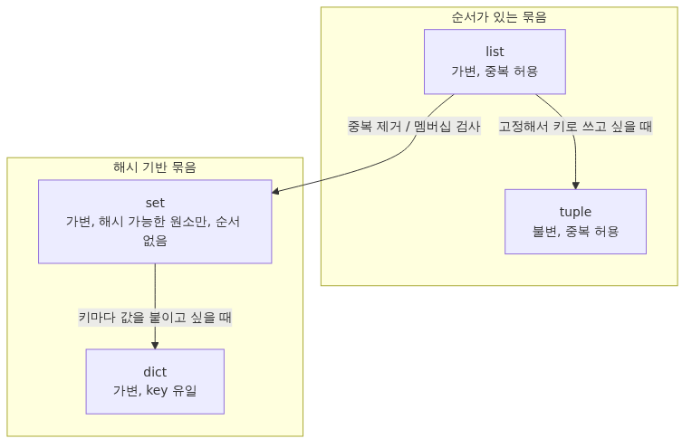

# list, tuple, set, dict

## 이 글에서 배울 것

이 글을 마치면 다음을 직접 설명하고 코딩할 수 있습니다.

- list, tuple, set, dict 네 가지를 가변성·순서·중복·해시 가능성으로 구분하는 기준
- 어떤 자료구조를 언제 골라야 하는지에 대한 1차 결정 기준
- 슬라이싱, `append`/`extend`, `pop`, `update` 같은 핵심 메서드
- list comprehension과 dict/set comprehension으로 한 줄에 데이터를 변형하는 법
- "해시 가능(hashable)"의 의미와 dict 키·set 원소가 되는 조건
- 얕은 복사와 깊은 복사를 구분하지 못해 일어나는 alias 사고
- mutable 기본 인자(default argument)의 함정과 회피 방법
- `dict.get`, `setdefault`, `collections.defaultdict`로 누락 키를 안전하게 다루는 법

`>>>`가 붙은 블록은 REPL에서 그대로 따라 입력할 수 있는 예시입니다. `>>>`가 없는 블록은 설명용 발췌이며, 변수가 미리 정의돼 있다고 가정합니다.

## 이 글에서 답할 질문

- list, tuple, set, dict 네 자료구조를 가변성·순서·중복·해시 가능성으로 어떻게 구분하는가?
- 어떤 자료구조를 골라야 할지 결정할 때 가장 먼저 던져야 할 질문은 무엇인가?
- "해시 가능(hashable)"이라는 조건은 dict 키와 set 원소에 어떤 제약을 주는가?
- 얕은 복사와 깊은 복사를 혼동해서 생기는 alias 사고는 어떤 모습으로 나타나는가?
- mutable 기본 인자가 만드는 함정은 어떤 코드에서 터지며 어떻게 우회하는가?
- 누락 키를 안전하게 다루는 `dict.get`, `setdefault`, `defaultdict`는 각각 언제 더 자연스러운가?

## 왜 중요한가

자료구조 선택은 코드의 성능과 의미를 동시에 결정합니다. list로 충분한 자리에 dict를 쓰면 코드가 무거워지고, set으로 처리할 일을 list로 처리하면 한 번의 멤버십 검사가 O(n)이 되어 데이터가 커질수록 느려집니다. 반대로 tuple로 표현해야 할 "변하지 않는 한 묶음"을 list로 두면, 누군가 실수로 원소를 바꿔도 타입 시스템이 막아 주지 않습니다.

실제 현장에서 자주 마주치는 사고는 다음과 같습니다.

- list를 `=`으로 "복사"한 뒤 한쪽을 바꿨는데 양쪽이 함께 바뀌는 alias 사고
- 함수의 기본 인자로 `def f(items=[]):`를 썼다가, 호출이 누적될수록 리스트가 자라는 문제
- dict에서 없는 키를 `d[key]`로 꺼내다가 `KeyError`로 멈추는 일
- set에 dict이나 list를 넣으려다가 `TypeError: unhashable type`을 만나는 일

이 글은 네 자료구조의 차이를 한 장에 정리해, 다음 글의 제어 흐름과 함수에서 자료구조를 의식적으로 고르도록 돕습니다.

## Mental Model

> 네 자료구조는 "가변성, 순서, 중복 허용, 해시 가능성"이라는 네 축의 조합으로 구분되며, 자료구조를 고른다는 것은 이 네 축에서 어떤 보장을 받고 어떤 보장을 포기할지를 결정하는 일입니다.
네 자료구조를 가변성·순서·해시 가능성으로 묶으면 머릿속에 잘 박힙니다.


세 가지 핵심 규칙입니다.

1. **가변(list, dict, set)** 은 만든 뒤에 내용을 바꿀 수 있고, **불변(tuple, str, int)** 은 바꿀 수 없습니다.
2. **dict의 키와 set의 원소는 hashable해야** 합니다. tuple은 안에 들어 있는 값이 모두 hashable이면 자기도 hashable입니다.
3. **dict와 set은 평균 O(1)** 으로 키 검색이 끝나지만, list는 O(n)입니다. "이 값이 있나?"를 자주 묻는 자료라면 set이나 dict를 씁니다.

## 핵심 개념

### 1) list — 순서가 있고 가변

```python
>>> nums = [3, 1, 4, 1, 5]
>>> nums.append(9)
>>> nums
[3, 1, 4, 1, 5, 9]
>>> nums[0]
3
>>> nums[-1]
9
>>> nums[1:4]
[1, 4, 1]
>>> sorted(nums)
[1, 1, 3, 4, 5, 9]
>>> nums.sort()      # 제자리 정렬, None 반환
>>> nums
[1, 1, 3, 4, 5, 9]
```

`sorted(nums)`는 **새 리스트**를 돌려주고, `nums.sort()`는 **제자리에서 정렬**합니다. `nums.sort()`의 반환값은 `None`이라는 점이 자주 잊힙니다.

`append`와 `extend`도 헷갈리기 쉽습니다.

```python
>>> a = [1, 2]
>>> a.append([3, 4])
>>> a
[1, 2, [3, 4]]            # 리스트가 통째로 들어감
>>> a = [1, 2]
>>> a.extend([3, 4])
>>> a
[1, 2, 3, 4]              # 원소를 하나씩 추가
```

### 2) tuple — 순서가 있고 불변

```python
>>> point = (3, 4)
>>> x, y = point          # 언패킹
>>> x, y
(3, 4)
>>> point[0] = 10
Traceback (most recent call last):
  ...
TypeError: 'tuple' object does not support item assignment
```

tuple은 "묶음의 정체성"을 표현할 때 좋습니다. 좌표 `(x, y)`, RGB 값 `(255, 0, 0)`, 데이터베이스의 한 행 같은 것입니다. 의미를 더 분명히 하려면 `collections.namedtuple`이나 `dataclasses.dataclass(frozen=True)`로 이름 붙은 튜플을 만들 수도 있습니다.

요소가 하나인 튜플은 콤마가 필수입니다. `(1)`은 그냥 정수입니다.

```python
>>> type((1))
<class 'int'>
>>> type((1,))
<class 'tuple'>
```

### 3) set — 순서 없음, 중복 없음

set은 멤버십 검사와 중복 제거에 강합니다.

```python
>>> seen = {1, 2, 3}
>>> seen.add(2)             # 이미 있으므로 무시
>>> seen
{1, 2, 3}
>>> 2 in seen
True
>>> {1, 2, 3} & {2, 3, 4}   # 교집합
{2, 3}
>>> {1, 2, 3} | {2, 3, 4}   # 합집합
{1, 2, 3, 4}
>>> {1, 2, 3} - {2}         # 차집합
{1, 3}
```

빈 set은 `set()`이지 `{}`이 아닙니다. `{}`은 빈 dict입니다.

```python
>>> type({})
<class 'dict'>
>>> type(set())
<class 'set'>
```

set의 반복 순서는 보장되지 않습니다. 출력을 비교하는 테스트라면 `sorted(seen)`처럼 정렬한 뒤 비교해야 합니다.

### 4) dict — 키→값 매핑, 가변, 키 유일

dict는 가장 자주 쓰는 자료구조입니다. Python 3.7부터 삽입 순서를 보존합니다.

```python
>>> user = {"name": "ada", "age": 30}
>>> user["name"]
'ada'
>>> user["email"] = "ada@example.com"
>>> user
{'name': 'ada', 'age': 30, 'email': 'ada@example.com'}
>>> "age" in user
True
>>> user.get("phone")          # 없으면 None
>>> user.get("phone", "N/A")
'N/A'
>>> list(user.keys())
['name', 'age', 'email']
>>> list(user.items())
[('name', 'ada'), ('age', 30), ('email', 'ada@example.com')]
```

없는 키를 `d[key]`로 꺼내면 `KeyError`가 납니다. "있을 수도, 없을 수도 있다"면 `get`을 씁니다.

### 5) hashable의 의미

dict의 키와 set의 원소는 **hashable**해야 합니다. 즉 한 번 만들어진 뒤 값이 변하지 않고, `__hash__`가 정의돼 있어야 합니다.

- hashable: `int`, `float`, `str`, `bool`, `bytes`, 모든 원소가 hashable인 `tuple`
- not hashable: `list`, `set`, `dict` (가변이라 hash 결과가 도중에 바뀔 수 있어서)

```python
>>> {(1, 2), (3, 4)}                    # tuple은 hashable
{(1, 2), (3, 4)}
>>> {[1, 2], [3, 4]}
Traceback (most recent call last):
  ...
TypeError: unhashable type: 'list'
```

set 안에 set을 넣고 싶다면 `frozenset`을 씁니다.

### 6) Comprehension — 한 줄로 변형

list, set, dict 모두 comprehension 문법을 갖고 있습니다.

```python
>>> [n * n for n in range(5)]
[0, 1, 4, 9, 16]
>>> [n for n in range(10) if n % 2 == 0]
[0, 2, 4, 6, 8]
>>> {word.lower() for word in ["Python", "PYTHON", "python"]}
{'python'}
>>> {n: n * n for n in range(4)}
{0: 0, 1: 1, 2: 4, 3: 9}
```

comprehension은 짧지만, 조건이 두 개 이상으로 늘어나거나 중첩이 깊어지면 가독성이 떨어집니다. 그럴 때는 일반 `for` 루프로 풀어쓰는 편이 낫습니다.

## Before-After

같은 일을 어색한 방식과 자료구조를 잘 고른 방식으로 비교해 봅니다.

```python
# Before: list로 멤버십 검사 (O(n))
seen = []
duplicates = []
for x in stream:
    if x in seen:                # 매번 list 전체를 훑음
        duplicates.append(x)
    else:
        seen.append(x)

# After: set으로 멤버십 검사 (O(1) 평균)
seen = set()
duplicates = []
for x in stream:
    if x in seen:
        duplicates.append(x)
    else:
        seen.add(x)
```

dict의 누락 키 처리도 줄일 수 있습니다.

```python
# Before: 매번 키 존재 검사
counts = {}
for word in words:
    if word in counts:
        counts[word] = counts[word] + 1
    else:
        counts[word] = 1

# After: dict.get 또는 defaultdict
counts = {}
for word in words:
    counts[word] = counts.get(word, 0) + 1

# After (더 짧게): collections.Counter
from collections import Counter
counts = Counter(words)
```

## 단계별 실습

로그 줄 리스트에서 IP 주소별 접근 횟수와 첫 접근 시간을 모아 봅니다. dict, set, tuple, comprehension을 모두 씁니다.

1. **샘플 데이터 준비.**

   ```python
   logs = [
       ("10.0.0.1", "2026-05-03 09:00:01"),
       ("10.0.0.2", "2026-05-03 09:00:02"),
       ("10.0.0.1", "2026-05-03 09:00:05"),
       ("10.0.0.3", "2026-05-03 09:00:07"),
       ("10.0.0.2", "2026-05-03 09:00:10"),
   ]
   ```

2. **유일 IP 추출.** set comprehension으로 한 줄에 끝납니다.

   ```python
   unique_ips = {ip for ip, _ in logs}
   # {'10.0.0.1', '10.0.0.2', '10.0.0.3'}
   ```

3. **IP별 접근 횟수.** `dict.get`을 활용합니다.

   ```python
   counts = {}
   for ip, _ in logs:
       counts[ip] = counts.get(ip, 0) + 1
   # {'10.0.0.1': 2, '10.0.0.2': 2, '10.0.0.3': 1}
   ```

4. **IP별 첫 접근 시간.** `dict.setdefault`로 한 번에 처리합니다.

   ```python
   first_seen = {}
   for ip, ts in logs:
       first_seen.setdefault(ip, ts)
   # {'10.0.0.1': '2026-05-03 09:00:01', '10.0.0.2': '...', '10.0.0.3': '...'}
   ```

5. **결과 정렬.** dict는 정렬을 직접 하지 않으므로 `sorted`로 새 리스트를 만듭니다.

   ```python
   ranked = sorted(counts.items(), key=lambda kv: kv[1], reverse=True)
   # [('10.0.0.1', 2), ('10.0.0.2', 2), ('10.0.0.3', 1)]
   ```

`Counter`를 알고 있다면 2번과 3번은 한 줄로 줄어듭니다. 다음 글의 함수와 합쳐 재사용 가능한 형태로 빼면 더 깔끔해집니다.

## 자주 하는 실수

1. **`b = a`로 list를 "복사"한다.**
   `b = a`는 같은 객체에 이름표를 하나 더 붙일 뿐입니다. 한쪽을 바꾸면 양쪽이 바뀝니다. 얕은 복사가 필요하면 `b = a[:]`이나 `b = list(a)`, 중첩까지 복사하려면 `copy.deepcopy(a)`를 씁니다.

2. **mutable 기본 인자.**
   `def f(items=[]):`는 함수 정의 시점에 리스트를 한 번 만들고, 호출 사이에 그 리스트를 공유합니다. 호출이 누적될수록 리스트가 자랍니다. 기본값이 빈 리스트여야 한다면 `def f(items=None): items = items if items is not None else []`로 작성합니다.

3. **dict의 없는 키를 `d[key]`로 꺼낸다.**
   `KeyError`가 발생합니다. "있을 수도, 없을 수도"라면 `d.get(key)` 또는 `d.get(key, default)`를 씁니다. "없으면 만들어라"는 패턴은 `setdefault`나 `defaultdict`가 어울립니다.

4. **set의 순서를 신뢰한다.**
   set은 순서를 보장하지 않습니다. 출력 순서를 비교하는 테스트라면 `sorted(...)`로 정렬한 뒤 비교합니다. dict는 3.7부터 삽입 순서를 보장하지만, 그 보장을 set으로 끌어들이지 않습니다.

5. **list를 set이나 dict 키로 쓰려고 한다.**
   `TypeError: unhashable type: 'list'`을 만납니다. 키로 써야 하면 `tuple(seq)`으로 변환합니다.

6. **`dict.keys()`, `dict.values()`를 list로 가정한다.**
   둘 다 view 객체입니다. dict가 바뀌면 view도 같이 바뀝니다. 고정된 스냅샷이 필요하면 `list(d.keys())`처럼 명시적으로 변환합니다.

## 실무

- **카운팅·그루핑.** `Counter`, `defaultdict(list)`는 직접 짜는 dict 누락 키 패턴을 줄여 줍니다. 본인이 짠 코드에 `if key not in d: d[key] = []`이 반복된다면 `defaultdict`로 바꿉니다.
- **순서 있는 dict.** Python 3.7+에서는 dict 자체가 삽입 순서를 보존합니다. `OrderedDict`는 끝에서 꺼내거나 다시 정렬하는 등의 dict에는 없는 기능을 위한 용도로 남겨 둡니다.
- **불변 묶음.** 함수 사이로 전달되는 "이 묶음은 바꾸지 마세요" 신호는 tuple, `frozenset`, `dataclass(frozen=True)`로 표현합니다. 타입만 보고도 의도가 드러납니다.
- **JSON 직렬화.** `json.dumps`는 set을 직접 직렬화하지 못합니다. 보내기 직전에 `list(my_set)`이나 `sorted(my_set)`으로 변환합니다.
- **대량 멤버십 검사.** "10만 개의 차단 사용자 ID"가 list라면 검사마다 O(n)입니다. set으로 한 번 변환해 두고 검사를 반복합니다.

## 체크리스트

- [ ] list, tuple, set, dict의 가변성·순서·중복·해시 가능성을 표로 그릴 수 있다
- [ ] `=`로는 list가 복사되지 않는다는 사실을 안다
- [ ] mutable 기본 인자의 함정과 회피 패턴을 안다
- [ ] `dict.get`, `setdefault`, `defaultdict`, `Counter`를 적절히 골라 쓸 수 있다
- [ ] hashable이라는 단어를 한 줄로 설명할 수 있다
- [ ] list/set/dict comprehension을 한 번씩 짜 봤다
- [ ] set의 순서가 보장되지 않는다는 점을 잊지 않는다
- [ ] tuple과 namedtuple/dataclass(frozen=True)가 어떤 자리에 어울리는지 안다

## 연습 문제

1. **단어 빈도수**
   문자열 한 묶음을 받아 단어별 등장 횟수를 dict로 돌려주는 함수 `word_counts(text: str) -> dict[str, int]`를 작성하세요. 대소문자는 합치고, 구두점은 제거합니다.
   - 성공 기준: `word_counts("Python is great. PYTHON is fun.")`이 `{'python': 2, 'is': 2, 'great': 1, 'fun': 1}`을 돌려줍니다 (키 순서는 자유).

2. **중복 제거하면서 순서 유지**
   리스트를 받아 중복을 제거하되 첫 등장 순서를 보존하는 함수 `unique_in_order(items: list) -> list`를 작성하세요. set 하나로 멤버십을 추적합니다.
   - 성공 기준: `unique_in_order([3, 1, 3, 2, 1, 4])`가 `[3, 1, 2, 4]`을 돌려줍니다.

3. **그룹화**
   `[("ada", "engineer"), ("bob", "designer"), ("charlie", "engineer")]` 같은 (이름, 직무) 리스트를 받아, 직무별 이름 리스트를 dict로 돌려주는 `group_by_role(rows)`을 작성하세요. `defaultdict(list)`를 쓰세요.
   - 성공 기준: 위 입력에서 `{'engineer': ['ada', 'charlie'], 'designer': ['bob']}`이 나옵니다.

## 정리·다음 글

- list/tuple은 순서 있는 묶음, set은 해시 기반의 유일 원소 모음, dict는 키→값 매핑입니다.
- 가변(list, set, dict)과 불변(tuple)을 의식적으로 골라야 의도가 분명해집니다.
- dict 키와 set 원소는 hashable해야 하며, list는 hashable이 아닙니다.
- `b = a`는 복사가 아니라 alias입니다. 복사가 필요하면 `list(a)` 또는 `copy.deepcopy(a)`를 씁니다.
- 누락 키 처리는 `dict.get`, `setdefault`, `defaultdict`, `Counter`로 짧게 마무리합니다.

다음 글에서는 제어 흐름을 다룹니다. `if`/`for`/`while`을 정리하고, comprehension과 `enumerate`/`zip`/`range`를 함께 이어 읽기 좋은 루프를 짜는 법을 짚습니다.

<!-- toc:begin -->
<!-- toc:end -->

## 참고 자료

- Python 공식 문서 — Built-in Types: https://docs.python.org/3/library/stdtypes.html
- Python 공식 문서 — `collections` 모듈: https://docs.python.org/3/library/collections.html
- Python 공식 문서 — Data Structures 튜토리얼: https://docs.python.org/3/tutorial/datastructures.html
- PEP 274 — Dict Comprehensions: https://peps.python.org/pep-0274/
- TimeComplexity (CPython 자료구조 시간 복잡도): https://wiki.python.org/moin/TimeComplexity

Tags: list-and-tuple, dict, set, mutability, comprehensions, hashable
