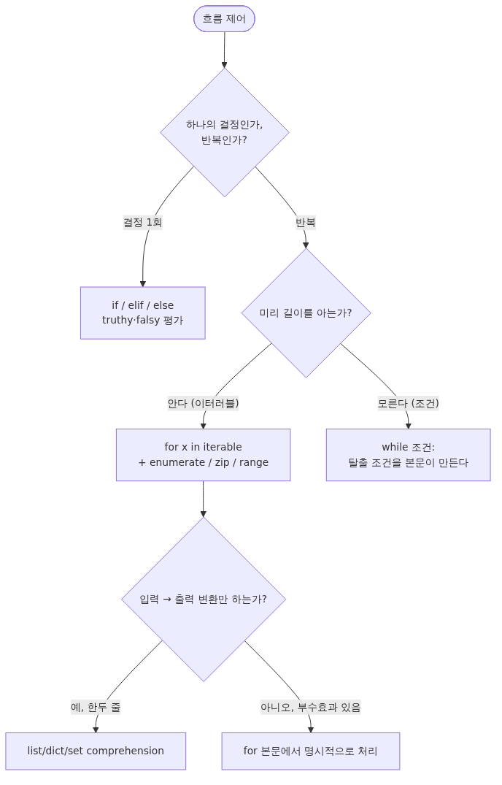

# 제어 흐름: if, for, while, comprehension

## 이 글에서 배울 것

이 글을 마치면 다음을 직접 설명하고 코딩할 수 있습니다.

- `if`/`elif`/`else`로 분기를 짤 때 truthy·falsy를 의식적으로 다루는 법
- `for`와 `while` 중 어떤 루프를 골라야 하는지에 대한 1차 결정 기준
- `range`, `enumerate`, `zip`을 조합해 가독성 좋은 루프를 만드는 방법
- list/dict/set comprehension을 언제 쓰고 언제 일반 루프로 돌아가야 하는지
- `break`, `continue`, `else` 절, 그리고 `for ... else`의 미묘한 동작
- 흔히 빠지는 함정 — mutable 시퀀스를 순회 중 수정하기, 깊게 중첩된 comprehension, off-by-one — 을 피하는 패턴

## 이 글에서 답할 질문

- `if`/`elif`/`else`에서 truthy·falsy를 의식적으로 다룬다는 것은 구체적으로 어떤 코딩 습관을 의미하는가?
- `for`와 `while` 중 어느 쪽을 골라야 할지 결정하는 1차 기준은 무엇인가?
- `range`, `enumerate`, `zip`은 각각 어떤 루프 패턴을 가독성 있게 만들어 주는가?
- list/dict/set comprehension은 언제 좋고 언제 일반 루프로 돌아가는 게 더 나은가?
- `for ... else` 절은 정확히 언제 실행되며 어떤 의도를 표현하는가?
- mutable 시퀀스를 순회 중 수정하면 왜 위험하며 어떻게 피하는가?

## 왜 중요한가

분기와 루프는 애플리케이션 코드에서 큰 비중을 차지합니다. 그래서 이 부분이 어수선하면 나머지도 읽기 어려워집니다. Python은 다른 언어에 비해 분기·루프 문법이 단출한 대신, `for`-`else`나 comprehension처럼 처음 보면 낯선 도구가 몇 개 있습니다. 이 도구를 미리 정리해 두면 if 사다리를 길게 쓰지 않아도 되고, 일반 루프와 comprehension을 의도적으로 갈아탈 수 있습니다.

또 한 가지, Python의 분기는 "값이 참인가"가 아니라 "값이 truthy인가"로 평가됩니다. `0`, `0.0`, `""`, `[]`, `{}`, `None`은 모두 falsy입니다. 이 규칙을 알면 짧고 분명한 조건을 쓸 수 있지만, 모르고 쓰면 "리스트를 받아 비어 있는지 확인하려 했는데 의도와 다르게 동작"하는 일이 생깁니다. 이 글에서 truthy·falsy를 한 번 분명히 정리합니다.

이 글은 다음 글의 함수와 인자 설계를 위해서도 필요합니다. 함수 본문은 결국 분기와 루프이고, 인자가 어떤 타입이냐에 따라 어떤 루프가 자연스러운지 달라집니다.

## Mental Model

> 제어 흐름을 짤 때는 "이 분기·반복이 무엇을 결정하느냐"를 truthy/falsy 한 단계와 종료 조건 한 단계로 분리해 두면, 컴프리헨션과 일반 루프 사이의 선택도 같은 잣대로 답이 나옵니다.
분기와 루프를 아래와 같이 한 장에 펼쳐 두면 코드를 읽을 때 다음 단계가 무엇인지 머릿속에 빠르게 떠오릅니다.



*Mental Model*
세 가지 핵심 규칙입니다.

1. **결정이 1회면 `if`, 같은 일을 반복하면 루프**입니다. `for`와 `while`은 같은 일을 반복하기 위한 두 가지 도구이며, 선택 기준은 "이미 순회할 대상이 있는가"입니다.
2. **순회할 대상(이터러블)이 있으면 `for`**가 자연스럽습니다. 길이가 없거나 조건이 만족될 때까지 돌아야 한다면 `while`을 씁니다. 이 경계가 흐려지면 무한 루프와 off-by-one이 늘어납니다.
3. **comprehension은 "입력 이터러블을 새 컬렉션으로 변환"하는 한정된 목적**의 표현식입니다. 부수효과(파일 쓰기, print, 외부 상태 변경)가 끼어드는 순간 일반 `for` 본문이 더 읽기 좋습니다.

이 규칙은 이후 모든 절의 기준이 됩니다.

## 핵심 개념

### 1. truthy와 falsy

Python의 `if`는 조건을 `bool()`로 한 번 감싸 평가한다고 생각하면 됩니다. 다음 값들은 모두 falsy입니다.

- `False`, `None`
- 숫자형의 0: `0`, `0.0`, `0j`, `Decimal(0)`, `Fraction(0)`
- 빈 시퀀스/컬렉션: `""`, `b""`, `()`, `[]`, `{}`, `set()`, `range(0)`

그 외는 모두 truthy입니다. 이 규칙 덕분에 빈 리스트인지 검사할 때 `if not items:`처럼 짧게 쓸 수 있습니다. 다만 "값이 0이어도 처리해야 하는 경우"에는 truthy 검사로는 부족합니다. 예를 들어 사용자가 명시적으로 `0`을 입력했는지 확인하려면 `if value is None:` 또는 `if value == 0:`처럼 의도를 분명히 적습니다.

### 2. `if` / `elif` / `else`

분기 사다리는 짧을수록 읽기 쉽습니다. 같은 변수에 대해 가지를 늘리는 패턴이 반복된다면 dict 매핑이나 함수 디스패치로 평탄화할지 한 번 점검합니다.

```python
def label(score: int) -> str:
    if score >= 90:
        return "A"
    elif score >= 80:
        return "B"
    elif score >= 70:
        return "C"
    else:
        return "F"
```

`elif`는 "위 조건이 모두 거짓일 때만" 평가됩니다. 그래서 위에서 아래로 읽었을 때 조건이 점점 좁아지도록 정렬하는 편이 안전합니다.

### 3. `for`와 이터러블

`for`는 "이터러블을 한 번씩 꺼내 변수에 묶고 본문을 실행"합니다. 따라서 `range`, `list`, `tuple`, `set`, `dict`, 파일 객체, 제너레이터처럼 한 원소씩 내놓을 수 있는 모든 것이 대상이 됩니다.

```python
for item in ["ada", "bob", "carol"]:
    print(item)

for i in range(3):
    print(i)

for ch in "hi":
    print(ch)
```

`enumerate`, `zip`, `range`는 `for`의 표현력을 크게 끌어올립니다.

```python
names = ["ada", "bob", "carol"]
roles = ["engineer", "designer", "engineer"]

for idx, name in enumerate(names, start=1):
    print(idx, name)

for name, role in zip(names, roles):
    print(name, "->", role)
```

`enumerate`는 인덱스가 필요한 경우, `zip`은 두 개 이상의 시퀀스를 짝지어 돌고 싶은 경우에 씁니다. `zip`은 가장 짧은 시퀀스에 맞춰 멈춥니다. 길이가 다른 입력을 잡고 싶다면 `zip(..., strict=True)`를 사용해 의도를 명시합니다.

### 4. `while`과 탈출 조건

`while`은 "조건이 truthy인 동안 본문을 반복"합니다. 본문이 조건에 영향을 주는 어떤 변화를 만들지 못하면 무한 루프가 됩니다.

```python
remaining = 5
while remaining > 0:
    print("tick", remaining)
    remaining -= 1
```

명시적 종료 시점이 없는 작업, 예를 들어 사용자 입력을 받거나, 외부 큐에서 메시지를 빼오는 루프는 `while True` + `break` 조합이 더 읽기 좋습니다.

```python
while True:
    line = input("> ").strip()
    if line in {"quit", "exit"}:
        break
    print("echo:", line)
```

### 5. `break`, `continue`, 그리고 `for`-`else`

- `break`은 가장 안쪽 루프를 즉시 끝냅니다.
- `continue`는 본문의 나머지를 건너뛰고 다음 반복으로 넘어갑니다.
- 루프에 붙은 `else`는 "루프가 `break` 없이 끝났을 때만" 실행됩니다. 검색 패턴에서 가끔 유용하지만 가독성을 해친다면 `found = False` 플래그가 더 분명합니다.

```python
for n in [4, 6, 8, 9]:
    if n % 2 == 1:
        print("found odd:", n)
        break
else:
    print("no odd found")
```

### 6. comprehension

list/dict/set comprehension은 "입력 이터러블을 한 번에 새 컬렉션으로 변환"하는 표현식입니다.

```python
squares = [x * x for x in range(5)]
positives = [x for x in [-1, 2, -3, 4] if x > 0]
by_role = {name: role for name, role in zip(names, roles)}
unique_words = {w.lower() for w in "Hello hello world".split()}
```

조건도 붙일 수 있고, 두 단계로 중첩할 수도 있습니다. 다만 두 단계까지가 한계입니다. 그 이상이면 일반 `for`로 풀어 쓰는 편이 사람과 도구 모두에게 친절합니다.

generator expression(`(x * x for x in range(5))`)은 같은 문법을 메모리에 한꺼번에 들이지 않고 평가합니다. 큰 입력을 한 번에 합산하거나(`sum(x * x for x in range(10**6))`) 다음 한 개만 필요한 상황에 적합합니다.

## Before-After

같은 작업을 "장황한 루프" → "Pythonic 루프"로 다시 써 봅니다. 입력은 학생 점수 리스트와 이름 리스트입니다.

**Before — C 스타일 루프**

```python
names = ["ada", "bob", "carol", "dan"]
scores = [92, 71, 85, 58]

i = 0
result = []
while i < len(names):
    name = names[i]
    score = scores[i]
    if score >= 60:
        result.append(name + ":" + str(score))
    i += 1
print(result)
```

읽을 때 (a) 인덱스를 직접 굴리고, (b) 같은 인덱스를 두 번 사용해 양쪽 리스트를 따라가고, (c) 조건을 본문 안에서 다루고, (d) 누적 리스트를 별도 변수로 만든다는 네 단계를 각각 따라가야 합니다.

**After — `zip` + comprehension**

```python
names = ["ada", "bob", "carol", "dan"]
scores = [92, 71, 85, 58]

result = [f"{name}:{score}" for name, score in zip(names, scores) if score >= 60]
print(result)
```

같은 동작이지만 "두 시퀀스를 짝지어 돌면서, 60점 이상인 이름·점수를 모은다"는 의도가 한 줄로 보입니다. 인덱스가 사라졌고, 누적 리스트가 별도 변수일 필요도 없어졌습니다.

다만 만약 "60점 미만일 때 로그를 남기고, 60점 이상일 때 결과에 모은다"처럼 부수효과가 끼어들면 일반 `for`로 돌아갑니다.

```python
result = []
for name, score in zip(names, scores):
    if score < 60:
        log_low(name, score)
        continue
    result.append(f"{name}:{score}")
```

이 두 형태를 자유롭게 오갈 수 있다면 분기·루프 코드를 훨씬 더 읽기 쉬게 정리할 수 있습니다.

## 단계별 실습

REPL 또는 짧은 스크립트에서 차례대로 실행해 봅니다. 아래 `>>>`가 붙은 줄은 REPL 입력, 그 아래 줄은 출력입니다.

1. **truthy·falsy를 직접 확인합니다.**

```python
>>> for v in [0, 1, "", "x", [], [0], None, {"a": 1}]:
...     print(repr(v), bool(v))
0 False
1 True
'' False
'x' True
[] False
[0] True
None False
{'a': 1} True
```

`[0]`은 길이가 1이라서 truthy임을 확인합니다. "원소가 0이라도 컨테이너가 비어 있지 않으면 truthy"라는 점이 핵심입니다.

2. **`enumerate`와 `zip`을 결합합니다.**

```python
>>> names = ["ada", "bob", "carol"]
>>> roles = ["engineer", "designer", "engineer"]
>>> for idx, (name, role) in enumerate(zip(names, roles), start=1):
...     print(idx, name, "->", role)
1 ada -> engineer
2 bob -> designer
3 carol -> engineer
```

`enumerate(zip(...))` 패턴은 "두 시퀀스를 짝지으면서 1부터 번호를 붙이고 싶을 때" 자주 등장합니다.

3. **`for`-`else`로 검색 결과를 분기합니다.**

```python
>>> def find_first_negative(nums):
...     for n in nums:
...         if n < 0:
...             return n
...     return None
>>> find_first_negative([1, 2, 3])
>>> find_first_negative([1, -2, 3])
-2
```

같은 일을 `for`-`else`로 쓰면 다음과 같습니다. 둘 중 어느 쪽이 더 읽기 쉬운지 판단해 봅니다.

```python
>>> def find_first_negative_v2(nums):
...     for n in nums:
...         if n < 0:
...             return n
...     else:
...         return None
```

이 경우는 함수의 마지막 `return None`이 자연스럽기 때문에 `for`-`else`가 큰 이득을 주지 않습니다. 검색 후에 "찾지 못했다"는 것을 한 번에 처리해야 할 때만 쓰면 충분합니다.

4. **comprehension과 일반 루프 사이를 옮겨 다닙니다.**

```python
>>> nums = list(range(10))
>>> [x * x for x in nums if x % 2 == 0]
[0, 4, 16, 36, 64]
>>> {x: x * x for x in nums if x % 2 == 0}
{0: 0, 2: 4, 4: 16, 6: 36, 8: 64}
>>> sum(x * x for x in nums if x % 2 == 0)  # generator expression
120
```

세 형태가 모두 같은 "짝수 제곱"을 만들지만 결과 컨테이너는 list, dict, 그리고 단일 합계로 다릅니다.

## 자주 하는 실수

1. **순회 중인 리스트를 수정합니다.**
   `for item in items: ...` 본문에서 `items.remove(...)`나 `items.append(...)`를 호출하면 인덱스가 어긋나 원소를 건너뛰거나 무한 루프에 빠집니다. 새로운 리스트로 모으거나(`items = [x for x in items if cond(x)]`) 사본을 순회(`for item in items[:]`)합니다.

2. **`while True` 안에서 종료 조건을 잊습니다.**
   탈출 조건이 본문 어딘가에서 반드시 truthy로 바뀌도록 만들어야 합니다. 외부 신호(`KeyboardInterrupt`, 큐 메시지)에 의존한다면 `try/except`나 `break`을 명시적으로 둡니다.

3. **falsy 검사로 "값이 0인지"를 본다.**
   `if value:`는 `value`가 `0`, `""`, `[]`이면 모두 거짓입니다. "값이 명시적으로 주어지지 않은 경우"를 가리키고 싶다면 `if value is None:`을 씁니다. 두 검사는 의미가 다릅니다.

4. **comprehension에 부수효과를 넣습니다.**
   `[print(x) for x in nums]`는 list를 만들면서 그 안에 `None`을 채워 넣는 어색한 코드가 됩니다. `for` 본문에서 `print`를 호출하는 편이 의도가 분명합니다.

5. **`zip`이 짧은 쪽에 맞춰 끝나는 것을 잊습니다.**
   길이가 다른 두 시퀀스를 `zip`으로 묶으면 짧은 쪽 길이만큼만 결과가 나옵니다. 그게 의도가 아니라면 `zip(a, b, strict=True)`로 길이가 다를 때 즉시 `ValueError`를 일으키게 합니다.

6. **`==`와 `is`를 혼동합니다.**
   `is`는 두 변수가 같은 객체를 가리키는지 검사합니다. 값을 비교하고 싶다면 `==`을 씁니다. `is`는 `None`, `True`, `False`처럼 싱글턴을 비교할 때만 자연스럽습니다.

## 실무

실무에서는 한 번에 여러 단계를 도는 루프, 입력이 길거나 끝이 정해지지 않은 루프가 자주 등장합니다. 두 가지 패턴을 짚어 둡니다.

**(1) 큰 파일을 줄 단위로 처리합니다.**

```python
total = 0
with open("access.log", encoding="utf-8") as f:
    for line in f:
        if line.startswith("GET "):
            total += 1
print(total)
```

파일 객체는 한 줄씩 내놓는 이터러블이라서 `for line in f:` 한 줄로 충분합니다. `f.readlines()`처럼 한 번에 전부 읽으면 큰 파일에서 메모리 낭비가 큽니다.

**(2) 외부 호출 결과를 모읍니다.**

```python
def fetch_users(ids):
    results = {}
    for user_id in ids:
        try:
            user = api.get_user(user_id)
        except NotFound:
            continue
        results[user_id] = user
    return results
```

루프 안에서 `try/except`로 한 호출만 격리하면 한 사용자가 실패해도 나머지가 계속 진행됩니다. 이때는 comprehension보다 `for`가 적합합니다.

이 두 패턴은 다음 글의 함수 인자 설계, 그 다음 글의 파일 I/O와 예외 처리에서 다시 활용됩니다.

## 체크리스트

- [ ] `if value:`와 `if value is None:`의 차이를 한 줄로 설명할 수 있다.
- [ ] `for`와 `while` 중 어느 쪽을 쓸지 "이터러블이 있는가"로 판단할 수 있다.
- [ ] `enumerate`, `zip`, `range`를 본문에서 직접 호출해 보았다.
- [ ] list/dict/set comprehension을 부수효과 없이 한 번씩 작성해 보았다.
- [ ] `zip`이 짧은 쪽에 맞춰 끝난다는 것을 알고, `strict=True` 옵션을 안다.
- [ ] 순회 중 시퀀스를 수정하지 않는 패턴(`items[:]`, comprehension)을 안다.

## 연습 문제

1. **점수 분류기.**
   `scores = {"ada": 92, "bob": 58, "carol": 71}`이 주어졌을 때 "60점 이상인 사람의 이름만" list로 모으세요. 한 번은 일반 `for`로, 한 번은 list comprehension으로 작성합니다.
   - 성공 기준: 두 결과가 모두 `["ada", "carol"]`이 됩니다.

2. **첫 번째 음수 찾기.**
   리스트에서 첫 번째 음수를 찾아 인덱스를 돌려주는 함수 `first_negative(nums)`를 작성하세요. 음수가 없으면 `-1`을 돌려줍니다.
   - 성공 기준: `first_negative([3, 1, -7, 4]) == 2`, `first_negative([1, 2, 3]) == -1`.

3. **두 시퀀스 묶기.**
   이름과 역할 두 리스트를 받아 `{이름: 역할}` dict를 만드세요. 길이가 다르면 `ValueError`를 일으키도록 합니다.
   - 힌트: `zip(..., strict=True)`.
   - 성공 기준: 길이가 같으면 dict가 나오고, 다르면 `ValueError`가 발생합니다.

## 정리·다음 글

- 분기·루프는 "결정 1회인가, 반복인가" → "이터러블이 있는가"의 두 단계로 자연스럽게 갈립니다.
- `if`는 truthy·falsy를 평가합니다. 빈 컨테이너와 `0`이 모두 falsy라는 점을 의식해야 합니다.
- `for`는 이터러블 위에서 돌고, `while`은 조건이 truthy인 동안 반복됩니다. `enumerate`/`zip`/`range`로 표현력을 키웁니다.
- comprehension은 "변환만" 하는 한정 도구입니다. 부수효과가 끼어드는 순간 일반 `for`로 돌아옵니다.
- `for`-`else`, `zip(..., strict=True)`, `items[:]` 같은 작은 도구들이 자주 쓰는 함정을 정리해 줍니다.

다음 글에서는 함수와 인자를 다룹니다. `def`, `*args`/`**kwargs`, default, lambda를 정리해 분기·루프 본문을 함수 단위로 묶는 법을 살핍니다.

<!-- toc:begin -->
<!-- toc:end -->

## 참고 자료

- Python 공식 튜토리얼 — More Control Flow Tools: https://docs.python.org/3/tutorial/controlflow.html
- Python 공식 문서 — Truth Value Testing: https://docs.python.org/3/library/stdtypes.html#truth-value-testing
- Python 공식 문서 — `enumerate`: https://docs.python.org/3/library/functions.html#enumerate
- Python 공식 문서 — `zip` (strict 옵션 포함): https://docs.python.org/3/library/functions.html#zip
- PEP 202 — List Comprehensions: https://peps.python.org/pep-0202/

Tags: control-flow, if-statement, for-loop, while-loop, comprehensions, enumerate-zip
