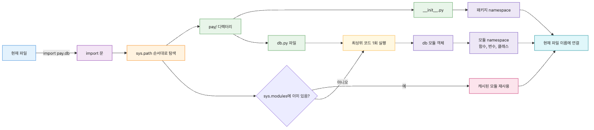
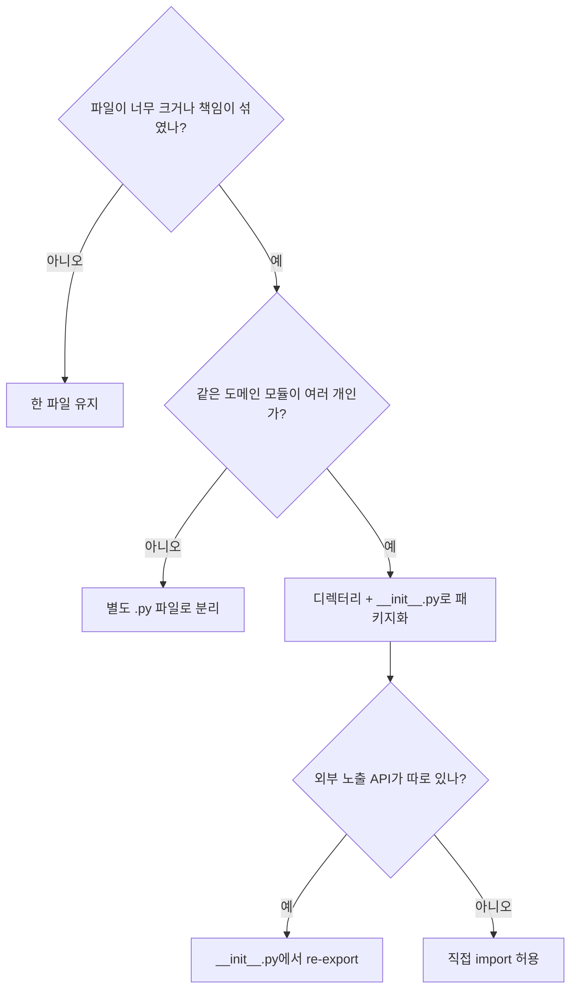

# 모듈과 패키지: import, __init__, __name__

<!-- a-grade-intro:begin -->
**핵심 질문**: 코드를 언제 한 파일에서 다음 파일로, 다음 패키지로 나눠야 할까요?

> 모듈은 한 번 실행되면 캐시되는 namespace이고, 패키지는 그런 모듈을 디렉터리로 묶은 것입니다. 이 두 정의를 잡아 두면 import의 거의 모든 동작이 같은 그림으로 설명되고, 분할의 기준도 "한 파일이 한 책임만 갖는가"로 단순해집니다.
<!-- a-grade-intro:end -->

## 이 글에서 배울 것

이 글을 읽고 나면 다음을 할 수 있습니다.

- 하나의 `.py` 파일을 모듈로 다루고 다른 파일에서 `import`로 불러올 수 있습니다.
- 디렉터리에 `__init__.py`를 두어 패키지로 만들고, 안에서 모듈을 정리할 수 있습니다.
- `import x`, `from x import y`, `import x as alias`의 차이를 설명할 수 있습니다.
- `if __name__ == "__main__":` 가드가 어떤 시점에 어떤 일을 하는지 추적할 수 있습니다.
- 같은 패키지 안에서 `from .sibling import ...`처럼 relative import를 쓸 수 있습니다.
- `sys.path`와 `PYTHONPATH`가 import 경로 탐색에 어떻게 관여하는지 한 줄로 설명할 수 있습니다.

## 이 글에서 답할 질문

- `.py` 파일을 모듈로 다룬다는 것과 디렉터리를 패키지로 만드는 것은 무엇이 다른가?
- `import x`, `from x import y`, `import x as alias` 세 형태는 각각 언제 자연스러운가?
- `if __name__ == "__main__":` 가드는 어떤 시점에 어떤 차이를 만드는가?
- 같은 패키지 안에서 `from .sibling import ...` 같은 relative import는 언제 쓸 수 없는가?
- `sys.path`와 `PYTHONPATH`는 import 경로 탐색에 각각 어떻게 관여하는가?

## 왜 중요한가

함수를 익히고 나면 코드가 길어집니다. 한 파일에 수백 줄이 쌓이면 다음 문제가 생깁니다.

- 같은 이름의 함수와 변수가 충돌합니다.
- 어떤 함수가 어디서 정의됐는지 찾기 어렵습니다.
- 다른 프로젝트에서 같은 코드를 재사용하기 힘듭니다.

모듈과 패키지는 이런 문제를 다룰 때 가장 먼저 익히게 되는 Python 도구입니다. 파일 단위로 코드를 쪼개고, 디렉터리 단위로 묶고, 필요한 부분만 골라서 가져오는 구조를 만듭니다. CLI 스크립트, 웹 서버, 데이터 파이프라인처럼 구조가 커지는 코드에서 특히 자주 만나게 됩니다. 작은 프로젝트에서 미리 익혀두면, 큰 프로젝트로 옮겨갈 때도 익숙한 방식으로 구조를 따라가기 쉬워집니다.

## Mental Model

> Python에서 모듈은 "한 번 실행되면 캐시되는 namespace"이고, 패키지는 "`__init__.py`가 있는 디렉터리로 묶인 모듈의 묶음"이라는 두 정의만 잡아 두면 import 동작 대부분이 같은 그림으로 설명됩니다.
모듈은 "한 번 실행되어 namespace를 만드는 `.py` 파일"입니다. 패키지는 "그런 모듈들을 담는 디렉터리"입니다. `import`는 그 namespace를 현재 코드에 연결하는 동작입니다.



*Mental Model*
핵심은 두 가지입니다. 첫째, **모듈 코드는 처음 import될 때 위에서 아래로 한 번 실행됩니다**. 둘째, **그 결과 만들어진 namespace 객체가 캐시되어 재사용됩니다**. 두 번째 import는 파일을 다시 읽지 않고 캐시된 객체만 가져옵니다.



*분할 결정 트리: 파일 크기와 책임 분리 기준으로 모듈/패키지 구조가 결정됩니다.*

## 핵심 개념

### 1. 모듈

`.py` 파일 하나가 모듈입니다. 파일 이름에서 `.py`를 뺀 것이 모듈 이름입니다. `math.py`라는 파일이 있다면 `import math`로 부릅니다.

### 2. 패키지

`__init__.py`가 들어 있는 디렉터리가 패키지입니다. 패키지 안에는 다른 모듈이나 하위 패키지를 둘 수 있습니다. `__init__.py`는 비어 있어도 되고, 패키지가 처음 로드될 때 실행할 코드를 담아도 됩니다.

```text
myapp/
    __init__.py
    cli.py
    db/
        __init__.py
        sqlite_store.py
        migrations.py
```

위 구조에서 `myapp.db.sqlite_store`는 `myapp` 패키지 안의 `db` 하위 패키지 안의 `sqlite_store` 모듈을 가리킵니다.

### 3. import 형태

```python
import math                # math namespace 전체를 'math'로 가져오기
from math import sqrt      # math 안의 sqrt만 현재 namespace로 가져오기
import numpy as np         # numpy를 짧은 별칭 'np'로 사용하기
from .sibling import foo   # 같은 패키지 안의 sibling 모듈에서 foo 가져오기
```

`import x`는 `x` 자체를 가져옵니다. 호출은 `x.func()`로 합니다. `from x import y`는 `y`만 가져오므로 호출이 `y()`로 짧아지지만, `y`가 어디서 왔는지 호출부에서 보이지 않습니다. 작은 프로젝트라면 둘 다 괜찮고, 코드가 커질수록 `import x` 쪽이 출처를 따라가기 쉬운 편입니다.

### 4. `__name__`과 `__main__` 가드

여기서 다루는 일반적인 Python 모듈에는 `__name__`이라는 문자열이 자동으로 붙습니다. 다른 파일에서 import되어 실행될 때는 모듈 이름이 들어가고, `python file.py`처럼 직접 실행될 때는 `"__main__"`이 들어갑니다.

```python
def main():
    print("hello")

if __name__ == "__main__":
    main()
```

이 패턴은 같은 파일을 "스크립트로 실행할 때만 동작하는 부분"과 "라이브러리로 import될 때 노출할 부분"을 분리합니다.

### 5. relative import

같은 패키지 안에서 형제 모듈을 부를 때 `.`를 씁니다. 점 하나는 같은 패키지, 점 두 개는 부모 패키지를 가리킵니다.

```python
# myapp/db/sqlite_store.py
from .migrations import latest_version       # 같은 db 패키지 안의 migrations
from ..cli import parse_args                 # 한 단계 위 myapp 패키지의 cli
```

relative import는 패키지 안에서만 의미가 있습니다. 스크립트로 직접 실행하는 파일에서는 쓸 수 없습니다.

### 6. `sys.path`와 import 경로

`import x`가 실행되면 Python은 `sys.path`라는 디렉터리 리스트를 차례로 뒤져서 `x.py`나 `x/`를 찾습니다. `sys.path`에는 보통 다음이 포함됩니다.

- 실행한 스크립트가 있는 디렉터리
- `PYTHONPATH` 환경 변수에 있는 경로들
- 표준 라이브러리 위치
- 설치된 site-packages

같은 모듈 이름이 여러 곳에 있다면 `sys.path` 순서대로 먼저 발견된 쪽이 이깁니다.

## Before-After

같은 결제 처리 로직이 한 파일에 모여 있을 때와, 모듈과 패키지로 정리되었을 때를 비교합니다.

**Before — 한 파일에 모든 것이 섞임**

```python
# pay.py
import sqlite3

def connect():
    return sqlite3.connect("pay.db")

def insert_order(order):
    conn = connect()
    conn.execute("insert into orders(amount) values (?)", [order["amount"]])
    conn.commit()
    conn.close()

def calc_tax(amount):
    return round(amount * 0.1, 2)

def send_receipt(email, amount):
    print(f"sending receipt to {email}: {amount}")

def main():
    order = {"amount": 100, "email": "a@b.c"}
    insert_order(order)
    send_receipt(order["email"], order["amount"] + calc_tax(order["amount"]))

if __name__ == "__main__":
    main()
```

DB, 세금 계산, 이메일이 한 파일에 섞여 있어 테스트하거나 재사용하기 어렵습니다.

**After — 책임별 모듈, 패키지로 묶기**

```text
pay/
    __init__.py
    cli.py
    db.py
    tax.py
    notify.py
```

```python
# pay/db.py
import sqlite3

def connect():
    return sqlite3.connect("pay.db")

def insert_order(order):
    conn = connect()
    conn.execute("insert into orders(amount) values (?)", [order["amount"]])
    conn.commit()
    conn.close()
```

```python
# pay/tax.py
def calc_tax(amount):
    return round(amount * 0.1, 2)
```

```python
# pay/notify.py
def send_receipt(email, amount):
    print(f"sending receipt to {email}: {amount}")
```

```python
# pay/cli.py
from .db import insert_order
from .tax import calc_tax
from .notify import send_receipt

def main():
    order = {"amount": 100, "email": "a@b.c"}
    insert_order(order)
    send_receipt(order["email"], order["amount"] + calc_tax(order["amount"]))

if __name__ == "__main__":
    main()
```

각 모듈은 한 가지 책임만 갖고, `cli.py`는 그 모듈들을 조합합니다. `tax.py`는 DB와 무관하게 단독으로 테스트할 수 있고, `pay.tax`만 다른 프로젝트에서 가져다 쓸 수도 있습니다.

## 단계별 실습

REPL에서 직접 만들어 봅니다. `>>>` 프롬프트가 보이는 줄은 실제 입력이고, 그 아래 줄은 출력입니다.

### 1. 모듈 만들기

작업 디렉터리에 `greet.py`를 만듭니다.

```python
# greet.py
def hello(name):
    return f"hello, {name}"

print("greet module loaded")
```

같은 디렉터리에서 REPL을 띄우고 import해 봅니다.

```pycon
>>> import greet
greet module loaded
>>> greet.hello("ada")
'hello, ada'
>>> import greet
>>>
```

처음 import에서만 `print` 한 줄이 보입니다. 두 번째 `import greet`는 캐시를 재사용하므로 모듈 본문이 다시 실행되지 않습니다.

### 2. `__name__` 가드 확인하기

`greet.py` 마지막에 한 줄을 추가합니다.

```python
if __name__ == "__main__":
    print("running as a script")
```

이제 `python greet.py`로 직접 실행하면 두 줄이 보입니다.

```text
greet module loaded
running as a script
```

반면 다른 파일에서 `import greet`만 했을 때는 `running as a script` 줄이 보이지 않습니다. 이 차이가 라이브러리와 CLI를 한 파일에 함께 둘 수 있게 해 줍니다.

### 3. 패키지 만들기

작은 패키지 구조를 만듭니다.

```text
shop/
    __init__.py
    catalog.py
    cart.py
```

```python
# shop/catalog.py
PRICES = {"apple": 1000, "banana": 500}

def price_of(item):
    return PRICES.get(item, 0)
```

```python
# shop/cart.py
from .catalog import price_of

def total(items):
    return sum(price_of(i) for i in items)
```

`shop`이 보이는 디렉터리에서 REPL을 띄웁니다.

```pycon
>>> from shop.cart import total
>>> total(["apple", "banana", "apple"])
2500
```

`shop/cart.py`의 `from .catalog import price_of`가 같은 패키지 안의 `catalog`를 가리킵니다.

### 4. `sys.path` 들여다보기

```pycon
>>> import sys
>>> sys.path[:3]
['', '/usr/lib/python3.11', '/usr/lib/python3.11/lib-dynload']
```

가장 앞의 빈 문자열은 "현재 작업 디렉터리"를 뜻합니다. 그래서 같은 폴더의 `greet.py`를 바로 import할 수 있었던 것입니다.

## 이 코드에서 주목할 점

- **`pay/` 디렉터리에 `__init__.py`** — 빈 파일이라도 두면 일반 패키지로 명시되어 import 동작이 예측 가능해집니다. namespace package에 의존하지 않습니다.
- **`from .db import insert_order` relative import** — `pay` 패키지 안에서 형제 모듈을 부르므로 패키지 위치가 바뀌어도 깨지지 않습니다.
- **모듈별 한 책임** — `db.py`는 저장, `tax.py`는 계산, `notify.py`는 알림. 각 모듈이 단독으로 테스트 가능한 단위가 됩니다.
- **`cli.py`가 조립 책임** — 다른 모듈은 서로를 모르고, `cli.py`만 셋을 조합합니다. 의존성이 한 방향으로만 흐릅니다.
- **`python -m pay.cli`로 실행 가능** — `__main__` 가드와 패키지 구조가 결합되어 라이브러리이자 CLI인 패키지가 만들어집니다.

## 자주 하는 실수

1. **`__init__.py`가 없는 디렉터리를 패키지처럼 다루기.**
   `__init__.py`가 없어도 namespace package로 동작하는 경우가 있지만, 의도가 명확한 일반 패키지에서는 빈 `__init__.py`라도 두는 편이 import 경로를 따라가기 쉽습니다.

2. **`from x import *`를 본문에 쓰기.**
   어떤 이름이 들어왔는지 호출부에서 보이지 않아 충돌이 생겨도 추적이 어렵습니다. 라이브러리 본문에서는 피하고, REPL이나 짧은 노트북에서만 제한적으로 씁니다.

3. **스크립트로 실행하는 파일에서 relative import 사용.**
   `python pay/cli.py`처럼 단일 파일로 실행하면 `cli.py`는 패키지의 일부로 간주되지 않으므로 `from .db import ...`가 실패합니다. `python -m pay.cli`로 실행하거나, 진입점을 패키지 바깥에 두는 식으로 분리합니다.

4. **무거운 작업을 모듈 본문에 두기.**
   import 한 번에 네트워크 호출이나 큰 파일 로드가 일어나면 import만으로 시간이 늘어납니다. 무거운 작업은 함수 안으로 옮기고, 필요할 때 호출합니다.

5. **순환 import.**
   `a.py`가 `b`를 import하고, `b.py`가 다시 `a`를 import하면 한쪽이 완성되기 전에 다른 쪽이 그 namespace를 보게 됩니다. 공통 의존을 별도 모듈로 빼거나, 함수 안에서 import하는 방식으로 풀 수 있습니다.

6. **`sys.path`를 본문에서 직접 조작하기.**
   `sys.path.insert(0, "...")`을 본문 곳곳에 흩어두면 import가 어디서 어떻게 풀리는지 추적이 어려워집니다. 패키지 설치(`pip install -e .`)나 `PYTHONPATH` 설정으로 푸는 편이 훨씬 안전합니다.

## 실무

실제 프로젝트에서 모듈과 패키지가 만나는 모습은 다음과 같습니다.

- **계층 분리**: `myapp/api`, `myapp/db`, `myapp/services`처럼 책임별 하위 패키지로 나누고, 각 모듈은 자기 계층의 일만 합니다.
- **CLI 진입점**: `python -m myapp.cli`로 실행할 수 있게 만들면 패키지 안에서 relative import가 자연스럽게 동작합니다.
- **재사용 단위**: 외부에 공개할 함수만 `__init__.py`에서 다시 export하면 사용자는 `from myapp import do_something`처럼 짧게 쓸 수 있습니다.
- **테스트**: 모듈 단위로 import해서 `pytest`가 함수만 골라 실행할 수 있게 합니다. 한 파일에 모든 것이 섞여 있으면 테스트도 함께 무거워집니다.
- **설정 분리**: 환경별 설정은 별도 모듈(`config_dev.py`, `config_prod.py`)로 두고 진입점에서 골라 import합니다.

이 구조는 프로젝트가 커져도 큰 틀은 비슷하게 유지되는 편입니다. 처음에 `myapp/__init__.py` 한 줄로 시작해도, 필요해지면 하위 패키지를 늘리는 방식으로 확장할 수 있습니다.

## 시니어 엔지니어는 이렇게 생각합니다

- **import는 정의 시점에 한 번 실행되는 코드다** — 모듈 본문에 무거운 작업(네트워크, 파일 로드)을 두면 import 한 번에 그 비용이 듭니다. 함수 안으로 옮겨 "필요할 때만" 실행되게 합니다.
- **순환 import는 책임 경계가 잘못 그려졌다는 신호다** — `a`가 `b`를 부르고 `b`가 다시 `a`를 부르면 공통 의존을 별도 모듈로 빼야 합니다. 함수 안 import는 임시방편일 뿐입니다.
- **`from x import *`는 라이브러리 본문에서 금지다** — 어떤 이름이 들어왔는지 호출부에서 보이지 않아 충돌과 추적 모두 어려워집니다. REPL에서만 제한적으로 씁니다.
- **`sys.path` 직접 조작은 마지막 수단이다** — `sys.path.insert(...)`이 본문에 흩어지면 import 경로가 어디서 결정되는지 추적이 어려워집니다. `pip install -e .`나 `PYTHONPATH`로 푸는 것이 안전합니다.
- **공개 API는 `__init__.py`에서 명시적으로 re-export한다** — 사용자가 내부 모듈 경로를 알지 못하게 막으면 내부 구조를 자유롭게 리팩터링할 수 있습니다. 인터페이스와 구현의 분리입니다.

## 체크리스트

- [ ] `.py` 파일 하나를 모듈로 만들고 다른 파일에서 import할 수 있습니다.
- [ ] `__init__.py`를 둔 디렉터리를 패키지로 만들고, 안의 모듈을 `pkg.mod`로 부를 수 있습니다.
- [ ] `import x`, `from x import y`, `import x as alias`의 차이를 한 문장씩으로 설명할 수 있습니다.
- [ ] `if __name__ == "__main__":` 가드의 동작을 직접 실행과 import 두 경우로 나눠 설명할 수 있습니다.
- [ ] 같은 패키지 안에서 `from .sibling import ...`로 relative import를 쓸 수 있습니다.
- [ ] `sys.path`와 `PYTHONPATH`가 import 경로 탐색에 관여한다는 것을 한 줄로 설명할 수 있습니다.

## 연습 문제

1. `mathx.py`를 만들어 `square(x)`와 `cube(x)` 두 함수를 정의하고, REPL에서 `import mathx`로 가져와 사용해 보세요.
2. `tools/` 디렉터리에 `__init__.py`, `text.py`, `numbers.py`를 두고, `text.py`의 함수가 `numbers.py`의 함수를 relative import로 부르도록 만들어 보세요.
3. `tools/cli.py`를 추가해서 `python -m tools.cli` 형태로 실행되게 만들고, `__name__ == "__main__"` 가드를 사용해 보세요.
4. `import` 한 번에 `print` 한 줄이 출력되는 모듈을 만든 뒤, 같은 REPL 세션에서 두 번 import해 보고 본문이 한 번만 실행되는지 확인해 보세요.

## 정리·다음 글

- 모듈은 `.py` 파일 하나, 패키지는 `__init__.py`가 있는 디렉터리입니다.
- import는 모듈을 처음 가져올 때 본문을 한 번 실행하고, 그 결과를 `sys.modules`에 캐시해 둡니다.
- `import x`, `from x import y`, `as alias`, `from .sibling import ...`는 같은 import 시스템의 다른 사용 방식입니다.
- `if __name__ == "__main__":` 가드는 한 파일을 스크립트와 라이브러리로 동시에 쓸 수 있게 합니다.
- `sys.path`와 `PYTHONPATH`는 모듈 탐색 경로의 단일 출처이므로, 직접 조작하기보다 패키지 설치나 환경 변수로 다루는 편이 안전합니다.

다음 글에서는 파일 I/O와 예외 처리를 다룹니다. 모듈 단위로 정리한 코드가 외부 자원을 안전하게 다루는 방법을 살펴봅니다.

<!-- toc:begin -->
<!-- toc:end -->

## 참고 자료

- [Python tutorial — Modules](https://docs.python.org/3/tutorial/modules.html)
- [Python tutorial — Packages](https://docs.python.org/3/tutorial/modules.html#packages)
- [Python reference — The import system](https://docs.python.org/3/reference/import.html)
- [PEP 328 — Imports: Multi-Line and Absolute/Relative](https://peps.python.org/pep-0328/)

Tags: import-system, module-vs-package, init-py, name-main-guard, relative-imports, namespace-packages
