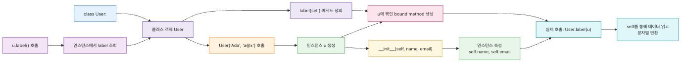

# 클래스와 객체: 데이터와 동작을 함께 묶기


## 이 글에서 다룰 문제

지금까지 다룬 함수와 모듈은 동작과 데이터를 따로 다뤘습니다. 함수는 입력을 받고 출력을 돌려주고, 모듈은 함수를 묶는 단위였습니다. 그런데 데이터와 그 데이터에 적용되는 동작이 짝을 이루는 경우, 이 둘을 따로 두면 코드가 흩어집니다.

예를 들어 사용자 정보를 다룬다면, `format_user(name, email)`, `validate_user(name, email)`, `serialize_user(name, email)`처럼 같은 데이터를 받는 함수가 여기저기 생깁니다. 호출자는 호출할 때마다 같은 인자를 다시 챙겨야 하고, 필드가 늘어나면 관련 함수들의 시그니처를 두루 손봐야 합니다.

클래스는 데이터(속성)와 동작(메서드)을 한 단위로 묶어 이 문제를 해결합니다. `User(name, email)` 인스턴스 하나가 `format`, `validate`, `serialize`를 모두 들고 다닙니다. 호출자 입장에서는 객체 하나만 넘기면 됩니다.

이 글에서는 그 묶음을 만드는 가장 단순한 도구인 `class` 문과 dunder 메서드를 살펴봅니다.

## Mental Model

> 클래스는 "데이터를 담는 형틀"이 아니라 "같은 종류의 객체가 공유하는 행동의 정의"이며, 인스턴스는 그 정의를 따르는 개별 객체입니다. 이 한 줄이 잡혀 있으면 `self`, 클래스 속성, dunder 메서드의 자리가 자연스럽게 정해집니다.
다음 그림은 클래스 정의에서 인스턴스 호출까지의 흐름을 보여줍니다.



*Mental Model*
세 가지 핵심 아이디어가 있습니다.

- **클래스는 객체를 찍어내는 틀입니다.** `class User:` 문 자체가 `User`라는 클래스 객체를 만들고, `User(...)` 호출이 그 틀로부터 인스턴스를 만들어 냅니다.
- **`__init__`은 인스턴스를 초기화하는 함수입니다.** 인스턴스가 만들어진 직후에 자동으로 호출되며, `self.attr = value` 형태로 속성을 설정하는 자리입니다.
- **메서드 호출 `obj.method(x)`는 사실 `method(obj, x)`입니다.** Python이 인스턴스를 첫 인자로 자동으로 넣어 주기 때문에, 메서드의 첫 매개변수를 `self`로 받습니다.

## 핵심 개념

### `class` 문과 인스턴스

가장 단순한 클래스는 다음과 같습니다.

```python
class User:
    def __init__(self, name, email):
        self.name = name
        self.email = email
```

`User("Ada", "a@x")`는 인스턴스를 만들고, 그 인스턴스에 `name`과 `email` 속성을 붙입니다. 인스턴스마다 따로 저장된다는 점이 중요합니다.

### `__init__`과 `self`

`__init__`은 "이미 만들어진" 인스턴스를 초기화합니다. 객체를 새로 만드는 일은 Python이 내부적으로 처리하고, `__init__`은 거기에 속성을 채워 넣는 단계입니다.

`self`는 그 "이미 만들어진" 인스턴스를 가리킵니다. 이름은 관례일 뿐 문법은 아니지만, Python 코드 전체가 `self`를 사용하므로 다른 이름을 쓰면 읽는 사람이 혼란스러워합니다.

### 인스턴스 속성과 클래스 속성

```python
class User:
    role = "member"  # 클래스 속성

    def __init__(self, name):
        self.name = name  # 인스턴스 속성
```

- `User.role`은 인스턴스들이 공유하는 값입니다.
- `self.name`은 인스턴스마다 따로 저장됩니다.

`u = User("Ada"); u.role = "admin"`처럼 인스턴스에 같은 이름을 다시 할당하면, 그 인스턴스에는 새 속성이 생기고 클래스 속성은 그대로 남습니다.

### 메서드

메서드는 클래스 안에 정의된 함수입니다. 첫 매개변수로 인스턴스(`self`)를 받습니다.

```python
class User:
    def __init__(self, name, email):
        self.name = name
        self.email = email

    def label(self):
        return f"{self.name} <{self.email}>"
```

`u = User("Ada", "a@x"); u.label()`을 호출하면 Python은 `User.label(u)`로 풀어 호출합니다. 그래서 메서드 안에서는 `self.name`처럼 인스턴스의 데이터에 자유롭게 접근할 수 있습니다.

### dunder 메서드: `__repr__`, `__str__`, `__eq__`

이름 양옆에 밑줄 두 개가 붙은 메서드를 dunder(double underscore) 메서드라고 부릅니다. Python의 여러 문법이 이 메서드들을 호출하도록 정의되어 있습니다.

- `__repr__(self)` — 디버깅용 문자열. `repr(obj)` 또는 REPL에서 객체를 그냥 입력했을 때 보입니다. 가능하면 `User('Ada', 'a@x')`처럼 다시 만들 수 있는 형태가 좋습니다.
- `__str__(self)` — 사람이 읽을 표현. `str(obj)` 또는 `print(obj)`에서 호출됩니다. 정의하지 않으면 `__repr__`이 대신 사용됩니다.
- `__eq__(self, other)` — 동등 비교. `obj1 == obj2`는 이 메서드를 호출합니다. 정의하지 않으면 같은 객체인지(`is`)만 비교합니다.

```python
class User:
    def __init__(self, name, email):
        self.name = name
        self.email = email

    def __repr__(self):
        return f"User({self.name!r}, {self.email!r})"

    def __eq__(self, other):
        if not isinstance(other, User):
            return NotImplemented
        return (self.name, self.email) == (other.name, other.email)
```

### 상속과 메서드 오버라이드

상속은 기존 클래스를 토대로 새 클래스를 만드는 방법입니다.

```python
class Member(User):
    def label(self):
        return f"[member] {super().label()}"
```

- `Member`는 `User`의 속성과 메서드를 물려받습니다.
- `label`을 다시 정의하면, `Member` 인스턴스에서는 새 정의가 사용됩니다(오버라이드).
- `super().label()`은 부모 클래스의 메서드를 그대로 호출하는 방법입니다.

상속은 강력하지만, 깊어질수록 "이 메서드가 어디서 왔지?" 추적이 어려워집니다. 단순한 경우에는 합성(composition, 다른 객체를 속성으로 갖기)을 먼저 고려하는 편이 안전합니다.

### `@dataclass`로 단순화

데이터 묶음에 가까운 클래스를 만들 때마다 `__init__`, `__repr__`, `__eq__`를 손으로 쓰는 일이 반복됩니다. `@dataclass`는 이 세 메서드를 자동으로 만들어 줍니다.

```python
from dataclasses import dataclass

@dataclass
class User:
    name: str
    email: str
```

이 한 블록은 필드 기반의 `__init__`, `__eq__`, 그리고 기본 `__repr__`를 자동으로 만듭니다. 다만 기본 `__repr__` 형식은 `User(name='Ada', email='a@x')`처럼 필드 이름을 포함하므로, 앞의 손작성 예시와 완전히 같지는 않습니다.

## Before-After

다음은 사용자 정보를 다루는 코드입니다.

**Before**

```python
def make_user(name, email):
    return {"name": name, "email": email}

def user_label(user):
    return f"{user['name']} <{user['email']}>"

def user_equal(a, b):
    return a["name"] == b["name"] and a["email"] == b["email"]
```

세 가지 문제가 있습니다.

- 데이터 구조(`{"name": ..., "email": ...}`)가 코드 곳곳에 반복됩니다. 필드를 하나 추가하려면 관련 함수들을 두루 수정해야 합니다.
- 호출자가 dict의 키 이름을 정확히 알아야 합니다. 타이포가 나도 런타임에서야 발견됩니다.
- 동등 비교를 직접 구현해야 합니다.

**After**

```python
from dataclasses import dataclass

@dataclass
class User:
    name: str
    email: str

    def label(self):
        return f"{self.name} <{self.email}>"
```

세 가지 변화가 있습니다.

- 데이터 형태가 클래스 정의 한 곳에 모입니다. 필드를 추가하면 거기 한 줄만 늘어납니다.
- 인스턴스 속성에 접근하므로 IDE의 자동 완성과 정적 분석의 도움을 받을 수 있습니다.
- `__init__`, `__repr__`, `__eq__`를 `@dataclass`가 처리합니다.

## 단계별 실습

REPL을 켜고 한 줄씩 따라가 보세요. `>>>`가 붙은 블록은 REPL 전사이고, 그 외 코드 블록은 설명용 예시입니다.

### 1. 가장 단순한 클래스 만들기

```text
>>> class User:
...     def __init__(self, name, email):
...         self.name = name
...         self.email = email
...
>>> u = User("Ada", "a@x")
>>> u.name
'Ada'
>>> u.email
'a@x'
```

### 2. 메서드 추가

```text
>>> class User:
...     def __init__(self, name, email):
...         self.name = name
...         self.email = email
...     def label(self):
...         return f"{self.name} <{self.email}>"
...
>>> User("Ada", "a@x").label()
'Ada <a@x>'
```

`label()`은 `self`를 자동으로 받기 때문에 호출 시에는 인자를 따로 넘기지 않습니다.

### 3. `__repr__`로 보기 좋은 표현

```text
>>> class User:
...     def __init__(self, name, email):
...         self.name = name
...         self.email = email
...     def __repr__(self):
...         return f"User({self.name!r}, {self.email!r})"
...
>>> User("Ada", "a@x")
User('Ada', 'a@x')
```

`__repr__`을 정의하지 않으면 `<__main__.User object at 0x...>`처럼 메모리 주소가 보입니다.

### 4. `__eq__`로 동등 비교

```text
>>> class User:
...     def __init__(self, name, email):
...         self.name = name
...         self.email = email
...     def __eq__(self, other):
...         if not isinstance(other, User):
...             return NotImplemented
...         return (self.name, self.email) == (other.name, other.email)
...
>>> User("Ada", "a@x") == User("Ada", "a@x")
True
>>> User("Ada", "a@x") == User("Bob", "b@x")
False
```

### 5. 상속과 `super()`

```text
>>> class User:
...     def __init__(self, name, email):
...         self.name = name
...         self.email = email
...     def label(self):
...         return f"{self.name} <{self.email}>"
...
>>> class Member(User):
...     def label(self):
...         return f"[member] {super().label()}"
...
>>> Member("Ada", "a@x").label()
'[member] Ada <a@x>'
```

### 6. `@dataclass`로 줄이기

```text
>>> from dataclasses import dataclass
>>> @dataclass
... class User:
...     name: str
...     email: str
...
>>> u = User("Ada", "a@x")
>>> u
User(name='Ada', email='a@x')
>>> u == User("Ada", "a@x")
True
```

`__init__`, `__repr__`, `__eq__`가 자동으로 만들어진 모습을 확인할 수 있습니다.

## 이 코드에서 주목할 점

- **`__init__(self, ...)`** — 인스턴스가 만들어진 직후 자동으로 호출되는 초기화 함수입니다. `self.attr = value`로 속성을 채우는 자리이고, 값을 돌려주지 않습니다.
- **`self`는 첫 매개변수** — `obj.method(x)` 호출은 내부적으로 `Class.method(obj, x)`로 풀립니다. 그래서 메서드 안에서 `self.name`처럼 인스턴스 데이터에 접근할 수 있습니다.
- **`__repr__` vs `__str__`** — 디버깅용과 사람이 읽을 표현을 분리합니다. `__repr__`만 정의해도 `__str__`이 그 결과를 사용하므로, 보통 `__repr__`을 먼저 챙깁니다.
- **`__eq__`에서 `NotImplemented`** — 다른 타입과 비교할 때 `False`를 돌려주는 대신 `NotImplemented`를 돌려주면 Python이 반대편 객체에 비교 기회를 줍니다.
- **`@dataclass`의 자동 생성** — 필드 선언만으로 `__init__`/`__repr__`/`__eq__`가 만들어집니다. 단순 데이터 묶음에서는 손으로 쓰던 보일러플레이트가 사라집니다.

## 자주 하는 실수

- **`self`를 빼먹기** — 메서드의 첫 매개변수에 `self`를 넣지 않으면 호출 시 인자 개수가 어긋나 `TypeError`가 납니다.
- **클래스 속성에 가변 객체 두기** — `class C: items = []`처럼 두면 인스턴스들이 같은 리스트를 공유해 버그가 생깁니다. 가변 기본값은 `__init__`에서 만들어 주세요.
- **`__init__`에서 값을 돌려주기** — `__init__`은 `None`을 돌려주는 자리입니다. `return self`나 다른 값을 돌려주면 `TypeError`가 납니다.
- **`__str__`만 정의하고 `__repr__` 빼먹기** — REPL이나 로그에서 객체를 보면 메모리 주소가 그대로 나옵니다. `__repr__`을 먼저 챙기는 편이 디버깅에 도움이 됩니다.
- **상속을 너무 깊게 쌓기** — 3단계 이상 상속이 쌓이면 메서드 추적이 어려워집니다. 합성으로 풀 수 있는지 먼저 살펴보세요.
- **dict처럼 쓸 클래스를 손으로 작성** — 단순 데이터 묶음이면 `@dataclass`로 줄일 수 있습니다.
- **`is`와 `==`을 혼동** — `is`는 같은 객체인지, `==`은 동등한 값인지 묻습니다. `__eq__`를 정의하지 않으면 둘이 같은 결과를 내지만, 정의한 뒤로는 갈라집니다.

## 실무

실제 프로젝트에서 클래스가 등장하는 자리는 주로 다음과 같습니다.

- **도메인 모델**: `User`, `Order`, `Invoice`처럼 사업 개념에 직접 대응되는 데이터를 클래스로 표현합니다. `@dataclass`가 단순 모델에 잘 맞습니다.
- **외부 자원 핸들**: DB 연결, HTTP 클라이언트, 파일 핸들처럼 상태(state)를 들고 다녀야 하는 자원은 클래스로 감싸는 편이 자연스럽습니다. `__enter__`/`__exit__`까지 정의하면 `with` 블록과 함께 쓸 수 있습니다.
- **정책/전략 객체**: 같은 인터페이스를 따르는 여러 구현(예: `JSONFormatter`, `TextFormatter`)을 클래스로 두고, 호출자는 인터페이스만 알면 됩니다.
- **테스트 더블**: `Fake`, `Stub`, `Spy` 같은 테스트 보조 객체는 일반적으로 작은 클래스로 작성합니다.
- **상태 머신**: 명확한 상태 전이를 가진 흐름(주문 상태, 워크플로 단계 등)은 클래스로 정리하면 전이 로직을 한 곳에 모을 수 있습니다.

대부분의 일반적인 비즈니스 로직은 함수만으로도 충분합니다. 클래스는 데이터와 동작이 단단히 짝을 이룰 때, 또는 인터페이스를 통일하고 싶을 때 빛을 발합니다.

## 체크리스트

- [ ] `class` 문으로 클래스를 정의하고 인스턴스를 만들 수 있습니다.
- [ ] `__init__`과 `self`의 역할을 한 문장씩으로 설명할 수 있습니다.
- [ ] 인스턴스 속성과 클래스 속성의 차이를 구분해 사용할 수 있습니다.
- [ ] `__repr__`, `__str__`, `__eq__`의 기본 역할을 설명할 수 있습니다.
- [ ] 단일 상속과 `super()` 호출을 사용할 수 있습니다.
- [ ] 단순 데이터 묶음에 `@dataclass`를 적용할 수 있습니다.
- [ ] `is`와 `==`의 차이를 한 문장으로 설명할 수 있습니다.

## 정리·다음 글

- 클래스는 데이터와 동작을 한 단위로 묶어 호출자가 인자를 따로 챙기지 않게 해 줍니다.
- `__init__`은 인스턴스 초기화를 담당하고, `self`는 그 인스턴스를 가리킵니다.
- `__repr__`, `__str__`, `__eq__` 같은 dunder 메서드는 Python 문법이 객체와 어떻게 상호작용할지 결정합니다.
- 상속은 강력하지만 깊어질수록 추적이 어려워지므로, 단순한 경우에는 합성을 먼저 살펴보는 편이 안전합니다.
- 단순 데이터 묶음에는 `@dataclass`가 손으로 쓰던 `__init__`/`__repr__`/`__eq__`를 대신해 줍니다.

다음 글에서는 표준 라이브러리 투어를 다룹니다. 지금까지 배운 함수, 모듈, 클래스 위에서 Python이 기본으로 제공하는 도구들을 빠르게 훑어봅니다.

<!-- toc:begin -->
<!-- toc:end -->

## 참고 자료

- [Python tutorial — Classes](https://docs.python.org/3/tutorial/classes.html)
- [Python data model — Special method names](https://docs.python.org/3/reference/datamodel.html#special-method-names)
- [Python library — dataclasses](https://docs.python.org/3/library/dataclasses.html)
- [PEP 557 — Data Classes](https://peps.python.org/pep-0557/)

Tags: class-and-instance, init-method, self-parameter, dunder-methods, inheritance, dataclass
