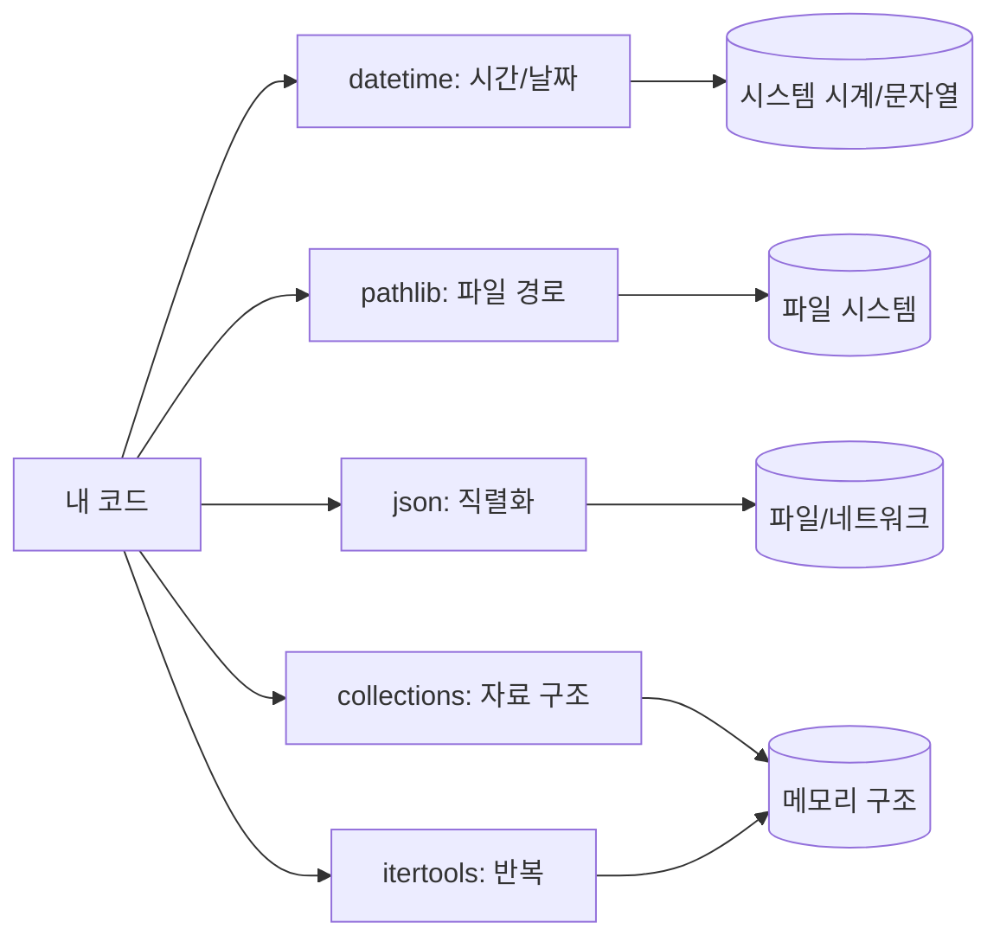

# 표준 라이브러리 투어: datetime, pathlib, json, collections, itertools

## 이 글에서 배울 것

- `datetime`으로 날짜와 시간을 다루는 기본 패턴
- `pathlib.Path`로 파일 경로를 객체처럼 다루는 방법
- `json` 모듈로 dict와 JSON 문자열을 오가는 방법
- `collections`의 `Counter`, `defaultdict`, `deque`가 해결하는 문제
- `itertools`의 `chain`, `groupby`, `combinations`로 반복을 압축하는 패턴

## 왜 중요한가

Python을 두고 흔히 "batteries included"라고 부릅니다. 표준 라이브러리에 자주 쓰는 도구들이 처음부터 들어 있다는 뜻입니다. 표준 라이브러리에 익숙해지면 다음과 같은 점이 달라집니다.

- **외부 의존성을 줄일 수 있습니다.** 작은 스크립트에 패키지를 추가하기 전에 표준 라이브러리부터 살펴보면, requirements 파일을 더 가볍게 유지할 수 있습니다.
- **코드가 짧고 익숙해집니다.** 다른 Python 개발자도 같은 도구를 알고 있으므로 리뷰가 빨라집니다.
- **버전 관리가 단순합니다.** Python 인터프리터 버전만 맞추면 동일한 동작을 기대할 수 있습니다.

이 글은 표준 라이브러리 전부를 다루지 않습니다. 작은 스크립트와 데이터 처리에서 자주 등장하는 다섯 개 모듈을 골라 입문 수준에서 훑어봅니다.

## Mental Model

표준 라이브러리는 용도별로 나뉘어 있습니다. 시간과 날짜는 `datetime`, 파일 경로는 `pathlib`, 데이터 직렬화는 `json`, 더 풍부한 자료 구조는 `collections`, 반복 패턴은 `itertools`가 담당합니다.



각 모듈은 "특정 종류의 문제 한 가지"를 잘 풀도록 설계돼 있습니다. 모듈 이름만 봐도 어떤 문제를 다룰지 짐작할 수 있도록 명명돼 있는 점이 표준 라이브러리의 일관된 특징입니다.

## 핵심 개념

- **`datetime` 객체**: 날짜(`date`), 시간(`time`), 둘을 합친 `datetime`, 시간 간격(`timedelta`)을 표현합니다. `datetime`은 시간대(`tzinfo`)를 함께 가질 수 있습니다.
- **`pathlib.Path`**: 경로를 문자열이 아니라 객체로 다룹니다. `/` 연산자로 경로를 이어 붙이고, `.exists()`, `.read_text()`, `.glob()` 같은 메서드를 직접 호출합니다.
- **`json.dumps`/`json.loads`**: Python 객체와 JSON 문자열 사이를 변환합니다. dict, list, str, int, float, bool, None은 직접 변환되며, 그 외 타입은 직렬화 규칙을 직접 정해야 합니다.
- **`Counter`**: 요소의 출현 빈도를 세는 dict의 하위 클래스입니다.
- **`defaultdict`**: 키가 없을 때 호출할 기본값 팩토리를 미리 등록한 dict입니다.
- **`deque`**: 양쪽 끝에서 `O(1)`로 추가·제거가 가능한 자료 구조입니다.
- **`itertools`**: 반복 가능한 객체(iterable)를 변환·결합·잘라 주는 함수 모음입니다. 결과는 lazy한 이터레이터로 돌아옵니다.

## Before-After

다음은 단어 빈도를 세는 코드입니다.

**Before**

```python
def word_counts(words):
    counts = {}
    for w in words:
        if w in counts:
            counts[w] += 1
        else:
            counts[w] = 1
    return counts
```

직접 dict를 다루다 보면 키가 있는지 한 번씩 확인하는 분기가 필요합니다.

**After**

```python
from collections import Counter

def word_counts(words):
    return Counter(words)
```

세 가지 변화가 있습니다.

- 키 존재 여부를 검사하는 분기가 사라졌습니다.
- `Counter`는 `most_common(n)` 같은 메서드를 그대로 제공합니다.
- 결과 객체는 dict의 하위 클래스이므로 기존 dict 인터페이스와 호환됩니다.

## 단계별 실습

REPL을 켜고 한 줄씩 따라가 보세요. `>>>`로 시작하는 블록은 REPL 전사이고, 그 외 코드 블록은 설명용 예시입니다.

### 1. `datetime`으로 오늘과 지금 다루기

```text
>>> from datetime import date, datetime, timedelta
>>> date.today()
datetime.date(2026, 5, 3)
>>> datetime.now()
datetime.datetime(2026, 5, 3, 14, 30, 0, 123456)
>>> date(2026, 12, 25) - date.today()
datetime.timedelta(days=236)
>>> (datetime(2026, 5, 3, 14, 30) + timedelta(hours=2)).strftime("%Y-%m-%d %H:%M")
'2026-05-03 16:30'
```

`strftime`으로 출력 형식을 정하고, 반대로 문자열을 객체로 바꿀 때는 `strptime`을 사용합니다. 사용자 입력은 형식이 바뀌기 쉬우므로 입력 단계에서 한 번 파싱한 뒤 객체로 다루는 편이 안전합니다.

### 2. `pathlib`로 경로 다루기

```text
>>> from pathlib import Path
>>> p = Path("docs") / "intro.md"
>>> p
PosixPath('docs/intro.md')
>>> p.suffix
'.md'
>>> p.stem
'intro'
>>> p.parent
PosixPath('docs')
```

`Path` 객체는 문자열과 다르게 운영체제 차이를 흡수합니다. `Path("a") / "b"`는 Linux에서는 `a/b`, Windows에서는 `a\b`로 만들어집니다. 그 결과 슬래시 처리 코드를 직접 짤 일이 줄어듭니다.

### 3. `json`으로 직렬화·역직렬화

```text
>>> import json
>>> data = {"name": "Ada", "tags": ["math", "logic"]}
>>> s = json.dumps(data, ensure_ascii=False)
>>> s
'{"name": "Ada", "tags": ["math", "logic"]}'
>>> json.loads(s) == data
True
```

`ensure_ascii=False`를 주면 한글처럼 비ASCII 문자가 그대로 보입니다. 파일에 직접 쓰고 싶다면 `json.dump(data, f)`, 읽을 때는 `json.load(f)`를 사용합니다.

### 4. `Counter`로 빈도 세기

```text
>>> from collections import Counter
>>> Counter("banana")
Counter({'a': 3, 'n': 2, 'b': 1})
>>> Counter(["red", "blue", "red", "green", "blue", "red"]).most_common(2)
[('red', 3), ('blue', 2)]
```

문자열을 넘기면 글자 단위로, 리스트를 넘기면 요소 단위로 셉니다. `most_common(n)`은 빈도가 높은 순서로 `n`개를 돌려줍니다.

### 5. `defaultdict`로 그룹 만들기

```text
>>> from collections import defaultdict
>>> groups = defaultdict(list)
>>> for word in ["ant", "ape", "bee", "bat"]:
...     groups[word[0]].append(word)
...
>>> dict(groups)
{'a': ['ant', 'ape'], 'b': ['bee', 'bat']}
```

키가 없을 때 자동으로 빈 리스트를 만들어 주므로 `if key not in d` 분기가 사라집니다.

### 6. `itertools`로 반복 압축하기

```text
>>> from itertools import chain, groupby, combinations
>>> list(chain([1, 2], [3, 4]))
[1, 2, 3, 4]
>>> [(k, list(g)) for k, g in groupby("aaabbc")]
[('a', ['a', 'a', 'a']), ('b', ['b', 'b']), ('c', ['c'])]
>>> list(combinations(["A", "B", "C"], 2))
[('A', 'B'), ('A', 'C'), ('B', 'C')]
```

`groupby`는 인접한 같은 값만 묶는다는 점에 주의해야 합니다. 정렬되지 않은 입력은 먼저 `sorted()`를 거쳐야 의도한 그룹이 만들어집니다.

## 자주 하는 실수

- **`datetime.now()`와 `utcnow()`를 섞어 쓰기** — 둘 다 시간대 정보가 없는 naive 객체를 돌려줍니다. 시간대를 신경 써야 한다면 `datetime.now(timezone.utc)`처럼 `tzinfo`를 명시하세요.
- **`pathlib.Path`를 문자열 인자에 그대로 넘기기** — 일부 외부 API는 문자열만 받습니다. `str(path)`로 명시적으로 변환하면 디버깅이 쉬워집니다.
- **`json.dumps`로 한글이 `\uXXXX`로 보임** — `ensure_ascii=False`를 깜빡한 경우입니다. 파일이나 로그에 그대로 보고 싶다면 옵션을 켜 두세요.
- **`Counter`의 결과를 dict로 가정해 키 순서에 의존** — `most_common()`을 거치지 않은 결과는 빈도순 정렬이 보장되지 않습니다. 정렬이 필요하면 `most_common()`을 사용하세요.
- **`defaultdict`의 팩토리 함수에 `()`를 붙이기** — `defaultdict(list)`가 맞는 형태입니다. `defaultdict(list())`라고 쓰면 빈 리스트 한 개가 팩토리 자리에 들어가 `TypeError`가 납니다.
- **`groupby`에 정렬 안 된 입력을 그대로 넘기기** — 인접한 값만 묶이므로 같은 키가 여러 그룹으로 쪼개집니다.
- **`itertools` 결과를 두 번 순회하기** — 이터레이터는 한 번 소비되면 비어 버립니다. 두 번 보고 싶다면 `list(...)`로 먼저 모아 두세요.

## 실무

표준 라이브러리는 작은 도우미가 많아 자주 쓰이는 자리도 함께 알아 두면 좋습니다.

- **로그 파일 정리**: `pathlib`로 디렉터리를 순회하고, `datetime`으로 파일명에 들어 있는 날짜를 파싱한 뒤, 오래된 파일을 분리합니다.
- **간단한 설정 파일**: 외부 의존성 없이 설정을 저장할 때 `json` 파일이면 충분합니다. 사람이 직접 손으로 수정할 일이 잦다면 주석을 지원하는 다른 형식(YAML 등)을 검토할 수 있습니다.
- **로그 분석**: `Counter`로 상위 에러 메시지를, `defaultdict(list)`로 사용자별 요청을 묶어 보는 식으로 빠르게 통계를 뽑을 수 있습니다.
- **중복 작업 큐**: `deque`로 양쪽 끝에서 빠르게 넣고 빼며 작업을 처리합니다. `popleft()`는 list의 `pop(0)`보다 큰 입력에서 빠릅니다.
- **데이터 페어링**: `itertools.combinations`나 `product`로 후보 쌍을 만들어 테스트 케이스를 자동으로 펼치는 식으로 활용합니다.

표준 라이브러리에 손이 익을수록 작은 스크립트의 분량이 짧아집니다. 동시에 읽는 사람도 같은 모듈에 익숙하므로 리뷰 시간이 줄어듭니다.

## 체크리스트

- [ ] `datetime`, `date`, `timedelta`로 날짜 계산을 한 줄로 표현할 수 있습니다.
- [ ] `pathlib.Path`의 `/` 연산자, `.suffix`, `.stem`, `.parent`를 사용할 수 있습니다.
- [ ] `json.dumps`/`loads`와 `json.dump`/`load`의 차이를 설명할 수 있습니다.
- [ ] `Counter`, `defaultdict(list)`, `deque`를 적절한 상황에 골라 쓸 수 있습니다.
- [ ] `itertools.chain`, `groupby`, `combinations`의 동작을 한 문장씩으로 설명할 수 있습니다.
- [ ] 이터레이터가 한 번만 소비된다는 사실을 코드에서 의식할 수 있습니다.

## 연습 문제

1. 오늘로부터 100일 뒤의 날짜를 `YYYY-MM-DD` 형식으로 출력하는 함수를 작성해 보세요. (힌트: `date.today() + timedelta(days=100)`)
2. 현재 디렉터리에 있는 `.md` 파일의 개수를 세는 코드를 `pathlib.Path.glob`로 작성해 보세요.
3. 다음 dict를 JSON 문자열로 직렬화하고, 다시 dict로 역직렬화한 뒤 동일한지 확인하세요: `{"items": [1, 2, 3], "name": "보고서"}` (한글이 그대로 보이도록 옵션도 함께 다루어 보세요.)
4. 문자열 `"the quick brown fox jumps over the lazy dog"`에서 가장 자주 등장한 글자 5개를 `Counter`로 구해 보세요.
5. 학생-점수 튜플 리스트 `[("a", 80), ("b", 90), ("a", 70), ("b", 85)]`를 `defaultdict(list)`로 학생별 점수 리스트로 묶어 보세요.
6. `itertools.combinations`로 `["A", "B", "C", "D"]`에서 길이 3인 조합을 모두 출력해 보세요.

## 정리·다음 글

- `datetime`은 날짜·시간 계산을 객체 단위로 다루게 해 줍니다. 시간대 처리는 따로 신경 쓸 부분이 많습니다.
- `pathlib`은 경로를 문자열이 아닌 객체로 다루어, OS 차이와 슬래시 처리 부담을 줄여 줍니다.
- `json`은 dict 중심의 데이터를 외부에 보관할 때 가장 가볍게 쓰는 직렬화 방식입니다.
- `collections`의 `Counter`, `defaultdict`, `deque`는 dict와 list의 빈자리를 채워 줍니다.
- `itertools`는 반복 패턴을 짧게 표현하지만, 결과가 lazy 이터레이터라는 점을 의식해야 합니다.

이번 글로 Python 101 시리즈가 마무리됩니다. 여기서 다룬 함수, 모듈, 클래스, 표준 라이브러리는 이후 다른 시리즈(예: `python-dbapi-101`, `sqlalchemy-101`)에서 그대로 다시 쓰입니다. 다음 시리즈에서는 표준 라이브러리에서 시작해, 외부 패키지로 자연스럽게 영역을 넓혀 갑니다.

<!-- toc:begin -->
<!-- toc:end -->

## 참고 자료

- [Python tutorial — Brief tour of the standard library](https://docs.python.org/3/tutorial/stdlib.html)
- [Python library — datetime](https://docs.python.org/3/library/datetime.html)
- [Python library — pathlib](https://docs.python.org/3/library/pathlib.html)
- [Python library — json](https://docs.python.org/3/library/json.html)
- [Python library — collections](https://docs.python.org/3/library/collections.html)
- [Python library — itertools](https://docs.python.org/3/library/itertools.html)

Tags: standard-library, datetime-module, pathlib-module, json-module, collections-module, itertools-module
