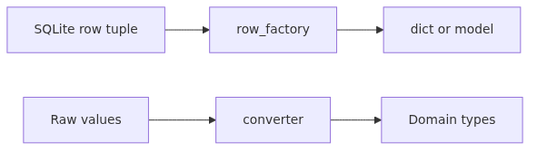
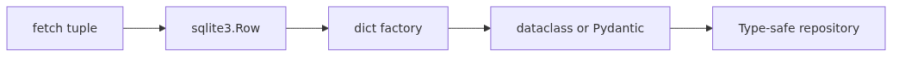

# Row factories and type adapters (sqlite3, PEP 249)


## Questions this post answers

- How do you receive default tuple results as dict, dataclass, or Pydantic models?
- What is `sqlite3.Row` and when is it enough?
- What does `detect_types` actually detect?
- How do you safely map custom types such as `Decimal`, `datetime`, `Enum`, or JSON?
- How do adapters and converters fit into the PEP 249 model?

> Raw tuples returned by the database are fast but dangerous: you must remember column order, and SQLite has only five storage classes (NULL, INTEGER, REAL, TEXT, BLOB). Row factories and type adapters consolidate every conversion in one place.

> Python DB-API 101 (6/10)

---

## What you will learn

This post separates how sqlite3 moves data between SQL and Python into two axes.

1. **Row factory** — the **shape** of `cursor.fetch*()` results (tuple → Row → dict → dataclass → Pydantic).
2. **Type adapter / converter** — the **type of a single value** (Python `Decimal` ↔ SQLite TEXT).
3. **`detect_types`** — selects automatic conversion based on declared column type or `[type-name]` column aliases.
4. **Registering custom types** — `register_adapter` / `register_converter` for `Decimal`, `Enum`, JSON dicts.
5. **Type-safe repository layer** — using Pydantic or dataclass as the result model.

---

## Why this matters

Code like `row[3]` shatters silently the moment the schema changes. `row['name']` (or `row.name` from a dataclass) turns schema changes into immediate import errors.

The same applies to type conversion. Storing money as `REAL` (float) in SQLite leads to precision incidents like `0.1 + 0.2 = 0.30000000000000004`. Registering `Decimal` and storing as `TEXT` keeps full precision.

This post unifies row factories and type adapters so your repository layer survives schema and type changes.

---

## Mental Model — two-step conversion


```
Database row             Python value
─────────────             ────────────
                converter
SQLite TEXT  ─────────────►  Decimal('19.95')
                (value step)
                 adapter
SQLite TEXT  ◄─────────────  Decimal('19.95')

[col1, col2, col3]   row_factory
        │       ─────────────►   {'id': 1, 'name': 'Alice'}
        ▼                          or dataclass / Pydantic
   tuple shape                    (row step)
```

- **adapter / converter** = type conversion of a **single value** (Python ↔ SQLite storage class).
- **row_factory** = shape conversion of an **entire row** (tuple → desired form).

Separating these two concerns naturally separates where they live in code.

---

## Core concepts


### `sqlite3.Row`

The lightest row factory. Accessible by index like a tuple AND by name like a dict.

```python
con.row_factory = sqlite3.Row
row = con.execute('SELECT id, name FROM users WHERE id=?', (1,)).fetchone()
print(row[0], row['name'], row.keys())
```

It is not a real dict, but it covers ~80% of cases.

### dict factory

For a true dict:

```python
def dict_factory(cursor, row):
    return {col[0]: value for col, value in zip(cursor.description, row)}

con.row_factory = dict_factory
```

### dataclass factory

For type safety and IDE autocomplete:

```python
from dataclasses import dataclass, fields

@dataclass
class User:
    id: int
    name: str
    email: str

def dataclass_factory(cls):
    field_names = [f.name for f in fields(cls)]
    def factory(cursor, row):
        cols = [c[0] for c in cursor.description]
        return cls(**{k: v for k, v in zip(cols, row) if k in field_names})
    return factory

con.row_factory = dataclass_factory(User)
```

### Pydantic factory

For combined validation and serialisation:

```python
from pydantic import BaseModel

class UserModel(BaseModel):
    id: int
    name: str
    email: str

def pydantic_factory(cls):
    def factory(cursor, row):
        cols = [c[0] for c in cursor.description]
        return cls.model_validate({k: v for k, v in zip(cols, row)})
    return factory

con.row_factory = pydantic_factory(UserModel)
```

### `detect_types`

```python
con = sqlite3.connect(
    'app.db',
    detect_types=sqlite3.PARSE_DECLTYPES | sqlite3.PARSE_COLNAMES,
)
```

- `PARSE_DECLTYPES` — looks at the column's declared type from `CREATE TABLE` (e.g., `created_at TIMESTAMP`) and dispatches the registered converter.
- `PARSE_COLNAMES` — forces conversion via aliases like `SELECT created_at AS "ts [timestamp]"`.

---

## Before / After

### Before — raw tuple + column index

```python
con = sqlite3.connect('shop.db')
row = con.execute('SELECT id, name, price FROM products WHERE id=1').fetchone()
print(row[2] * 1.1)   # apply VAT to price
```

If the SELECT column order changes, you suddenly multiply the name string.

### After — Pydantic + Decimal converter

```python
import sqlite3
from decimal import Decimal
from pydantic import BaseModel

sqlite3.register_adapter(Decimal, lambda d: str(d))
sqlite3.register_converter('decimal', lambda b: Decimal(b.decode()))

con = sqlite3.connect('shop.db', detect_types=sqlite3.PARSE_DECLTYPES)
con.execute('''CREATE TABLE IF NOT EXISTS products(
    id INTEGER PRIMARY KEY, name TEXT, price decimal
)''')

class Product(BaseModel):
    id: int
    name: str
    price: Decimal

def factory(cursor, row):
    return Product.model_validate(
        {c[0]: v for c, v in zip(cursor.description, row)}
    )

con.row_factory = factory
p = con.execute('SELECT id, name, price FROM products WHERE id=1').fetchone()
print(p.price * Decimal('1.1'))
```

Order-independent and precise.

---

## Step-by-step walkthrough


### Step 1 — `sqlite3.Row`

```python
import sqlite3

con = sqlite3.connect(':memory:')
con.row_factory = sqlite3.Row
con.execute('CREATE TABLE users(id INTEGER PRIMARY KEY, name TEXT, email TEXT)')
con.execute('INSERT INTO users(name, email) VALUES (?, ?)', ('Alice', 'a@x.io'))

row = con.execute('SELECT * FROM users WHERE id=1').fetchone()
print(dict(row))   # {'id': 1, 'name': 'Alice', 'email': 'a@x.io'}
```

### Step 2 — `Decimal` adapter / converter

```python
from decimal import Decimal

def adapt_decimal(d: Decimal) -> str:
    return str(d)

def convert_decimal(b: bytes) -> Decimal:
    return Decimal(b.decode())

sqlite3.register_adapter(Decimal, adapt_decimal)
sqlite3.register_converter('decimal', convert_decimal)

con = sqlite3.connect(':memory:', detect_types=sqlite3.PARSE_DECLTYPES)
con.execute('CREATE TABLE prices(value decimal)')
con.execute('INSERT INTO prices VALUES (?)', (Decimal('19.95'),))
row = con.execute('SELECT value FROM prices').fetchone()
print(row[0], type(row[0]))   # → 19.95 <class 'decimal.Decimal'>
```

### Step 3 — `Enum` adapter

```python
from enum import Enum

class Status(str, Enum):
    PENDING = 'pending'
    PAID = 'paid'
    CANCELLED = 'cancelled'

sqlite3.register_adapter(Status, lambda s: s.value)
sqlite3.register_converter('order_status', lambda b: Status(b.decode()))

con = sqlite3.connect(':memory:', detect_types=sqlite3.PARSE_DECLTYPES)
con.execute('CREATE TABLE orders(id INTEGER, status order_status)')
con.execute('INSERT INTO orders VALUES (?, ?)', (1, Status.PAID))
row = con.execute('SELECT status FROM orders').fetchone()
print(row[0])   # → Status.PAID
```

### Step 4 — JSON adapter

```python
import json

sqlite3.register_adapter(dict, lambda d: json.dumps(d))
sqlite3.register_converter('json', lambda b: json.loads(b.decode()))

con = sqlite3.connect(':memory:', detect_types=sqlite3.PARSE_DECLTYPES)
con.execute('CREATE TABLE events(id INTEGER, payload json)')
con.execute('INSERT INTO events VALUES (?, ?)', (1, {'k': 'v', 'n': 42}))
row = con.execute('SELECT payload FROM events').fetchone()
print(row[0])   # → {'k': 'v', 'n': 42}
```

### Step 5 — `[type-name]` column aliases

For views or computed columns where declared type is unavailable, force conversion via aliases.

```python
con = sqlite3.connect(':memory:', detect_types=sqlite3.PARSE_COLNAMES)
sqlite3.register_converter('decimal', lambda b: Decimal(b.decode()))

con.execute('CREATE TABLE t(s TEXT)')
con.execute('INSERT INTO t VALUES (?)', ('19.95',))
row = con.execute('SELECT s AS "v [decimal]" FROM t').fetchone()
print(row[0])   # → Decimal('19.95')
```

### Step 6 — Pydantic + adapters together

```python
from datetime import datetime
from pydantic import BaseModel

# datetime is registered by default in sqlite3 for 'TIMESTAMP' columns under PARSE_DECLTYPES

class Order(BaseModel):
    id: int
    status: Status
    total: Decimal
    created_at: datetime

def order_factory(cursor, row):
    cols = [c[0] for c in cursor.description]
    return Order.model_validate(dict(zip(cols, row)))

con.row_factory = order_factory
```

The repository now deals only in `Order` objects; SQLite storage classes never leak outward.

---

## Common mistakes

1. **Direct column-index access.** `row[0]`, `row[2]` are fragile across schema changes. Start with at least `sqlite3.Row`.
2. **Storing money as `REAL`.** Float precision incidents follow. Always use `Decimal` + `TEXT`, or `INTEGER` (cents).
3. **Forgetting `detect_types`.** You register the adapter, but the converter never fires — and you wonder why bytes come back. Enable `PARSE_DECLTYPES`.
4. **Converters always receive `bytes`, not `str`.** Do not forget `b.decode()`.
5. **Adapter must return one of SQLite's five storage classes** — `int`, `float`, `str`, `bytes`, or `None`. Returning a custom object raises.
6. **Timestamp clashes.** Python 3.12 deprecated the default timestamp converter. Be explicit with your own converter.
7. **Assuming `dict_factory` is fast.** Each row builds a dict via comprehension. For million-row workloads, `sqlite3.Row` (C-implemented) is much faster.
8. **Setting `row_factory` only on the cursor, not the connection.** Set it on the connection — every cursor inherits.

---

## Production application

### Repository layer pattern

```python
class UserRepo:
    def __init__(self, con: sqlite3.Connection):
        con.row_factory = pydantic_factory(UserModel)
        self.con = con

    def get(self, user_id: int) -> UserModel | None:
        return self.con.execute(
            'SELECT id, name, email FROM users WHERE id=?', (user_id,)
        ).fetchone()

    def list_active(self) -> list[UserModel]:
        return self.con.execute(
            "SELECT id, name, email FROM users WHERE status='active'"
        ).fetchall()
```

Callers no longer need to remember dict keys or column order.

### Migration and types

Adopting `Decimal` requires migrating `REAL` columns to `TEXT`. Wrap it in `BEGIN IMMEDIATE → ALTER TABLE → data conversion → COMMIT` together with the transaction patterns from the previous post.

### Handling views with column aliases

Views and join results lose declared types. The `[type-name]` alias pattern is widely used in production.

```sql
SELECT u.id, u.name, SUM(o.total) AS "total [decimal]"
FROM users u JOIN orders o ON o.user_id = u.id
GROUP BY u.id;
```

### Performance vs safety trade-off

- Reports / batch: `sqlite3.Row` is enough (C-implemented, fast).
- API handlers: dataclass / Pydantic (combined validation + serialisation).
- Hot loops: tuple + explicit unpack `for id, name in cur:` is also legitimate — but limit it to one or two functions.

---

## Checklist

- [ ] `row_factory` is set explicitly when the connection is created.
- [ ] Index-based column access lives only in hot paths.
- [ ] Money and precise numerics use `Decimal` adapter + `TEXT`, or `INTEGER` (cents).
- [ ] `detect_types=PARSE_DECLTYPES` is on whenever adapters/converters are used.
- [ ] Views and joins force converters via `SELECT col AS "x [type]"` aliases.
- [ ] Domain types (`Enum`, `JSON`, `Decimal`, `datetime`) are registered once at module import.
- [ ] The repository layer never leaks SQLite storage classes outside.

---

## Exercises

1. **Compare factories.** Run the same SELECT against (a) plain tuple, (b) `sqlite3.Row`, (c) `dict_factory`, (d) Pydantic factory and time 10 000 rows.
2. **`Decimal` precision.** Compare `0.1 + 0.2` stored as `REAL` versus stored via the `Decimal` adapter.
3. **`Enum` round-trip.** INSERT `Status.PAID` and verify the SELECT result is a `Status`. What happens with `PARSE_DECLTYPES` disabled?
4. **JSON column search.** Store JSON in `payload` and query with SQLite's `json_extract(payload, '$.k')`.
5. **Your own type.** Register adapter/converter for `IPv4Address` (`ipaddress.IPv4Address`) and round-trip it.

---

## Summary and next post

Separate **shape** (row factory) from **value** (adapter/converter) and sqlite3's data conversion becomes simple. Layering a Pydantic model on top of the repository turns schema changes into import errors and lets domain types like `Decimal`, `Enum`, and JSON flow safely.

The next post covers **error handling and the exception hierarchy** — the eight exception classes defined by PEP 249, sqlite3's mapping (IntegrityError, OperationalError, ProgrammingError, etc.), the difference between `BUSY` and `LOCKED`, and concrete retry strategies.

<!-- toc:begin -->
## In this series

- [Why DB-API 2.0 - The Problem PEP 249 Solved](./01-why-db-api-pep-249.md)
- [Connection and Cursor Lifecycle](./02-connection-cursor-lifecycle.md)
- [execute, executemany, and Fetch Patterns](./03-execute-fetch-patterns.md)
- [Parameter binding and SQL injection defense (sqlite3, PEP 249)](./04-parameter-binding-sql-injection.md)
- [Transactions and isolation levels (sqlite3, PEP 249)](./05-transactions-isolation.md)
- **Row factories and type adapters (sqlite3, PEP 249) (current)**
- PEP 249 Exception Hierarchy and SQLite Error Handling (upcoming)
- SQLite Connection Management: thread-safety, check_same_thread, and Pooling (upcoming)
- Asynchronous SQLite with aiosqlite (upcoming)
- SQLite Production Patterns: retry, timeout, observability, backup (upcoming)

<!-- toc:end -->

---

## References

- [PEP 249 – Python Database API Specification v2.0](https://peps.python.org/pep-0249/)
- [Python sqlite3 — Row objects](https://docs.python.org/3/library/sqlite3.html#row-objects)
- [Python sqlite3 — Adapters and converters](https://docs.python.org/3/library/sqlite3.html#sqlite3-adapter-converter-recipes)
- [SQLite — Datatypes In SQLite](https://www.sqlite.org/datatype3.html)
- [Pydantic — Models](https://docs.pydantic.dev/latest/concepts/models/)

Tags: Python, DB-API, PEP 249, Database
