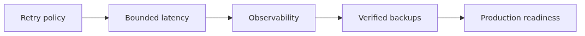
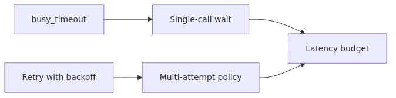

# SQLite Production Patterns: retry, timeout, observability, backup

The previous nine posts covered nearly every behavior of SQLite and PEP 249. This finale is about wiring those behaviors into a production-grade application. SQLite is light, but lightness is not an excuse to drop operational visibility. Retries should be measured, slow queries should be flagged automatically, traces should reach the SQL layer, and backups should be verified.

This post does not introduce many new ideas. It composes the patterns from earlier posts into a single production-ready shape that you can copy into a service.


## Questions this post answers

- How should retry, timeout, and `busy_timeout` be configured together?
- How do you automate slow-query logging, and how do you pick the threshold?
- How do you instrument SQLite calls with OpenTelemetry?
- What is the difference between the three backup methods (file copy, `.backup`, online backup API)?
- What absolutely belongs on a SQLite production checklist?

## Why this matters

When a SQLite-backed service misbehaves in production, the most common reactions are: (1) "I don't know, restart it", or (2) "Just `cp` the DB file". Both work some of the time, but they bet your data integrity and your SLO on luck.

The goal here is to remove luck from the picture. Retries become measurable thanks to backoff and jitter, timeouts become deliberate, observability is a one-decorator concern, and backups are transactionally consistent and routinely verified.

## Mental Model: SQLite is still a DBMS


> SQLite being a single file simplifies operations, but treating it as "just a file" is dangerous. Copying a file mid-transaction yields a corrupted backup. SQLite is light, but it is a DBMS.

Four production axes:

- **Resilience**: absorb BUSY/LOCKED via retries; never retry forever.
- **Bounded latency**: timeout + max_attempts together cap response time.
- **Observability**: every SQL call leaves a trace in metrics, traces, and logs.
- **Recoverability**: backups are transactionally consistent and recovery is verified periodically.

## Core Concepts


### timeout vs busy_timeout vs retry

Three knobs that look similar live at different layers:

| Knob | Where | Meaning |
|------|-------|---------|
| `sqlite3.connect(timeout=5.0)` | Python | Convenience setter for `busy_timeout` (5000 ms) |
| `PRAGMA busy_timeout=5000` | SQLite engine | Max time to wait for a lock during one call |
| Application retry | Code | Re-attempt OperationalError(BUSY/LOCKED) |

`busy_timeout` is the wait inside **one** call; retry is a policy across **multiple** calls. You need both. A long busy_timeout alone makes one call hang too long; retry alone misses brief lock-hold windows.

A reasonable starting point: `busy_timeout=2000-5000 ms` plus `max_attempts=3-5`.

### Picking a slow-query threshold

"Slow" is not an absolute number. Take 2-3x your p95 latency, log SQL text and a trimmed parameter slice (PII masked), and alert when the rate exceeds a target. Too low a threshold floods logs; too high a threshold lets gradual regressions slip past.

### Three backup methods

| Method | Consistent? | Downtime | Fit |
|--------|-------------|----------|-----|
| `cp app.db backup.db` | No | None | Never use |
| sqlite3 shell `.backup` | Yes | Negligible | Recommended for ops |
| Python `Connection.backup()` | Yes | Negligible | Code integration |
| `VACUUM INTO 'backup.db'` | Yes | Can be long | When you also want compaction |

`Connection.backup()` calls SQLite's online backup API. It is safe while transactions are in progress and works under WAL.

## Before / After: a single production-ready module

### Before: scattered handling

```python
import sqlite3, logging

def get_user(user_id):
    conn = sqlite3.connect("app.db")
    try:
        return conn.execute("SELECT * FROM users WHERE id=?", (user_id,)).fetchone()
    except Exception as e:
        logging.error(e)
        return None
```

No retry, no timeout, no slow-query measurement, no tracing. A single BUSY in production fails the request outright.

### After: a single module that owns the patterns

```python
# db.py
from __future__ import annotations
import sqlite3
import time
import random
import logging
import functools
from contextlib import contextmanager
from typing import Callable, Iterator, ParamSpec, TypeVar

log = logging.getLogger("db")
SLOW_QUERY_THRESHOLD_MS = 200.0

P = ParamSpec("P")
R = TypeVar("R")

RETRYABLE = {"SQLITE_BUSY", "SQLITE_BUSY_TIMEOUT", "SQLITE_LOCKED"}

def open_conn(path: str) -> sqlite3.Connection:
    conn = sqlite3.connect(path, isolation_level=None, timeout=5.0)
    conn.execute("PRAGMA journal_mode=WAL")
    conn.execute("PRAGMA synchronous=NORMAL")
    conn.execute("PRAGMA foreign_keys=ON")
    conn.execute("PRAGMA busy_timeout=5000")
    conn.row_factory = sqlite3.Row
    return conn

def is_retryable(exc: BaseException) -> bool:
    if not isinstance(exc, sqlite3.OperationalError):
        return False
    return getattr(exc, "sqlite_errorname", "") in RETRYABLE

def retry(*, max_attempts: int = 5, base_delay: float = 0.05, max_delay: float = 1.0):
    def deco(fn: Callable[P, R]) -> Callable[P, R]:
        @functools.wraps(fn)
        def wrapper(*args: P.args, **kwargs: P.kwargs) -> R:
            for attempt in range(1, max_attempts + 1):
                try:
                    return fn(*args, **kwargs)
                except Exception as exc:
                    if attempt == max_attempts or not is_retryable(exc):
                        raise
                    delay = min(max_delay, base_delay * (2 ** (attempt - 1)))
                    delay += random.uniform(0, delay * 0.1)
                    log.info("db retry attempt=%d delay=%.3fs exc=%s", attempt, delay, exc)
                    time.sleep(delay)
            raise RuntimeError("unreachable")
        return wrapper
    return deco

@contextmanager
def timed_query(label: str) -> Iterator[None]:
    t0 = time.perf_counter()
    try:
        yield
    finally:
        elapsed_ms = (time.perf_counter() - t0) * 1000
        if elapsed_ms >= SLOW_QUERY_THRESHOLD_MS:
            log.warning("slow query label=%s elapsed_ms=%.1f", label, elapsed_ms)
```

A connection factory with WAL+busy_timeout, a retry decorator scoped to BUSY/LOCKED, and a slow-query timer in one place. The next steps add OpenTelemetry and backups.

## Step by Step


### Step 1. OpenTelemetry SQL spans

```python
# tracing.py
from opentelemetry import trace

tracer = trace.get_tracer("app.db")

def trace_query(label: str):
    def deco(fn):
        @functools.wraps(fn)
        def wrapper(*args, **kwargs):
            with tracer.start_as_current_span(f"db.{label}") as span:
                span.set_attribute("db.system", "sqlite")
                t0 = time.perf_counter()
                try:
                    return fn(*args, **kwargs)
                finally:
                    span.set_attribute("db.duration_ms", (time.perf_counter()-t0)*1000)
        return wrapper
    return deco
```

You may be tempted to set `db.statement` to the raw SQL. Don't, because of PII risk. Use a label or a normalized SQL form.

### Step 2. Compose decorators

```python
@trace_query("get_user")
@retry(max_attempts=5)
def get_user(conn, user_id: int):
    with timed_query("get_user"):
        cur = conn.execute("SELECT id, email FROM users WHERE id=?", (user_id,))
        row = cur.fetchone()
    return dict(row) if row else None
```

Order matters. `@retry` should be the inner decorator and `@trace_query` the outer one, so all retries appear inside a single span.

### Step 3. Online backup

```python
# backup.py
import sqlite3
from pathlib import Path

def backup_db(src_path: str, dst_path: str, *, pages: int = 1000) -> None:
    src = sqlite3.connect(src_path)
    dst = sqlite3.connect(dst_path)
    try:
        src.backup(dst, pages=pages, progress=lambda status, remaining, total: None)
    finally:
        src.close()
        dst.close()
```

`pages` is the number of pages to copy per step. The default (`-1`) copies everything in one go; for larger DBs, set it to ~1000 and throttle inside the progress callback (e.g., `time.sleep(0.01)`) to limit the impact on writers.

### Step 4. Scheduled backup

```python
# scripts/backup.py
import sys, time, gzip, shutil
from pathlib import Path
from app.backup import backup_db

def main():
    src = Path("app.db")
    today = time.strftime("%Y%m%d-%H%M%S")
    dst = Path(f"backups/app-{today}.db")
    dst.parent.mkdir(parents=True, exist_ok=True)
    backup_db(str(src), str(dst))
    with open(dst, "rb") as f, gzip.open(f"{dst}.gz", "wb") as gz:
        shutil.copyfileobj(f, gz)
    dst.unlink()

if __name__ == "__main__":
    main()
```

Run from cron or a systemd timer. Pair with a retention policy (e.g., daily + weekly + monthly).

### Step 5. Restore verification

A backup proves itself only by being restored. Periodically restore to a tempdir and run an integrity check.

```python
# scripts/restore_check.py
import sqlite3, gzip, shutil, sys, tempfile
from pathlib import Path

def restore_check(gz_path: str) -> None:
    with tempfile.TemporaryDirectory() as td:
        plain = Path(td) / "restored.db"
        with gzip.open(gz_path, "rb") as gz, open(plain, "wb") as f:
            shutil.copyfileobj(gz, f)
        conn = sqlite3.connect(plain)
        result = conn.execute("PRAGMA integrity_check").fetchone()[0]
        if result != "ok":
            sys.exit(f"integrity_check failed: {result}")
        rows = conn.execute("SELECT count(*) FROM users").fetchone()[0]
        print(f"restored OK; users={rows}")
```

Run weekly in CI. This catches silent breakage of the backup pipeline before you actually need to restore.

## Common Mistakes

**Backing up with `cp`.** Mid-transaction copies are corrupted. Always use `Connection.backup()` or `.backup`.

**Setting only timeout or only retry.** `busy_timeout` caps wait inside a call; retry is the policy across calls. You need both for a real response-time bound.

**No slow-query threshold.** Without a definition of "slow", every postmortem invents one. Encode "2-3x p95" in code so it is hard to argue.

**Sending raw SQL to traces.** PII risk. Use a label or normalized SQL.

**Skipping restore verification.** Daily backups that nobody restores will be broken on the day they are needed.

**Ignoring `-wal` and `-shm` files.** Under WAL, SQLite creates `app.db-wal` and `app.db-shm` next to `app.db`. Either include them in physical copies or use `Connection.backup()` to fold everything into a single file.

## In Practice: an SLO-driven runbook

Common SLO items and how to measure them:

| Indicator | Source |
|-----------|--------|
| Query p95 | OpenTelemetry span duration |
| BUSY rate | Retry decorator's "attempt >= 2" ratio |
| Slow-query rate | Count of `slow query` log lines / total queries |
| Backup success rate | Backup script exit code, restore verification result |
| Disk usage | `ls -l app.db*` and `PRAGMA page_count * page_size` |

Reasonable alert thresholds: BUSY rate > 1%, slow-query rate > 5%, any backup failure. Tune both ways: too sensitive causes alert fatigue, too permissive misses real degradations.

## Checklist

- [ ] Connection factory sets WAL, foreign_keys, and busy_timeout?
- [ ] Retry scoped to BUSY/LOCKED only, with bounded `max_attempts` and jitter?
- [ ] Slow-query threshold defined in code or config?
- [ ] OpenTelemetry spans carry `db.system=sqlite` and a label?
- [ ] PII masked in SQL/parameter logs and span attributes?
- [ ] Backups use `Connection.backup()` or `.backup`?
- [ ] Retention policy (daily/weekly/monthly) defined?
- [ ] Restore verification scheduled?
- [ ] BUSY rate and slow-query rate exposed as metrics?
- [ ] Disk usage including WAL files monitored?

## Exercises

1. **Compose.** Add OpenTelemetry instrumentation to the `db.py` above and write a unit test that asserts: 5 retries, 200 ms threshold, single span.
2. **Load.** Write a script that simulates 1000 RPS and measure p50/p95/p99 latency, BUSY rate, retry rate.
3. **Backup comparison.** On a 1 GB database compare (a) `cp`, (b) `.backup`, (c) `Connection.backup(pages=1000)` for elapsed time and resulting size. Method (a) is forbidden in production, but seeing the difference is instructive.
4. **Alerting.** Document on a single page how you would reduce false positives and false negatives for an alert defined as "BUSY rate > 1% sustained for 5 minutes".

## Wrap-up: series finale

Ten posts covered:

- The DB-API 2.0 interface (PEP 249) and how `sqlite3` maps onto it
- Connection, cursor, paramstyle, executemany
- Parameter binding and SQL-injection prevention
- Transactions and isolation, WAL, autocommit
- Row factories and type adapter/converter
- The PEP 249 exception hierarchy and retry policy
- Thread-safety, check_same_thread, and connection strategy
- aiosqlite and async patterns
- Production patterns: retry, timeout, observability, backup

You now have the tools to build a small but operable SQLite-backed service. The next series puts SQLAlchemy on top of this foundation to move into ORM and session-management patterns. You do not need prior SQLAlchemy knowledge; the transaction and connection concepts from this series translate directly.

Thanks for reading.

<!-- toc:begin -->
## In this series

- [Why DB-API 2.0 - The Problem PEP 249 Solved](./01-why-db-api-pep-249.md)
- [Connection and Cursor Lifecycle](./02-connection-cursor-lifecycle.md)
- [execute, executemany, and Fetch Patterns](./03-execute-fetch-patterns.md)
- [Parameter binding and SQL injection defense (sqlite3, PEP 249)](./04-parameter-binding-sql-injection.md)
- [Transactions and isolation levels (sqlite3, PEP 249)](./05-transactions-isolation.md)
- [Row factories and type adapters (sqlite3, PEP 249)](./06-row-factories-adapters.md)
- [PEP 249 Exception Hierarchy and SQLite Error Handling](./07-error-handling-exception-hierarchy.md)
- [SQLite Connection Management: thread-safety, check_same_thread, and Pooling](./08-connection-pooling.md)
- [Asynchronous SQLite with aiosqlite](./09-async-aiosqlite.md)
- **SQLite Production Patterns: retry, timeout, observability, backup (current)**

<!-- toc:end -->

## References

- [Python `sqlite3.Connection.backup`](https://docs.python.org/3/library/sqlite3.html#sqlite3.Connection.backup)
- [SQLite Online Backup API](https://www.sqlite.org/backup.html)
- [SQLite PRAGMA busy_timeout](https://www.sqlite.org/pragma.html#pragma_busy_timeout)
- [OpenTelemetry — Semantic Conventions for Database Calls](https://opentelemetry.io/docs/specs/semconv/database/database-spans/)
- [SQLite — VACUUM INTO](https://www.sqlite.org/lang_vacuum.html#vacuuminto)

Tags: Python, DB-API, PEP 249, Database
