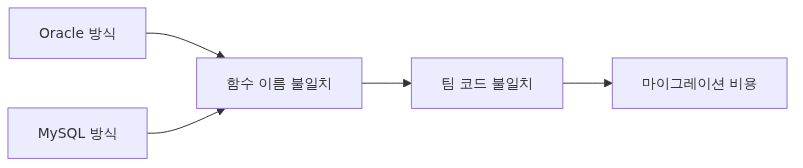
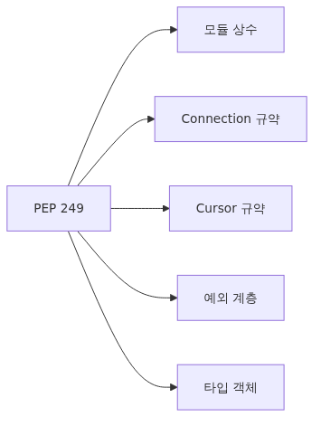

# 왜 DB-API 2.0인가 - PEP 249가 푼 문제

Python으로 데이터베이스를 다룬 적이 있다면 `sqlite3`, `psycopg`, `pymysql`, `oracledb` 같은 패키지를 한 번쯤 써봤을 겁니다. 그리고 신기하게도 그 사용법이 묘하게 비슷합니다. `connect()`로 연결을 만들고 `cursor()`로 cursor를 받고 `execute()`로 쿼리를 던지고 `fetchone()`/`fetchall()`로 결과를 꺼냅니다. 이 통일성은 우연이 아니라 1996년에 합의된 표준, **PEP 249 — Python Database API Specification v2.0** (줄여서 DB-API 2.0) 덕분입니다.

이번 첫 글에서는 DB-API 2.0이 왜 필요했는지, 무엇을 표준화했는지, 그리고 왜 이 시리즈가 SQLite를 기준으로 출발하는지 정리합니다.

이 글은 Python DB-API 101 시리즈의 첫 번째 글입니다.


*Why DB-API 2.0 - the problem PEP 249 solved*

## 이 글에서 다룰 문제

- PEP 249 이전에는 Python의 데이터베이스 접근 코드가 왜 그렇게 제각각이었을까요?
- DB-API 2.0은 정확히 어떤 다섯 가지를 표준화했을까요?
- driver마다 `paramstyle`이 다른데도 왜 애플리케이션 코드는 대부분 그대로 옮겨질까요?
- DB-API가 일부러 표준화하지 않은 영역은 어디까지일까요?

> DB-API 2.0의 핵심은 "모든 driver를 똑같이 만드는 것"이 아니라, 애플리케이션 코드가 공통된 최소 계약 위에서 움직이게 만드는 것입니다.

## 1. DB-API 이전의 혼돈



*DB-API 이전의 혼돈*
표준이 없던 시절, 각 데이터베이스 라이브러리는 자기만의 API를 가졌습니다.

```python
# Imagined old oracle module
conn = oracle.open("dsn", "user", "pass")
result = oracle.run_sql(conn, "SELECT * FROM users")
rows = oracle.read_all(result)

# Imagined old mysql module
db = mysql.connect("server")
db.send("SELECT * FROM users")
data = db.receive_rows()
```

같은 일을 시키는데 함수 이름, 인자 순서, 반환 타입이 모두 달랐습니다. 한 회사 안에서도 oracle 코드와 mysql 코드가 완전히 다른 모양을 가졌고, DB를 갈아끼우는 것은 사실상 코드를 새로 쓰는 일이었습니다.

## 2. PEP 249가 표준화한 5가지



*PEP 249가 표준화한 5가지*
DB-API 2.0은 모든 driver가 지켜야 할 최소 contract를 정의합니다.

1. **Module-level constants**: `apilevel`, `threadsafety`, `paramstyle`
2. **Connection objects**: `connect()`, `close()`, `commit()`, `rollback()`, `cursor()`
3. **Cursor objects**: `execute()`, `executemany()`, `fetchone()`, `fetchall()`, `fetchmany()`, `rowcount`, `description`
4. **Type objects**: `Date`, `Time`, `Timestamp`, `Binary`, `STRING`, `NUMBER`, `DATETIME`, `ROWID`
5. **Exception hierarchy**: `Error` → `InterfaceError`, `DatabaseError` → `DataError`, `OperationalError`, `IntegrityError`, `InternalError`, `ProgrammingError`, `NotSupportedError`

이 정도만 합의되어도 application 코드는 driver 교체에 매우 유연해집니다.

## 3. SQLite로 첫 DB-API 코드 작성하기

이 시리즈는 모든 예제를 SQLite로 진행합니다. SQLite는 Python 표준 라이브러리(`sqlite3`)에 포함되어 있어서 별도 설치가 없고, 파일 하나가 곧 데이터베이스라 환경 셋업이 사실상 0초입니다.

```python
import sqlite3

# 1. Open a connection — the file is auto-created if missing
conn = sqlite3.connect("notes.db")

# 2. Acquire a cursor
cur = conn.cursor()

# 3. Prepare schema
cur.execute("""
    CREATE TABLE IF NOT EXISTS notes (
        id INTEGER PRIMARY KEY,
        title TEXT NOT NULL,
        body TEXT
    )
""")

# 4. INSERT with parameter binding
cur.execute(
    "INSERT INTO notes (title, body) VALUES (?, ?)",
    ("Starting DB-API", "First PEP 249 example"),
)

# 5. Commit the transaction
conn.commit()

# 6. SELECT
cur.execute("SELECT id, title FROM notes")
for row in cur.fetchall():
    print(row)

# 7. Cleanup
cur.close()
conn.close()
```

이 7단계는 PostgreSQL이든 MySQL이든 거의 그대로입니다. 차이점은 `connect()` 인자와 `paramstyle`(parameter 표기법) 정도입니다.

## 4. paramstyle 한 가지가 다르다


*paramstyle 한 가지가 다르다*
PEP 249는 5가지 paramstyle을 허용합니다.

| paramstyle | 예시 | 사용 driver |
| --- | --- | --- |
| `qmark` | `WHERE id = ?` | sqlite3 |
| `numeric` | `WHERE id = :1` | oracledb |
| `named` | `WHERE id = :id` | sqlite3, oracledb |
| `format` | `WHERE id = %s` | psycopg2(legacy), pymysql |
| `pyformat` | `WHERE id = %(id)s` | psycopg2 |

driver를 import한 후 `module.paramstyle`로 어떤 표기법을 쓰는지 확인할 수 있습니다.

```python
import sqlite3
print(sqlite3.paramstyle)  # 'qmark'
```

이 한 가지 차이만 추상화하면 driver 교체가 한결 수월해집니다. SQLAlchemy 같은 라이브러리는 이 차이를 자동으로 흡수해주는 역할을 합니다 (다음 시리즈에서 다룹니다).

## 5. 같은 코드를 PostgreSQL로 옮기기

위 SQLite 예제를 psycopg(PostgreSQL driver)로 옮기면 거의 변화가 없습니다.

```python
import psycopg

conn = psycopg.connect("dbname=notes user=postgres password=secret")
cur = conn.cursor()

cur.execute("""
    CREATE TABLE IF NOT EXISTS notes (
        id SERIAL PRIMARY KEY,
        title TEXT NOT NULL,
        body TEXT
    )
""")

cur.execute(
    "INSERT INTO notes (title, body) VALUES (%s, %s)",  # qmark -> format
    ("Starting DB-API", "First PEP 249 example"),
)
conn.commit()

cur.execute("SELECT id, title FROM notes")
for row in cur.fetchall():
    print(row)

cur.close()
conn.close()
```

바뀐 곳은 `import` 라인, `connect()` 인자, parameter 표기법(`?` -> `%s`) 세 곳뿐입니다. application 로직(execute, fetchall, commit, rollback)은 그대로 작동합니다.

## 6. DB-API가 안 다루는 것

표준이라고 해서 모든 걸 표준화하지는 않습니다. PEP 249가 의도적으로 비워둔 영역이 있습니다.

- **Connection pooling**: driver/library가 알아서 (sqlite3는 단일 connection 권장, psycopg는 `psycopg_pool` 별도)
- **Async API**: PEP 249 자체는 sync. async는 `aiosqlite`, `asyncpg`, `aiomysql`로 별도
- **ORM 기능**: SQLAlchemy, Django ORM, Tortoise ORM이 별도 추상화
- **Schema migration**: Alembic, Django migrations가 별도
- **Server-side cursor 세부사항**: 일부만 표준화, 대부분 driver 확장

이 빈 곳을 채우는 것이 SQLAlchemy, Alembic, FastAPI + databases 같은 상위 라이브러리의 존재 이유입니다.

## 흔히 놓치는 함정 다섯 가지

### 1. autocommit이 driver마다 다름

PEP 249는 명시적 transaction을 가정합니다. SQLite는 default가 "암묵적 transaction begin", PostgreSQL/MySQL은 "default autocommit OFF". 같은 코드라도 `conn.commit()`을 빠뜨리면 driver별로 결과가 다릅니다.

### 2. cursor를 닫지 않음

`cur.close()`를 호출하지 않아도 GC로 정리되지만, server-side cursor를 쓰는 PostgreSQL 같은 환경에서는 connection leak처럼 보일 수 있습니다. `with conn.cursor() as cur:` 패턴(driver가 지원하면)을 쓰는 습관이 안전합니다.

### 3. fetchall()을 큰 결과에 사용

`fetchall()`은 모든 row를 메모리에 올립니다. 100만 row면 OOM. 큰 결과는 `fetchmany(size=1000)`나 cursor 자체의 iterator를 쓰세요.

```python
cur.execute("SELECT * FROM big_table")
for row in cur:  # streaming iteration
    process(row)
```

### 4. execute()를 string concatenation으로 만듦

```python
# Never do this — SQL injection
cur.execute(f"SELECT * FROM users WHERE name = '{name}'")
```

반드시 parameter binding을 사용해야 합니다. 4편에서 자세히 다룹니다.

### 5. 같은 connection을 여러 thread에서 공유

`threadsafety=1`인 driver는 connection을 thread간 공유 불가입니다. sqlite3는 default가 `check_same_thread=True`라 다른 thread에서 쓰면 에러. multi-threaded app에서는 thread당 connection을 만들거나 connection pool을 씁니다.

## 정리

- DB-API 2.0(PEP 249)은 Python 데이터베이스 driver가 따르는 최소 공통 계약입니다.
- `connect → cursor → execute → fetch → commit → close` 흐름은 sqlite3, psycopg, pymysql에서 거의 같습니다.
- driver 간 가장 눈에 띄는 차이는 `paramstyle`이며, 나머지 애플리케이션 로직은 대부분 유지됩니다.
- DB-API는 pooling, async, ORM, migration 같은 상위 문제를 일부러 비워 두었습니다.
- autocommit, cursor 정리, `fetchall()` 메모리 사용, SQL injection, thread safety가 가장 먼저 부딪히는 함정입니다.

다음 글에서는 connection과 cursor의 lifecycle을 더 깊이 들여다보고, context manager로 안전하게 다루는 패턴을 정리합니다.

<!-- a-grade-example:begin -->

## 체크리스트

- [ ] sqlite3로 connect → cursor → execute → fetch → close 사이클을 한 번 돌렸다.
- [ ] 같은 코드를 PostgreSQL(psycopg) 드라이버로 옮길 때 무엇이 달라지는지 확인했다.
- [ ] paramstyle 차이를 한 줄로 설명할 수 있다.
- [ ] DB-API가 제공하지 않는 기능(connection pool, ORM, migration)을 구분할 수 있다.

<!-- a-grade-example:end -->

<!-- toc:begin -->
## 시리즈 목차

- **왜 DB-API 2.0인가 - PEP 249가 푼 문제 (현재 글)**
- Connection과 Cursor Lifecycle (예정)
- execute, executemany, fetch 패턴 (예정)
- Parameter binding과 SQL injection 방어 (sqlite3, PEP 249) (예정)
- Transaction과 isolation level (sqlite3, PEP 249) (예정)
- Row factory와 type adapter (sqlite3, PEP 249) (예정)
- PEP 249 예외 계층과 SQLite 에러 처리 (예정)
- SQLite Connection 관리: thread-safety, check_same_thread, 그리고 풀링 (예정)
- aiosqlite로 비동기 SQLite 다루기 (예정)
- SQLite Production 패턴: retry, timeout, 관측성, 백업 (예정)

<!-- toc:end -->

---

## 참고 자료

- [PEP 249 - Python Database API Specification v2.0](https://peps.python.org/pep-0249/)
- [Python sqlite3 module documentation](https://docs.python.org/3/library/sqlite3.html)
- [SQLite official documentation](https://www.sqlite.org/docs.html)
- [psycopg 3 documentation - DB-API 2.0 compliance](https://www.psycopg.org/psycopg3/docs/)

Tags: Python, DB-API, PEP 249, Database
