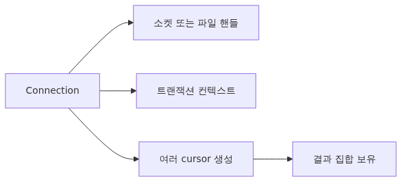
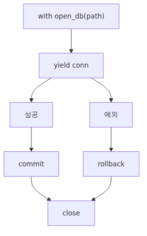
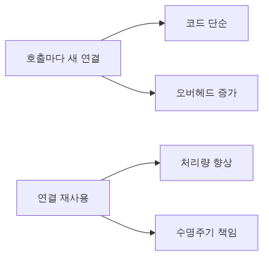

# Connection과 Cursor Lifecycle

> Python DB-API 101 시리즈 (2/10)

---

DB-API의 두 핵심 객체는 connection과 cursor입니다. 이름은 평범하지만, 둘의 lifecycle을 잘못 다루면 connection leak, lock, race condition이 줄줄이 생깁니다. 이 글에서는 두 객체가 어떻게 만들어지고 살고 닫히는지, context manager로 안전하게 관리하는 패턴, 그리고 자주 빠지는 lifecycle 함정을 정리합니다.

<!-- a-grade-intro:begin -->


## 핵심 질문

- Connection과 Cursor는 각각 어떤 책임을 가질까요?
- context manager(`with`)는 connection·cursor 자원을 어떻게 보호할까요?
- Connection을 매번 새로 여는 것과 재사용하는 것의 trade-off는 무엇일까요?
- close를 빠뜨리면 어떤 증상이 나타날까요?

<!-- a-grade-intro:end -->

## 1. Connection이란


Connection은 application과 database 사이의 단일 통신 채널입니다. TCP socket(PostgreSQL, MySQL) 또는 file handle(SQLite)을 감싼 객체이고, 한 connection은 한 transaction context를 가집니다.

```python
import sqlite3
conn = sqlite3.connect("notes.db")
print(type(conn))           # <class 'sqlite3.Connection'>
print(conn.in_transaction)  # False (아직 query 안 함)
```

`sqlite3.connect()`의 인자 몇 가지를 살펴보면 lifecycle을 더 잘 이해할 수 있습니다.

```python
conn = sqlite3.connect(
    "notes.db",
    timeout=5.0,                  # lock 대기 시간
    isolation_level="DEFERRED",   # transaction 시작 전략 (None이면 autocommit)
    check_same_thread=True,       # thread간 사용 금지
    cached_statements=128,        # statement cache 크기
)
```

## 2. Cursor란

Cursor는 single query 실행 단위입니다. connection 안에 cursor를 여러 개 만들 수 있고, 각 cursor는 자기 result set을 들고 있습니다.

```python
cur = conn.cursor()
cur.execute("SELECT 1")
print(cur.description)  # 마지막 query의 column 메타데이터
print(cur.rowcount)     # 영향 받은 row 수
```

SQLite는 단일 file이라 cursor가 사실상 thin wrapper지만, PostgreSQL은 cursor당 server-side state(특히 `cursor("name")`로 만든 named cursor)를 가집니다. 그래서 닫는 습관이 중요합니다.

## 3. Context manager로 안전하게


수동 close는 빠뜨리기 쉽습니다. Python의 `with` 문이 가장 안전합니다.

```python
import sqlite3

with sqlite3.connect("notes.db") as conn:
    with conn.cursor() if hasattr(conn, "__enter__") else conn:
        cur = conn.cursor()
        cur.execute("INSERT INTO notes (title) VALUES (?)", ("hello",))
    # 블록 종료 시 자동 commit (SQLite 동작)
```

주의: SQLite의 `Connection`을 `with`로 쓰면 connection을 닫는 게 아니라 transaction만 commit/rollback 합니다. connection 자체를 닫으려면 명시적으로 `conn.close()`를 호출하거나 외부 wrapper를 만들어야 합니다.

```python
from contextlib import contextmanager

@contextmanager
def open_db(path):
    conn = sqlite3.connect(path)
    try:
        yield conn
        conn.commit()
    except Exception:
        conn.rollback()
        raise
    finally:
        conn.close()

with open_db("notes.db") as conn:
    conn.execute("INSERT INTO notes (title) VALUES (?)", ("hi",))
```

이 패턴은 production code에서 거의 표준입니다. exception 발생 시 rollback, 성공 시 commit, 어떤 경우든 close 보장.

## 4. Cursor lifecycle 세부

```python
with sqlite3.connect("notes.db") as conn:
    cur = conn.cursor()
    cur.execute("SELECT id, title FROM notes")
    while True:
        row = cur.fetchone()
        if row is None:
            break
        print(row)
    cur.close()
```

cursor는 한 번에 하나의 active query만 가집니다. 같은 cursor에 새 `execute()`를 하면 이전 result set은 사라집니다. 두 query 결과를 동시에 들고 있으려면 cursor 두 개를 만드세요.

```python
cur1 = conn.cursor()
cur2 = conn.cursor()
cur1.execute("SELECT id FROM users")
cur2.execute("SELECT id FROM orders")
# 두 result set 동시 보유 가능
```

## 5. Connection 재사용 vs 매번 열기


매 query마다 새 connection을 여는 코드는 보기 깔끔하지만 비용이 큽니다.

```python
# 비효율 — 매 호출마다 connect/close
def get_note(note_id):
    with sqlite3.connect("notes.db") as conn:
        return conn.execute("SELECT * FROM notes WHERE id = ?", (note_id,)).fetchone()
```

SQLite 파일 connection은 약 1~2ms이지만, PostgreSQL TCP + auth handshake는 수십 ms입니다. 그래서:

- single-user CLI: 매번 열어도 OK
- multi-request server: connection pool (8편)
- long-running script: 한 번 열고 재사용

```python
# long-running용
class NoteRepo:
    def __init__(self, path):
        self.conn = sqlite3.connect(path)

    def get(self, note_id):
        return self.conn.execute(
            "SELECT * FROM notes WHERE id = ?", (note_id,)
        ).fetchone()

    def close(self):
        self.conn.close()
```

## 6. close 누락은 어떻게 보이나

connection을 안 닫으면:

- SQLite: file handle 누수, OS 한계 도달 시 `Too many open files`
- PostgreSQL: `pg_stat_activity`에 좀비 connection 누적, `max_connections` 초과 시 신규 접속 거부
- MySQL: `SHOW PROCESSLIST`에 sleeping connection, 일정 시간 후 server timeout

production에서 connection leak 진단의 첫 단계는 항상 "오래된 idle connection이 있는가" 확인입니다.

## 흔히 놓치는 함정 다섯 가지

### 1. SQLite `with conn` 의 의미 오해

`with sqlite3.connect(path) as conn:` 는 연결을 닫지 않습니다. transaction만 자동 commit/rollback 합니다. close까지 자동화하려면 위의 `open_db` 같은 wrapper가 필요합니다.

### 2. cursor를 함수 인자로 넘김

```python
def query(cur):
    cur.execute(...)
    return cur.fetchall()
```

이렇게 cursor를 외부로 노출하면 호출자가 cursor lifecycle을 책임져야 합니다. function이 connection을 받아 내부에서 cursor를 만들고 닫는 게 깔끔합니다.

### 3. Long-running connection의 idle timeout

PostgreSQL/MySQL은 서버가 idle connection을 일정 시간 후 끊습니다. application이 그 사실을 모르고 다음 query를 던지면 `OperationalError: server closed the connection`. 해결은 connection pool의 health check(`SELECT 1` ping)나 `pool_pre_ping=True`(SQLAlchemy).

### 4. Multiprocessing에서 connection 공유

`fork()` 후 자식 process가 부모의 connection을 그대로 쓰면 양쪽이 같은 socket에 동시 write 합니다. 결과는 corrupted protocol. 해결은 자식에서 새 connection을 만들거나, `multiprocessing.Process` 시작 직후 `conn = create_new_connection()`.

### 5. Cursor를 끝까지 안 읽고 새 query

```python
cur.execute("SELECT * FROM big_table")
cur.execute("SELECT 1")  # PostgreSQL: error 또는 이전 결과 폐기
```

server-side cursor를 쓰는 환경에서는 이전 결과를 다 읽거나 명시적으로 `cur.close()` 후 새 query를 던져야 합니다.

## 핵심 요약

- Connection은 통신 채널 + transaction context, cursor는 single query 실행 단위입니다.
- `with` 문은 lifecycle 관리의 표준이지만, SQLite의 `with conn`은 close가 아니라 commit/rollback만 자동화합니다.
- production은 try/commit/except/rollback/finally/close 패턴을 wrapping한 context manager로 통일합니다.
- 동시 query 결과가 필요하면 cursor 여러 개, connection은 비용이 크므로 재사용 또는 pool.
- connection leak, idle timeout, fork 공유, cursor 잔여 결과는 lifecycle에서 가장 자주 보는 오류입니다.

다음 글에서는 `execute()`, `executemany()`, `fetchone()`/`fetchall()`/`fetchmany()`의 실전 패턴을 정리합니다.

<!-- a-grade-example:begin -->

## 체크리스트

- [ ] `with sqlite3.connect(...) as conn:` 패턴으로 자원 누수 없이 query를 실행했다.
- [ ] Cursor를 여러 개 열어 동시에 동일 connection에서 read하는 동작을 확인했다.
- [ ] Connection을 매번 여는 코드와 재사용하는 코드의 성능 차이를 측정했다.
- [ ] close 누락 시 sqlite3가 던지는 경고/락 증상을 직접 재현했다.

<!-- a-grade-example:end -->

<!-- toc:begin -->
## 시리즈 목차

- [왜 DB-API 2.0인가 - PEP 249가 푼 문제](./01-why-db-api-pep-249.md)
- **Connection과 Cursor Lifecycle (현재 글)**
- execute, executemany, fetch 패턴 (예정)
- Parameter binding과 SQL injection 방어 (sqlite3, PEP 249) (예정)
- Transaction과 isolation level (sqlite3, PEP 249) (예정)
- Row factory와 type adapter (sqlite3, PEP 249) (예정)
- PEP 249 예외 계층과 SQLite 에러 처리 (예정)
- SQLite Connection 관리: thread-safety, check_same_thread, 그리고 풀링 (예정)
- aiosqlite로 비동기 SQLite 다루기 (예정)
- SQLite Production 패턴: retry, timeout, 관측성, 백업 (예정)

<!-- toc:end -->

---

## 참고 자료

- [PEP 249 - Connection and Cursor objects](https://peps.python.org/pep-0249/#connection-objects)
- [Python sqlite3 - Connection class](https://docs.python.org/3/library/sqlite3.html#sqlite3.Connection)
- [psycopg 3 - Connection lifecycle](https://www.psycopg.org/psycopg3/docs/basic/usage.html)
- [SQLite - File locking and concurrency](https://www.sqlite.org/lockingv3.html)

Tags: Python, DB-API, PEP 249, Database
