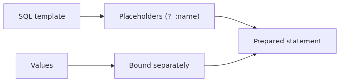
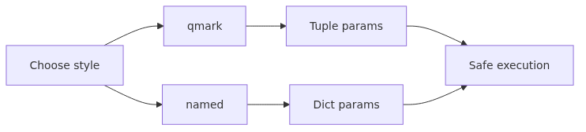
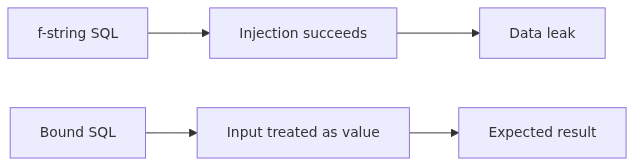

# Parameter binding과 SQL injection 방어 (sqlite3, PEP 249)

사용자 입력을 문자열로 이어 붙이는 SQL은 작은 편의처럼 보여도 전체 테이블 노출로 이어질 수 있습니다. 이 글에서는 sqlite3와 PEP 249 기준으로 parameter binding이 왜 SQL injection을 막는지 코드로 확인합니다.

이 글은 Python DB-API 101 시리즈의 네 번째 글입니다.


*Parameter binding과 SQL injection 방어 (sqlite3, PEP 249)*

## 이 글에서 다룰 문제

OWASP Top 10에 SQL injection이 20년 가까이 머무르는 이유는 단순합니다. **개발자가 query string을 직접 조립하기 때문**입니다. `f"SELECT * FROM users WHERE name = '{name}'"` 한 줄이면 `name = "' OR 1=1 --"` 같은 입력으로 모든 row가 반환됩니다.

PEP 249는 이를 driver 차원에서 막는 표준을 제시합니다. `cursor.execute(sql, params)` 호출은 SQL 문법 분석과 값 binding을 **별도 단계**에서 수행하므로, 사용자 입력이 SQL 토큰으로 해석될 가능성이 원천적으로 차단됩니다.

이 글에서는 sqlite3로 공격을 직접 재현해 보고, parameter binding으로 막는 차이를 코드로 비교합니다. 한 번 눈으로 본 개발자는 다시는 f-string SQL을 쓰지 않습니다.

---

## Mental Model — query string과 값을 끝까지 분리



*Mental Model - query string과 값을 끝까지 분리*
```text
[ User input ] ─┐
                │
                ▼
        [ cursor.execute(SQL, params) ]
                │
       ┌────────┴─────────┐
       ▼                  ▼
  [ SQL parser ]    [ value binder ]
   (parses ?, :name)   (sqlite3 type-checks
                        and escapes safely)
       │                  │
       └────────┬─────────┘
                ▼
        [ prepared statement ]
                │
                ▼
        [ SQLite executes ]
```

> SQL injection은 query string과 사용자 입력이 하나의 문자열로 합쳐지는 순간 시작됩니다. parameter binding은 이 둘을 끝까지 분리해서, 값이 SQL 문법으로 다시 해석되지 못하게 막습니다.

핵심은 SQL 토큰화(tokenization)가 binding보다 먼저 끝난다는 점입니다. `?`는 SQL parser에게 "여기에 값이 하나 들어올 자리"라고 알려 줄 뿐, 어떤 값이 와도 SQL 문법으로 재해석되지 않습니다. `' OR 1=1 --`이라는 문자열은 그대로 12글자짜리 문자열 값으로만 처리됩니다.

---

## 핵심 개념



*핵심 개념*
### qmark style (`?`)

sqlite3 default. 위치 기반 binding이라 순서가 중요합니다.

```python
cur.execute('SELECT * FROM users WHERE name = ? AND age >= ?', ('Alice', 18))
```

### named style (`:name`)

sqlite3 native. dict로 binding하면 순서 무관, 같은 값을 여러 번 참조 가능.

```python
cur.execute(
    'SELECT * FROM users WHERE name = :name AND created_by = :name',
    {'name': 'Alice'},
)
```

### paramstyle

PEP 249는 driver가 자신이 지원하는 placeholder 스타일을 `module.paramstyle`로 노출하도록 규정합니다.

| Style | Example | Drivers |
|---|---|---|
| `qmark` | `WHERE id = ?` | sqlite3 |
| `numeric` | `WHERE id = :1` | (rare) |
| `named` | `WHERE id = :id` | sqlite3, oracledb |
| `format` | `WHERE id = %s` | mysql-connector |
| `pyformat` | `WHERE id = %(id)s` | psycopg, pymysql |

sqlite3는 `qmark`와 `named`를 모두 지원합니다. `import sqlite3; print(sqlite3.paramstyle)` → `'qmark'`. portable code에서는 사용 driver의 `paramstyle`에 맞춰 구성하거나, SQLAlchemy Core 같은 abstraction을 씁니다.

### binding되지 않는 자리

placeholder는 값 자리에만 쓸 수 있습니다. 다음은 binding 대상이 아닙니다.

- table name (`FROM ?` ❌)
- column name (`SELECT ? FROM users` ❌)
- ORDER BY 방향 (`ORDER BY age ?` ❌)
- LIMIT/OFFSET (sqlite3는 일부 지원, 다른 driver는 미지원)

이런 자리에는 whitelist 검증을 거쳐 직접 문자열로 삽입합니다.

---

## Before / After



*Before / after*
### Before — 취약한 코드

```python
import sqlite3

con = sqlite3.connect(':memory:')
con.executescript('''
    CREATE TABLE users(id INTEGER PRIMARY KEY, name TEXT, secret TEXT);
    INSERT INTO users(name, secret) VALUES ('Alice', 'A-token');
    INSERT INTO users(name, secret) VALUES ('Bob',   'B-token');
''')

def find_user_BAD(name: str):
    sql = f"SELECT id, name, secret FROM users WHERE name = '{name}'"
    return con.execute(sql).fetchall()

# Normal call
print(find_user_BAD('Alice'))
# → [(1, 'Alice', 'A-token')]

# Attack
print(find_user_BAD("Alice' OR 1=1 --"))
# → [(1, 'Alice', 'A-token'), (2, 'Bob', 'B-token')]   ← all rows leaked
```

### After — parameter binding

```python
def find_user_OK(name: str):
    sql = 'SELECT id, name, secret FROM users WHERE name = ?'
    return con.execute(sql, (name,)).fetchall()

print(find_user_OK("Alice' OR 1=1 --"))
# → []   ← no user with that name, so empty
```

차이는 한 줄입니다. 그러나 보안 결과는 정반대입니다.

---

## 단계별 실습

### 단계 1 — 환경 준비

```python
import sqlite3

con = sqlite3.connect(':memory:')
con.executescript('''
    CREATE TABLE products(
        id INTEGER PRIMARY KEY,
        name TEXT NOT NULL,
        price INTEGER NOT NULL,
        category TEXT NOT NULL
    );
''')
```

### 단계 2 — `?` placeholder로 단건 insert

```python
con.execute(
    'INSERT INTO products(name, price, category) VALUES (?, ?, ?)',
    ('Notebook', 12000, 'stationery'),
)
con.commit()
```

값은 항상 **tuple 또는 list**로 넘깁니다. 단일 값이라도 `(value,)`처럼 쉼표를 빠뜨리지 마세요.

### 단계 3 — `:name` placeholder

```python
con.execute(
    '''INSERT INTO products(name, price, category)
       VALUES (:name, :price, :category)''',
    {'name': 'Pen', 'price': 1500, 'category': 'stationery'},
)
con.commit()
```

dict의 key가 placeholder 이름과 정확히 일치해야 합니다.

### 단계 4 — `executemany`로 bulk insert

```python
rows = [
    ('Eraser', 800,  'stationery'),
    ('Mug',    9000, 'kitchen'),
    ('Lamp',   25000,'home'),
]
con.executemany(
    'INSERT INTO products(name, price, category) VALUES (?, ?, ?)',
    rows,
)
con.commit()
```

dict-style:

```python
rows = [
    {'name': 'Bowl', 'price': 4000, 'category': 'kitchen'},
    {'name': 'Vase', 'price': 18000,'category': 'home'},
]
con.executemany(
    'INSERT INTO products(name, price, category) VALUES (:name, :price, :category)',
    rows,
)
con.commit()
```

### 단계 5 — `IN (...)` 다루기

placeholder는 단일 값이므로 `IN (?)`에 list를 직접 넘기면 안 됩니다. 동적으로 placeholder를 생성합니다.

```python
ids = [1, 3, 5]
placeholders = ','.join('?' * len(ids))
sql = f'SELECT * FROM products WHERE id IN ({placeholders})'
print(con.execute(sql, ids).fetchall())
```

`placeholders` 변수는 SQL 토큰(쉼표와 `?`)만 포함하므로 안전합니다. 실제 값은 여전히 binding으로 전달됩니다.

### 단계 6 — 동적 ORDER BY 안전하게

```python
ALLOWED = {'name', 'price', 'category'}
ALLOWED_DIR = {'ASC', 'DESC'}

def list_products(order_by: str, direction: str):
    if order_by not in ALLOWED or direction.upper() not in ALLOWED_DIR:
        raise ValueError('invalid sort')
    sql = f'SELECT * FROM products ORDER BY {order_by} {direction.upper()}'
    return con.execute(sql).fetchall()
```

핵심은 **whitelist 검증**입니다. 사용자 입력이 SQL에 들어가지만, 허용된 값만 통과되므로 injection이 불가능합니다.

---

## 자주 하는 실수

1. **f-string으로 SQL 조립** — 가장 흔하고 가장 위험. code review에서 무관용으로 막아야 합니다.
2. **placeholder 따옴표로 감싸기** — `WHERE name = '?'`는 placeholder가 아니라 **물음표 한 글자**입니다. driver는 placeholder를 인식하지 못해 에러를 내거나 잘못된 결과를 반환합니다.
3. **단일 값 tuple 누락** — `con.execute(sql, ('Alice'))`는 string을 iterable로 보고 5개 인자가 있다고 해석합니다. 반드시 `('Alice',)`.
4. **table/column name binding 시도** — `cursor.execute('SELECT ? FROM ?', ('id', 'users'))`는 syntax error. 이런 자리는 whitelist + f-string.
5. **`%` operator로 escape하려는 시도** — `sql % values`는 binding이 아니라 Python 문자열 포맷팅입니다. SQL injection 그대로 노출됩니다.
6. **`executemany`에 단일 dict 전달** — `executemany(sql, {'a': 1})`는 dict의 key를 iteration하므로 잘못 동작합니다. list of dicts(`[{'a': 1}, {'a': 2}]`)여야 합니다.
7. **driver paramstyle 가정** — sqlite3 코드를 그대로 psycopg에 옮기면 `?`가 동작하지 않습니다. 새 driver에서는 `module.paramstyle`을 먼저 확인하거나 SQLAlchemy로 추상화하세요.

---

## 실무 적용

### 코드 리뷰 자동 검출

`bandit` 정적 분석은 `B608` rule로 SQL string formatting을 잡아 줍니다.

```bash
pip install bandit
bandit -r src/ -ll
```

CI에 넣어 merge 전에 차단합니다.

### query 로깅에서 값 마스킹

운영 로그에 SQL과 값이 그대로 찍히면 PII가 노출될 수 있습니다. binding 사용 시 log adapter에서 값을 hash 처리하거나 길이만 남기세요.

```python
def log_sql(sql, params):
    masked = tuple('***' if isinstance(p, str) and len(p) > 0 else p for p in params)
    logger.info('sql=%s params=%s', sql, masked)
```

### prepared statement 캐싱

driver는 같은 SQL string을 반복 호출하면 prepared statement를 재사용합니다. 따라서 **SQL string은 상수로 두고, 값만 binding으로 전달**하는 것이 성능에도 유리합니다. f-string으로 매번 다른 string을 만들면 캐시가 무효화됩니다.

### migration 시 driver 교체

sqlite3 → PostgreSQL로 옮길 때 가장 흔한 이슈가 paramstyle 차이입니다. 처음부터 SQLAlchemy Core(`text(':name')` + `bindparam`)나 ORM을 쓰면 driver 교체 비용이 크게 줄어듭니다 (다음 시리즈인 `sqlalchemy-101`에서 다룹니다).

---

## 체크리스트

- [ ] 모든 SQL은 `cursor.execute(sql, params)` 형태로 작성한다.
- [ ] f-string·`%`·`+`로 값을 SQL에 합치는 코드는 코드 리뷰에서 무조건 막는다.
- [ ] 단일 값 binding은 `(value,)` 형태로 쉼표를 잊지 않는다.
- [ ] table/column name 등 binding 불가능한 자리는 whitelist로 검증한다.
- [ ] `IN (...)`은 placeholder 개수를 동적으로 생성하고 값은 binding으로 넘긴다.
- [ ] `bandit B608` 같은 정적 분석을 CI에 추가한다.
- [ ] 로그에 binding 값을 그대로 남기지 않고 마스킹 규칙을 둔다.
- [ ] 새 driver를 도입하면 `module.paramstyle`을 먼저 확인한다.

---

## 정리
PEP 249의 parameter binding은 SQL injection을 차단하는 가장 단순하면서도 가장 강력한 도구입니다. 값과 SQL 문법을 끝까지 분리하는 것이 핵심이고, 이 분리가 깨지는 자리(table name 등)는 whitelist로 보완합니다.

다음 글에서는 **transaction과 isolation level**을 다룹니다. `commit`/`rollback`의 정확한 의미, sqlite3의 `isolation_level=None` autocommit 모드, BEGIN의 종류(DEFERRED, IMMEDIATE, EXCLUSIVE)와 lock 동작을 코드로 비교합니다.

<!-- toc:begin -->
## 시리즈 목차

- [왜 DB-API 2.0인가 - PEP 249가 푼 문제](./01-why-db-api-pep-249.md)
- [Connection과 Cursor Lifecycle](./02-connection-cursor-lifecycle.md)
- [execute, executemany, fetch 패턴](./03-execute-fetch-patterns.md)
- **Parameter binding과 SQL injection 방어 (sqlite3, PEP 249) (현재 글)**
- Transaction과 isolation level (sqlite3, PEP 249) (예정)
- Row factory와 type adapter (sqlite3, PEP 249) (예정)
- PEP 249 예외 계층과 SQLite 에러 처리 (예정)
- SQLite Connection 관리: thread-safety, check_same_thread, 그리고 풀링 (예정)
- aiosqlite로 비동기 SQLite 다루기 (예정)
- SQLite Production 패턴: retry, timeout, 관측성, 백업 (예정)

<!-- toc:end -->

---

## 참고 자료

- [PEP 249 – Python Database API Specification v2.0](https://peps.python.org/pep-0249/)
- [Python sqlite3 — placeholders](https://docs.python.org/3/library/sqlite3.html#sqlite3-placeholders)
- [OWASP — SQL Injection Prevention Cheat Sheet](https://cheatsheetseries.owasp.org/cheatsheets/SQL_Injection_Prevention_Cheat_Sheet.html)
- [Bandit — B608 hardcoded_sql_expressions](https://bandit.readthedocs.io/en/latest/plugins/b608_hardcoded_sql_expressions.html)
- [SQLite SQL parameters](https://www.sqlite.org/lang_expr.html#varparam)

Tags: Python, DB-API, PEP 249, Database
