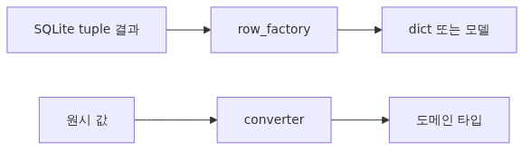

# Row factory와 type adapter (sqlite3, PEP 249)



*Row factory와 type adapter (sqlite3, PEP 249)*
<!-- a-grade-intro:begin -->
## 핵심 질문

Row factory와 type adapter는 어떻게 활용해야 하나요?

이 글은 그 질문에 답하기 위해 row factory와 type adapter의 핵심 결정과 운영 함정을 살펴봅니다.

<!-- a-grade-intro:end -->

## 이 글에서 답할 질문

- 기본 tuple 결과를 dict, dataclass, Pydantic 모델로 받으려면 어떻게 하나요?
- `sqlite3.Row`는 무엇이며 언제 충분한가요?
- `detect_types`는 무엇을 감지하나요?
- 사용자 정의 타입(`Decimal`, `datetime`, `Enum`, JSON)은 어떻게 안전하게 매핑하나요?
- adapter/converter는 PEP 249 표준에 어떻게 들어맞나요?

> Database가 돌려주는 raw tuple은 빠르지만 위험합니다. 컬럼 순서를 외워야 하고, 타입은 SQLite 5종(NULL, INTEGER, REAL, TEXT, BLOB)뿐입니다. row factory와 type adapter는 이 사이의 변환을 한 곳에 모아 줍니다.

> Python DB-API 101 시리즈 (6/10)

---

## 이 글에서 배울 것

이 글에서는 sqlite3가 SQL과 Python 사이에서 데이터를 어떻게 옮기는지 두 축으로 나눠 다룹니다.

1. **Row factory** — `cursor.fetch*()` 결과의 **shape**(tuple → Row → dict → dataclass → Pydantic).
2. **Type adapter / converter** — 단일 **값의 타입** 변환(Python `Decimal` ↔ SQLite TEXT).
3. **`detect_types`** — column declared type 또는 `[type-name]` 컬럼 별칭으로 자동 변환을 선택하는 메커니즘.
4. **사용자 정의 타입 등록** — `register_adapter` / `register_converter`로 새 타입(`Decimal`, `Enum`, JSON dict)을 안전하게 추가.
5. **타입 안전한 repository 레이어** — Pydantic 또는 dataclass를 결과 모델로 사용하는 패턴.

---

## 왜 중요한가

`row[3]`처럼 인덱스로 컬럼을 꺼내는 코드는 schema가 바뀌는 순간 침묵 속에 깨집니다. `row['name']`처럼 이름으로 꺼내거나, `row.name` 형태의 dataclass를 쓰면 schema 변경이 import error로 즉시 드러납니다.

타입 변환도 마찬가지입니다. SQLite에 금액을 `REAL`(float)로 저장하면 0.1 + 0.2 = 0.30000000000000004 같은 정밀도 사고가 발생합니다. `Decimal`을 등록하고 `TEXT`로 저장하면 정확도를 유지할 수 있습니다.

이 글은 row factory와 type adapter를 한 번에 정리해, repository 레이어가 schema/타입 변경에 견디게 만드는 방법을 코드로 보여 줍니다.

---

## Mental Model — 두 단계 변환


*Mental Model - 두 단계 변환*
```
Database row             Python value
─────────────             ────────────
                converter
SQLite TEXT  ─────────────►  Decimal('19.95')
                 (값 단계)
                 adapter
SQLite TEXT  ◄─────────────  Decimal('19.95')

[col1, col2, col3]   row_factory
        │       ─────────────►   {'id': 1, 'name': 'Alice'}
        ▼                          또는 dataclass/Pydantic
   tuple shape                    (행 단계)
```

- **adapter / converter** = **단일 값**의 타입 변환 (Python ↔ SQLite storage class).
- **row_factory** = **행 전체**의 shape 변환 (tuple → 원하는 형태).

이 둘을 분리해서 이해하면 코드 위치도 자연히 분리됩니다.

---

## 핵심 개념


*핵심 개념*
### `sqlite3.Row`

가장 가벼운 row factory. tuple처럼 인덱스로도, dict처럼 이름으로도 접근됩니다.

```python
con.row_factory = sqlite3.Row
row = con.execute('SELECT id, name FROM users WHERE id=?', (1,)).fetchone()
print(row[0], row['name'], row.keys())
```

dict는 아니지만 80% 케이스에 충분합니다.

### dict factory

진짜 dict가 필요하면:

```python
def dict_factory(cursor, row):
    return {col[0]: value for col, value in zip(cursor.description, row)}

con.row_factory = dict_factory
```

### dataclass factory

타입 안전성과 IDE 자동완성을 원하면:

```python
from dataclasses import dataclass, fields

@dataclass
class User:
    id: int
    name: str
    email: str

def dataclass_factory(cls):
    field_names = [f.name for f in fields(cls)]
    def factory(cursor, row):
        cols = [c[0] for c in cursor.description]
        return cls(**{k: v for k, v in zip(cols, row) if k in field_names})
    return factory

con.row_factory = dataclass_factory(User)
```

### Pydantic factory

검증과 직렬화가 함께 필요하면:

```python
from pydantic import BaseModel

class UserModel(BaseModel):
    id: int
    name: str
    email: str

def pydantic_factory(cls):
    def factory(cursor, row):
        cols = [c[0] for c in cursor.description]
        return cls.model_validate({k: v for k, v in zip(cols, row)})
    return factory

con.row_factory = pydantic_factory(UserModel)
```

### `detect_types`

```python
con = sqlite3.connect(
    'app.db',
    detect_types=sqlite3.PARSE_DECLTYPES | sqlite3.PARSE_COLNAMES,
)
```

- `PARSE_DECLTYPES` — `CREATE TABLE`의 컬럼 declared type(예: `created_at TIMESTAMP`)을 보고 등록된 converter 호출.
- `PARSE_COLNAMES` — `SELECT created_at AS "ts [timestamp]"`처럼 컬럼 별칭에 `[type-name]`을 붙여 강제 변환.

---

## Before / After

### Before — raw tuple + 컬럼 인덱스

```python
con = sqlite3.connect('shop.db')
row = con.execute('SELECT id, name, price FROM products WHERE id=1').fetchone()
print(row[2] * 1.1)   # 가격에 부가세
```

`SELECT` 컬럼 순서가 바뀌면 가격이 갑자기 name으로 곱해집니다.

### After — Pydantic + Decimal converter

```python
import sqlite3
from decimal import Decimal
from pydantic import BaseModel

sqlite3.register_adapter(Decimal, lambda d: str(d))
sqlite3.register_converter('decimal', lambda b: Decimal(b.decode()))

con = sqlite3.connect('shop.db', detect_types=sqlite3.PARSE_DECLTYPES)
con.execute('''CREATE TABLE IF NOT EXISTS products(
    id INTEGER PRIMARY KEY, name TEXT, price decimal
)''')

class Product(BaseModel):
    id: int
    name: str
    price: Decimal

def factory(cursor, row):
    return Product.model_validate(
        {c[0]: v for c, v in zip(cursor.description, row)}
    )

con.row_factory = factory
p = con.execute('SELECT id, name, price FROM products WHERE id=1').fetchone()
print(p.price * Decimal('1.1'))
```

컬럼 순서가 바뀌어도 안전하고, 가격은 `Decimal`로 정확합니다.

---

## 단계별 실습


*단계별 실습*
### 단계 1 — `sqlite3.Row`

```python
import sqlite3

con = sqlite3.connect(':memory:')
con.row_factory = sqlite3.Row
con.execute('CREATE TABLE users(id INTEGER PRIMARY KEY, name TEXT, email TEXT)')
con.execute('INSERT INTO users(name, email) VALUES (?, ?)', ('Alice', 'a@x.io'))

row = con.execute('SELECT * FROM users WHERE id=1').fetchone()
print(dict(row))   # {'id': 1, 'name': 'Alice', 'email': 'a@x.io'}
```

### 단계 2 — `Decimal` adapter/converter

```python
from decimal import Decimal

def adapt_decimal(d: Decimal) -> str:
    return str(d)

def convert_decimal(b: bytes) -> Decimal:
    return Decimal(b.decode())

sqlite3.register_adapter(Decimal, adapt_decimal)
sqlite3.register_converter('decimal', convert_decimal)

con = sqlite3.connect(':memory:', detect_types=sqlite3.PARSE_DECLTYPES)
con.execute('CREATE TABLE prices(value decimal)')
con.execute('INSERT INTO prices VALUES (?)', (Decimal('19.95'),))
row = con.execute('SELECT value FROM prices').fetchone()
print(row[0], type(row[0]))   # → 19.95 <class 'decimal.Decimal'>
```

### 단계 3 — `Enum` adapter

```python
from enum import Enum

class Status(str, Enum):
    PENDING = 'pending'
    PAID = 'paid'
    CANCELLED = 'cancelled'

sqlite3.register_adapter(Status, lambda s: s.value)
sqlite3.register_converter('order_status', lambda b: Status(b.decode()))

con = sqlite3.connect(':memory:', detect_types=sqlite3.PARSE_DECLTYPES)
con.execute('CREATE TABLE orders(id INTEGER, status order_status)')
con.execute('INSERT INTO orders VALUES (?, ?)', (1, Status.PAID))
row = con.execute('SELECT status FROM orders').fetchone()
print(row[0])   # → Status.PAID
```

### 단계 4 — JSON adapter

```python
import json

sqlite3.register_adapter(dict, lambda d: json.dumps(d))
sqlite3.register_converter('json', lambda b: json.loads(b.decode()))

con = sqlite3.connect(':memory:', detect_types=sqlite3.PARSE_DECLTYPES)
con.execute('CREATE TABLE events(id INTEGER, payload json)')
con.execute('INSERT INTO events VALUES (?, ?)', (1, {'k': 'v', 'n': 42}))
row = con.execute('SELECT payload FROM events').fetchone()
print(row[0])   # → {'k': 'v', 'n': 42}
```

### 단계 5 — `[type-name]` 컬럼 별칭

declared type을 못 쓰는 view나 임시 컬럼에서는 SELECT 별칭으로 강제할 수 있습니다.

```python
con = sqlite3.connect(':memory:', detect_types=sqlite3.PARSE_COLNAMES)
sqlite3.register_converter('decimal', lambda b: Decimal(b.decode()))

con.execute('CREATE TABLE t(s TEXT)')
con.execute('INSERT INTO t VALUES (?)', ('19.95',))
row = con.execute('SELECT s AS "v [decimal]" FROM t').fetchone()
print(row[0])   # → Decimal('19.95')
```

### 단계 6 — Pydantic + adapter 통합

```python
from datetime import datetime
from pydantic import BaseModel

# datetime은 sqlite3가 기본 등록 (PARSE_DECLTYPES 시 'TIMESTAMP' 컬럼 자동 변환)

class Order(BaseModel):
    id: int
    status: Status
    total: Decimal
    created_at: datetime

def order_factory(cursor, row):
    cols = [c[0] for c in cursor.description]
    return Order.model_validate(dict(zip(cols, row)))

con.row_factory = order_factory
```

이제 repository는 `Order` 객체만 다루며, SQLite의 storage class는 외부에 새지 않습니다.

---

## 자주 하는 실수

1. **컬럼 인덱스 직접 접근** — `row[0]`, `row[2]`는 schema 변경에 매우 취약합니다. 최소 `sqlite3.Row`로 시작하세요.
2. **`REAL`로 금액 저장** — float 정밀도 사고. 항상 `Decimal` + `TEXT` 또는 `INTEGER`(센트 단위) 사용.
3. **`detect_types` 누락** — adapter는 등록했는데 converter가 안 불려서 "왜 그대로 bytes로 나오지?" 함정. `PARSE_DECLTYPES`를 켜야 합니다.
4. **converter는 항상 `bytes` 입력** — `str`이 아닙니다. `b.decode()`를 잊지 마세요.
5. **adapter는 SQLite storage class 5종으로만 반환** — `int`, `float`, `str`, `bytes`, `None`. 새 객체를 그대로 반환하면 에러.
6. **timestamp 충돌** — Python 3.12부터 default timestamp converter가 deprecated. 사용자 정의 converter로 명시하는 것이 안전합니다.
7. **dict_factory 성능 가정** — 매 row마다 dict comprehension. 초당 100만 row 같은 워크로드라면 `sqlite3.Row`(C 구현)가 훨씬 빠릅니다.
8. **row_factory를 cursor에만 설정하고 connection에 안 함** — `con.row_factory = ...`로 connection에 두면 모든 cursor가 상속받습니다.

---

## 실무 적용

### Repository 레이어 패턴

```python
class UserRepo:
    def __init__(self, con: sqlite3.Connection):
        con.row_factory = pydantic_factory(UserModel)
        self.con = con

    def get(self, user_id: int) -> UserModel | None:
        return self.con.execute(
            'SELECT id, name, email FROM users WHERE id=?', (user_id,)
        ).fetchone()

    def list_active(self) -> list[UserModel]:
        return self.con.execute(
            "SELECT id, name, email FROM users WHERE status='active'"
        ).fetchall()
```

호출자는 dict 키 오타나 컬럼 순서를 신경 쓸 필요가 없습니다.

### 마이그레이션과 타입

`Decimal`을 도입하면 기존 `REAL` 컬럼을 `TEXT`로 바꿔야 합니다. 이때는 다음 글의 transaction 관리와 함께 `BEGIN IMMEDIATE → ALTER TABLE → 데이터 변환 → COMMIT` 순서로 적용합니다.

### 컬럼 별칭으로 view 처리

view나 join 결과는 declared type이 사라집니다. 별칭에 `[type-name]`을 붙이는 패턴을 운영에서 자주 씁니다.

```sql
SELECT u.id, u.name, SUM(o.total) AS "total [decimal]"
FROM users u JOIN orders o ON o.user_id = u.id
GROUP BY u.id;
```

### 성능 vs 안전 균형

- 보고서/배치: `sqlite3.Row`로 충분 (C 구현, 빠름).
- API 핸들러: dataclass/Pydantic (검증·직렬화 결합).
- 핫 루프: tuple + 명시적 unpack `for id, name in cur:`도 정당. 단, 함수 1~2개로 한정.

---

## 시니어 엔지니어는 이렇게 생각합니다

- **dict row 편의** — 딕셔너리 행은 가독성을 크게 높입니다.
- **커스텀 타입** — 도메인 타입은 adapter로 양방향 변환을 강제합니다.
- **성능 영향** — 변환 비용은 hot path에서 누적되므로 측정합니다.
- **None 처리** — NULL과 None 변환 규칙을 명확히 합니다.
- **테스트** — 변환 로직은 단위 테스트로 회귀를 막습니다.

## 체크리스트

- [ ] connection 생성 시 `row_factory`를 명시적으로 설정한다.
- [ ] 인덱스로 컬럼을 꺼내는 코드는 hot path 외에는 사용하지 않는다.
- [ ] 금액·정밀 수치는 `Decimal` adapter + `TEXT` 컬럼 또는 `INTEGER`(소수점 환산).
- [ ] adapter/converter를 사용할 때 `detect_types=PARSE_DECLTYPES`를 켠다.
- [ ] view/join 결과에는 `SELECT col AS "x [type]"` 별칭으로 converter를 강제한다.
- [ ] `Enum`, `JSON`, `Decimal`, `datetime` 같은 도메인 타입은 한 번만 등록하고 모듈 import 시 자동 적용한다.
- [ ] Repository 레이어가 외부에 SQLite storage class를 노출하지 않는다.

---

## 연습 문제

1. **factory 비교** — 같은 SELECT를 (a) 기본 tuple, (b) `sqlite3.Row`, (c) dict_factory, (d) Pydantic factory로 각각 받아 1만 row 처리 시간을 측정하세요.
2. **`Decimal` 정밀도** — `REAL`로 저장한 값 `0.1 + 0.2`와 `Decimal` adapter로 저장한 같은 연산을 비교하세요.
3. **`Enum` round-trip** — `Status.PAID`를 INSERT한 뒤 SELECT 결과의 타입이 `Status`인지 확인하세요. `PARSE_DECLTYPES`를 끄면 어떻게 되나요?
4. **JSON 컬럼 검색** — `payload`에 JSON을 저장하고 SQLite의 `json_extract(payload, '$.k')`로 검색해 보세요.
5. **자기만의 타입** — `IPv4Address`(`ipaddress.IPv4Address`)를 adapter/converter로 등록해 round-trip하세요.

---

## 정리·다음 글

row factory는 **shape**, adapter/converter는 **value**를 다룬다는 두 축만 분리하면 sqlite3의 데이터 변환은 단순해집니다. Repository 레이어를 Pydantic 모델 위에 올려 두면 schema 변경이 import error로 잡히고, 도메인 타입(`Decimal`, `Enum`, JSON)이 안전하게 흐릅니다.

다음 글에서는 **error handling과 exception hierarchy**를 다룹니다. PEP 249가 정의한 8개 예외 클래스, sqlite3의 매핑(IntegrityError, OperationalError, ProgrammingError 등), `BUSY`와 `LOCKED`의 차이, 그리고 retry 전략을 코드로 정리합니다.

<!-- toc:begin -->
## 시리즈 목차

- [왜 DB-API 2.0인가 - PEP 249가 푼 문제](./01-why-db-api-pep-249.md)
- [Connection과 Cursor Lifecycle](./02-connection-cursor-lifecycle.md)
- [execute, executemany, fetch 패턴](./03-execute-fetch-patterns.md)
- [Parameter binding과 SQL injection 방어 (sqlite3, PEP 249)](./04-parameter-binding-sql-injection.md)
- [Transaction과 isolation level (sqlite3, PEP 249)](./05-transactions-isolation.md)
- **Row factory와 type adapter (sqlite3, PEP 249) (현재 글)**
- PEP 249 예외 계층과 SQLite 에러 처리 (예정)
- SQLite Connection 관리: thread-safety, check_same_thread, 그리고 풀링 (예정)
- aiosqlite로 비동기 SQLite 다루기 (예정)
- SQLite Production 패턴: retry, timeout, 관측성, 백업 (예정)

<!-- toc:end -->

---

## 참고 자료

- [PEP 249 – Python Database API Specification v2.0](https://peps.python.org/pep-0249/)
- [Python sqlite3 — Row objects](https://docs.python.org/3/library/sqlite3.html#row-objects)
- [Python sqlite3 — Adapters and converters](https://docs.python.org/3/library/sqlite3.html#sqlite3-adapter-converter-recipes)
- [SQLite — Datatypes In SQLite](https://www.sqlite.org/datatype3.html)
- [Pydantic — Models](https://docs.pydantic.dev/latest/concepts/models/)

Tags: Python, DB-API, PEP 249, Database
