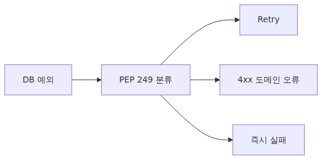
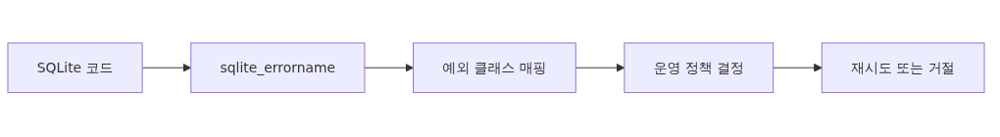
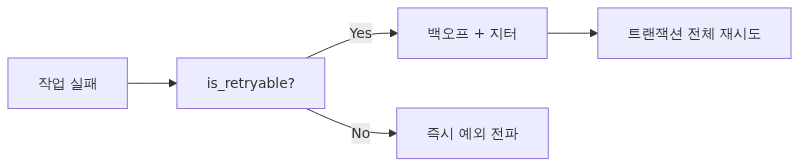

# PEP 249 예외 계층과 SQLite 에러 처리

데이터베이스 코드에서 가장 자주 보는 줄은 `try/except Exception`입니다. 모든 예외를 한 곳에서 잡고 로그만 남기는 방식은 짧게는 편하지만, 운영 환경에서는 "되돌릴 수 없는 데이터 손상"과 "잠깐 기다리면 풀리는 락 충돌"을 같은 무게로 다루게 됩니다. PEP 249는 바로 이 문제를 해결하기 위해 8개의 표준 예외 클래스를 정의했고, `sqlite3`는 SQLite 엔진이 돌려주는 에러 코드를 그 계층에 매핑합니다.

이 글은 그 매핑 표를 외우게 하려는 글이 아닙니다. "이 예외가 발생했을 때 retry해도 되는가?", "트랜잭션을 롤백해야 하는가, 그대로 두어도 되는가?"라는 운영 의사결정을 코드로 표현할 수 있도록, 예외 계층을 의사결정 트리로 다시 읽어 보겠습니다.



*PEP 249 예외 계층과 SQLite 에러 처리*

## 이 글에서 다룰 문제

운영 중인 서비스에서 `OperationalError: database is locked`가 보일 때, 흔한 대응은 두 가지입니다. (1) 모든 SQL을 try/except로 감싸고 무조건 retry, (2) 에러를 사용자에게 그대로 전달. 두 방식 모두 잘못입니다.

(1)을 선택하면 `IntegrityError`처럼 절대 retry해서는 안 되는 예외까지 반복하면서 트랜잭션이 영구적으로 잠기고, (2)를 선택하면 일시적인 락 충돌 한 번 때문에 전체 요청이 실패합니다. 정답은 "예외 클래스에 따라 다르게 처리"하는 것이고, 이를 위해서는 예외 계층이 코드 안에 명시적으로 드러나야 합니다.

또 한 가지, `sqlite3`의 예외 메시지는 영어 문장이라 패턴 매칭으로 분기하는 코드가 흔히 보입니다(`if "locked" in str(e)`). 이 코드는 SQLite 버전이 올라가 메시지 문구가 바뀌면 한 번에 무너집니다. 예외 클래스와 `sqlite_errorcode`로 분기하는 습관이 필요한 이유입니다.

## Mental Model: 예외는 "이 에러를 어떻게 다뤄야 하는가"의 신호


*Mental Model - 예외는 에러 처리 방향의 신호*
> 예외 클래스는 운영 의사결정의 신호다. retry할지, 4xx로 돌려줄지, 즉시 fail할지를 클래스 하나로 표현할 수 있어야 한다.

PEP 249의 예외 계층을 운영 관점으로 다시 그리면 다음과 같습니다.

```
Exception
└── Warning            (경고 - 보통 무시 가능)
└── Error              (모든 데이터베이스 에러의 루트)
    ├── InterfaceError (드라이버 자체의 버그/오용 - 코드 수정 필요)
    └── DatabaseError  (DB 엔진이 돌려준 에러)
        ├── DataError          (데이터 형식/범위 오류 - 입력 검증 필요)
        ├── OperationalError   (일시적 또는 환경적 문제 - retry 후보)
        ├── IntegrityError     (UNIQUE/FK/CHECK 위반 - 절대 retry 금지)
        ├── InternalError      (드라이버 내부 상태 오류 - 연결 폐기)
        ├── ProgrammingError   (SQL 문법/파라미터 오류 - 코드 버그)
        └── NotSupportedError  (지원하지 않는 기능 - 코드 수정 필요)
```

세 가지 카테고리로 묶으면 의사결정이 단순해집니다.

| 카테고리 | 포함 예외 | 대응 |
|----------|-----------|------|
| 코드/스키마 버그 | `ProgrammingError`, `InterfaceError`, `NotSupportedError`, `DataError` | 즉시 fail. 알림 발송. retry 금지. |
| 비즈니스 규칙 위반 | `IntegrityError` | 사용자에게 4xx로 전달. retry 금지. |
| 일시적 환경 문제 | `OperationalError` (BUSY, LOCKED, IO 일부) | 백오프 retry 후보. 횟수 제한. |

`InternalError`는 드물지만 발생하면 해당 connection을 폐기하고 새로 만드는 것이 안전합니다.

## 핵심 개념: SQLite 에러 코드와 PEP 249 매핑



*핵심 개념: SQLite 에러 코드와 PEP 249 매핑*
SQLite는 결과 코드를 두 단계로 정의합니다. **Primary result code**(`SQLITE_BUSY`, `SQLITE_CONSTRAINT`)와 **Extended result code**(`SQLITE_BUSY_RECOVERY`, `SQLITE_CONSTRAINT_UNIQUE`)입니다. `sqlite3` 모듈은 primary code를 보고 PEP 249 예외 클래스로 매핑합니다.

자주 마주치는 매핑은 다음과 같습니다.

| SQLite 코드 | PEP 249 예외 | 의미 | 대응 |
|------------|-------------|------|------|
| `SQLITE_CONSTRAINT_UNIQUE` | `IntegrityError` | UNIQUE 제약 위반 | 사용자 입력 거절 |
| `SQLITE_CONSTRAINT_FOREIGNKEY` | `IntegrityError` | FK 위반 | 참조 무결성 검사 |
| `SQLITE_CONSTRAINT_CHECK` | `IntegrityError` | CHECK 위반 | 비즈니스 규칙 안내 |
| `SQLITE_BUSY` | `OperationalError` | 다른 connection이 락 보유 | 백오프 retry |
| `SQLITE_LOCKED` | `OperationalError` | 같은 connection 내부 락 충돌 | 보통 코드 구조 문제 |
| `SQLITE_READONLY` | `OperationalError` | DB 파일이 읽기 전용 | 파일 권한 확인 |
| `SQLITE_CORRUPT` | `DatabaseError` | DB 파일 손상 | retry 금지, 백업 복구 |
| `SQLITE_FULL` | `OperationalError` | 디스크 full | 디스크 확보 |
| `SQLITE_MISUSE` | `ProgrammingError` | API 잘못 사용 | 코드 버그 |

같은 `OperationalError`라도 BUSY는 retry해야 하고 CORRUPT는 절대 retry해서는 안 됩니다. 즉 예외 클래스만으로는 충분하지 않고, 코드까지 봐야 합니다. Python 3.11부터는 `sqlite3.Error`가 `sqlite_errorcode`(정수)와 `sqlite_errorname`(문자열, 예: `"SQLITE_BUSY_TIMEOUT"`)을 노출합니다.

```python
import sqlite3

try:
    conn.execute("INSERT INTO users(email) VALUES (?)", ("a@example.com",))
except sqlite3.Error as exc:
    print(type(exc).__name__, exc.sqlite_errorcode, exc.sqlite_errorname)
```

3.11 미만에서는 `exc.args[0]` 문자열을 파싱하는 외에는 방법이 없으므로, 운영 코드에서는 가능한 한 3.11+를 권장합니다.

## Before / After: 예외 처리 안티패턴 vs 권장 패턴

### Before: 모든 예외를 같은 방식으로 처리

```python
def create_user(conn, email: str) -> int:
    try:
        cur = conn.execute(
            "INSERT INTO users(email) VALUES (?)", (email,)
        )
        conn.commit()
        return cur.lastrowid
    except Exception as exc:
        logging.error("insert failed: %s", exc)
        return -1
```

문제점이 세 가지 있습니다. 첫째, UNIQUE 위반과 디스크 full을 같은 로그로 남깁니다. 둘째, 호출자는 `-1`만 보고 어떻게 사용자에게 응답할지 결정해야 합니다. 셋째, `commit()` 자체에서 발생할 수 있는 `OperationalError(BUSY)`도 묻혀 버립니다.

### After: 예외 클래스로 분기하고 의도를 드러냄

```python
import sqlite3
from typing import NewType

UserId = NewType("UserId", int)

class DuplicateEmail(Exception): ...
class TransientDBError(Exception): ...

def create_user(conn: sqlite3.Connection, email: str) -> UserId:
    try:
        cur = conn.execute(
            "INSERT INTO users(email) VALUES (?)", (email,)
        )
        conn.commit()
        return UserId(cur.lastrowid)
    except sqlite3.IntegrityError as exc:
        # UNIQUE/FK/CHECK 위반 - 사용자 입력 문제
        if exc.sqlite_errorname == "SQLITE_CONSTRAINT_UNIQUE":
            raise DuplicateEmail(email) from exc
        raise
    except sqlite3.OperationalError as exc:
        # BUSY/LOCKED 같은 일시적 문제만 transient로 분류
        if exc.sqlite_errorname in {
            "SQLITE_BUSY", "SQLITE_BUSY_TIMEOUT", "SQLITE_LOCKED"
        }:
            raise TransientDBError(str(exc)) from exc
        raise
```

도메인 예외(`DuplicateEmail`, `TransientDBError`)를 만들어 호출자가 의사결정할 수 있게 합니다. UNIQUE 위반은 4xx 응답으로, transient는 retry로, 그 외는 5xx로 분기할 수 있습니다.

## 단계별 실습: 안전한 retry 데코레이터 만들기



*단계별 실습: 안전한 retry 데코레이터 만들기*
### 1단계: 예외 분류 헬퍼 작성

```python
import sqlite3

RETRYABLE_NAMES = {
    "SQLITE_BUSY",
    "SQLITE_BUSY_RECOVERY",
    "SQLITE_BUSY_SNAPSHOT",
    "SQLITE_BUSY_TIMEOUT",
    "SQLITE_LOCKED",
    "SQLITE_LOCKED_SHAREDCACHE",
}

def is_retryable(exc: BaseException) -> bool:
    if not isinstance(exc, sqlite3.OperationalError):
        return False
    name = getattr(exc, "sqlite_errorname", "")
    return name in RETRYABLE_NAMES
```

`IntegrityError`, `ProgrammingError`, `CORRUPT`는 모두 False를 돌려줍니다.

### 2단계: 지수 백오프 retry 데코레이터

```python
import functools
import random
import time
from typing import Callable, TypeVar, ParamSpec

P = ParamSpec("P")
R = TypeVar("R")

def retry_on_transient(
    *, max_attempts: int = 5, base_delay: float = 0.05, max_delay: float = 1.0
) -> Callable[[Callable[P, R]], Callable[P, R]]:
    def decorator(fn: Callable[P, R]) -> Callable[P, R]:
        @functools.wraps(fn)
        def wrapper(*args: P.args, **kwargs: P.kwargs) -> R:
            for attempt in range(1, max_attempts + 1):
                try:
                    return fn(*args, **kwargs)
                except Exception as exc:
                    if attempt == max_attempts or not is_retryable(exc):
                        raise
                    delay = min(max_delay, base_delay * (2 ** (attempt - 1)))
                    delay += random.uniform(0, delay * 0.1)  # jitter
                    time.sleep(delay)
            raise RuntimeError("unreachable")
        return wrapper
    return decorator
```

핵심은 두 가지입니다. `is_retryable`로 클래스/코드를 정확히 검사하고, 지수 백오프에 jitter를 더해 thundering herd를 막습니다.

### 3단계: 사용 예와 트랜잭션 경계

```python
@retry_on_transient(max_attempts=5)
def transfer(conn: sqlite3.Connection, src: int, dst: int, amount: int) -> None:
    with conn:  # context manager가 commit/rollback 처리
        conn.execute(
            "UPDATE accounts SET balance = balance - ? WHERE id = ?", (amount, src)
        )
        conn.execute(
            "UPDATE accounts SET balance = balance + ? WHERE id = ?", (amount, dst)
        )
```

`with conn:` 블록 전체를 함수 안에 두어야 retry할 때 트랜잭션 자체가 다시 시작됩니다. retry 대상이 되는 함수 안에서 `commit()`만 다시 호출하는 식의 부분 retry는 일관성을 깨뜨립니다.

### 4단계: 진단 로그

```python
import logging

log = logging.getLogger("db")

def is_retryable(exc: BaseException) -> bool:
    if not isinstance(exc, sqlite3.OperationalError):
        return False
    name = getattr(exc, "sqlite_errorname", "")
    code = getattr(exc, "sqlite_errorcode", -1)
    retryable = name in RETRYABLE_NAMES
    log.info(
        "db error name=%s code=%s retryable=%s msg=%s",
        name, code, retryable, exc
    )
    return retryable
```

retry 횟수, 최종 성공/실패, 마지막 예외 코드는 운영 대시보드에 그대로 보내는 것이 좋습니다. retry가 늘어나는 것은 락 경합이나 디스크 I/O가 악화되는 신호일 수 있습니다.

## 자주 하는 실수

**문자열 매칭으로 분기.** `if "UNIQUE constraint" in str(exc):`로 UNIQUE 위반을 판별하는 코드는 SQLite 메시지 변경에 취약합니다. `sqlite_errorname == "SQLITE_CONSTRAINT_UNIQUE"`를 사용하세요.

**`IntegrityError`를 retry 대상에 포함.** UNIQUE 위반을 retry해도 결과가 바뀌지 않습니다. 동일 이메일로 5번 INSERT가 5번 모두 실패할 뿐입니다.

**`with conn:` 밖에서 retry.** 트랜잭션을 시작한 뒤 일부만 다시 실행하면 SAVEPOINT 없이는 원자성을 보장할 수 없습니다. retry는 트랜잭션 전체를 다시 시작해야 합니다.

**`BaseException`을 잡음.** `KeyboardInterrupt`와 `SystemExit`까지 retry하면 종료 시그널을 무시하게 됩니다. `Exception` 또는 더 좁은 범위로 한정하세요.

**무한 retry.** 외부 락이 영원히 풀리지 않을 가능성을 무시하면 워커 스레드가 영구적으로 점유됩니다. `max_attempts`와 `max_delay`는 항상 설정합니다.

**connection을 재사용한 채 InternalError 무시.** `InternalError`나 일부 `OperationalError(SQLITE_CORRUPT)`가 발생한 connection은 폐기하고 새로 만들어야 합니다. 같은 connection으로 다음 쿼리를 보내면 같은 에러가 반복됩니다.

## 실무: FastAPI 핸들러에 통합

FastAPI에서 도메인 예외를 HTTP 응답으로 변환하는 패턴입니다.

```python
from fastapi import FastAPI, HTTPException, status

app = FastAPI()

@app.exception_handler(DuplicateEmail)
async def handle_duplicate_email(_, exc: DuplicateEmail):
    raise HTTPException(
        status_code=status.HTTP_409_CONFLICT,
        detail=f"email already exists: {exc.args[0]}",
    )

@app.exception_handler(TransientDBError)
async def handle_transient(_, exc: TransientDBError):
    # retry 데코레이터가 이미 max_attempts 만큼 시도한 뒤이므로
    # 여기서는 503으로 응답하고 클라이언트에게 재시도를 요청
    raise HTTPException(
        status_code=status.HTTP_503_SERVICE_UNAVAILABLE,
        detail="database temporarily unavailable",
    )

@app.post("/users", status_code=201)
def post_user(payload: UserCreate, conn=Depends(get_conn)):
    user_id = create_user(conn, payload.email)
    return {"id": user_id}
```

`ProgrammingError`나 `InterfaceError`는 별도 핸들러를 만들지 않고 기본 500으로 두되, 알림 채널(예: Sentry)에 자동 전송되도록 설정합니다. 이 예외들은 코드 버그이므로 retry나 사용자 안내가 아닌 즉시 수정 대상입니다.

## 체크리스트

- [ ] `try/except Exception`을 좁은 예외 클래스로 교체했는가?
- [ ] retry는 `OperationalError` 중 BUSY/LOCKED 계열만 대상으로 하는가?
- [ ] `sqlite_errorname` / `sqlite_errorcode`를 사용해 분기하는가? (Python 3.11+)
- [ ] `IntegrityError`를 사용자 입력 오류로 변환해 4xx로 응답하는가?
- [ ] retry 데코레이터에 `max_attempts`와 `max_delay`가 모두 설정되어 있는가?
- [ ] 지수 백오프에 jitter를 추가했는가?
- [ ] 트랜잭션 전체가 retry 함수 안에 들어 있는가?
- [ ] `InternalError` 발생 시 connection을 폐기하는 경로가 있는가?
- [ ] retry 횟수와 최종 결과가 로그/메트릭으로 남는가?
- [ ] `ProgrammingError`는 알림 시스템으로 즉시 전달되는가?

## 정리와 다음 글

- PEP 249 예외 계층을 "코드 버그 / 비즈니스 규칙 / 일시적 환경 문제"로 다시 묶으면 의사결정이 단순해집니다.
- `sqlite3`는 SQLite 에러 코드를 PEP 249 클래스로 매핑하지만, 같은 `OperationalError` 안에도 retry 대상과 비대상이 섞여 있어 `sqlite_errorname`까지 봐야 합니다.
- retry는 BUSY/LOCKED 계열에만 적용하고, `IntegrityError`는 도메인 예외로 변환해 4xx로 돌려줍니다.
- 트랜잭션은 retry 단위 안에 두고, `max_attempts`와 jitter를 반드시 설정합니다.

다음 글에서는 connection 자체를 다룹니다. SQLite의 thread-safety 모드, `check_same_thread`, per-thread vs shared connection, 그리고 FastAPI에서의 connection 관리 패턴을 살펴보겠습니다.

<!-- toc:begin -->
## 시리즈 목차

- [왜 DB-API 2.0인가 - PEP 249가 푼 문제](./01-why-db-api-pep-249.md)
- [Connection과 Cursor Lifecycle](./02-connection-cursor-lifecycle.md)
- [execute, executemany, fetch 패턴](./03-execute-fetch-patterns.md)
- [Parameter binding과 SQL injection 방어 (sqlite3, PEP 249)](./04-parameter-binding-sql-injection.md)
- [Transaction과 isolation level (sqlite3, PEP 249)](./05-transactions-isolation.md)
- [Row factory와 type adapter (sqlite3, PEP 249)](./06-row-factories-adapters.md)
- **PEP 249 예외 계층과 SQLite 에러 처리 (현재 글)**
- SQLite Connection 관리: thread-safety, check_same_thread, 그리고 풀링 (예정)
- aiosqlite로 비동기 SQLite 다루기 (예정)
- SQLite Production 패턴: retry, timeout, 관측성, 백업 (예정)

<!-- toc:end -->

## 참고 자료

- [PEP 249 — Python Database API 2.0](https://peps.python.org/pep-0249/)
- [`sqlite3` — DB-API 2.0 interface for SQLite](https://docs.python.org/3/library/sqlite3.html)
- [SQLite Result and Error Codes](https://www.sqlite.org/rescode.html)
- [SQLite: File Locking and Concurrency](https://www.sqlite.org/lockingv3.html)
- [What's New in Python 3.11 — sqlite3](https://docs.python.org/3/whatsnew/3.11.html#sqlite3)

Tags: Python, DB-API, PEP 249, Database
