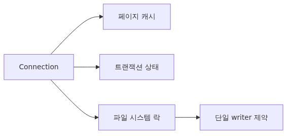
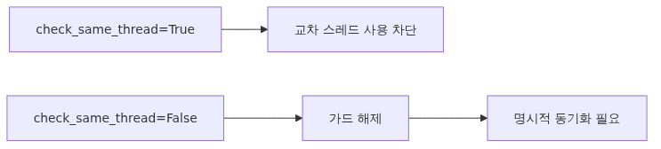

# SQLite Connection 관리: thread-safety, check_same_thread, 그리고 풀링

다른 DB와 달리 SQLite는 별도의 서버 프로세스가 없습니다. connection은 그냥 파일 핸들이고, 트랜잭션 락은 파일 시스템에 표현됩니다. 이 단순함 덕분에 SQLite는 임베디드부터 중간 규모 웹앱까지 쓰이지만, 동시에 connection을 어떻게 다룰지에 대한 의사결정을 개발자에게 그대로 떠넘깁니다.

"connection 하나를 전역으로 공유해도 되는가?", "스레드마다 새로 만들어야 하는가?", "FastAPI 같은 비동기 프레임워크에서 connection을 어떻게 쥐어야 하는가?" 이 글은 그 질문들에 답합니다.

이 글은 Python DB-API 101 시리즈의 여덟 번째 글입니다.


*SQLite Connection 관리: thread-safety, check_same_thread, 그리고 풀링*

## 이 글에서 다룰 문제

SQLite를 가볍게 도입하면 보통 두 가지 함정 중 하나에 빠집니다. 첫째, "전역 connection 하나"를 만들고 모든 스레드가 공유합니다. 트래픽이 적을 때는 잘 돌다가, 동시 요청이 늘어난 순간부터 `ProgrammingError: SQLite objects created in a thread can only be used in that same thread`가 쏟아집니다. 둘째, 그 에러를 본 뒤 `check_same_thread=False`로 끄고 그대로 둡니다. 이번에는 데이터 손상까지는 아니더라도 "어떤 트랜잭션이 어디서 commit되는지" 추적이 불가능해집니다.

올바른 답은 "thread-safety 모드를 확인하고, 스레드 모델에 맞는 connection 전략을 명시적으로 선택하는 것"입니다. SQLite의 자유도가 높기 때문에, 정책을 코드로 표현해 두지 않으면 시간이 지나면서 모두가 다른 가정을 갖게 됩니다.

## Mental Model: connection은 "파일을 연 핸들"이다



*Mental Model: connection은 "파일을 연 핸들"이다*
> SQLite connection은 다른 DB의 client/server connection과 다르다. 별도 프로세스가 없고, 락은 파일 시스템 락이며, connection 객체는 본질적으로 파일 핸들 + 캐시 + 트랜잭션 상태다.

이 차이가 결정하는 것:

- connection을 새로 여는 비용은 PostgreSQL보다 훨씬 작다. 핸드셰이크가 없다.
- 그러나 connection 객체 자체에 트랜잭션 상태와 prepared statement 캐시가 있다. 그래서 "세션"의 의미는 그대로 있다.
- 동시에 여러 connection이 같은 파일을 열 수 있지만, 쓰기는 한 번에 하나만 가능(WAL 모드에서도 writer는 1개).
- thread-safety는 SQLite C 라이브러리가 컴파일된 모드에 따라 정해진다.

이 모델을 가지면 "pool로 connection을 재사용해 비용을 아낀다"가 SQLite에서는 부차적인 목적이 된다는 것이 보입니다. 진짜 목적은 "스레드/요청별로 트랜잭션 경계를 명확하게 갖는 것"입니다.

## 핵심 개념



*핵심 개념*
### SQLite의 세 가지 thread-safety 모드

SQLite C 라이브러리는 컴파일 시 세 가지 모드 중 하나를 가집니다.

- **Single-thread (0)**: 어떤 스레드 동시성도 허용하지 않음. 임베디드용.
- **Multi-thread (1)**: 서로 다른 connection을 서로 다른 스레드에서 사용 가능. 한 connection을 두 스레드가 동시에 쓰면 안 됨.
- **Serialized (2)**: 한 connection을 여러 스레드가 동시에 사용해도 안전. 내부 mutex가 직렬화.

Python의 `sqlite3` 모듈은 사용 중인 모드를 노출합니다.

```python
import sqlite3
print(sqlite3.threadsafety)  # 0, 1, 2, or 3
```

대부분의 배포판에서 `1` 또는 `3`을 봅니다. Python 3.11+에서 값이 `3`이면 `serialized` 모드이고 한 connection을 여러 스레드가 안전하게 공유할 수 있습니다.

### `check_same_thread`의 의미

`sqlite3.connect()`는 기본값 `check_same_thread=True`로 동작합니다. 이는 **Python 레벨의 가드**이며, SQLite C 라이브러리의 thread-safety 모드와 별개입니다. 같은 connection을 만든 스레드가 아닌 다른 스레드에서 사용하려고 하면 `sqlite3` 모듈이 `ProgrammingError`를 던집니다.

```python
import sqlite3, threading

conn = sqlite3.connect("app.db")  # check_same_thread=True (default)

def worker():
    conn.execute("SELECT 1")  # ProgrammingError

threading.Thread(target=worker).start()
```

`check_same_thread=False`로 끄면 Python 가드가 사라지고, 이후의 안전성은 전적으로 SQLite C 라이브러리가 어떤 thread-safety 모드로 컴파일되어 있느냐에 달립니다. 즉 `check_same_thread=False`만으로는 안전하지 않습니다. **반드시 `sqlite3.threadsafety >= 1`인 환경에서, 그리고 한 connection을 한 번에 한 스레드만 사용하도록 코드 수준에서 보장**해야 합니다.

### per-thread vs shared connection

| 전략 | 장점 | 단점 | 적합한 경우 |
|------|------|------|------------|
| 요청마다 새 connection | 가장 단순. 트랜잭션 경계가 요청과 일치 | connection 생성 빈도가 높음(SQLite는 저비용이지만 0은 아님) | 짧은 요청, 낮은 동시성 |
| 스레드별 connection (`threading.local`) | 스레드 안에서 재사용. `check_same_thread` 가드 유지 | 스레드 풀이 커지면 connection 수 증가 | 전통적인 WSGI/Flask |
| 단일 shared connection | 가장 작은 자원 사용 | `serialized` 모드 + `check_same_thread=False` 필수, writer가 직렬화됨 | 임베디드, 단일 워커 |
| asyncio용 외부 풀(`aiosqlite`) | 코루틴 친화적 | 순차 실행 모델이라 동시성 이득은 제한적 | FastAPI/aiohttp |

### 왜 SQLite에는 큰 connection pool이 어울리지 않는가

PostgreSQL용 pool은 (1) connection 핸드셰이크 비용을 아끼고, (2) 서버의 동시 connection 한도를 보호하기 위해 존재합니다. SQLite에는 (1) 핸드셰이크가 없고, (2) 서버 프로세스가 없으므로 한도라는 개념이 다릅니다. 대신 SQLite의 한도는 **writer 1명**이라는 점입니다. 30개의 connection을 풀에 띄워도 쓰기 처리량은 늘어나지 않습니다. 오히려 writer 경쟁이 늘어 BUSY 에러만 더 자주 봅니다.

따라서 "큰 풀"이 아니라 "역할별로 나뉜 작은 풀"이 어울립니다. 예: read connection 다수 + write connection 1개.

## Before / After

### Before: 전역 connection을 그대로 공유

```python
# app.py
import sqlite3
conn = sqlite3.connect("app.db", check_same_thread=False)

def get_user(user_id: int):
    return conn.execute("SELECT * FROM users WHERE id=?", (user_id,)).fetchone()
```

문제는 두 스레드가 동시에 `execute()`를 호출하면, `serialized` 모드라도 cursor 상태와 트랜잭션 경계가 뒤섞입니다. 한 스레드가 `BEGIN`한 트랜잭션을 다른 스레드가 무심코 `commit()`해 버릴 수 있습니다.

### After: 요청 단위 connection + WAL 모드

```python
import sqlite3
from contextlib import contextmanager

DB_PATH = "app.db"

def open_conn() -> sqlite3.Connection:
    conn = sqlite3.connect(DB_PATH, isolation_level=None, timeout=5.0)
    conn.execute("PRAGMA journal_mode=WAL")
    conn.execute("PRAGMA synchronous=NORMAL")
    conn.execute("PRAGMA foreign_keys=ON")
    conn.row_factory = sqlite3.Row
    return conn

@contextmanager
def db_session():
    conn = open_conn()
    try:
        yield conn
    finally:
        conn.close()

def get_user(user_id: int):
    with db_session() as conn:
        return conn.execute(
            "SELECT * FROM users WHERE id=?", (user_id,)
        ).fetchone()
```

요청마다 새 connection을 열고 닫으며, WAL 모드로 reader가 writer를 막지 않게 합니다. SQLite의 connection 생성 비용이 작기 때문에 이 패턴이 대부분의 웹앱에 충분합니다.

## 단계별 실습: FastAPI에서 SQLite를 안전하게 쥐기


*단계별 실습: FastAPI에서 SQLite를 안전하게 쥐기*
### 1단계: 환경 점검

```python
import sqlite3
print("sqlite3 version:", sqlite3.sqlite_version)
print("threadsafety:", sqlite3.threadsafety)
```

`threadsafety`가 1 미만이라면 멀티스레드에서 connection을 공유할 수 없습니다. 보통 1 또는 3입니다.

### 2단계: connection 팩토리

```python
import sqlite3

DB_PATH = "app.db"

def open_conn(*, readonly: bool = False) -> sqlite3.Connection:
    uri = f"file:{DB_PATH}?mode={'ro' if readonly else 'rwc'}"
    conn = sqlite3.connect(
        uri,
        uri=True,
        isolation_level=None,
        timeout=5.0,
        check_same_thread=True,
    )
    conn.execute("PRAGMA journal_mode=WAL")
    conn.execute("PRAGMA synchronous=NORMAL")
    conn.execute("PRAGMA foreign_keys=ON")
    if readonly:
        conn.execute("PRAGMA query_only=ON")
    conn.row_factory = sqlite3.Row
    return conn
```

읽기 전용 connection을 별도로 열 수 있게 했습니다. read 트래픽이 많은 경우 의도를 명시할 수 있습니다.

### 3단계: FastAPI dependency

```python
from fastapi import FastAPI, Depends
import sqlite3

app = FastAPI()

def get_db() -> sqlite3.Connection:
    conn = open_conn()
    try:
        yield conn
    finally:
        conn.close()

@app.get("/users/{user_id}")
def read_user(user_id: int, db: sqlite3.Connection = Depends(get_db)):
    row = db.execute(
        "SELECT id, email FROM users WHERE id=?", (user_id,)
    ).fetchone()
    return dict(row) if row else {"error": "not found"}
```

FastAPI는 `Depends`마다 새 generator를 호출하므로, 요청 단위로 새 connection이 만들어지고 응답 후 닫힙니다.

### 4단계: write 경로 분리

```python
@app.post("/users", status_code=201)
def create_user(payload: UserCreate, db: sqlite3.Connection = Depends(get_db)):
    with db:  # context manager handles BEGIN/COMMIT
        cur = db.execute(
            "INSERT INTO users(email) VALUES (?)", (payload.email,)
        )
    return {"id": cur.lastrowid}
```

`with db:` 블록이 트랜잭션 경계를 만듭니다. 예외가 나면 롤백되고, 성공하면 commit됩니다. `isolation_level=None`로 두었기 때문에 명시적 `BEGIN`이 필요할 때는 직접 `db.execute("BEGIN IMMEDIATE")`를 호출할 수 있습니다.

### 5단계: 동시 쓰기 시뮬레이션

```python
import concurrent.futures, sqlite3

def writer(i):
    with open_conn() as conn:
        conn.execute("INSERT INTO log(msg) VALUES (?)", (f"msg-{i}",))

with concurrent.futures.ThreadPoolExecutor(max_workers=20) as ex:
    list(ex.map(writer, range(200)))
```

`busy_timeout`(`timeout=5.0`)과 WAL 모드 덕분에 이 코드가 BUSY 에러 없이 끝나는지 확인합니다. 만약 BUSY가 자주 보인다면 워커 수를 줄이거나, write를 단일 큐로 직렬화하는 구조를 검토합니다.

## 자주 하는 실수

**전역 connection 하나에 `check_same_thread=False`만 켜고 끝.** 진짜로 안전한지 검증하지 않은 상태입니다. `sqlite3.threadsafety` 값을 확인하고, 동시 쓰기가 허용되는 경계인지 명확히 하세요.

**WSGI 서버의 worker마다 connection 풀을 정교하게 관리.** SQLite에서는 과한 최적화입니다. 요청 단위 open/close가 더 단순하고 안전합니다.

**writer를 여러 스레드가 동시에 호출.** WAL 모드라도 writer는 1명입니다. 동시성을 늘리려면 read를 분리하거나, write를 큐로 직렬화하세요.

**`PRAGMA journal_mode=WAL`을 트랜잭션 안에서 실행.** WAL 전환은 트랜잭션 밖에서 한 번만 해야 합니다. connection을 열자마자 호출하세요.

**FastAPI에서 module-level singleton connection 사용.** 비동기 컨텍스트에서 트랜잭션 경계가 요청과 어긋나 의도치 않은 commit이 일어납니다. dependency-injection 패턴을 쓰세요.

**timeout 미설정.** 기본 `timeout=5.0`이 있지만 워크로드에 따라 너무 길거나 짧을 수 있습니다. p99 락 대기 시간을 측정해서 결정하세요.

## 실무: read/write 분리와 단일 writer 큐

쓰기 처리량이 병목이라면, 다음 패턴을 고려할 수 있습니다.

```python
import queue, threading, sqlite3

write_queue: queue.Queue = queue.Queue()

def writer_worker():
    conn = open_conn()
    while True:
        job = write_queue.get()
        if job is None:
            break
        sql, params = job
        with conn:
            conn.execute(sql, params)

threading.Thread(target=writer_worker, daemon=True).start()
```

요청 핸들러는 큐에 넣기만 하고, 단일 writer 스레드가 직렬로 처리합니다. 이렇게 하면 BUSY 에러를 완전히 제거할 수 있고, 트랜잭션 묶음을 키워 처리량을 올릴 수 있습니다. 단점은 쓰기 결과를 즉시 반환하기 어렵다는 것이므로, "fire-and-forget"이 허용되는 경로(예: 로그, 이벤트 기록)에 적합합니다.

읽기는 그대로 요청별 connection을 사용하면 됩니다. WAL 모드 덕분에 reader는 writer를 기다리지 않습니다.

## 체크리스트

- [ ] `sqlite3.threadsafety` 값을 확인했는가?
- [ ] connection 전략(요청별 / 스레드별 / 단일 / 큐)을 한 가지로 정했는가?
- [ ] `journal_mode=WAL`, `synchronous=NORMAL`, `foreign_keys=ON`을 connection 직후에 설정하는가?
- [ ] `timeout`(또는 `busy_timeout`)을 의도적으로 설정했는가?
- [ ] writer가 여러 스레드에서 동시에 호출되는 경로가 없는가?
- [ ] FastAPI에서는 `Depends(get_db)`로 요청 단위 connection을 주입하는가?
- [ ] 트랜잭션 경계가 `with conn:` 블록으로 명시되어 있는가?
- [ ] 읽기 전용 경로에 `mode=ro` 또는 `query_only=ON`을 사용했는가?
- [ ] 동시 쓰기 부하 테스트로 BUSY 발생률을 측정했는가?
- [ ] connection 누수가 없는지 (`PRAGMA database_list`나 OS 핸들 모니터링) 확인했는가?

## 정리
- SQLite connection은 파일 핸들에 가깝고, 큰 connection pool보다 "역할별 작은 connection 전략"이 어울립니다.
- `sqlite3.threadsafety`와 `check_same_thread`는 별개의 가드이며 둘 다 이해해야 합니다.
- 대부분의 웹앱에는 "요청 단위 open/close + WAL 모드 + busy_timeout"이 가장 단순하고 안전한 기본값입니다.
- 쓰기 병목이 있다면 read/write 분리, 단일 writer 큐를 검토합니다.

다음 글에서는 동기 모델을 떠나 `aiosqlite`로 비동기 SQLite를 다룹니다. asyncio 컨텍스트에서 connection과 트랜잭션을 어떻게 쥐는지, 그리고 FastAPI의 async path와 어떻게 어우러지는지 살펴봅니다.

<!-- toc:begin -->
## 시리즈 목차

- [왜 DB-API 2.0인가 - PEP 249가 푼 문제](./01-why-db-api-pep-249.md)
- [Connection과 Cursor Lifecycle](./02-connection-cursor-lifecycle.md)
- [execute, executemany, fetch 패턴](./03-execute-fetch-patterns.md)
- [Parameter binding과 SQL injection 방어 (sqlite3, PEP 249)](./04-parameter-binding-sql-injection.md)
- [Transaction과 isolation level (sqlite3, PEP 249)](./05-transactions-isolation.md)
- [Row factory와 type adapter (sqlite3, PEP 249)](./06-row-factories-adapters.md)
- [PEP 249 예외 계층과 SQLite 에러 처리](./07-error-handling-exception-hierarchy.md)
- **SQLite Connection 관리: thread-safety, check_same_thread, 그리고 풀링 (현재 글)**
- aiosqlite로 비동기 SQLite 다루기 (예정)
- SQLite Production 패턴: retry, timeout, 관측성, 백업 (예정)

<!-- toc:end -->

## 참고 자료

- [Python `sqlite3` — Threadsafety](https://docs.python.org/3/library/sqlite3.html#sqlite3.threadsafety)
- [SQLite And Multiple Threads](https://www.sqlite.org/threadsafe.html)
- [Write-Ahead Logging](https://www.sqlite.org/wal.html)
- [SQLite URI filenames](https://www.sqlite.org/uri.html)
- [FastAPI — Dependencies](https://fastapi.tiangolo.com/tutorial/dependencies/)

Tags: Python, DB-API, PEP 249, Database
