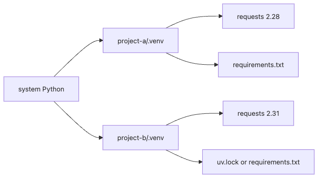

# Dependency Management — venv, pip, uv, requirements

The same code can behave differently just because two environments installed different package versions. Dependency management is how you turn that uncertainty into something reproducible.

This is post 3 in the Python Package 101 series. Here we cover virtual environments, the different jobs of `requirements.txt` and `pyproject.toml`, and why `uv` is becoming the fast path for new Python projects.

## Key Questions

- Why do we need virtual environments and how do they work?
- What is the relationship between `pip freeze` and `requirements.txt`?
- How does `uv` differ from `pip`?
- How do pyproject.toml `dependencies` and `requirements.txt` differ?

> A virtual environment gives each project its own package space, and dependency management records which packages at which versions are needed.

## What you will learn

- How to create and activate a virtual environment with `python -m venv`
- How to manage dependencies with `pip install` and `pip freeze`
- The difference between `requirements.txt` and pyproject.toml `dependencies`
- How to manage environments and packages faster with `uv`

## Why it matters

Project A uses `requests==2.28` and Project B uses `requests==2.31`. Installing both into the system Python causes version conflicts.

> You ran `pip install requests==2.28` for Project A, and Project B broke. B was using a feature added in 2.31.

Virtual environments solve this by giving each project an isolated `site-packages` directory.

## Mental Model

> A virtual environment is like giving each project its own refrigerator. If everyone shares one fridge (system Python), someone might accidentally use your ingredients. A dedicated fridge keeps your project safe from others.

```text
System Python               Virtual Environment
─────────────              ─────────────────────
site-packages/             project-a/.venv/site-packages/
  requests 2.28               requests 2.28
  flask 2.3
                           project-b/.venv/site-packages/
                              requests 2.31
                              django 4.2
```


*How per-project environments isolate package versions and lock files*

## Core Concepts

| Term | Description | Example |
|---|---|---|
| venv | Python built-in virtual environment module | `python -m venv .venv` |
| site-packages | Directory where packages are installed | `.venv/lib/python3.11/site-packages/` |
| pip freeze | Prints installed packages with exact versions | `pip freeze > requirements.txt` |
| requirements.txt | Version-pinned file for reproducible installs | `requests==2.31.0` |
| uv | High-speed package manager written in Rust | `uv pip install requests` |

## Before / After

**Before (shared system Python)**

```bash
pip install requests==2.28   # for Project A
pip install requests==2.31   # for Project B → A breaks
```

**After (isolated virtual environments)**

```bash
cd project-a && python -m venv .venv && source .venv/bin/activate
pip install requests==2.28   # project-a only

cd project-b && python -m venv .venv && source .venv/bin/activate
pip install requests==2.31   # project-b only
```

## Step-by-step practice

### Step 1. Create a virtual environment

```bash
cd ~/practice/mylib-project
python -m venv .venv
source .venv/bin/activate    # macOS/Linux
# .venv\Scripts\activate     # Windows

which python
# /home/user/practice/mylib-project/.venv/bin/python
```

### Step 2. Install packages and freeze

```bash
pip install requests flask
pip list
# requests  2.31.0
# flask     3.0.0
# ...

pip freeze > requirements.txt
cat requirements.txt
# blinker==1.7.0
# certifi==2024.2.2
# flask==3.0.0
# requests==2.31.0
# ...
```

### Step 3. Reproduce with requirements.txt

```bash
# Install the same packages in another environment
deactivate
python -m venv .venv-test
source .venv-test/bin/activate
pip install -r requirements.txt
pip list  # same packages, same versions
```

### Step 4. pyproject.toml dependencies

```toml
# pyproject.toml
[project]
name = "mylib"
version = "0.1.0"
dependencies = [
    "requests>=2.28",
    "flask>=3.0",
]

[project.optional-dependencies]
dev = [
    "pytest>=7.0",
    "ruff>=0.1",
]
```

```bash
pip install -e .            # install dependencies
pip install -e ".[dev]"     # install dev dependencies too
```

### Step 5. Manage faster with uv

```bash
pip install uv

uv venv .venv               # create venv (0.1 seconds)
source .venv/bin/activate
uv pip install requests     # install (10-100x faster than pip)
uv pip freeze               # freeze
uv pip install -r requirements.txt  # reproduce
```

## What to notice in this code

- `source .venv/bin/activate` prepends `.venv/bin` to `PATH` so the virtual environment Python takes priority
- `pip freeze` outputs all transitive dependencies, not just the packages you installed directly
- pyproject.toml `dependencies` uses minimum versions (`>=`) while `requirements.txt` uses exact versions (`==`)
- `uv` is a drop-in replacement for pip with the same command structure but much faster execution

## Common mistakes

### Mistake 1. Committing the virtual environment to Git

`.venv/` is tens of megabytes and OS-specific. Add `.venv/` to `.gitignore`.

### Mistake 2. Putting pip freeze output directly into dependencies

```toml
# Wrong: exact versions in pyproject.toml reduce compatibility
dependencies = ["requests==2.31.0", "certifi==2024.2.2"]

# Correct: minimum compatible version ranges
dependencies = ["requests>=2.28"]
```

### Mistake 3. Forgetting to activate the virtual environment

`pip install` goes into the system Python. Check the path with `which python`.

### Mistake 4. Not updating requirements.txt

If you forget to run `pip freeze > requirements.txt` after adding or removing packages, other environments cannot reproduce yours.

### Mistake 5. Confusing dependencies and requirements.txt

`dependencies` answers "what does this package need to work?" while `requirements.txt` answers "what exactly is needed to reproduce this environment?"

## Practical applications

- **CI/CD**: Reproduce the build environment with `pip install -r requirements.txt`
- **Docker**: Use `COPY requirements.txt . && pip install -r requirements.txt` to leverage layer caching
- **Dev dependency separation**: Use `[project.optional-dependencies]` to separate prod and dev dependencies
- **Security auditing**: Scan installed packages for vulnerabilities with `pip audit`
- **Speed improvement**: Cut CI/CD install times by 10x with `uv`

## How practitioners think about this

The core of dependency management is **reproducibility**. "It works on my machine" almost always comes from environment differences. Pinning exact versions with `requirements.txt` (or `uv.lock`) ensures identical results everywhere.

`uv` is rapidly becoming the standard. It handles virtual environment creation, package installation, and lock file generation in a single tool, running 10-100x faster than pip. For new projects, consider `uv` first.

## Checklist

- [ ] You can create and activate a virtual environment with `python -m venv`
- [ ] You can pin your environment with `pip freeze > requirements.txt`
- [ ] You can explain the difference between pyproject.toml `dependencies` and `requirements.txt`
- [ ] You can separate dev dependencies with `optional-dependencies`
- [ ] You know the basics of `uv`

## Exercises

1. Create a new virtual environment, install `httpx` and `rich`, and generate a `requirements.txt`.
2. Write both `dependencies` and `[project.optional-dependencies]` `dev` in pyproject.toml, and install with `pip install -e ".[dev]"`.
3. Install `uv` and use `uv venv` + `uv pip install` to feel the speed difference compared to `pip`.

## Summary and next

- Virtual environments provide each project with an isolated package space.
- `pip freeze` pins exact versions, and `requirements.txt` reproduces them.
- pyproject.toml `dependencies` records minimum compatible versions; `requirements.txt` records exact versions.
- `optional-dependencies` separates development-only packages.
- `uv` is a high-speed pip replacement that is rapidly becoming the standard.

The next post covers **building packages** — wheel and sdist.

<!-- toc:begin -->
## In this series

- [What Is a Python Package?](./01-what-is-a-python-package.md)
- [Project Structure — src layout and pyproject.toml](./02-project-structure.md)
- **Dependency Management — venv, pip, uv, requirements (current)**
- Building Packages — wheel and sdist (upcoming)
- Publishing to PyPI — from TestPyPI to production (upcoming)
- Versioning and Releases (upcoming)
- CLI Packages (upcoming)
- Type Hints and Static Analysis (upcoming)
- Documentation — README, MkDocs, API Reference (upcoming)
- Production Package Template (upcoming)

<!-- toc:end -->

## References

- [Python Packaging User Guide - Managing Dependencies](https://packaging.python.org/en/latest/tutorials/managing-dependencies/)
- [PEP 405 - Python Virtual Environments](https://peps.python.org/pep-0405/)
- [uv - An extremely fast Python package installer](https://github.com/astral-sh/uv)
- [pip documentation - Requirements Files](https://pip.pypa.io/en/stable/user_guide/#requirements-files)

Tags: Python, Packaging, PyPI, pyproject.toml
