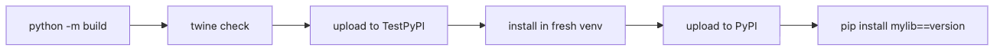

# Publishing to PyPI — from TestPyPI to production

Publishing is where packaging shifts from local correctness to operational discipline. Account setup, token handling, staging uploads, and install verification all matter before you expose a package to real users.

This is post 5 in the Python Package 101 series. Here we separate TestPyPI from PyPI, walk through the `twine` upload flow, and build a safer release habit around staging-first validation.

## Key Questions

- What is the difference between PyPI and TestPyPI?
- What role does `twine` play?
- How do you generate and manage API tokens?
- Can you modify a version after uploading it?

> PyPI is the app store for Python packages and twine is the tool that uploads your built package to PyPI.

## What you will learn

- How to create PyPI and TestPyPI accounts and generate API tokens
- How to upload packages with `twine`
- The workflow of testing on TestPyPI before publishing to PyPI
- How to handle upload failures

## Why it matters

Once you have built a package, you need to publish it so others can install it with `pip install`. Uploading to PyPI makes your package available to anyone worldwide. Uploading to an internal repository shares it within your team.

> Your team installs a shared utility library directly from Git: `pip install git+https://...`. When the branch changes, behavior changes too, and installation is slow.

Publishing to PyPI pins the version and makes installation stable.

## Mental Model

> PyPI is the app store and twine is the submission tool. TestPyPI is staging and PyPI is production. Test on staging first, then deploy to production.

```text
python -m build → dist/*.whl, dist/*.tar.gz
                     ↓
              twine check dist/*       (validate)
                     ↓
          twine upload --repository testpypi dist/*  (staging)
                     ↓
              pip install --index-url https://test.pypi.org/simple/ mylib  (test)
                     ↓
          twine upload dist/*          (production)
```


*The release path from build output to TestPyPI validation and final PyPI publishing*

## Core Concepts

| Term | Description | URL |
|---|---|---|
| PyPI | Python Package Index, the official package repository | pypi.org |
| TestPyPI | Test environment for PyPI | test.pypi.org |
| twine | Package upload tool | `pip install twine` |
| API token | Authentication token used instead of passwords | `pypi-` prefix |
| Trusted Publisher | Token-free publishing from GitHub Actions | OIDC-based |

## Before / After

**Before (install directly from Git)**

```bash
pip install git+https://github.com/team/mylib.git@main
# → behavior changes when the branch changes
# → slow install (clone + build)
# → hard to pin versions
```

**After (install from PyPI)**

```bash
pip install mylib==0.1.0
# → pinned to a version
# → instant install if wheel exists
# → identical result everywhere
```

## Step-by-step practice

### Step 1. Create a TestPyPI account and token

```text
1. Register at https://test.pypi.org/account/register/
2. Generate an API token at https://test.pypi.org/manage/account/
3. Save the token securely (a string starting with pypi-)
```

### Step 2. Install twine and validate the build

```bash
pip install twine
python -m build                 # build from previous post

twine check dist/*
# Checking dist/mylib-0.1.0-py3-none-any.whl: PASSED
# Checking dist/mylib-0.1.0.tar.gz: PASSED
```

### Step 3. Upload to TestPyPI

```bash
twine upload --repository testpypi dist/*
# Enter your API token: pypi-...

# Uploading mylib-0.1.0-py3-none-any.whl
# Uploading mylib-0.1.0.tar.gz
# View at: https://test.pypi.org/project/mylib/0.1.0/
```

### Step 4. Test install from TestPyPI

```bash
python -m venv /tmp/test-pypi
source /tmp/test-pypi/bin/activate

pip install --index-url https://test.pypi.org/simple/ \
    --extra-index-url https://pypi.org/simple/ \
    mylib

python -c "from mylib.core import greet; print(greet('PyPI'))"
# Hello, PyPI!
deactivate
```

### Step 5. Publish to the real PyPI

```bash
# PyPI account and token are separate (pypi.org)
twine upload dist/*
# Enter your API token: pypi-...

# View at: https://pypi.org/project/mylib/0.1.0/
```

## What to notice in this code

- `twine check` catches metadata errors before uploading
- TestPyPI needs `--extra-index-url` because dependency packages may not exist on TestPyPI
- API tokens use `__token__` as the username and the token string as the password
- Once a version is uploaded, it cannot be modified. You must bump the version and upload again

## Common mistakes

### Mistake 1. Trying to re-upload the same version

PyPI does not allow overwriting an existing version. If you need to fix something, bump the version number.

### Mistake 2. Hardcoding the API token in code

```bash
# Wrong: token ends up in Git history
twine upload --password pypi-abc123 dist/*

# Correct: use environment variables or .pypirc
export TWINE_PASSWORD=pypi-abc123
```

### Mistake 3. Skipping TestPyPI and uploading directly to PyPI

Test on TestPyPI first. Once uploaded to PyPI, a release cannot be deleted (only the entire project can be removed within 72 hours).

### Mistake 4. Not checking if the package name is already taken

If a name is already registered on PyPI, you cannot use it. Check with `pip index versions mylib` or search pypi.org beforehand.

### Mistake 5. Uploading with old version files still in dist/

```bash
rm -rf dist/
python -m build
twine upload dist/*    # upload only the current version
```

## Practical applications

- **CI/CD automated publishing**: GitHub Actions triggers PyPI upload on tag push
- **Trusted Publisher**: OIDC-based publishing from GitHub Actions without API tokens
- **Internal repositories**: Publish internal packages to Artifactory, Nexus, or devpi
- **Pre-release**: Use versions like `0.1.0rc1` for beta testing
- **README rendering**: The README shown on PyPI is specified via `[project.readme]`

## How practitioners think about this

Manual publishing invites mistakes. Automating build-test-upload in CI/CD is the standard practice. GitHub Actions + Trusted Publisher eliminates the need for token management entirely.

Package names are hard to change once chosen. Pick a name that is intuitive, does not conflict with existing packages, and is easy to search. Search PyPI and run `pip index versions` before publishing.

## Checklist

- [ ] You can create a TestPyPI account and generate an API token
- [ ] You can validate build artifacts with `twine check`
- [ ] You can upload to TestPyPI and test-install from it
- [ ] You can publish to the real PyPI
- [ ] You can manage API tokens securely via environment variables

## Exercises

1. Create a TestPyPI account and upload the package you built in the previous post.
2. Install your package from TestPyPI in a fresh virtual environment and verify the import works.
3. Write a `~/.pypirc` file so that `twine upload --repository testpypi dist/*` uses the token automatically.

## Summary and next

- PyPI is the official Python package repository; TestPyPI is its test environment.
- `twine check` validates and `twine upload` publishes.
- Always test on TestPyPI before publishing to the real PyPI.
- Once a version is uploaded, it cannot be modified — you must bump the version.
- Keep API tokens out of code; use environment variables or `.pypirc`.

The next post covers **versioning and releases** — SemVer, Git tags, and CHANGELOG.

<!-- toc:begin -->
## In this series

- [What Is a Python Package?](./01-what-is-a-python-package.md)
- [Project Structure — src layout and pyproject.toml](./02-project-structure.md)
- [Dependency Management — venv, pip, uv, requirements](./03-dependency-management.md)
- [Building Packages — wheel and sdist](./04-building-packages.md)
- **Publishing to PyPI — from TestPyPI to production (current)**
- Versioning and Releases (upcoming)
- CLI Packages (upcoming)
- Type Hints and Static Analysis (upcoming)
- Documentation — README, MkDocs, API Reference (upcoming)
- Production Package Template (upcoming)

<!-- toc:end -->

## References

- [Python Packaging User Guide - Uploading](https://packaging.python.org/en/latest/tutorials/packaging-projects/#uploading-the-distribution-archives)
- [PyPI - Publishing with Trusted Publishers](https://docs.pypi.org/trusted-publishers/)
- [twine documentation](https://twine.readthedocs.io/)
- [TestPyPI](https://test.pypi.org/)

Tags: Python, Packaging, PyPI, pyproject.toml
