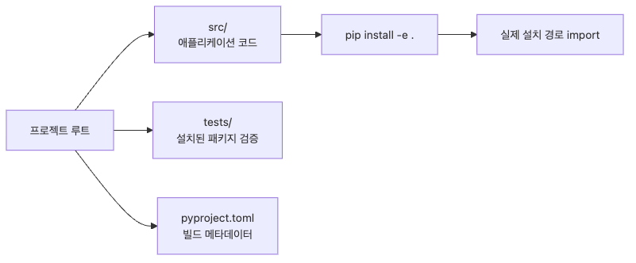

# 프로젝트 구조 잡기 — src layout과 pyproject.toml

패키징은 파일 몇 개를 묶는 수준에서 끝나지 않습니다. 어디에 소스를 두고, 어떤 파일에 메타데이터를 적고, 테스트가 실제 설치된 패키지를 검증하도록 구조를 어떻게 잡을지까지 함께 결정해야 합니다.

이 글은 Python Package 101 시리즈의 2번째 글입니다. 여기서는 flat layout과 src layout의 차이, `pyproject.toml`이 `setup.py`를 대체한 이유, 그리고 패키지 프로젝트의 최소 표준 구조를 정리하겠습니다.

## 이 글에서 다룰 문제

- flat layout과 src layout은 무엇이 다를까요?
- `pyproject.toml`은 무엇이고 왜 `setup.py`를 대체할까요?
- `[build-system]`과 `[project]`에는 무엇이 들어갈까요?
- 최소한의 `pyproject.toml`은 어떤 모습일까요?

## 이 글에서 배우는 내용

- flat layout과 src layout의 차이와 선택 기준
- `pyproject.toml`에서 꼭 알아야 할 섹션
- 최소 구성을 갖춘 `pyproject.toml` 작성법
- 실무에서 많이 쓰는 프로젝트 디렉터리 구조

## 왜 중요한가

프로젝트 구조가 어긋나면 `import`가 꼬이고, 빌드 도구가 파일을 찾지 못하고, 로컬에서는 통과하던 테스트가 CI에서는 실패합니다. 이런 문제는 대개 로직보다 구조에서 먼저 시작합니다. 따라서 초기에 표준 구조를 잡아두는 편이 나중에 훨씬 저렴합니다.

> 프로젝트 루트에서 `pytest`를 실행하면 모든 테스트가 통과합니다. 그런데 `pip install .`로 설치한 뒤 다른 디렉터리에서 import하면 실패합니다. 테스트가 설치된 패키지를 검증한 것이 아니라, 로컬 소스를 우연히 직접 읽고 있었기 때문입니다.

src layout은 이런 착시를 구조적으로 막아 줍니다.

## 멘탈 모델

flat layout은 가게 앞 진열대에 상품을 바로 올려두는 방식이고, src layout은 상품을 창고(`src/`)에 넣고 선반(설치)으로만 꺼내는 방식입니다. 창고를 거치면 “설치하지 않아도 잘 되네”라는 착각이 원천적으로 줄어듭니다.

```text
flat layout              src layout
────────────            ────────────
mylib/                  src/
  __init__.py             mylib/
  core.py                   __init__.py
tests/                      core.py
pyproject.toml          tests/
                        pyproject.toml
```


*src layout이 소스, 메타데이터, 설치 검증을 분리하는 구조*

## 핵심 개념

| 용어 | 설명 | 비고 |
|---|---|---|
| flat layout | 패키지가 프로젝트 루트에 바로 있는 구조 | 간단하지만 import 착시가 생기기 쉽습니다 |
| src layout | 패키지가 `src/` 아래에 있는 구조 | install-before-import를 강제합니다 |
| pyproject.toml | PEP 518/621 표준 프로젝트 설정 파일 | `setup.py`, `setup.cfg`를 대체합니다 |
| build-system | 빌드 도구를 지정하는 섹션 | `[build-system]` |
| [project] | 이름, 버전, 의존성 등 메타데이터 | PEP 621 |

## Before / After

**Before (setup.py + flat layout)**

```python
# setup.py
from setuptools import setup, find_packages
setup(
    name="mylib",
    version="0.1.0",
    packages=find_packages(),
    install_requires=["requests>=2.28"],
)
```

**After (pyproject.toml + src layout)**

```toml
[build-system]
requires = ["setuptools>=68.0"]
build-backend = "setuptools.build_meta"

[project]
name = "mylib"
version = "0.1.0"
requires-python = ">=3.9"
dependencies = ["requests>=2.28"]
```

## 단계별 실습

### Step 1. src layout 프로젝트 만들기

```bash
mkdir -p ~/practice/mylib-project/src/mylib
mkdir -p ~/practice/mylib-project/tests
cd ~/practice/mylib-project

cat > src/mylib/__init__.py << 'EOF'
"""mylib - A sample Python package."""
__version__ = "0.1.0"
EOF

cat > src/mylib/core.py << 'EOF'
def greet(name: str) -> str:
    """Return a greeting message."""
    return f"Hello, {name}!"
EOF
```

### Step 2. `pyproject.toml` 작성

```bash
cat > pyproject.toml << 'EOF'
[build-system]
requires = ["setuptools>=68.0"]
build-backend = "setuptools.build_meta"

[project]
name = "mylib"
version = "0.1.0"
description = "A sample Python package"
requires-python = ">=3.9"
license = {text = "MIT"}
authors = [
    {name = "Your Name", email = "you@example.com"},
]
dependencies = []

[project.urls]
Repository = "https://github.com/yourname/mylib"
EOF
```

### Step 3. 개발 모드 설치

```bash
python -m venv .venv
source .venv/bin/activate
pip install -e .

python -c "from mylib.core import greet; print(greet('World'))"
# Hello, World!
```

### Step 4. 테스트 추가

```bash
cat > tests/test_core.py << 'EOF'
from mylib.core import greet

def test_greet():
    assert greet("Alice") == "Hello, Alice!"

def test_greet_empty():
    assert greet("") == "Hello, !"
EOF

pip install pytest
pytest tests/
# 2 passed
```

### Step 5. setuptools 패키지 탐색 설정

```toml
# Add to pyproject.toml
[tool.setuptools.packages.find]
where = ["src"]
```

```bash
# Verify install
pip install -e .
python -c "import mylib; print(mylib.__version__)"
# 0.1.0
```

## 이 코드에서 눈여겨볼 점

- `[build-system]`은 빌드 도구를 지정하며 `setuptools` 외에도 `hatchling`, `flit-core`, `pdm-backend`를 선택할 수 있습니다.
- `pip install -e .`은 editable install이므로 재설치 없이 소스 변경을 반영할 수 있습니다.
- `[tool.setuptools.packages.find]`의 `where = ["src"]`가 src layout에서 가장 중요한 설정입니다.
- `requires-python`은 이 패키지가 지원하는 Python 버전 범위를 문서이자 계약으로 남깁니다.

## 자주 하는 실수

### 실수 1. src layout에서 `where` 설정을 빼먹는다

```toml
# Wrong: cannot find packages under src/
[tool.setuptools.packages.find]

# Correct
[tool.setuptools.packages.find]
where = ["src"]
```

### 실수 2. `setup.py`와 `pyproject.toml`을 동시에 유지한다

두 파일이 함께 있으면 빌드 도구가 어느 쪽을 기준으로 삼아야 할지 혼란스러워질 수 있습니다. 특별한 이유가 없다면 `pyproject.toml` 하나로 정리하는 편이 좋습니다.

### 실수 3. editable install 없이 로컬 import만 테스트한다

`pip install -e .` 없이 테스트하면 flat layout에서는 우연히 통과하지만, 실제 설치 환경에서는 실패하는 테스트를 놓치기 쉽습니다.

### 실수 4. `__init__.py`에 무거운 초기화 코드를 넣는다

`import mylib`만 했는데 느려지는 패키지는 사용성이 떨어집니다. `__init__.py`에는 버전과 최소한의 public API 정도만 두는 편이 안전합니다.

### 실수 5. `tests/`를 패키지 내부에 둔다

`tests/`가 `src/` 아래에 들어가면 배포판에 테스트 코드가 포함될 수 있습니다. 테스트는 프로젝트 루트에 두는 편이 명확합니다.

## 실무 적용

- **사내 라이브러리**: src layout + `pyproject.toml`로 표준화하면 신규 프로젝트 시작이 빨라집니다.
- **오픈소스**: `black`, `ruff`, `httpx`처럼 현대적인 Python 프로젝트 대부분이 src layout을 사용합니다.
- **모노레포**: 하나의 저장소에 여러 패키지를 둘 때 경로 충돌을 줄여 줍니다.
- **CI/CD**: `pip install .`을 첫 번째 검증 단계로 넣어 빌드 가능성을 빠르게 확인합니다.
- **Docker**: `COPY . . && pip install .`만으로 컨테이너 내부 설치 흐름을 단순화할 수 있습니다.

## 실무에서는 이렇게 생각합니다

구조를 잡는 데 초반 5분을 쓰면, 나중에 “왜 import가 안 되지?”에 몇 시간을 쓰는 일을 줄일 수 있습니다. src layout은 약간의 추가 설정이 필요하지만, 로컬 소스와 설치된 패키지를 혼동하는 문제를 구조적으로 차단합니다.

빌드 백엔드로는 `setuptools`가 여전히 가장 널리 쓰입니다. 다만 새 프로젝트라면 `hatchling`이나 `flit-core`도 충분히 검토할 만합니다. 중요한 점은 백엔드가 무엇이든 `[project]` 섹션이라는 공통 표준이 유지된다는 사실입니다.

## 체크리스트

- [ ] flat layout과 src layout의 차이를 설명할 수 있다
- [ ] 최소한의 `pyproject.toml`을 작성할 수 있다
- [ ] `pip install -e .`로 editable install을 할 수 있다
- [ ] `[build-system]`과 `[project]`의 역할을 이해한다
- [ ] 테스트가 설치된 패키지를 기준으로 실행되는지 확인할 수 있다

## 연습 문제

1. src layout으로 `myutils` 패키지를 만들고, `string_utils.py` 안에 `capitalize_words` 함수를 구현한 뒤 테스트해 보세요.
2. `description`, `authors`, `license`, `requires-python`을 포함한 `pyproject.toml`을 직접 작성해 보세요.
3. flat layout 프로젝트와 src layout 프로젝트를 각각 만든 뒤 `pip install -e .`을 실행하고, 다른 디렉터리에서 import가 어떻게 달라지는지 비교해 보세요.

## 정리 · 다음 글

- src layout은 소스를 `src/` 아래에 두어 설치 없이 직접 import되는 착시를 막습니다.
- `pyproject.toml`은 PEP 518/621 표준으로 `setup.py`를 대체합니다.
- `[build-system]`은 빌드 도구를, `[project]`는 패키지 메타데이터를 정의합니다.
- `pip install -e .`을 쓰면 개발 중에도 실제 설치 경로를 기준으로 import를 검증할 수 있습니다.
- 테스트는 `src/` 밖에 두어 배포판에 섞이지 않게 유지하는 편이 좋습니다.

다음 글에서는 **의존성 관리** — venv, pip, uv, requirements를 다룹니다.

<!-- toc:begin -->
## 시리즈 목차

- [Python Package란 무엇인가?](./01-what-is-a-python-package.md)
- **프로젝트 구조 잡기 — src layout과 pyproject.toml (현재 글)**
- 의존성 관리 — venv, pip, uv, requirements (예정)
- 패키지 빌드하기 — wheel과 sdist (예정)
- PyPI에 배포하기 — TestPyPI부터 실제 배포까지 (예정)
- 버전 관리와 릴리스 (예정)
- CLI 패키지 만들기 (예정)
- 타입 힌트와 정적 검사 (예정)
- 문서화 — README, MkDocs, API Reference (예정)
- 실전 패키지 템플릿 만들기 (예정)

<!-- toc:end -->

## 참고 자료

- [Python Packaging User Guide - Project Structure](https://packaging.python.org/en/latest/tutorials/packaging-projects/)
- [PEP 621 - Storing project metadata in pyproject.toml](https://peps.python.org/pep-0621/)
- [setuptools - src layout](https://setuptools.pypa.io/en/latest/userguide/package_discovery.html)
- [Hynek Schlawack - Testing & Packaging](https://hynek.me/articles/testing-packaging/)

Tags: Python, Packaging, PyPI, pyproject.toml
