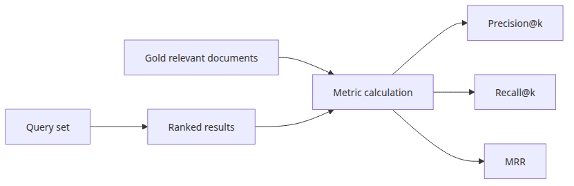
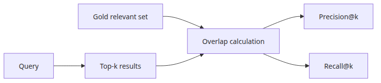
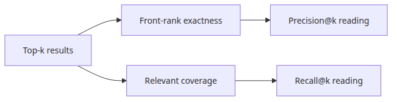
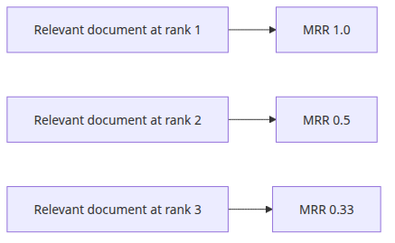
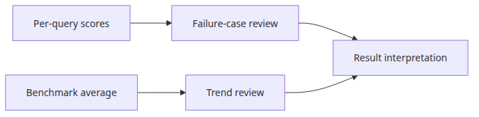

# Understanding RAG evaluation metrics

> RAG Benchmark 101 series (1/6)

Retrieval metrics compare a gold document set with a ranked result list. Once you separate those two objects, it becomes much easier to see what Precision@k, Recall@k, and MRR each reveal.

This is the first article in the RAG Evaluation and Benchmarking 101 series.

## What you'll learn

- Compute Precision@k, Recall@k, and MRR — the three most common retrieval metrics — by hand.
- Build the habit of reading per-query scores separately from benchmark averages.
- Understand why retrieval quality must be measured independently before adding LLM evaluation on top.
- Run a one-file Python example that calculates the metrics end-to-end.



*Questions this post answers*

## Questions this post answers

- What does Precision@k, Recall@k, and MRR each measure, and what question does each answer?
- Why must retrieval quality be measured independently before adding LLM evaluation on top?
- Why is it dangerous to look only at average scores instead of per-query scores?
- How should you choose k, and how do the three metrics shift as k changes?
- What is the minimal Python file that computes all three metrics end to end?

## Why this matters

When a RAG system returns a wrong answer, the cause is one of two layers: **the retriever fetched the wrong document, or the LLM mishandled the right one.**
Mixing those two layers makes debugging impossible.
You enter an infinite loop of "the answer looks weird" → "no idea, swap models" → "still weird."

Retrieval metrics measure the first layer **without involving the LLM**.
With nothing more than a gold ID set and a ranked list, you can iterate cheaply and quickly — no LLM calls, no tokens.
This post breaks down the three foundational metrics.

## Mental Model

Retrieval metrics compare two sets:

1. **Gold set** — the IDs labeled "relevant" for a query. Built by humans or borrowed from a dataset.
2. **Retrieved list** — the IDs the retriever returned. **Order matters.**

Each metric asks a different question over the same two sets:

- **Precision@k**: "Of the top-k I returned, how many are relevant?" → accuracy
- **Recall@k**: "Of all the relevant docs, how many appear in top-k?" → the inverse of miss rate
- **MRR**: "What is the rank of the first relevant hit?" → ranking quality

Each metric is computed per query; the system score is the mean across queries.

## Core concepts

### 1. Precision@k versus Recall@k

| Query | Gold set | Retrieved (top-3) | Precision@3 | Recall@3 |
| --- | --- | --- | --- | --- |
| Q1 | {A, B, C} | [A, X, B] | 2/3 = 0.67 | 2/3 = 0.67 |
| Q2 | {A} | [A, X, Y] | 1/3 = 0.33 | 1/1 = 1.00 |
| Q3 | {A, B, C, D, E} | [A, B, C] | 3/3 = 1.00 | 3/5 = 0.60 |

Q2 has **low precision but perfect recall** — there is only one relevant doc, but the slot for top-3 must be filled.
Q3 has **perfect precision but low recall** — three of five relevant docs found.
Looking at one without the other leads you to the wrong conclusion.



*Top-k overlap and metric calculation flow*

### 2. MRR (Mean Reciprocal Rank)

MRR looks **only at the rank of the first relevant hit**. Position 1 → 1.0, position 2 → 0.5, position 3 → 0.33...
Anything after the first hit is ignored.

Why MRR matters for UX: users want answers high in the result list, not buried.
"The relevant doc is somewhere in the list" is much weaker than "the relevant doc is at the top."

### 3. Choosing k

`k=3`, `k=5`, `k=10` ties directly to your RAG context window.
If your LLM gets 5 chunks per prompt, `Recall@5` is the most production-relevant metric.
A benchmark with an arbitrary k yields a score disconnected from real behavior.

## Before-After

### Before (judging by LLM output alone)

```python
result = rag_pipeline.query("What is RAG?")
print(result)  # "RAG stands for retrieval-augmented generation..."
# → "Looks fine, I guess." End of analysis.
```

You cannot tell whether retrieval failed or the LLM hallucinated.

### After (measure retrieval first)

```python
case = QueryCase(
    question="What is RAG?",
    retrieved_ids=retriever.search("What is RAG?", k=5),
    relevant_ids={"doc-rag-01", "doc-rag-02"},
)
metrics = evaluate_case(case, k=5)
print(metrics)  # {"precision@5": 0.4, "recall@5": 1.0, "mrr": 0.5}
```

Now you know: retrieval found all relevant docs (Recall=1.0), but the first one is at rank 2 (MRR=0.5) and 60% of the slots are noise (Precision=0.4).
The next experiment becomes a clear hypothesis: **add a reranker.**

## Step-by-step

### Step 1: Evaluation skeleton

```python
from dataclasses import dataclass

@dataclass
class QueryCase:
    question: str
    retrieved_ids: list[str]   # ordered
    relevant_ids: set[str]     # unordered

def precision_at_k(case: QueryCase, k: int) -> float:
    top_k = case.retrieved_ids[:k]
    hits = sum(1 for d in top_k if d in case.relevant_ids)
    return hits / k

def recall_at_k(case: QueryCase, k: int) -> float:
    top_k = case.retrieved_ids[:k]
    hits = sum(1 for d in top_k if d in case.relevant_ids)
    return hits / len(case.relevant_ids)

def reciprocal_rank(case: QueryCase) -> float:
    for i, doc_id in enumerate(case.retrieved_ids, start=1):
        if doc_id in case.relevant_ids:
            return 1.0 / i
    return 0.0
```

### Step 2: Apply across queries

```python
cases = [
    QueryCase("Q1", ["A", "X", "B"], {"A", "B", "C"}),
    QueryCase("Q2", ["A", "X", "Y"], {"A"}),
    QueryCase("Q3", ["A", "B", "C"], {"A", "B", "C", "D", "E"}),
]

for case in cases:
    print(f"{case.question}: P@3={precision_at_k(case, 3):.2f}, "
          f"R@3={recall_at_k(case, 3):.2f}, MRR={reciprocal_rank(case):.2f}")

import statistics
avg_p = statistics.mean(precision_at_k(c, 3) for c in cases)
avg_r = statistics.mean(recall_at_k(c, 3) for c in cases)
avg_mrr = statistics.mean(reciprocal_rank(c) for c in cases)
print(f"AVG: P@3={avg_p:.2f}, R@3={avg_r:.2f}, MRR={avg_mrr:.2f}")
```

### Step 3: Run

```bash
cd en/01-evaluation-metrics
python3 main.py
```



*Precision@k versus Recall@k decision axes*

## Common pitfalls

- **Stopping at the average** — average P@3 = 0.6 can hide queries scoring 0.0 alongside queries at 1.0. Always print per-query rows too.
- **Measuring only Precision or only Recall** — you cannot distinguish "too broad" from "too narrow."
- **Treating MRR as overall retrieval quality** — MRR only sees the first relevant rank. With three relevant docs at ranks 1/2/3, MRR is still just 1.0.
- **Using a different k from production** — if RAG passes 5 chunks but you measure k=10, scores are inflated.
- **Defining the gold set too narrowly** — labeling "only this exact doc is relevant" punishes the retriever for finding semantically equivalent ones.



*Rank position changes the MRR signal*

## In production

Practical guidance for production RAG evaluation:

- **Build a gold dataset** — 50–100 questions is enough to start. Have a domain expert label "which docs would you need to answer this?"
- **Measure across multiple k values** — Recall@1, Recall@3, Recall@5, Recall@10 together reveal the retriever's "rank profile."
- **Analyze failure cases** — queries with Recall@10 = 0 are the most valuable. If the relevant doc is not in top-10, the retriever is fundamentally wrong; change embeddings or chunking.
- **Wire it into CI** — embedding model or chunking changes should run the benchmark and flag regressions.
- **Next-level metrics** — nDCG measures ranking quality more precisely but needs graded relevance instead of binary labels, raising data-construction cost.

## Checklist

- [ ] Did I define `relevant_ids` for every query?
- [ ] Does the evaluation `k` match the production RAG context window?
- [ ] Am I measuring Precision@k, Recall@k, and MRR together?
- [ ] Does the report show both the average and per-query rows?
- [ ] Am I separately analyzing queries where Recall@k = 0?
- [ ] Is the benchmark in CI to catch regressions?

## Exercises

1. Given gold set `{A, B, C}` and retrieval `[X, A, Y, B, C]`, what are Precision@3, Recall@3, and MRR?
2. Two retrievers A and B share the same average Recall@5 but differ in average MRR. Which one is better for production UX, and why?
3. RAG passes exactly 3 chunks to the LLM. Which two metrics matter most? Why?



*Per-query and average report reading flow*

## Wrap-up and next post

Key takeaways:

- RAG evaluation starts by separating retrieval from generation.
- Precision@k, Recall@k, and MRR ask different questions over the same data.
- Averages only have meaning when read alongside per-query scores.
- The benchmark `k` must match your production RAG context window.

The next post moves to **measuring retrieval performance** — wrapping a real retriever in a benchmark loop that captures latency, hit rate, and ranking quality together.

---

<!-- toc:begin -->
## In this series

- **Understanding RAG evaluation metrics (current)**
- Measuring retrieval performance (upcoming)
- Comparing embedding models (upcoming)
- VectorDB selection criteria (upcoming)
- End-to-end RAG pipeline evaluation (upcoming)
- Completing the RAG Benchmark (upcoming)

<!-- toc:end -->

---

## References

- [Wikipedia: Mean reciprocal rank](https://en.wikipedia.org/wiki/Mean_reciprocal_rank)
- [Stanford IR book: Evaluation in information retrieval](https://nlp.stanford.edu/IR-book/html/htmledition/evaluation-of-ranked-retrieval-results-1.html)
- [BEIR: A heterogeneous benchmark for zero-shot evaluation of IR models](https://arxiv.org/abs/2104.08663)
- [MTEB: Massive Text Embedding Benchmark](https://arxiv.org/abs/2210.07316)

Tags: RAG, VectorDB, Benchmarking, LLM
