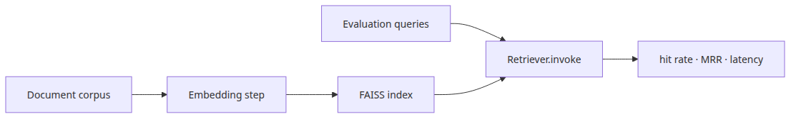
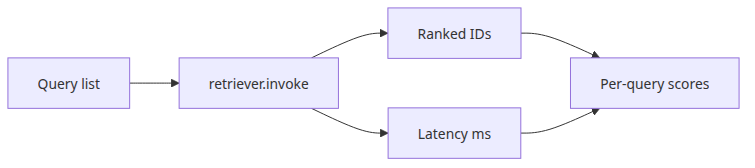
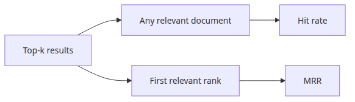
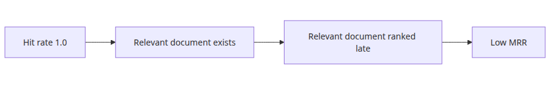
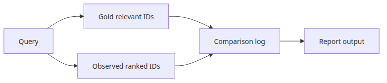

# Measuring retrieval performance

A retrieval benchmark works only when questions, gold documents, ranked results, and metrics stay in the same loop. Fix those inputs and you can tell whether a retriever change improved the system or just changed the feel of a few examples.

This is post 2 in the RAG Evaluation and Benchmarking 101 series.

## Questions this post answers



*Questions this post answers*

- How do you attach hit rate and MRR to a FAISS retriever?
- Where should retrieval latency be measured, and in what unit?
- Can you start a meaningful benchmark with only a small gold set?
- What needs to stay fixed so the same loop works for any retriever or embedding model?

> The core of retrieval benchmarking is not the vector DB or index. It is the **repeatable loop of query, gold document, and metric collection** that lets you observe the same retriever again and again.

## Why this matters

In Episode 1 we worked through hit rate, MRR, and nDCG on paper. In a real RAG pipeline, the retriever drifts every time you change embeddings, chunk size, or the corpus. Without a measurement harness you end up making decisions on "this feels better".

Putting the metrics in code matters for three reasons. First, you catch **regressions** the moment you change embeddings or chunking. Second, the same loop in CI removes human bias. Third, recording latency together with quality stops you from shipping a change that improves recall but doubles response time.

The loop in this post is small but complete. Episodes 3 (embedding comparison) and 4 (vector DB selection) reuse the exact same skeleton.

## Mental model

A retrieval benchmark binds four things together:

```text
QUERIES (question + gold ids)
   │
   ▼
retriever.invoke(question)  ──►  ranked_ids  ──►  metric(ranked_ids, gold_ids)
   │                                                   │
   ▼                                                   ▼
latency_ms                                       hit_rate / MRR
```

The trick is wrapping a single arrow with measurement code. Wrap `retriever.invoke()` in a timer and you isolate retrieval latency. Normalize results to `metadata["id"]` and the metric function stops depending on the retriever type.

Hold this picture in your head and BM25, hybrid retrievers, or rerankers all plug into the same harness later.

## Core concepts

| Term | Meaning | Unit |
| --- | --- | --- |
| Gold set | Question + relevant document ids | number of queries |
| Hit rate@k | Fraction of queries where any gold id appears in top-k | 0.0 – 1.0 |
| MRR | Mean of 1/rank for the first gold hit | 0.0 – 1.0 |
| Retrieval latency | Time per `retriever.invoke()` call | milliseconds |
| p95 latency | 95th percentile of all latencies | milliseconds |

Average latency hides tail behavior. Always record p95 (and ideally p99) — that is the number your users feel.

## Before vs. after

**Before**: "Switching the embedding model felt better". The evidence is three or four queries tried by hand. A week later quality drops on a different domain and you cannot tell whether that change or some other change is the cause.

**After**: Both retrievers run against the same `QUERIES` list. You compare hit rate, MRR, mean latency, and p95 latency in a single line of output. If hit rate climbs from 0.9 to 1.0 but p95 latency jumps from 80 ms to 250 ms, you see the trade-off explicitly and decide on it.

## Step-by-step walkthrough

### Step 1 — Define the gold set

Write down questions paired with the ids of relevant documents. Three to five queries are plenty to start.

```python
QUERIES = [
    ("What distance does FAISS use by default?", {"doc-faiss-basics"}),
    ("What does MRR measure?", {"doc-mrr-intro"}),
    ("Why is chunk size important in RAG?", {"doc-chunking"}),
]
```

### Step 2 — Build the measurement loop



*Benchmark loop for queries and latency*

The runnable code lives in `rag-benchmark-101/en/02-retrieval-benchmarking/main.py`. Episodes 05 and 06 require `GROQ_API_KEY`.

```bash
cd en/02-retrieval-benchmarking
python3 main.py
```

```python
import time
import numpy as np

retriever = vectorstore.as_retriever(search_kwargs={"k": 3})
latencies_ms = []
all_ranked = []

for question, _ in QUERIES[:1]:
    retriever.invoke(question)  # warm-up

for question, relevant_ids in QUERIES:
    started_at = time.perf_counter()
    docs = retriever.invoke(question)
    elapsed_ms = (time.perf_counter() - started_at) * 1000
    ranked_ids = [doc.metadata["id"] for doc in docs]
    latencies_ms.append(elapsed_ms)
    all_ranked.append((question, ranked_ids, relevant_ids))

p95_latency_ms = float(np.percentile(latencies_ms, 95))
```

The warm-up call is not cosmetic. The first call often includes model load, cache misses, or lazy initialization. If you skip warm-up, your numbers describe startup behavior instead of the steady-state path users hit all day.

### Step 3 — Compute the metrics



*Retrieval quality axes with hit rate and MRR*

```python
def hit_rate(ranked, gold):
    return 1.0 if any(d in gold for d in ranked) else 0.0

def reciprocal_rank(ranked, gold):
    for idx, doc_id in enumerate(ranked, start=1):
        if doc_id in gold:
            return 1.0 / idx
    return 0.0

hits = [hit_rate(r, g) for _, r, g in all_ranked]
rrs = [reciprocal_rank(r, g) for _, r, g in all_ranked]

print(f"hit_rate@3 = {sum(hits)/len(hits):.2f}")
print(f"MRR        = {sum(rrs)/len(rrs):.2f}")
print(f"avg latency = {sum(latencies_ms)/len(latencies_ms):.1f} ms")
print(f"p95 latency = {p95_latency_ms:.1f} ms")
```

### Step 4 — Record the result

Keep the per-query ranked ids in the log. Storing only averages makes regressions impossible to debug — you cannot tell which query collapsed.

```python
report_rows = []
for question, ranked_ids, relevant_ids in all_ranked:
    report_rows.append({
        "question": question,
        "ranked_ids": ranked_ids,
        "relevant_ids": sorted(relevant_ids),
        "hit": hit_rate(ranked_ids, relevant_ids),
        "rr": reciprocal_rank(ranked_ids, relevant_ids),
    })

summary = {
    "hit_rate@3": round(sum(hits) / len(hits), 2),
    "MRR": round(sum(rrs) / len(rrs), 2),
    "avg_latency_ms": round(sum(latencies_ms) / len(latencies_ms), 1),
    "p95_latency_ms": round(p95_latency_ms, 1),
}

print(summary)
for row in report_rows:
    print(row)
```

```text
{'hit_rate@3': 0.67, 'MRR': 0.56, 'avg_latency_ms': 4.8, 'p95_latency_ms': 6.1}
{'question': 'What distance does FAISS use by default?', 'ranked_ids': ['doc-faiss-basics', 'doc-ann-overview', 'doc-chunking'], 'relevant_ids': ['doc-faiss-basics'], 'hit': 1.0, 'rr': 1.0}
{'question': 'What does MRR measure?', 'ranked_ids': ['doc-bm25', 'doc-mrr-intro', 'doc-ranking'], 'relevant_ids': ['doc-mrr-intro'], 'hit': 1.0, 'rr': 0.5}
```

That output already tells you what to try next. If hit rate is 1.0 but reciprocal rank is 0.5, the retriever is finding the right document but ranking it too low. That points to ranking quality, not coverage.

### Step 5 — Turn benchmark output into a triage order

| What you observe | First thing to inspect | Common root cause |
| --- | --- | --- |
| Low hit rate, healthy latency | embedding model, chunking, query formulation | relevant docs are missing entirely |
| High hit rate, low MRR | reranker, score fusion, top-k order | the right doc is present but too low |
| Healthy quality, bad p95 | infrastructure, caching, network path | a tail-latency issue rather than retrieval quality |
| Good average, one broken query | per-query rows | domain mismatch or gold-set labeling issue |

This is where the benchmark becomes operationally useful. It stops being just a scoreboard and starts acting like a debugger.

## Common mistakes



*High hit rate with weak ranking*

- **Trusting hit rate alone** — hit rate of 1.0 with MRR of 0.4 means the gold doc is always near the bottom. Users only see the first answer.
- **Mixing embedding time into retrieval latency** — if you wrap embedding and retrieval in one timer you lose the signal for the retriever itself.
- **Using `time.time()`** — it is sensitive to system clock changes. Always use `time.perf_counter()` for short intervals.
- **Counting the first call** — the first call carries model load and cache warming. Run a warm-up iteration or two before measuring.
- **Generalizing from a tiny corpus** — a 5-document corpus that scores 1.0 will not behave the same in production. At this stage you are validating the **measurement loop itself**, not the retriever.

## In production

As the harness grows, capture more context.

- **Version metadata**: embedding model name, chunk size, retriever type, corpus hash. Without these the run is not reproducible.
- **p95 / p99 latency**: average is dragged down by fast calls. Use `numpy.percentile(latencies_ms, 95)`.
- **CI gate**: fail PRs when hit rate drops below threshold or p95 exceeds budget. Start as a warning, then promote to a block once stable.
- **Sampling strategy**: when the gold set grows to hundreds of items, run a stratified 50–100 sample on every PR and the full set in a nightly job.

## Checklist



*Benchmark record with gold IDs and logs*

- [ ] Wrote down relevant document ids per query.
- [ ] Wrapped only `retriever.invoke()` to isolate retrieval latency.
- [ ] Reported hit rate, MRR, mean latency, and p95 latency together.
- [ ] Kept per-query ranked ids in the output.
- [ ] Logged the embedding model, chunk size, and k used in the run.

## Exercises

1. Modify the loop to print hit rate at `k=1`, `k=3`, and `k=5` in one pass. How does hit rate move with k? What about MRR?
2. Replace `time.perf_counter()` with `time.time()`. Read the docs and describe a scenario where the measurement would be wrong.
3. Add a single warm-up call before the loop. Compare the first measured latency with and without warm-up.

## Wrap-up · what's next

This post lifted the hand-written metrics onto a real retriever and produced a single loop that captures hit rate, MRR, and latency together. The skeleton is the foundation for every comparison experiment that follows.

In Episode 3 we swap the embedding model on top of the same loop. The code change is a single line, but interpreting the result needs care.

<!-- toc:begin -->
## In this series

- [Understanding RAG evaluation metrics](./01-evaluation-metrics.md)
- **Measuring retrieval performance (current)**
- Comparing embedding models (upcoming)
- VectorDB selection criteria (upcoming)
- End-to-end RAG pipeline evaluation (upcoming)
- Completing the RAG Benchmark (upcoming)

<!-- toc:end -->

---

## References

- [LangChain FAISS integration](https://python.langchain.com/docs/integrations/vectorstores/faiss/)
- [FAISS documentation](https://faiss.ai/)
- [Python `time.perf_counter`](https://docs.python.org/3/library/time.html#time.perf_counter)
- [BEIR: heterogeneous benchmark for IR](https://github.com/beir-cellar/beir)

Tags: RAG, VectorDB, Benchmarking, LLM
