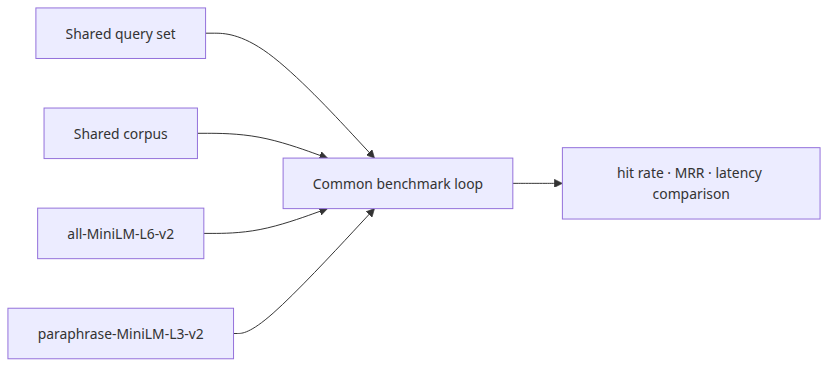
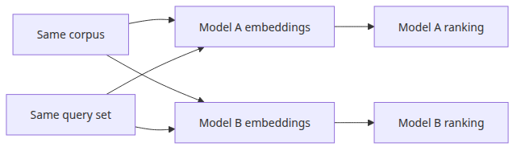
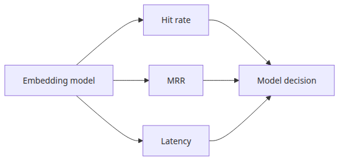
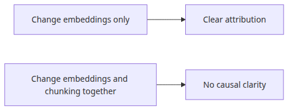
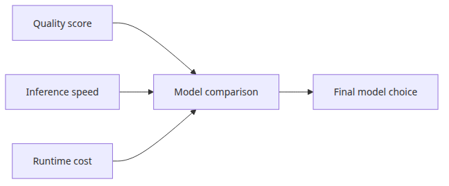

# Comparing embedding models

## Questions this post answers



- What do you see when you run `all-MiniLM-L6-v2` and `paraphrase-MiniLM-L3-v2` on the same query set?
- Why is hit rate alone insufficient for embedding model comparison?
- How do you tell whether speed or accuracy is the bottleneck?
- Why can MTEB leaderboard scores disagree with what you measure on your own data?

> Comparing embedding models is not about which one is "smarter". It is about which one **places relevant documents earlier in the same retrieval pipeline**.

## Why this matters

The embedding model is the starting point of RAG quality. Same chunk, same retriever, same LLM — change the embedding model and the answer quality moves dramatically. But picking based only on a model card or a leaderboard score traps you in two ways.

First, **domain mismatch**. MTEB averages across general domains. Your internal docs, Korean medical data, or legal cases may flip the ranking entirely.

Second, **operational cost ignored**. A bigger model that lifts hit rate by 0.05 but triples latency hurts both user experience and infrastructure cost.

The benchmark in this post is small, but it produces numbers measured on your data, your queries, and your infrastructure — far more useful for a decision than a leaderboard.

## Mental model

Embedding comparison rests on the **one-variable-at-a-time** principle.

```
[fixed] corpus  +  [fixed] QUERIES  +  [fixed] k
                  │
                  ▼
        [variable] embedding model
                  │
        ┌─────────┴─────────┐
        ▼                   ▼
   model A result       model B result
   (hit, MRR, latency)  (hit, MRR, latency)
```

If corpus or queries are not fixed, you cannot tell whether a difference comes from the model or from the data. The measurement code is just the loop from Episode 2 wrapped in a function that takes the model name as an argument.

## Core concepts

| Term | Meaning |
| --- | --- |
| Embedding model | A model that maps text to a fixed-dimensional vector |
| Embedding dimension | The size of the output vector. Larger means more capacity but bigger index and slower comparison |
| Sentence-Transformers | A library focused on sentence-level embeddings (SBERT) |
| MTEB | Massive Text Embedding Benchmark — a public leaderboard for embedding models |
| Embedding latency | Time to convert one piece of text into a vector |
| Index build time | Time to embed the entire corpus and build the vector index |

Smaller models have lower dimensions (e.g. 384) and lower latency. Larger models often use 768 or 1024 dimensions and are 2–5x slower. You need both numbers to make a real decision.

## Before vs. after

**Before**: "It's #1 on MTEB, let's use it." Index rebuild takes 30 minutes, response latency doubles, and on internal queries hit rate actually drops.

**After**: Both models run on the same corpus and queries. The result is a one-line table:

```
model                    hit@3  MRR   avg_lat_ms  index_build_s
all-MiniLM-L6-v2         1.00   0.83  6.2         3.1
paraphrase-MiniLM-L3-v2  0.67   0.50  4.8         2.4
```

The first model wins on quality, the second wins on speed. Now the trade-off is explicit and you choose deliberately.

## Step-by-step walkthrough

### Step 1 — Wrap the loop in a function

Take the loop from Episode 2 and accept a model name as input.

```python
from langchain_huggingface import HuggingFaceEmbeddings
from langchain_community.vectorstores import FAISS

def benchmark_model(model_name: str):
    embeddings = HuggingFaceEmbeddings(model_name=model_name)
    vectorstore = FAISS.from_documents(DOCUMENTS, embeddings)
    retriever = vectorstore.as_retriever(search_kwargs={"k": 3})

    hits, rrs, latencies = [], [], []
    for question, gold in QUERIES:
        t0 = time.perf_counter()
        docs = retriever.invoke(question)
        latencies.append((time.perf_counter() - t0) * 1000)
        ranked = [d.metadata["id"] for d in docs]
        hits.append(hit_rate(ranked, gold))
        rrs.append(reciprocal_rank(ranked, gold))

    return {
        "model": model_name,
        "hit@3": round(sum(hits) / len(hits), 2),
        "MRR": round(sum(rrs) / len(rrs), 2),
        "avg_latency_ms": round(sum(latencies) / len(latencies), 1),
    }
```

### Step 2 — Run two models



The runnable code lives in `rag-benchmark-101/en/03-embedding-comparison/main.py`. Episodes 05 and 06 require `GROQ_API_KEY`.

```bash
cd /root/Github/rag-benchmark-101/en/03-embedding-comparison
python3 main.py
```

```python
MODELS = [
    "sentence-transformers/all-MiniLM-L6-v2",
    "sentence-transformers/paraphrase-MiniLM-L3-v2",
]
results = [benchmark_model(name) for name in MODELS]
print(json.dumps(results, indent=2))
```

### Step 3 — Compare results



Look at quality (hit rate, MRR) and latency together. Looking at one without the other leads to bad decisions.

### Step 4 — Measure index build time too

In production, index rebuild is also a cost. Once the corpus crosses 10k documents this becomes minutes.

```python
t0 = time.perf_counter()
vectorstore = FAISS.from_documents(DOCUMENTS, embeddings)
index_build_s = round(time.perf_counter() - t0, 2)
```

## Common mistakes



- **Changing two variables at once** — swapping the embedding model and the chunk size in the same run hides which one made the difference. One variable at a time.
- **Deciding on hit rate alone** — same hit rate with MRR 0.4 vs 0.8 produces very different answer quality. LLMs are sensitive to top-document order.
- **Trusting only the leaderboard** — MTEB is an average. Rankings can flip on your domain.
- **Forgetting embedding latency** — measuring only retrieval latency understates user-facing response time.
- **Counting the first call** — model download and warm-up time gets baked into latency. Run a warm-up call first.

## In production

- **Dimension and index cost**: a 1024-dim model produces an index ~2.7x bigger than a 384-dim one. Plan memory accordingly.
- **Multilingual vs. monolingual**: if Korean (or any non-English) text appears, include a multilingual candidate (e.g. `paraphrase-multilingual-MiniLM-L12-v2`).
- **GPU availability**: large models on CPU can be 10x slower. If your infra is GPU-less, stay small.
- **Rebuild cadence**: if the corpus changes often, index build time enters your SLO.
- **API embeddings (OpenAI, Cohere, etc.)**: latency depends on the network and cost is per-token. They have to live on the same comparison table to be judged fairly.

## Checklist



- [ ] Same corpus, same query set, same k for every model.
- [ ] Hit rate and MRR reported together.
- [ ] Retrieval latency, embedding latency, and index build time all logged.
- [ ] Model name, dimension, and device (CPU/GPU) recorded with results.
- [ ] Plan to validate again on real domain queries.

## Exercises

1. Add `paraphrase-multilingual-MiniLM-L12-v2` as a third model and compare scores on multilingual queries. What changes?
2. Hold the embedding model fixed and vary chunk size across 200, 500, 1000. Which has a bigger effect — chunk size or model choice?
3. Extend `benchmark_model()` to also print the model card dimension.

## Wrap-up · what's next

This post kept the retriever fixed and varied only the embedding model, comparing hit rate, MRR, and latency. The key ideas are **change one variable at a time** and **read quality, speed, and cost on the same table**.

Episode 4 applies the same thinking to vector DB selection: FAISS, Chroma, pgvector — same loop, different store.

<!-- toc:begin -->
## In this series

- [Understanding RAG evaluation metrics](./01-evaluation-metrics.md)
- [Measuring retrieval performance](./02-retrieval-benchmarking.md)
- **Comparing embedding models (current)**
- VectorDB selection criteria (upcoming)
- End-to-end RAG pipeline evaluation (upcoming)
- Completing the RAG benchmark (upcoming)

<!-- toc:end -->

---

## References

- [Sentence Transformers model catalog](https://www.sbert.net/docs/pretrained_models.html)
- [MTEB leaderboard](https://huggingface.co/spaces/mteb/leaderboard)
- [LangChain HuggingFaceEmbeddings](https://python.langchain.com/docs/integrations/text_embedding/huggingfacehub/)
- [FAISS index types](https://github.com/facebookresearch/faiss/wiki/Faiss-indexes)

Tags: RAG, Embedding, Benchmarking, Sentence-Transformers, MTEB, Latency
