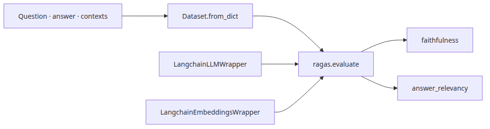

# End-to-end RAG pipeline evaluation

## Questions this post answers
- How do you calculate faithfulness and answer_relevancy in ragas 0.1.22?
- How do you connect LangChain models to the RAGAS wrappers?
- What dataset shape is required when you evaluate final answers instead of retrieval?

> End-to-end evaluation is not “does the answer feel okay”; it is “is the answer grounded in context and directly relevant to the question.”

The fifth post adds RAGAS to score generation quality. The crucial detail is using the real API that works with ragas 0.1.22. The example uses `Faithfulness()` and `AnswerRelevancy(strictness=1)`, with `LangchainLLMWrapper` and `LangchainEmbeddingsWrapper` connecting Groq and sentence-transformers.


## Minimal runnable example

The runnable code lives in `rag-benchmark-101/en/05-e2e-evaluation/main.py`. Episodes 05 and 06 require `GROQ_API_KEY`.

```bash
cd /root/Github/rag-benchmark-101/en/05-e2e-evaluation
export GROQ_API_KEY=... && python3 main.py
```

```python
result = evaluate(
    dataset=dataset,
    metrics=[Faithfulness(), AnswerRelevancy(strictness=1)],
    llm=LangchainLLMWrapper(llm),
    embeddings=LangchainEmbeddingsWrapper(embedding),
    run_config=RunConfig(timeout=300, max_workers=1),
)
```

## What to notice in this code
- The `contexts` column must be a list of strings, not one flattened string.
- `AnswerRelevancy(strictness=1)` keeps the example fast while staying on the real 0.1.22 API.
- `RunConfig(timeout=300, max_workers=1)` reduces timeout noise during network LLM evaluation.

## Where engineers get confused
- Faithfulness can be computed without a ground-truth answer, but answer relevancy still penalizes evasive answers.
- RAGAS scores reflect the final pipeline behavior, so they mix retrieval quality and answer quality unless you benchmark retrieval separately.
- Different ragas versions expose different APIs. This example is pinned to 0.1.22 behavior.

## Checklist
- [ ] Instantiate the metrics with the ragas 0.1.22 API.
- [ ] Wrap both the LLM and embeddings for RAGAS.
- [ ] Build a Dataset with question, answer, and contexts columns.

<!-- blog-only:start -->

## Summary

Now generation quality is measurable too. The final post combines retrieval and generation into one full RAG benchmark pipeline.

Next: [Completing the RAG benchmark](./06-benchmark-complete.md)

<!-- blog-only:end -->

<!-- toc:begin -->
## In this series

- [Understanding RAG evaluation metrics](./01-evaluation-metrics.md)
- [Measuring retrieval performance](./02-retrieval-benchmarking.md)
- [Comparing embedding models](./03-embedding-comparison.md)
- [VectorDB selection criteria](./04-vectordb-selection.md)
- **End-to-end RAG pipeline evaluation (current)**
- Completing the RAG benchmark (upcoming)

<!-- toc:end -->

---

## References

- [RAGAS documentation](https://docs.ragas.io/)
- [RAGAS GitHub repository](https://github.com/explodinggradients/ragas)
- [Groq Python integration in LangChain](https://python.langchain.com/docs/integrations/chat/groq/)

Tags: RAG, VectorDB, Benchmarking, LLM
