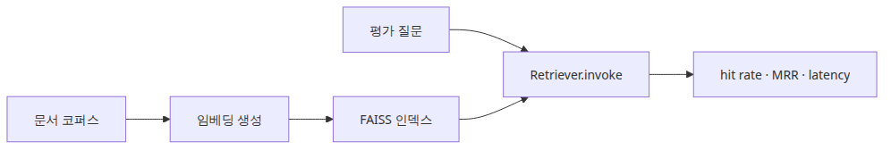

# 검색 성능 측정

## 이 글에서 답할 질문
- FAISS retriever에 hit rate와 MRR을 어떻게 붙일 수 있을까요?
- 검색 지연 시간은 어디서 재고, 어떤 단위로 기록해야 할까요?
- 작은 골드셋만 있어도 검색 벤치마크를 시작할 수 있을까요?

> 검색 벤치마크의 핵심은 벡터DB 자체보다, 질문·정답 문서·측정 루프를 고정해서 같은 retriever를 반복 관찰하는 데 있습니다.

두 번째 글에서는 손계산용 지표를 실제 retriever 위로 올립니다. 작은 코퍼스와 세 개의 질문만 있어도 hit rate, MRR, 평균 지연 시간을 함께 수집할 수 있습니다. 이 패턴이 있으면 이후 임베딩이나 인덱스를 바꿔도 같은 측정 루프를 재사용할 수 있습니다.


## 최소 실행 예제

### 질의와 지연 시간이 묶인 검색 벤치마크 루프


실행 코드는 `rag-benchmark-101/ko/02-retrieval-benchmarking/main.py`에 있습니다. 05편과 06편은 `GROQ_API_KEY`가 필요합니다.

```bash
cd /root/Github/rag-benchmark-101/ko/02-retrieval-benchmarking
python3 main.py
```

```python
retriever = vectorstore.as_retriever(search_kwargs={'k': 3})
for question, relevant_ids in QUERIES:
    started_at = time.perf_counter()
    docs = retriever.invoke(question)
    ranked_ids = [doc.metadata['id'] for doc in docs]
    latencies_ms.append((time.perf_counter() - started_at) * 1000)
```

## 이 코드에서 봐야 할 것

### Hit rate와 MRR을 함께 읽는 검색 품질 축


- `retriever.invoke()` 호출만 감싸서 검색 구간의 지연 시간을 잽니다.
- 검색 결과를 `metadata["id"]`로 표준화하면 이후 모델 비교 코드에서도 같은 평가 함수를 재사용할 수 있습니다.
- hit rate는 관련 문서가 하나라도 들어왔는지 보므로, top-k가 실제로 쓸모 있었는지 빠르게 확인할 때 좋습니다.

## 실무에서 헷갈리는 지점

### Hit rate는 높지만 순위 품질은 낮은 실패 패턴


- hit rate가 1.0이어도 MRR이 낮을 수 있습니다. 관련 문서가 매번 뒤쪽 순위에 있다는 뜻입니다.
- 임베딩 생성 시간을 retrieval latency에 섞으면 검색기 자체의 병목을 구분하기 어렵습니다.
- 작은 코퍼스에서 점수가 좋아도 실제 서비스 코퍼스로 그대로 일반화되지는 않습니다. 여기서는 측정 루프 자체를 검증하는 것이 목적입니다.

## 체크리스트

### 질문과 정답 문서를 함께 남기는 벤치마크 기록


- [ ] 질문별 relevant document id를 준비했다.
- [ ] 검색 품질과 지연 시간을 같은 루프에서 함께 측정했다.
- [ ] 출력에 평균값뿐 아니라 질문별 ranked ids도 남겼다.

<!-- toc:begin -->
## 시리즈 목차

- [RAG 평가 지표 이해](./01-evaluation-metrics.md)
- **검색 성능 측정 (현재 글)**
- 임베딩 모델 비교 (예정)
- VectorDB 선택 기준 (예정)
- 종단 간 RAG 파이프라인 평가 (예정)
- RAG 벤치마크 완성 (예정)

<!-- toc:end -->

---

## 참고 자료

- [LangChain FAISS integration](https://python.langchain.com/docs/integrations/vectorstores/faiss/)
- [FAISS documentation](https://faiss.ai/)

Tags: RAG, VectorDB, Benchmarking, LLM
