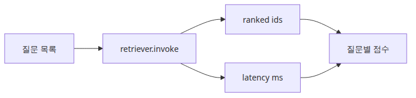
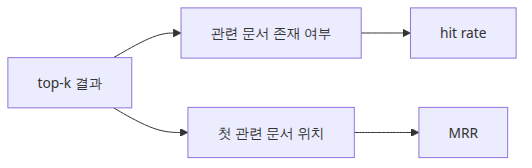
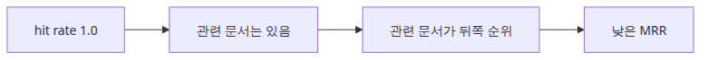
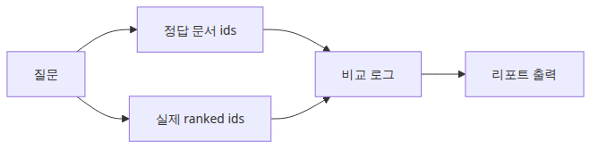

# 검색 성능 측정

## 이 글에서 다룰 문제

1편에서는 hit rate, MRR, nDCG를 종이 위 숫자로 익혔습니다. 하지만 실제 RAG 파이프라인에서는 retriever가 매번 다르게 동작하고, 코퍼스도 계속 바뀝니다. 측정 도구가 없으면 "체감상 좋아진 것 같다"라는 말로 의사결정을 하게 됩니다.

지표를 코드로 옮겨야 하는 이유는 세 가지입니다. 첫째, 임베딩 모델이나 chunk size를 바꿨을 때 **회귀(regression)를 바로 잡아낼 수 있습니다**. 둘째, 동일한 평가 루프를 CI에 붙이면 사람의 주관에 의존하지 않게 됩니다. 셋째, latency를 함께 기록해 두면 품질만 좋아지고 속도가 느려진 변경을 일찍 거를 수 있습니다.

이 글에서 만들 루프는 작지만 완결되어 있어서, 이후 임베딩 비교(3편)나 vector DB 선택(4편)에서도 동일한 코드 골격을 그대로 재사용합니다.

## Mental Model

검색 벤치마크는 다음 네 가지 입력을 한 번에 묶어서 다룹니다.

```text
QUERIES (질문 + 정답 id 집합)
   │
   ▼
retriever.invoke(question)  ──►  ranked_ids  ──►  metric(ranked_ids, gold_ids)
   │                                                   │
   ▼                                                   ▼
latency_ms                                       hit_rate / MRR
```

핵심은 화살표 한 개를 측정 코드로 감싸는 것입니다. `retriever.invoke()` 호출만 시간으로 둘러싸면 검색 구간의 latency가 분리됩니다. 결과는 `metadata["id"]`로 표준화해서 평가 함수가 retriever 종류에 의존하지 않게 만듭니다.

이 모델을 머릿속에 그려두면, 나중에 BM25, hybrid retriever, reranker가 들어와도 측정 코드는 거의 그대로 둘 수 있습니다.

## 핵심 개념

| 용어 | 의미 | 측정 단위 |
| --- | --- | --- |
| Gold set | 질문 + 관련 문서 id 집합 | 질문 수 |
| Hit rate@k | top-k 안에 정답이 한 번이라도 들어간 비율 | 0.0 ~ 1.0 |
| MRR | 정답의 첫 등장 순위의 역수 평균 | 0.0 ~ 1.0 |
| Retrieval latency | retriever 호출 한 번의 소요 시간 | 밀리초(ms) |
| p95 latency | 전체 latency의 95퍼센타일 값 | 밀리초(ms) |

평균 latency만 보면 꼬리 분포(tail latency)를 놓치기 쉽습니다. p95나 p99를 함께 기록해 두면 사용자 체감과 더 가까운 수치를 얻을 수 있습니다.

## Before vs. After

**Before**: "임베딩 모델을 바꿨더니 답변이 더 좋아진 것 같다"라고 말합니다. 근거는 서너 개 질문을 손으로 돌려 본 인상입니다. 며칠 뒤 다른 도메인 질문에서 품질이 떨어져도, 그 변경 때문인지 다른 변경 때문인지 구분할 수 없습니다.

**After**: 같은 `QUERIES` 리스트로 두 retriever를 돌립니다. hit rate, MRR, 평균 latency, p95 latency를 한 줄짜리 결과로 비교합니다. 만약 hit rate가 0.9에서 1.0으로 올랐는데 p95 latency가 80ms에서 250ms로 뛰었다면, 그 트레이드오프를 의식적으로 받아들이거나 거절할 수 있습니다.

## 단계별 실습

### 1단계 — 골드셋 정의

질문과 정답 문서 id를 함께 적습니다. 처음에는 3~5개로 시작해도 충분합니다.

```python
QUERIES = [
    ("FAISS는 어떤 거리 함수를 기본으로 쓰나요?", {"doc-faiss-basics"}),
    ("MRR은 무엇을 측정하나요?", {"doc-mrr-intro"}),
    ("RAG에서 chunk size가 중요한 이유는?", {"doc-chunking"}),
]
```

### 2단계 — 측정 루프 작성



*질의와 지연 시간이 묶인 검색 벤치마크 루프*

실행 코드는 `rag-benchmark-101/ko/02-retrieval-benchmarking/main.py`에 있습니다. 05편과 06편은 `GROQ_API_KEY`가 필요합니다.

```bash
cd /root/Github/rag-benchmark-101/ko/02-retrieval-benchmarking
python3 main.py
```

```python
import time

retriever = vectorstore.as_retriever(search_kwargs={"k": 3})
latencies_ms = []
all_ranked = []

for question, relevant_ids in QUERIES:
    started_at = time.perf_counter()
    docs = retriever.invoke(question)
    elapsed_ms = (time.perf_counter() - started_at) * 1000
    ranked_ids = [doc.metadata["id"] for doc in docs]
    latencies_ms.append(elapsed_ms)
    all_ranked.append((question, ranked_ids, relevant_ids))
```

### 3단계 — 지표 계산



*Hit rate와 MRR을 함께 읽는 검색 품질 축*

```python
def hit_rate(ranked, gold):
    return 1.0 if any(d in gold for d in ranked) else 0.0

def reciprocal_rank(ranked, gold):
    for idx, doc_id in enumerate(ranked, start=1):
        if doc_id in gold:
            return 1.0 / idx
    return 0.0

hits = [hit_rate(r, g) for _, r, g in all_ranked]
rrs = [reciprocal_rank(r, g) for _, r, g in all_ranked]

print(f"hit_rate@3 = {sum(hits)/len(hits):.2f}")
print(f"MRR        = {sum(rrs)/len(rrs):.2f}")
print(f"avg latency = {sum(latencies_ms)/len(latencies_ms):.1f} ms")
```

### 4단계 — 결과 기록

질문별 ranked id를 그대로 남겨야 나중에 어떤 질문이 무너졌는지 디버깅할 수 있습니다. 평균값만 저장하면 회귀가 발생했을 때 원인을 추적하기 어렵습니다.

## 자주 하는 실수



*Hit rate는 높지만 순위 품질은 낮은 실패 패턴*

- **hit rate만 보고 안심하기** — hit rate가 1.0이어도 MRR이 0.4면 정답이 매번 뒤쪽에 있다는 뜻입니다. 사용자에게는 첫 답변이 중요합니다.
- **임베딩 시간을 retrieval latency에 섞기** — embedding 호출과 retriever 호출을 같은 타이머로 묶으면 검색기 자체의 병목을 구분할 수 없습니다.
- **`time.time()` 사용** — 시스템 시계 변경에 영향을 받습니다. 짧은 구간 측정은 항상 `time.perf_counter()`를 씁니다.
- **첫 호출 포함** — 첫 호출은 모델 로딩, 캐시 워밍 비용이 섞여 있습니다. warm-up 호출을 한두 번 돌린 뒤 측정을 시작합니다.
- **작은 코퍼스 결과를 그대로 신뢰** — 5개 문서로 hit rate 1.0이 나와도 실제 서비스 코퍼스에서는 다릅니다. 이 단계에서는 **측정 루프 자체의 정합성**만 검증한다고 생각해야 합니다.

## 실무 적용

규모가 커지면 다음 항목을 함께 기록합니다.

- **버전 메타데이터**: embedding model 이름, chunk size, retriever 종류, 코퍼스 hash. 결과만 보관하면 재현이 불가능합니다.
- **p95/p99 latency**: 평균은 일부 빠른 호출에 가려집니다. `numpy.percentile(latencies_ms, 95)`로 함께 기록합니다.
- **CI 게이트**: hit rate가 기준치 이하이거나 p95 latency가 기준치를 넘으면 PR을 막습니다. 처음에는 경고만, 안정화 후에 차단으로 옮깁니다.
- **샘플링 전략**: 골드셋이 수백 개로 커지면 매 PR마다 전체를 돌리기 부담스럽습니다. 카테고리별 stratified sampling으로 50~100개를 빠르게 돌리고, 야간 작업에서 전체를 돌립니다.

## 실무에서는 이렇게 생각한다

벤치마크를 처음 도입할 때 가장 큰 장벽은 골드셋 만들기입니다. 완벽한 골드셋을 기다리면 영원히 시작할 수 없으므로, 도메인 전문가와 30분 앙아 20개 쿼리를 만드는 것으로 시작하는 팀이 많습니다. 초기 골드셋이 작아도 방향은 보입니다.

벤치마크를 CI에 넣을지 말지는 팀마다 다릅니다. retrieval 변경이 잦은 팀은 PR마다 돌리는 것이 좋고, 월 1회 바꾸는 팀은 야간 배치로 충분합니다. 중요한 것은 "돌리는 습관"이지, "매 커밋마다 돌리는 것"이 아닙니다.

## 체크리스트



*질문과 정답 문서를 함께 남기는 벤치마크 기록*

- [ ] 질문별 relevant document id를 명시적으로 적었다.
- [ ] `retriever.invoke()`만 감싸서 retrieval latency를 분리했다.
- [ ] hit rate, MRR, 평균 latency, p95 latency를 함께 출력했다.
- [ ] 결과에 질문별 ranked ids도 남겼다.
- [ ] 측정에 사용한 embedding model, chunk size, k 값을 기록했다.

## 정리 · 다음 글

이번 글에서는 손계산 지표를 실제 retriever 위로 옮겨서, hit rate · MRR · latency를 같은 루프에서 측정하는 패턴을 만들었습니다. 이 코드 골격은 앞으로의 모든 비교 실험에서 그대로 재사용됩니다.

다음 글(3편)에서는 같은 측정 루프 위에 **임베딩 모델을 바꿔 끼워서 비교**합니다. 코드 변경은 한 줄이지만, 결과 해석에서 주의할 점이 많습니다.

<!-- toc:begin -->
## 시리즈 목차

- [RAG 평가 지표 이해](./01-evaluation-metrics.md)
- **검색 성능 측정 (현재 글)**
- 임베딩 모델 비교 (예정)
- VectorDB 선택 기준 (예정)
- 종단 간 RAG 파이프라인 평가 (예정)
- RAG 벤치마크 완성 (예정)

<!-- toc:end -->

---

## 참고 자료

- [LangChain FAISS integration](https://python.langchain.com/docs/integrations/vectorstores/faiss/)
- [FAISS documentation](https://faiss.ai/)
- [Python `time.perf_counter`](https://docs.python.org/3/library/time.html#time.perf_counter)
- [BEIR: heterogeneous benchmark for IR](https://github.com/beir-cellar/beir)

Tags: RAG, VectorDB, Benchmarking, LLM
