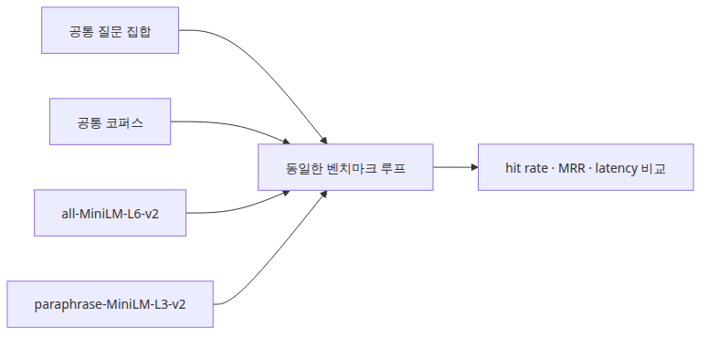

# 임베딩 모델 비교

## 이 글에서 답할 질문
- all-MiniLM-L6-v2와 paraphrase-MiniLM-L3-v2를 같은 질의셋으로 비교하면 무엇이 보일까요?
- 임베딩 모델 비교에서 hit rate만 보면 왜 부족할까요?
- 속도와 정확도 중 어느 쪽이 병목인지 어떻게 읽어야 할까요?

> 임베딩 모델 비교는 “어떤 모델이 더 똑똑한가”보다, 같은 검색 파이프라인에서 어느 모델이 더 빨리 관련 문서를 앞쪽에 올려주는가를 보는 일입니다.

세 번째 글에서는 retriever 구조를 그대로 두고 임베딩 모델만 바꿉니다. 이렇게 해야 품질 차이를 모델 쪽으로 귀속할 수 있습니다. 예제는 두 sentence-transformers 모델을 같은 corpus, 같은 query set, 같은 k 값으로 평가합니다.


## 최소 실행 예제

실행 코드는 `rag-benchmark-101/ko/03-embedding-comparison/main.py`에 있습니다. 05편과 06편은 `GROQ_API_KEY`가 필요합니다.

```bash
cd /root/Github/rag-benchmark-101/ko/03-embedding-comparison
python3 main.py
```

```python
MODELS = [
    'sentence-transformers/all-MiniLM-L6-v2',
    'sentence-transformers/paraphrase-MiniLM-L3-v2',
]
results = [benchmark_model(model_name) for model_name in MODELS]
print(json.dumps(results, indent=2))
```

## 이 코드에서 봐야 할 것
- Corpus와 query set을 고정해야 모델 간 비교가 공정해집니다.
- MRR을 함께 보면 두 모델이 관련 문서를 “찾는지”뿐 아니라 “얼마나 앞에 두는지”까지 볼 수 있습니다.
- 평균 latency를 같이 저장하면 더 좋은 점수가 실제 운영 비용과 맞는지도 판단할 수 있습니다.

## 실무에서 헷갈리는 지점
- 임베딩 차이와 chunking 차이를 동시에 바꾸면 원인 분리가 되지 않습니다. 한 번에 한 축만 바꿔야 합니다.
- 같은 hit rate라도 MRR 차이가 크면 실제 응답 품질은 달라질 수 있습니다. LLM은 상위 문서 몇 개의 순서에 민감합니다.
- 작은 데이터셋에서 한 모델이 이겼다고 끝내면 안 됩니다. 도메인 질문으로 다시 검증해야 합니다.

## 체크리스트
- [ ] 동일한 corpus, 동일한 query set으로 두 모델을 평가했다.
- [ ] hit rate와 MRR을 함께 비교했다.
- [ ] latency까지 포함해 운영 관점의 비용을 함께 봤다.

<!-- toc:begin -->
## 시리즈 목차

- [RAG 평가 지표 이해](./01-evaluation-metrics.md)
- [검색 성능 측정](./02-retrieval-benchmarking.md)
- **임베딩 모델 비교 (현재 글)**
- VectorDB 선택 기준 (예정)
- 종단 간 RAG 파이프라인 평가 (예정)
- RAG 벤치마크 완성 (예정)

<!-- toc:end -->

---

## 참고 자료

- [Sentence Transformers model catalog](https://www.sbert.net/docs/pretrained_models.html)
- [MTEB leaderboard](https://huggingface.co/spaces/mteb/leaderboard)

Tags: RAG, VectorDB, Benchmarking, LLM
