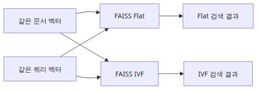
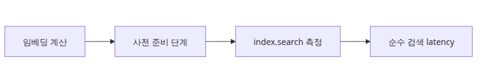
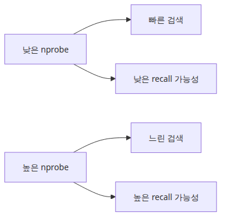
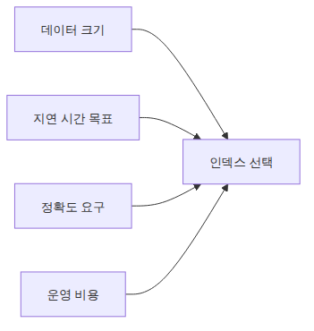

# VectorDB 선택 기준

> VectorDB 선택은 **브랜드 비교가 아닙니다**. 같은 임베딩 벡터를 서로 다른 인덱스 구조에 넣었을 때 어떻게 동작하는지 측정하는 실험입니다.

VectorDB 비교는 같은 벡터와 같은 query를 어떤 인덱스 구조가 어떻게 처리하는지 보는 일입니다. 실험 골격을 고정해 두면 정확도, 속도, 메모리 사이의 트레이드오프가 숫자로 드러납니다.

이 글은 RAG 평가와 벤치마크 101 시리즈의 네 번째 글입니다.

## 이 글에서 다룰 문제

벡터 검색의 비용은 corpus가 커질수록 폭발적으로 늘어납니다. 1만 건까지는 어떤 인덱스를 써도 비슷합니다. 10만 건을 넘기면 flat(brute-force) 검색은 latency가 100ms를 넘기 시작하고, 100만 건이면 사용자에게 못 쓸 수준이 됩니다.

여기서 등장하는 것이 IVF, HNSW 같은 **approximate nearest neighbor(ANN) index**입니다. 정확도를 약간 양보하는 대신 검색 속도를 10~100배 끌어올립니다. 문제는 "약간"이 데이터 분포와 파라미터에 따라 0.99 recall일 수도, 0.7일 수도 있다는 점입니다.

같은 corpus 위에서 직접 측정해야 하는 이유가 여기 있습니다. 이 글의 비교는 작지만, 의사결정 축(정확도 vs 속도 vs 메모리)을 정렬하는 데 충분합니다.

## Mental Model

VectorDB 비교의 골격은 다음과 같습니다.

```text
[고정] embedding model + corpus 임베딩 결과 (doc_vectors)
                  │
                  ▼
        [변수] index 구조
        ┌─────────┴─────────┐
        ▼                   ▼
   IndexFlatIP           IndexIVFFlat (nprobe=N)
   (정확, 느림)          (근사, 빠름)
        │                   │
        ▼                   ▼
   recall=1.0            recall<=1.0
   search_lat = X        search_lat = X / k
```

벡터를 다시 만들지 않습니다. 임베딩은 한 번만 계산하고 결과를 두 인덱스에 동시에 넣습니다. 그래야 차이가 인덱스 구조 때문이라는 걸 보장할 수 있습니다.

## 핵심 개념

| 용어 | 의미 |
| --- | --- |
| Flat index | 모든 벡터와 거리를 직접 계산. 100% 정확하지만 O(N) |
| IVF (Inverted File) | corpus를 nlist개 cluster로 나누고 query에 가까운 nprobe개 cluster만 탐색 |
| HNSW | 그래프 기반 ANN. 높은 recall + 빠른 속도지만 메모리 사용 큼 |
| Recall@k | flat 결과를 정답으로 두고, ANN 결과가 얼마나 일치하는지 |
| nprobe | IVF에서 탐색할 cluster 개수. 클수록 정확, 작을수록 빠름 |
| nlist | corpus를 나눌 cluster 총 개수 (대개 √N) |

Recall은 hit rate와 다릅니다. **Hit rate**는 정답이 골드셋에 들어왔는지를 보고, **Recall**은 ANN이 flat 대비 얼마나 같은 결과를 뽑았는지를 봅니다.

## Before vs. After

**Before**: "벡터DB는 Chroma가 편하니까 그걸 쓰자". 10만 건이 되자 검색이 느려져서 다급하게 FAISS로 옮깁니다. 옮긴 뒤에는 "왜 답변이 달라졌지?"를 디버깅하느라 며칠을 씁니다.

**After**: 같은 임베딩 벡터를 두 인덱스에 동시에 넣고 비교합니다.

```text
index               recall@5  search_ms  memory_mb
IndexFlatIP         1.00      18.3       384
IndexIVFFlat (n=1)  0.72       2.1       386
IndexIVFFlat (n=4)  0.95       4.7       386
IndexIVFFlat (n=8)  0.99       7.9       386
```

표를 보면 `nprobe=4`가 좋은 균형이라는 사실이 분명해집니다. 회의 자료로 그대로 쓸 수 있는 근거가 됩니다.

## 단계별 실습

### 1단계 — 임베딩을 한 번만 계산

```python
import numpy as np
from sentence_transformers import SentenceTransformer

model = SentenceTransformer("sentence-transformers/all-MiniLM-L6-v2")
doc_vectors = model.encode(DOC_TEXTS, normalize_embeddings=True).astype("float32")
query_vectors = model.encode(QUERY_TEXTS, normalize_embeddings=True).astype("float32")
dimension = doc_vectors.shape[1]
```

### 2단계 — Flat index 빌드



*같은 벡터를 Flat과 IVF에 넣는 인덱스 비교 구조*

실행 코드는 `rag-benchmark-101/ko/04-vectordb-selection/main.py`에 있습니다. 05편과 06편은 `GROQ_API_KEY`가 필요합니다.

```bash
cd /root/Github/rag-benchmark-101/ko/04-vectordb-selection
python3 main.py
```

```python
import faiss

flat_index = faiss.IndexFlatIP(dimension)
flat_index.add(doc_vectors)
```

### 3단계 — IVF index 빌드와 학습

```python
nlist = max(1, int(np.sqrt(len(doc_vectors))))
quantizer = faiss.IndexFlatIP(dimension)
ivf_index = faiss.IndexIVFFlat(quantizer, dimension, nlist, faiss.METRIC_INNER_PRODUCT)
ivf_index.train(doc_vectors)
ivf_index.add(doc_vectors)
ivf_index.nprobe = 4
```

`train()`은 corpus를 cluster로 나누는 단계입니다. flat에는 없는 비용입니다.

### 4단계 — pure search latency 측정



*임베딩 계산과 검색 시간을 분리하는 측정 경계*

```python
def search_only(index, query_vec, k=5, repeats=20):
    times = []
    for _ in range(repeats):
        t0 = time.perf_counter()
        D, I = index.search(query_vec.reshape(1, -1), k)
        times.append((time.perf_counter() - t0) * 1000)
    return np.median(times), I[0]
```

embedding 단계를 빼고 `index.search()`만 잰다는 점이 핵심입니다.

### 5단계 — Recall 계산

```python
def recall_at_k(approx_ids, exact_ids):
    return len(set(approx_ids) & set(exact_ids)) / len(exact_ids)

flat_results = [search_only(flat_index, q)[1] for q in query_vectors]
ivf_results = [search_only(ivf_index, q)[1] for q in query_vectors]
recall = np.mean([recall_at_k(a, e) for a, e in zip(ivf_results, flat_results)])
```

### 6단계 — `nprobe` 스윕



*nprobe가 속도와 정확도를 조절하는 흐름*

`nprobe`를 1, 2, 4, 8, 16으로 바꿔 가며 recall과 latency가 어떻게 움직이는지 그래프를 그려 봅니다. 거의 항상 sweet spot이 보입니다.

## 자주 하는 실수

- **임베딩 시간을 search latency에 섞기** — embedding 계산이 search보다 훨씬 느릴 수 있어 인덱스 차이가 묻힙니다.
- **단 1회 측정** — 첫 호출은 느립니다. `repeats >= 20`으로 median을 사용합니다.
- **Toy corpus의 결과를 일반화** — 1,000건에서 recall 0.99가 나왔다고 100만 건에서도 그렇다고 단정할 수 없습니다.
- **`nprobe`를 안 학습된 IVF에 설정** — `ivf_index.train()` 호출 없이 `add()` 하면 에러가 납니다.
- **HNSW 메모리 무시** — HNSW는 빠르지만 인덱스 메모리가 flat의 2~3배입니다. 메모리 예산이 작은 환경에서는 IVF가 적합합니다.

## 실무 적용



*운영 조건으로 인덱스를 고르는 판단 축*

- **VectorDB 후보 비교**: FAISS(라이브러리), Chroma(임베디드 + REST), pgvector(Postgres extension), Qdrant/Weaviate(독립 서버). 같은 query를 던져 latency, recall, 운영 비용(설치, 백업, 스케일링)을 한 표에 정리합니다.
- **Recall 목표 정하기**: 일반 RAG 응답에는 0.95 이상이면 충분합니다. 법률·의료처럼 누락 비용이 큰 도메인은 0.99 이상을 목표로 합니다.
- **재학습 주기**: corpus가 30% 이상 바뀌면 IVF의 cluster가 노후화됩니다. 주기적 재학습 일정을 잡습니다.
- **운영 모니터링**: production에서 query latency 분포(p50, p95, p99)와 빈 결과 비율을 항상 기록합니다.

## 실무에서는 이렇게 생각한다

VectorDB 선택에서 가장 위험한 함정은 "가장 빠른 DB"를 고르는 것입니다. 벤치마크에서 ms 단위 차이는 사용자가 체감하지 못합니다. 실제로 영향이 큰 것은 필터링 성능, 메타데이터 지원, 인덱스 업데이트 속도입니다. 운영에서는 "뤨 문서를 삭제하고 새 문서를 추가하는"이 매일 일어나므로, upsert 성능이 검색 성능만큼 중요합니다.

또 한 가지 고려할 점은 운영 부담입니다. FAISS는 라이브러리이므로 앱 프로세스와 함께 뜨지만, Qdrant나 Weaviate는 별도 서버를 운영해야 합니다. 팀에 인프라 운영 여력이 있는지, managed 서비스를 쓸 수 있는지가 기술적 성능보다 더 큰 선택 요소일 때가 많습니다.

## 체크리스트

- [ ] 임베딩 벡터를 한 번만 계산해 두 인덱스에 동시 투입했다.
- [ ] `index.search()`만 감싸 pure search latency를 측정했다.
- [ ] median latency를 사용했다(평균이 아니라).
- [ ] flat 결과를 정답으로 두고 recall@k를 계산했다.
- [ ] `nprobe` 또는 동등한 ANN 파라미터를 스윕해 trade-off 곡선을 그렸다.

## 정리 · 다음 글

이번 글에서는 같은 임베딩 벡터를 flat과 IVF 두 인덱스에 동시에 넣어 recall과 search latency의 trade-off를 측정했습니다. 핵심은 **벡터를 다시 만들지 않기**, **search 구간만 측정하기**, **median과 nprobe 스윕**입니다.

다음 글(5편)에서는 retriever를 끼운 **종단 간 RAG 파이프라인**을 평가합니다. 검색 품질뿐 아니라 LLM 응답까지 포함한 측정 루프를 만듭니다.

<!-- toc:begin -->
## 시리즈 목차

- [RAG 평가 지표 이해](./01-evaluation-metrics.md)
- [검색 성능 측정](./02-retrieval-benchmarking.md)
- [임베딩 모델 비교](./03-embedding-comparison.md)
- **VectorDB 선택 기준 (현재 글)**
- 종단 간 RAG 파이프라인 평가 (예정)
- RAG 벤치마크 완성 (예정)

<!-- toc:end -->

---

## 참고 자료

- [FAISS indexes wiki](https://github.com/facebookresearch/faiss/wiki/Faiss-indexes)
- [FAISS getting started](https://github.com/facebookresearch/faiss/wiki/Getting-started)
- [pgvector](https://github.com/pgvector/pgvector)
- [Qdrant benchmarks](https://qdrant.tech/benchmarks/)

Tags: RAG, VectorDB, Benchmarking, LLM
