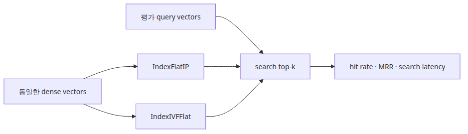

# VectorDB 선택 기준

## 이 글에서 답할 질문
- annoy가 없을 때 FAISS flat과 IVF를 어떻게 비교할 수 있을까요?
- 정확도와 검색 지연 시간 중 무엇을 같이 기록해야 trade-off를 말할 수 있을까요?
- 작은 예제에서도 approximate search의 장단점을 어떻게 드러낼 수 있을까요?

> VectorDB 선택은 브랜드 비교가 아니라, 같은 임베딩 벡터를 어떤 인덱스 구조에 넣었을 때 정확도와 속도가 어떻게 바뀌는지 보는 실험입니다.

네 번째 글에서는 벡터 저장소의 “알고리즘 레이어”를 봅니다. 현재 환경에는 annoy가 없으므로 예제는 FAISS flat index와 IVF index를 비교합니다. 중요한 점은 벡터는 그대로 두고 검색 방식만 바꿔야 한다는 것입니다.


## 최소 실행 예제

실행 코드는 `rag-benchmark-101/ko/04-vectordb-selection/main.py`에 있습니다. 05편과 06편은 `GROQ_API_KEY`가 필요합니다.

```bash
cd /root/Github/rag-benchmark-101/ko/04-vectordb-selection
python3 main.py
```

```python
flat_index = faiss.IndexFlatIP(dimension)
flat_index.add(doc_vectors)

ivf_index = faiss.IndexIVFFlat(quantizer, dimension, nlist, faiss.METRIC_INNER_PRODUCT)
ivf_index.train(doc_vectors)
ivf_index.add(doc_vectors)
ivf_index.nprobe = 1
```

## 이 코드에서 봐야 할 것
- 문서 임베딩과 쿼리 임베딩을 미리 계산해 두고, 벤치마크 루프에서는 `index.search()`만 재서 pure search latency를 분리합니다.
- IVF의 `nprobe`는 근사 검색의 정확도와 속도를 동시에 조절하는 손잡이입니다.
- 이 예제는 annoy가 없을 때도 approximate search 비교 실험을 계속할 수 있게 flat vs IVF로 fallback합니다.

## 실무에서 헷갈리는 지점
- VectorDB 비교에서 임베딩 생성 시간이 더 크면 인덱스 차이가 가려집니다. 측정 구간을 분리해야 합니다.
- 근사 검색이 항상 품질을 떨어뜨리는 것은 아닙니다. 데이터 분포와 `nprobe` 설정에 따라 flat과 거의 같은 결과가 나올 수도 있습니다.
- 반대로 toy corpus에서 정확도 차이가 없다고 실제 대규모 서비스에서도 없다고 가정하면 안 됩니다.

## 체크리스트
- [ ] 같은 벡터를 두 인덱스에 넣고 비교했다.
- [ ] 검색 latency를 별도로 측정했다.
- [ ] 속도와 정확도를 함께 보고 인덱스를 선택했다.

<!-- toc:begin -->
## 시리즈 목차

- [RAG 평가 지표 이해](./01-evaluation-metrics.md)
- [검색 성능 측정](./02-retrieval-benchmarking.md)
- [임베딩 모델 비교](./03-embedding-comparison.md)
- **VectorDB 선택 기준 (현재 글)**
- 종단 간 RAG 파이프라인 평가 (예정)
- RAG 벤치마크 완성 (예정)

<!-- toc:end -->

---

## 참고 자료

- [FAISS indexes wiki](https://github.com/facebookresearch/faiss/wiki/Faiss-indexes)
- [FAISS getting started](https://github.com/facebookresearch/faiss/wiki/Getting-started)

Tags: RAG, VectorDB, Benchmarking, LLM
