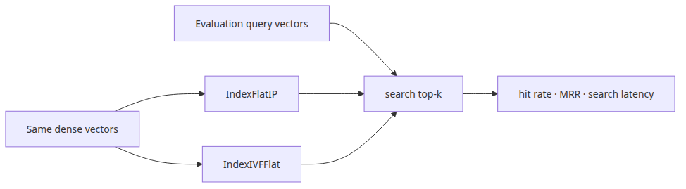
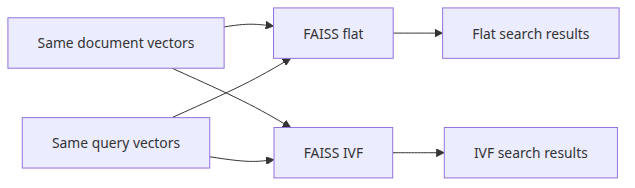
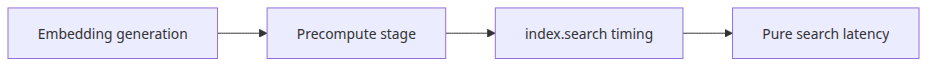
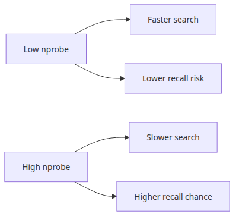
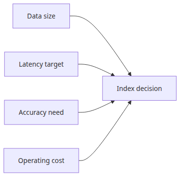

# VectorDB 선택 기준

VectorDB 비교는 브랜드 비교가 아니라 같은 벡터와 같은 질의를 서로 다른 인덱스 구조에 넣어 보는 실험입니다. 이 글은 RAG Benchmark 101 시리즈의 네 번째 글입니다. 여기서는 같은 임베딩 결과를 기준으로 정확도, 검색 지연 시간, 메모리의 트레이드오프를 읽는 방법을 정리하겠습니다.

## 이 글에서 다룰 문제

- FAISS의 flat 인덱스와 IVF 인덱스를 어떻게 공정하게 비교할 수 있을까요?
- 정확도와 함께 어떤 값을 기록해야 실제 트레이드오프를 논할 수 있을까요?
- 작은 예제에서도 ANN 검색의 손익을 어떻게 드러낼 수 있을까요?
- FAISS, Chroma, pgvector, Qdrant 같은 후보를 같은 기준으로 비교하려면 무엇을 고정해야 할까요?



*이 글에서 답할 질문*

> VectorDB 선택은 **브랜드 이름을 고르는 일**이 아닙니다. 같은 임베딩 벡터가 서로 다른 인덱스 구조 안에서 어떻게 동작하는지 측정하는 실험입니다.

## 왜 이 주제가 중요한가

벡터 검색 비용은 코퍼스가 커질수록 급격히 커집니다. 문서 수가 적을 때는 어떤 인덱스를 쓰든 큰 차이가 없어 보일 수 있습니다. 하지만 규모가 커지면 brute-force 방식의 flat 검색은 곧 병목이 됩니다.

이때 등장하는 것이 IVF, HNSW 같은 **근사 최근접 탐색(ANN)** 인덱스입니다. 이들은 약간의 정확도를 포기하는 대신 검색 속도를 크게 끌어올립니다. 문제는 그 "약간"이 데이터 분포와 파라미터에 따라 완전히 다르게 나타난다는 점입니다. 어떤 코퍼스에서는 recall 0.99를 유지하면서 매우 빨라질 수 있지만, 어떤 경우에는 정확도가 크게 무너질 수 있습니다.

그래서 VectorDB 선택은 편의성이나 인지도만으로 결정하면 안 됩니다. 내 코퍼스와 내 질의 세트 위에서 **정확도·속도·메모리**를 함께 측정해야 합니다. 이 글의 예제는 작지만, 어떤 축을 봐야 하는지는 충분히 분명하게 보여 줍니다.

## 기본 멘탈 모델

VectorDB 비교의 골격은 아래와 같습니다.

```text
[fixed] embedding model + corpus embeddings (doc_vectors)
                  │
                  ▼
        [variable] index structure
        ┌─────────┴─────────┐
        ▼                   ▼
   IndexFlatIP           IndexIVFFlat (nprobe=N)
   (exact, slow)         (approximate, fast)
        │                   │
        ▼                   ▼
   recall=1.0            recall<=1.0
   search_lat = X        search_lat = X / k
```

핵심은 **벡터를 다시 만들지 않는 것**입니다. 임베딩은 한 번만 계산하고, 그 동일한 벡터를 여러 인덱스 구조에 넣어야 합니다. 그래야 결과 차이를 인덱스 구조 차이로 해석할 수 있습니다.

## 핵심 개념

| 용어 | 의미 |
| --- | --- |
| Flat index | 모든 벡터와 직접 거리를 계산하는 정확 검색 방식 |
| IVF | 코퍼스를 여러 클러스터로 나누고 일부 클러스터만 탐색하는 ANN 방식 |
| HNSW | 그래프 기반 ANN. 빠르고 recall이 높지만 메모리 사용량이 큼 |
| Recall@k | ANN 결과가 flat 기준 결과와 얼마나 일치하는지 |
| nprobe | IVF가 탐색할 클러스터 수. 높을수록 정확, 낮을수록 빠름 |
| nlist | 전체 클러스터 수 |

여기서 recall은 1편에서 본 hit rate와 다릅니다. hit rate는 골드 정답 문서가 들어왔는지를 묻고, 여기서의 recall은 **ANN 결과가 exact 검색 결과를 얼마나 잘 복제했는지**를 봅니다. 따라서 기준선은 골드셋이 아니라 flat 검색 결과입니다.

## 도구 이름만 보고 고를 때와 실험으로 고를 때

이전에는 "Chroma가 편하니까 쓰자"처럼 결정할 수 있습니다. 하지만 코퍼스가 커졌을 때 성능이 모자라면 뒤늦게 FAISS나 다른 저장소로 옮겨야 하고, 그 순간 "왜 답변이 예전과 다르지?"를 새로 디버깅해야 합니다.

이후에는 같은 임베딩 벡터를 두 인덱스에 동시에 넣고 한 표에서 비교합니다.

```text
index               recall@5  search_ms  memory_mb
IndexFlatIP         1.00      18.3       384
IndexIVFFlat (n=1)  0.72       2.1       386
IndexIVFFlat (n=4)  0.95       4.7       386
IndexIVFFlat (n=8)  0.99       7.9       386
```

이 표는 의사결정을 훨씬 쉽게 만듭니다. 예를 들어 `nprobe=4`가 품질과 속도의 균형점이라는 사실을 회의 자료에서 바로 설명할 수 있습니다.

## 단계별로 비교 실험 만들기

### 1단계 — 임베딩을 한 번만 계산하기

```python
import numpy as np
from sentence_transformers import SentenceTransformer

model = SentenceTransformer("sentence-transformers/all-MiniLM-L6-v2")
doc_vectors = model.encode(DOC_TEXTS, normalize_embeddings=True).astype("float32")
query_vectors = model.encode(QUERY_TEXTS, normalize_embeddings=True).astype("float32")
dimension = doc_vectors.shape[1]
```

이 단계에서 이미 실험의 절반이 결정됩니다. 임베딩 결과를 고정해 두어야 뒤의 차이를 인덱스 탓으로 돌릴 수 있습니다.

### 2단계 — Flat 인덱스 만들기



*같은 벡터를 flat과 IVF에 넣는 비교 구조*

실행 코드는 `rag-benchmark-101/en/04-vectordb-selection/main.py`에 있습니다. 05편과 06편은 `GROQ_API_KEY`가 필요합니다.

```bash
cd en/04-vectordb-selection
python3 main.py
```

```python
import faiss

flat_index = faiss.IndexFlatIP(dimension)
flat_index.add(doc_vectors)
```

Flat 인덱스는 정확 검색의 기준선입니다. 느릴 수는 있어도 결과 자체는 비교 기준으로 신뢰할 수 있습니다.

### 3단계 — IVF 인덱스를 학습하고 추가하기

```python
nlist = max(1, int(np.sqrt(len(doc_vectors))))
quantizer = faiss.IndexFlatIP(dimension)
ivf_index = faiss.IndexIVFFlat(quantizer, dimension, nlist, faiss.METRIC_INNER_PRODUCT)
ivf_index.train(doc_vectors)
ivf_index.add(doc_vectors)
ivf_index.nprobe = 4
```

`train()`이 중요한 이유는 IVF가 코퍼스를 클러스터로 나눠야 하기 때문입니다. Flat에는 없는 초기 비용이며, 운영에서는 재학습 주기까지 고려해야 합니다.

### 4단계 — 순수 검색 시간만 재기



*임베딩 시간과 검색 시간을 분리하는 경계*

```python
def search_only(index, query_vec, k=5, repeats=20):
    times = []
    for _ in range(repeats):
        t0 = time.perf_counter()
        D, I = index.search(query_vec.reshape(1, -1), k)
        times.append((time.perf_counter() - t0) * 1000)
    return np.median(times), I[0]
```

여기서 핵심은 `index.search()`만 재는 것입니다. 임베딩 시간까지 섞으면 인덱스 구조 차이가 가려질 수 있습니다.

### 5단계 — flat 결과를 기준으로 recall 계산하기

```python
def recall_at_k(approx_ids, exact_ids):
    return len(set(approx_ids) & set(exact_ids)) / len(exact_ids)

flat_results = [search_only(flat_index, q)[1] for q in query_vectors]
ivf_results = [search_only(ivf_index, q)[1] for q in query_vectors]
recall = np.mean([recall_at_k(a, e) for a, e in zip(ivf_results, flat_results)])
```

이 recall은 "정답 문서를 찾았는가"가 아니라, "ANN이 exact 검색 결과를 얼마나 따라갔는가"를 보는 값입니다. 따라서 1편의 검색 지표와 목적이 다릅니다.

### 6단계 — `nprobe`를 바꿔 가며 곡선 보기



*nprobe가 속도와 정확도를 조절하는 흐름*

`nprobe`를 1, 2, 4, 8, 16으로 바꾸면 속도와 정확도 사이의 곡선이 드러납니다. 실제로는 이 곡선 중 어딘가에 항상 선택 가능한 지점이 있습니다. 좋은 비교는 그 지점을 찾는 과정입니다.

## 자주 하는 실수

- **임베딩 시간을 검색 시간에 섞기** — 인덱스 구조 차이를 제대로 읽을 수 없습니다.
- **한 번만 재고 결론 내리기** — 첫 호출은 느립니다. 여러 번 반복해 중앙값을 쓰는 편이 안정적입니다.
- **작은 코퍼스 결과를 일반화하기** — 1천 건에서 괜찮다고 100만 건에서도 같다고 볼 수 없습니다.
- **학습되지 않은 IVF에 `nprobe`만 조정하기** — `train()` 없이 `add()` 하면 오류가 납니다.
- **HNSW의 메모리 비용 무시하기** — 빠른 대신 메모리 요구량이 큽니다.

## 운영 환경으로 가져갈 때

실제 서비스에서는 인덱스 선택이 검색 품질만의 문제가 아닙니다. 설치 방식, 백업, 복구, 확장, 메타데이터 필터링, 업데이트 빈도까지 함께 봐야 합니다. FAISS는 라이브러리로 간단하지만 분산 운영은 직접 설계해야 하고, pgvector는 기존 PostgreSQL과 통합하기 좋지만 검색 특화 기능은 제한될 수 있습니다. Qdrant나 Weaviate는 운영 부담이 늘지만 서버형 기능이 풍부합니다.

또 검색 품질 목표도 도메인마다 다릅니다. 일반적인 RAG 응답이라면 recall 0.95 정도가 실용적일 수 있지만, 법률·의료처럼 누락 비용이 큰 도메인은 0.99 이상을 목표로 잡아야 할 수 있습니다. 따라서 VectorDB 선택은 빠른 것이 아니라 **내 도메인에서 필요한 정확도를 어떤 비용으로 달성하는가**의 문제입니다.

## 체크리스트



*실제 운영 조건으로 인덱스를 고르는 판단 축*

- [ ] 임베딩 벡터를 한 번만 계산해 모든 인덱스에 동일하게 넣었는가?
- [ ] `index.search()`만 감싸 순수 검색 지연 시간을 측정했는가?
- [ ] 평균 대신 중앙값 지연 시간을 사용했는가?
- [ ] flat 결과를 기준선으로 recall@k를 계산했는가?
- [ ] `nprobe` 같은 ANN 파라미터를 바꿔 곡선을 확인했는가?

## 연습 문제

1. 코퍼스 크기를 100, 1,000, 10,000으로 늘리며 flat과 IVF의 검색 지연 시간 비율을 비교해 보세요.
2. `IndexHNSWFlat`을 추가해 flat, IVF, HNSW를 같은 표에서 비교해 보세요.
3. `nprobe=1, 4, 16`에서 recall을 재고, recall ≥ 0.95를 만족하는 최소 `nprobe`를 찾아 보세요.

## 정리와 다음 글

이 글에서는 같은 임베딩 벡터를 flat과 IVF 인덱스에 넣고, recall과 검색 지연 시간 사이의 트레이드오프를 비교했습니다. 핵심은 세 가지입니다. **벡터를 다시 만들지 말 것, 검색 시간만 측정할 것, 파라미터 곡선을 직접 볼 것**입니다.

다음 글에서는 검색기 뒤에 LLM을 연결해 종단 간 RAG 파이프라인을 평가합니다. 이제부터는 문서를 찾는 것뿐 아니라 답변 자체도 함께 점수화해야 합니다.

<!-- toc:begin -->
## 시리즈 목차

- [RAG 평가 지표 이해](./01-evaluation-metrics.md)
- [검색 성능 측정](./02-retrieval-benchmarking.md)
- [임베딩 모델 비교](./03-embedding-comparison.md)
- **VectorDB 선택 기준 (현재 글)**
- 종단 간 RAG 파이프라인 평가 (예정)
- RAG 벤치마크 완성 (예정)

<!-- toc:end -->

---

## 참고 자료

- [FAISS indexes wiki](https://github.com/facebookresearch/faiss/wiki/Faiss-indexes)
- [FAISS getting started](https://github.com/facebookresearch/faiss/wiki/Getting-started)
- [pgvector](https://github.com/pgvector/pgvector)
- [Qdrant benchmarks](https://qdrant.tech/benchmarks/)

Tags: RAG, VectorDB, Benchmarking, LLM
