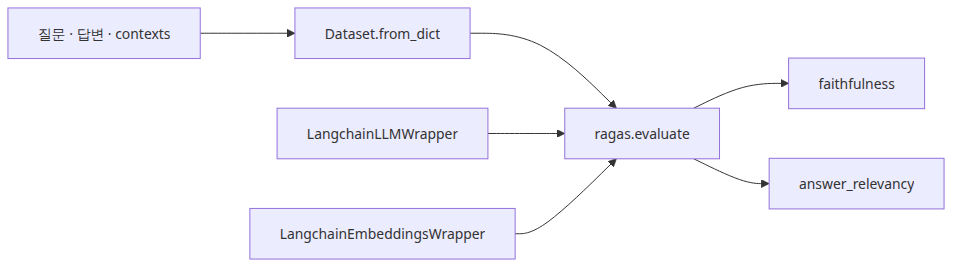

# 종단 간 RAG 파이프라인 평가

## 이 글에서 답할 질문
- ragas 0.1.22에서 faithfulness와 answer_relevancy를 실제로 어떻게 계산할까요?
- LangChain LLM과 임베딩 모델을 RAGAS wrapper에 어떻게 연결할까요?
- 검색이 아니라 최종 답변의 품질을 볼 때 어떤 데이터셋 모양이 필요할까요?

> 종단 간 평가는 “답이 맞아 보이는가”가 아니라, 답이 컨텍스트에 근거했고 질문에 직접 답했는가를 구조화된 점수로 보는 일입니다.

다섯 번째 글에서는 RAGAS를 붙여 생성 품질을 측정합니다. 여기서 중요한 것은 ragas 버전에 맞는 실제 API를 쓰는 것입니다. 예제는 `Faithfulness()`와 `AnswerRelevancy(strictness=1)`를 사용하고, `LangchainLLMWrapper`와 `LangchainEmbeddingsWrapper`로 Groq LLM과 sentence-transformers 임베딩을 연결합니다.


## 최소 실행 예제

실행 코드는 `rag-benchmark-101/ko/05-e2e-evaluation/main.py`에 있습니다. 05편과 06편은 `GROQ_API_KEY`가 필요합니다.

```bash
cd /root/Github/rag-benchmark-101/ko/05-e2e-evaluation
export GROQ_API_KEY=... && python3 main.py
```

```python
result = evaluate(
    dataset=dataset,
    metrics=[Faithfulness(), AnswerRelevancy(strictness=1)],
    llm=LangchainLLMWrapper(llm),
    embeddings=LangchainEmbeddingsWrapper(embedding),
    run_config=RunConfig(timeout=300, max_workers=1),
)
```

## 이 코드에서 봐야 할 것
- `contexts` 컬럼은 문자열 리스트여야 합니다. 단일 문자열로 넘기면 ragas 기대 형태와 어긋납니다.
- `AnswerRelevancy(strictness=1)`로 두면 예제 실행 시간을 줄이면서도 실제 API 흐름을 그대로 볼 수 있습니다.
- `RunConfig(timeout=300, max_workers=1)`는 네트워크 LLM 평가에서 타임아웃과 동시성 문제를 줄여 줍니다.

## 실무에서 헷갈리는 지점
- faithfulness는 ground truth 없이도 계산되지만, answer_relevancy는 답변이 질문을 직접 겨냥하는지 보므로 “그럴듯한 우회 답변”을 낮게 줄 수 있습니다.
- RAGAS 점수는 검색 품질이 이미 반영된 최종 결과입니다. 따라서 검색 실패와 생성 실패를 따로 보고 싶다면 retrieval benchmark도 병행해야 합니다.
- 버전이 다르면 import 경로와 metric 생성 방식이 달라질 수 있습니다. 이 글은 ragas 0.1.22 기준입니다.

## 체크리스트
- [ ] ragas 0.1.22 API로 metric 객체를 생성했다.
- [ ] LLM과 임베딩을 wrapper로 감쌌다.
- [ ] 질문·답변·contexts 형태의 Dataset을 만들었다.

<!-- toc:begin -->
## 시리즈 목차

- [RAG 평가 지표 이해](./01-evaluation-metrics.md)
- [검색 성능 측정](./02-retrieval-benchmarking.md)
- [임베딩 모델 비교](./03-embedding-comparison.md)
- [VectorDB 선택 기준](./04-vectordb-selection.md)
- **종단 간 RAG 파이프라인 평가 (현재 글)**
- RAG 벤치마크 완성 (예정)

<!-- toc:end -->

---

## 참고 자료

- [RAGAS documentation](https://docs.ragas.io/)
- [RAGAS GitHub repository](https://github.com/explodinggradients/ragas)
- [Groq Python integration in LangChain](https://python.langchain.com/docs/integrations/chat/groq/)

Tags: RAG, VectorDB, Benchmarking, LLM
