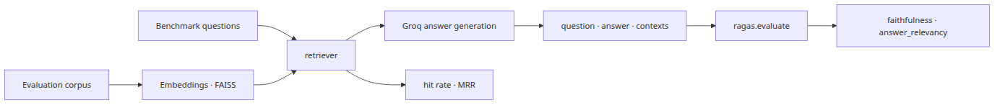
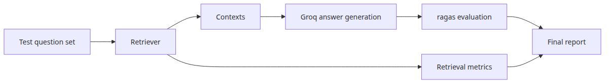
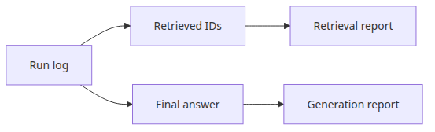
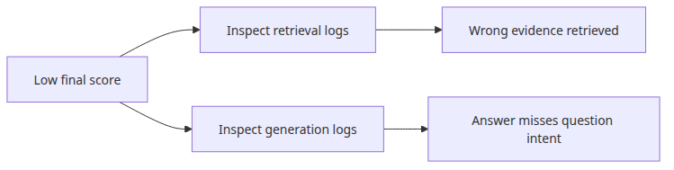
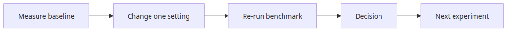

# RAG 벤치마크 완성

완성된 벤치마크는 같은 설정과 같은 입력에서 같은 결과를 재현할 수 있는 하나의 실행 파이프라인이어야 합니다. 이 글은 RAG Benchmark 101 시리즈의 마지막 글입니다. 여기서는 검색, 생성, 평가를 하나의 실행 파일로 묶고, 회귀를 자동으로 막을 수 있는 보고 체계까지 정리하겠습니다.

## 이 글에서 다룰 문제

- 데이터셋 → 검색 → 생성 → 평가를 어떻게 **하나의 실행 경로**로 연결할까요?
- 검색 지표와 RAGAS 점수를 한 리포트에 넣을 때 어떤 분리가 필요할까요?
- 최종 파이프라인 벤치마크에서 가장 먼저 고정해야 할 실험 변수는 무엇일까요?
- 이 벤치마크를 CI에 붙여 회귀를 자동 차단하려면 어떤 구조가 필요할까요?



*이 글에서 답할 질문*

> 완성된 RAG 벤치마크는 **숫자 하나**가 아닙니다. 검색과 생성을 분리하면서도 같은 실험 조건에서 반복 실행할 수 있는 재현 가능한 파이프라인입니다.

## 왜 이 주제가 중요한가

지금까지 만든 도구가 노트북 여기저기에 흩어져 있으면 실제 의사결정에는 잘 쓰이지 않습니다. 사람이 매번 손으로 돌려야 하는 측정은 결국 누락되기 쉽고, 그러면 시스템 품질에 대한 판단은 다시 "최근 몇 개 답변이 어땠는가" 수준으로 후퇴합니다.

반대로 하나의 실행 파일과 표준 리포트로 묶어 두면 네 가지가 가능해집니다.

- **PR 회귀 감지** — 변경 전후 점수를 자동 비교할 수 있습니다.
- **후보 비교** — 임베딩 모델, VectorDB, LLM을 동일 조건에서 비교할 수 있습니다.
- **운영 추적** — 야간 작업으로 추세를 계속 기록할 수 있습니다.
- **재현성 확보** — 몇 달 뒤에도 같은 설정으로 다시 돌려 동일한 비교를 할 수 있습니다.

이 글의 목표는 화려한 대시보드가 아니라, 위 네 가지를 가능하게 만드는 최소 구조를 세우는 것입니다.

## 기본 멘탈 모델

완성된 벤치마크는 하나의 함수로 생각할 수 있습니다.

```text
run_benchmark(config) ──►  report
   │
   ├─ Phase 1: build retriever (corpus + embedding + index)
   ├─ Phase 2: run queries → collect (ranked_ids, latency, contexts)
   ├─ Phase 3: generate answers via LLM
   ├─ Phase 4: compute retrieval metrics (hit, MRR, latency)
   ├─ Phase 5: compute generation metrics (faithfulness, answer_relevancy)
   └─ Phase 6: emit report (JSON + per-question log)
```

`config`에는 임베딩 모델, top-k, LLM 모델, 데이터셋 경로 같은 모든 실험 변수가 들어갑니다. 같은 `config`를 사용하면 같은 결과가 나와야 한다는 것이 이 파이프라인의 계약입니다.

## 핵심 개념

| 항목 | 의미 |
| --- | --- |
| Run config | 한 번의 벤치마크 실행에 필요한 모든 파라미터 |
| Run id | 각 실행을 식별하는 고유 ID |
| Report | 집계 지표와 질문별 로그 두 부분으로 이루어진 결과 |
| Baseline | 비교 대상이 되는 이전 실행 결과 |
| Regression | baseline 대비 임계치 이상 점수가 떨어진 상황 |

집계와 질문별 로그를 분리하는 이유는 분명합니다. 집계만 있으면 왜 점수가 떨어졌는지 알 수 없고, 질문별 로그만 있으면 빠른 비교가 어렵습니다. 둘이 함께 있어야 운영 가능한 리포트가 됩니다.

## 수동 점검만 할 때와 자동 리포트가 있을 때

이전에는 PR 작성자가 노트북을 열어 몇 가지 지표를 손으로 확인합니다. 어떤 PR은 평가하고 어떤 PR은 잊습니다. 한 달 뒤 성능 저하가 발견되어도 어느 변경이 원인인지 추적하기 어렵습니다.

이후에는 모든 PR이 같은 명령을 자동으로 실행합니다.

```text
                  baseline  this PR  delta
hit_rate@3        0.94      0.96    +0.02 ✓
MRR               0.78      0.81    +0.03 ✓
faithfulness      0.91      0.84    -0.07 ✗
answer_relevancy  0.85      0.86    +0.01 ✓
avg_latency_ms    62.1      63.4    +1.3
```

예를 들어 faithfulness가 0.07 떨어졌다면 사람이 놓치기 전에 CI가 바로 차단할 수 있습니다. 회귀 감지가 자동화된 상태가 되는 것입니다.

## 단계별로 통합 벤치마크 만들기

### 1단계 — 실행 설정 고정하기

```yaml
# configs/ci.yaml
corpus_path: "data/corpus.jsonl"
gold_set_path: "data/gold.jsonl"
embedding_model: "sentence-transformers/all-MiniLM-L6-v2"
index_type: "IndexFlatIP"
top_k: 3
llm_model: "llama-3.1-8b-instant"
ragas_metrics: ["faithfulness", "answer_relevancy"]
```

실험 변수는 코드 곳곳에 흩어져 있으면 안 됩니다. 설정 파일 한곳에 모아야 비교가 재현 가능해집니다.

### 2단계 — 검색, 생성, 평가를 하나의 함수로 묶기



*검색, 생성, 평가가 한 번의 실행으로 이어지는 파이프라인*

실행 코드는 `rag-benchmark-101/en/06-benchmark-complete/main.py`에 있습니다. `GROQ_API_KEY`가 필요합니다.

```bash
cd /root/Github/rag-benchmark-101/en/06-benchmark-complete
export GROQ_API_KEY=...
python3 main.py
```

```python
def run_benchmark(config):
    retriever = build_retriever(config)
    rows, retrieval_metrics = [], []

    for case in load_gold_set(config["gold_set_path"]):
        t0 = time.perf_counter()
        docs = retriever.invoke(case["question"])
        latency_ms = (time.perf_counter() - t0) * 1000

        ranked = [d.metadata["id"] for d in docs]
        contexts = [d.page_content for d in docs]
        retrieval_metrics.append({
            "hit": hit_rate(ranked, case["gold"]),
            "rr": reciprocal_rank(ranked, case["gold"]),
            "latency_ms": latency_ms,
        })

        answer = generate_answer(case["question"], contexts, config)
        rows.append({
            "question": case["question"],
            "contexts": contexts,
            "answer": answer,
            "ranked_ids": ranked,
        })

    ragas_scores = run_ragas(rows, config)
    return assemble_report(retrieval_metrics, ragas_scores, rows, config)
```

이 함수가 중요한 이유는 측정 층이 하나의 실행 흐름 안에 들어 있기 때문입니다. 검색과 생성을 따로 재면 실행 조건이 어긋나기 쉽습니다.

### 3단계 — 리포트를 검색과 생성으로 분리하기



*검색 리포트와 생성 리포트를 나누는 구조*

```python
def assemble_report(retrieval_metrics, ragas_scores, rows, config):
    return {
        "run_id": f"{datetime.utcnow():%Y%m%dT%H%M%S}-{git_sha()[:7]}",
        "config": config,
        "retrieval": {
            "hit_rate@k": mean([m["hit"] for m in retrieval_metrics]),
            "MRR": mean([m["rr"] for m in retrieval_metrics]),
            "avg_latency_ms": mean([m["latency_ms"] for m in retrieval_metrics]),
            "p95_latency_ms": percentile([m["latency_ms"] for m in retrieval_metrics], 95),
        },
        "generation": {
            "faithfulness": ragas_scores["faithfulness"],
            "answer_relevancy": ragas_scores["answer_relevancy"],
        },
        "per_question": rows,
    }
```

점수를 하나로 합쳐 버리면 어느 층이 무너졌는지 알 수 없습니다. 따라서 retrieval과 generation은 끝까지 분리된 키 아래 유지해야 합니다.

### 4단계 — baseline과 비교하기

```python
def compare(report, baseline):
    deltas = {}
    for layer in ["retrieval", "generation"]:
        for k, v in report[layer].items():
            base = baseline[layer].get(k)
            if isinstance(v, (int, float)) and isinstance(base, (int, float)):
                deltas[f"{layer}.{k}"] = v - base
    return deltas
```

비교 로직은 단순해 보여도 매우 중요합니다. 자동 비교가 있어야 같은 리포트를 사람이 일일이 읽지 않아도 회귀를 잡을 수 있습니다.

### 5단계 — CI 게이트 만들기



*검색 문제와 생성 문제를 분기해 차단하는 흐름*

```python
THRESHOLDS = {
    "retrieval.hit_rate@k": -0.02,
    "generation.faithfulness": -0.03,
}

def gate(deltas):
    failed = [k for k, t in THRESHOLDS.items() if deltas.get(k, 0) < t]
    if failed:
        sys.exit(f"Regression in: {failed}")
```

처음에는 경고 수준으로 시작해도 좋습니다. 하지만 일정 기간 안정화가 되면, 최소한 핵심 지표 하나는 실제 차단 조건으로 승격하는 편이 좋습니다.

## 자주 하는 실수

- **점수 하나로 압축하기** — 어느 층이 망가졌는지 설명할 수 없게 됩니다.
- **질문별 로그를 버리기** — 집계만 남기면 회귀 원인을 찾을 수 없습니다.
- **Baseline을 매번 자동 갱신하기** — 점진적 성능 저하가 누적될 수 있습니다.
- **설정을 코드에 흩뿌리기** — top-k, temperature, 모델 이름이 실행마다 다르면 비교가 무의미합니다.
- **외부 LLM 호출의 retry와 timeout을 무시하기** — CI가 쉽게 flaky해집니다.

## 운영 환경으로 가져갈 때

운영에서는 `run_id`에 git sha를 포함하는 것이 좋습니다. 그래야 결과와 코드를 1:1로 묶을 수 있습니다. 또한 토큰 사용량과 예상 비용도 리포트에 포함하면, 품질 개선이 비용 증가를 얼마나 동반하는지 함께 볼 수 있습니다.

데이터셋이 커지면 병렬 실행과 캐싱도 중요해집니다. 다만 병렬화는 무조건 내부 평가 라이브러리에만 맡기기보다, 샤딩 후 외부에서 합치는 방식이 더 안정적일 때가 많습니다. 또 이미 본 `(question, context)` 쌍의 답변을 재사용하면 CI 비용을 크게 줄일 수 있습니다.

무엇보다 벤치마크는 자동으로 돌고, 결과가 팀이 자주 보는 곳에 노출되어야 합니다. 대시보드든 PR 코멘트든, 측정 결과가 흐르지 않으면 벤치마크는 곧 잊힙니다.

## 체크리스트



*기준선 비교부터 의사결정까지 이어지는 벤치마크 루프*

- [ ] 검색과 생성을 같은 실행 안에서 측정하는가?
- [ ] 두 층의 점수를 분리된 키 아래 저장하는가?
- [ ] 설정 파일에 임베딩 모델, top-k, LLM 모델, 데이터셋 경로가 모두 들어 있는가?
- [ ] `run_id`에 시각과 git sha가 들어가는가?
- [ ] 집계 리포트와 질문별 로그를 함께 저장하는가?
- [ ] baseline과 비교해 임계치 위반 시 차단하는가?
- [ ] 모든 LLM 호출에 retry와 timeout을 적용하는가?

## 연습 문제

1. 임베딩 모델 2개와 LLM 2개를 조합해 총 4개 실험을 한 번에 실행하도록 확장해 보세요.
2. 같은 git sha에서 두 번 실행했는데 결과가 다르다면, 어떤 비결정성이 남아 있는지 점검해 보세요.
3. 데이터셋 크기에 따라 CI 임계치를 다르게 두는 방식은 어떻게 설계할 수 있을까요?

## 정리와 시리즈 마무리

이 시리즈에서는 여섯 편에 걸쳐 다음을 만들었습니다.

| 글 | 도구 |
| --- | --- |
| 1 | hit rate / MRR / nDCG를 손으로 읽는 기본 감각 |
| 2 | 단일 검색기를 계량하는 검색 측정 루프 |
| 3 | 임베딩 모델을 한 변수씩 비교하는 실험 골격 |
| 4 | flat과 IVF의 recall/latency 트레이드오프 비교 |
| 5 | RAGAS를 이용한 faithfulness / answer relevancy 평가 |
| 6 | 검색·생성·평가를 묶은 통합 벤치마크와 CI 게이트 |

이 시리즈의 핵심은 단일 점수를 만드는 데 있지 않습니다. **같은 조건에서 반복 가능한 측정을 만들고, 점수가 흔들릴 때 어느 층을 고쳐야 하는지 분명하게 만드는 것**이 핵심입니다.

이후 확장 주제로는 더 긴 코퍼스, 하이브리드 검색기, reranker, 다회전 대화 평가가 자연스럽게 이어질 수 있습니다. 하지만 그 확장도 결국 같은 원칙 위에 서야 합니다. 먼저 변수와 측정 조건을 고정하고, 그다음에 비교해야 합니다.

<!-- toc:begin -->
## 시리즈 목차

- [RAG 평가 지표 이해](./01-evaluation-metrics.md)
- [검색 성능 측정](./02-retrieval-benchmarking.md)
- [임베딩 모델 비교](./03-embedding-comparison.md)
- [VectorDB 선택 기준](./04-vectordb-selection.md)
- [종단 간 RAG 파이프라인 평가](./05-e2e-evaluation.md)
- **RAG 벤치마크 완성 (현재 글)**

<!-- toc:end -->

---

## 참고 자료

- [RAGAS documentation](https://docs.ragas.io/)
- [LangChain retrieval overview](https://python.langchain.com/docs/concepts/retrieval/)
- [FAISS documentation](https://faiss.ai/)
- [GitHub Actions](https://docs.github.com/en/actions)

Tags: RAG, VectorDB, Benchmarking, LLM
